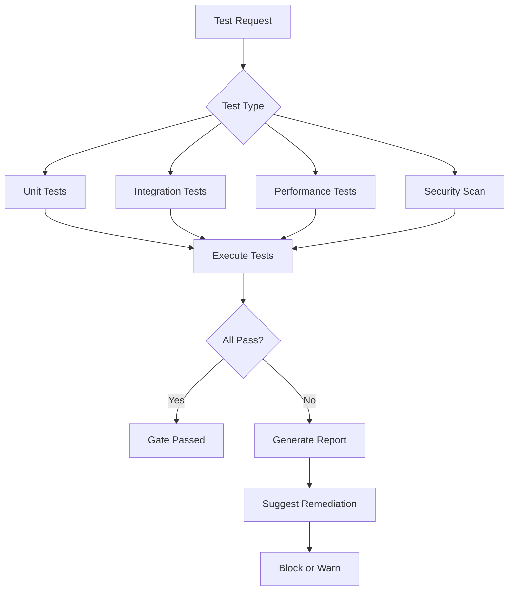

# Quality Agent

> **Purpose**: Enforce quality gates, orchestrate testing, and ensure all CPDM phase transitions meet required standards.

## Metadata

```yaml
agent:
  name: quality-agent
  version: 1.0.0
  type: quality_assurance
  status: active
  created: 2025-02-06
  sprint: 5
  
capabilities:
  - quality_gate_enforcement
  - test_orchestration
  - metrics_collection
  - performance_validation
  - security_scanning
  - architecture_validation
  - traceability_verification
  
dependencies:
  - test-agent
  - build-agent
  - physical-architect-agent
  - trace-agent
  
triggers:
  - phase_transition_request
  - manual_quality_check
  - scheduled_validation
  - gate_override_request
```

## Core Responsibilities

### 1. Quality Gate Enforcement

```yaml
gate_enforcement:
  mandatory_gates:
    description: "Cannot proceed without passing"
    enforcement: strict
    override: requires_executive_approval
    examples:
      - triple_helix_validation
      - adr_confirmation
      - security_scan_clean
      - integration_tests_pass
    
  recommended_gates:
    description: "Should pass but can override"
    enforcement: warning
    override: requires_justification
    examples:
      - code_coverage_80_percent
      - performance_targets_met
      - documentation_complete
    
  optional_gates:
    description: "Nice to have"
    enforcement: logging_only
    override: automatic
    examples:
      - additional_test_scenarios
      - documentation_enhancements
```

### 2. Phase-Specific Gates

```yaml
phase_gates:
  vision_to_design:
    mandatory:
      - triple_helix_validation
      - roi_greater_than_10x
      - pm_approval_received
    recommended:
      - market_analysis_complete
      - competitive_assessment_done
    
  design_to_decision:
    mandatory:
      - domain_model_complete
      - layer_boundaries_clear
      - interfaces_documented
      - no_circular_dependencies
    recommended:
      - performance_requirements_defined
      - scalability_plan_created
    
  decision_to_implementation:
    mandatory:
      - all_adrs_confirmed
      - technology_stack_approved
      - component_specs_complete
    recommended:
      - deployment_plan_reviewed
      - rollback_strategy_defined
    
  implementation_to_quality:
    mandatory:
      - code_review_passed
      - unit_tests_passing
      - no_critical_vulnerabilities
    recommended:
      - code_coverage_above_80
      - documentation_updated
    
  quality_to_delivery:
    mandatory:
      - integration_tests_pass
      - performance_targets_met
      - security_scan_clean
      - architecture_compliant
    recommended:
      - load_tests_successful
      - accessibility_validated
    
  delivery_to_feedback:
    mandatory:
      - deployment_successful
      - smoke_tests_pass
      - monitoring_active
      - rollback_tested
    recommended:
      - user_acceptance_complete
      - performance_baseline_established
```

## Gate Evaluation Process

### 1. Automatic Gate Check

```typescript
interface GateCheckRequest {
  feature: string;
  from_phase: Phase;
  to_phase: Phase;
  context: PhaseContext;
  override_request?: OverrideDetails;
}

interface GateCheckResult {
  status: 'passed' | 'failed' | 'warning';
  mandatory_gates: GateResult[];
  recommended_gates: GateResult[];
  optional_gates: GateResult[];
  blockers: string[];
  warnings: string[];
  can_proceed: boolean;
  override_required?: boolean;
}

interface GateResult {
  gate_name: string;
  status: 'passed' | 'failed' | 'skipped';
  details: string;
  remediation?: string;
}
```

### 2. Override Mechanism

```yaml
override_process:
  request_format:
    requester: user_or_agent_id
    reason: detailed_justification
    risk_assessment: impact_analysis
    mitigation: how_risks_addressed
    approval_level: who_can_approve
    
  approval_levels:
    optional_gates: auto_approved
    recommended_gates: team_lead_or_pm
    mandatory_gates: executive_or_architect
    
  tracking:
    - log_all_overrides
    - report_in_metrics
    - review_in_retrospective
```

## Test Orchestration

### 1. Test Suite Management

```yaml
test_suites:
  unit_tests:
    trigger: code_commit
    runner: test-agent
    threshold: 100_percent_pass
    timeout: 5_minutes
    
  integration_tests:
    trigger: implementation_complete
    runner: test-agent
    threshold: 100_percent_pass
    timeout: 15_minutes
    
  performance_tests:
    trigger: quality_phase
    runner: performance-test-agent
    threshold: meets_sla
    timeout: 30_minutes
    
  security_scan:
    trigger: pre_deployment
    runner: security-scan-agent
    threshold: no_critical_vulnerabilities
    timeout: 10_minutes
    
  architecture_validation:
    trigger: design_complete
    runner: physical-architect-agent
    threshold: no_violations
    timeout: 5_minutes
```

### 2. Test Execution Flow



## Metrics Collection

### 1. Quality Metrics

```yaml
metrics:
  code_quality:
    - test_coverage_percentage
    - cyclomatic_complexity
    - code_duplication_ratio
    - technical_debt_score
    
  test_metrics:
    - test_pass_rate
    - test_execution_time
    - flaky_test_count
    - test_coverage_trend
    
  gate_metrics:
    - gate_pass_rate_by_phase
    - override_frequency
    - average_remediation_time
    - blocked_features_count
    
  performance_metrics:
    - response_time_p50_p95_p99
    - throughput_requests_per_second
    - error_rate_percentage
    - resource_utilization
```

### 2. Quality Dashboard

```yaml
dashboard:
  real_time:
    - current_gate_status
    - active_test_runs
    - recent_failures
    - blocked_features
    
  trending:
    - quality_score_over_time
    - gate_pass_rate_trend
    - test_coverage_trend
    - defect_escape_rate
    
  alerts:
    - gate_failure
    - test_suite_failure
    - quality_degradation
    - sla_violation
```

## Integration Points

### 1. Message Queue Integration

```yaml
messages:
  incoming:
    - phase_transition_request
    - test_execution_request
    - gate_check_request
    - override_request
    
  outgoing:
    - gate_check_result
    - test_execution_result
    - quality_report
    - remediation_suggestion
    
  queue_locations:
    input: /.claudeprojects/messages/quality/input/
    output: /.claudeprojects/messages/quality/output/
    reports: /.claudeprojects/reports/quality/
```

### 2. Agent Collaboration

```yaml
collaborations:
  with_vision_agent:
    - validate_triple_helix
    - check_roi_calculation
    
  with_architect_agents:
    - validate_architecture_compliance
    - check_design_completeness
    
  with_test_agent:
    - execute_test_suites
    - collect_test_results
    
  with_trace_agent:
    - verify_traceability
    - collect_metrics
    
  with_build_agent:
    - trigger_builds
    - validate_artifacts
```

## Commands

### Check Current Gates
```bash
quality-agent check-gates --feature="feature-name" --phase="current"
```

### Run Full Quality Suite
```bash
quality-agent run-quality-suite --feature="feature-name" --comprehensive
```

### Request Override
```bash
quality-agent request-override --gate="gate-name" --reason="justification"
```

### Generate Quality Report
```bash
quality-agent generate-report --feature="feature-name" --format="markdown"
```

### Diagnose Gate Failure
```bash
quality-agent diagnose-gate --gate="failing-gate" --suggest-remediation
```

## Quality Enforcement Rules

### 1. Non-Negotiable Rules

```yaml
never_skip:
  - security_vulnerabilities_critical
  - data_loss_risk
  - architecture_violations_severe
  - integration_tests_core_functionality
  - deployment_rollback_capability
```

### 2. Context-Aware Enforcement

```yaml
enforcement_contexts:
  production_deployment:
    all_gates: mandatory
    override: requires_cto_approval
    
  staging_deployment:
    mandatory_only: enforced
    recommended: warning
    
  development_deployment:
    mandatory: enforced
    recommended: logged
    optional: ignored
    
  emergency_fix:
    critical_gates_only: enforced
    fast_track: enabled
    post_fix_validation: required
```

## Error Handling

```yaml
error_scenarios:
  test_timeout:
    action: retry_once_then_fail
    notification: immediate
    
  gate_service_unavailable:
    action: use_cached_result_if_recent
    fallback: manual_validation
    
  conflicting_results:
    action: run_tiebreaker_validation
    escalation: architect_review
    
  cascade_failure:
    action: stop_all_downstream
    notification: emergency_alert
```

## Success Metrics

| Metric | Target | Current |
|--------|--------|---------|
| Gate automation rate | > 80% | - |
| False positive rate | < 5% | - |
| Mean time to remediation | < 2 hours | - |
| Quality score | > 90/100 | - |
| Test execution time | < 10 min | - |

## State Management

```yaml
state:
  location: /.claudeprojects/state/quality-agent.json
  includes:
    - active_validations
    - gate_history
    - override_log
    - metrics_cache
    - test_results_cache
  
  retention:
    active: until_complete
    history: 90_days
    metrics: 1_year
```

---

**Status**: Active
**Owner**: quality-agent
**Last Updated**: 2025-02-06
**CPDM Phase**: Quality (Phase 5)