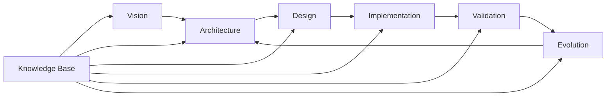
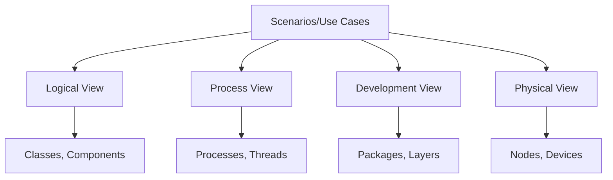
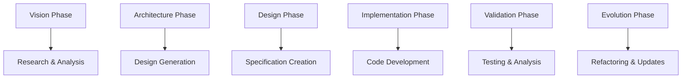

# Architecture-Centric Software Development Methodology

## Introduction

Our Architecture-Centric Software Development Methodology (AC-SDM) places architectural design at the heart of every development decision. This approach ensures scalability, maintainability, and alignment with business goals while leveraging Claude Code's capabilities.

## Core Philosophy

> "Architecture is not just the blueprint; it's the continuous dialogue between vision and implementation."

### Key Principles

1. **Architecture as Code**: All architectural decisions are documented, versioned, and executable
2. **Agent-First Development**: Claude agents are primary implementers, humans are architects and reviewers
3. **Knowledge-Driven Design**: Every decision backed by documented rationale
4. **Iterative Refinement**: Architecture evolves with understanding
5. **Quality by Design**: Non-functional requirements considered from the start

## Methodology Phases



### Phase 1: Vision & Context

**Objective**: Establish clear understanding of the problem space and solution vision

**Activities**:
- Stakeholder analysis
- Business capability mapping
- Context diagram creation
- Quality attribute workshop

**Deliverables**:
- Product Vision document
- Context diagrams
- Stakeholder map
- Quality attribute scenarios

**Claude Agent Role**:
- Research similar systems
- Generate initial context diagrams
- Analyze stakeholder concerns

### Phase 2: Architecture Design

**Objective**: Create the system's architectural blueprint

**Activities**:
- Component identification
- Interface definition
- Technology selection
- Pattern application

**Deliverables**:
- Component diagrams
- Interface specifications
- Architecture Decision Records (ADRs)
- Technology radar

**Claude Agent Role**:
- Generate component diagrams
- Research technology options
- Draft ADRs
- Validate design patterns

### Phase 3: Detailed Design

**Objective**: Elaborate architecture into implementable designs

**Activities**:
- API design
- Data model creation
- Sequence diagram development
- Security design

**Deliverables**:
- API specifications
- Data models
- Sequence diagrams
- Security architecture

**Claude Agent Role**:
- Generate API specs from requirements
- Create data models
- Develop sequence diagrams
- Security analysis

### Phase 4: Implementation

**Objective**: Transform designs into working software

**Activities**:
- Code generation
- Test implementation
- Documentation creation
- Integration work

**Deliverables**:
- Source code
- Test suites
- Documentation
- Deployment scripts

**Claude Agent Role**:
- Primary code implementation
- Test generation
- Documentation writing
- CI/CD setup

### Phase 5: Validation

**Objective**: Ensure implementation meets architectural intent

**Activities**:
- Architecture conformance checking
- Performance testing
- Security validation
- Quality gate review

**Deliverables**:
- Conformance reports
- Performance benchmarks
- Security scan results
- Quality metrics

**Claude Agent Role**:
- Run conformance checks
- Execute performance tests
- Analyze security scans
- Generate reports

### Phase 6: Evolution

**Objective**: Adapt architecture to new requirements and learnings

**Activities**:
- Feedback analysis
- Architecture retrospective
- Refactoring planning
- Knowledge capture

**Deliverables**:
- Updated ADRs
- Refactoring plans
- Lessons learned
- Updated documentation

**Claude Agent Role**:
- Analyze feedback patterns
- Suggest improvements
- Plan refactoring
- Update documentation

## Architectural Views

Using the 4+1 architectural view model:



### View Descriptions

1. **Logical View**: Functionality exposed to end-users
2. **Process View**: Runtime behavior and concurrency
3. **Development View**: Software module organization
4. **Physical View**: Deployment topology
5. **Scenarios**: Use cases tying views together

## Architecture Decision Records (ADR)

### ADR Template

```markdown
# ADR-{number}: {title}

## Status
{Proposed | Accepted | Deprecated | Superseded}

## Context
What is the issue we're seeing that motivates this decision?

## Decision
What is the change that we're proposing/doing?

## Consequences
What becomes easier or harder because of this change?

## Alternatives Considered
What other options were evaluated?
```

## Quality Attributes

### Priority Matrix

| Attribute | Priority | Measure | Target |
|-----------|----------|---------|--------|
| Performance | High | Response time | < 200ms |
| Scalability | High | Concurrent users | 10,000 |
| Security | Critical | Vulnerabilities | Zero critical |
| Maintainability | High | Code coverage | > 80% |
| Reliability | High | Uptime | 99.9% |

## Claude Agent Integration

### Agent Responsibilities by Phase



### Agent Workflow

1. **Input**: Architectural directive or requirement
2. **Research**: Analyze codebase and documentation
3. **Design**: Generate or update architectural artifacts
4. **Implement**: Create code following architecture
5. **Validate**: Ensure conformance and quality
6. **Document**: Update knowledge base

## Tools and Technologies

### Development Tools
- **Claude Code**: Primary development agent
- **Obsidian**: Knowledge management
- **GitHub**: Version control and issue tracking
- **Mermaid**: Architecture diagrams
- **OpenAPI**: API specifications

### MCP Integrations
- **Context7**: Latest documentation access
- **GitHub MCP**: Repository operations
- **Obsidian MCP**: Knowledge base integration
- **Sequential MCP**: Workflow orchestration

## Metrics and Governance

### Architecture Health Metrics

1. **Technical Debt Ratio**: < 5%
2. **Architecture Conformance**: > 95%
3. **Documentation Coverage**: 100%
4. **Decision Traceability**: All changes linked to ADRs

### Review Gates

- **Architecture Review Board**: Major decisions
- **Design Review**: Before implementation
- **Code Review**: All changes
- **Retrospective**: End of each iteration

## Getting Started

1. Define your product vision
2. Identify key quality attributes
3. Create initial architecture
4. Set up Claude agents
5. Begin iterative development
6. Continuously refine

## Best Practices

1. **Document Everything**: If it's not documented, it doesn't exist
2. **Automate Validation**: Let agents check conformance
3. **Iterate Frequently**: Small, validated changes
4. **Measure Continuously**: Track architecture health
5. **Learn and Adapt**: Update methodology based on experience

## Conclusion

Our Architecture-Centric methodology ensures that every line of code serves the greater architectural vision, with Claude agents as our tireless implementers and guardians of quality.