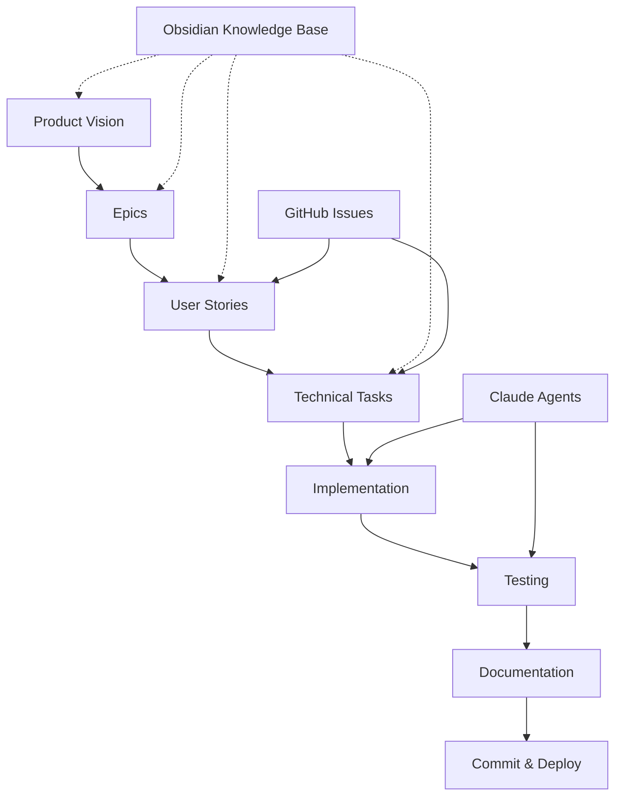
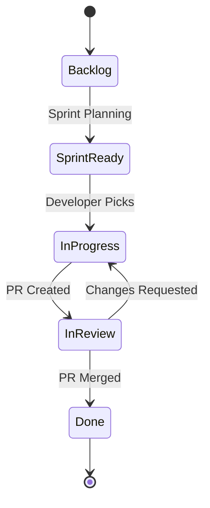

# Project Management System for ClaudeProjects

## Overview

Our project management system is designed specifically for Claude-based development workflows, emphasizing architecture-centric methodology and integration with Obsidian for knowledge management.

## Core Principles

1. **Architecture First**: Every feature starts with architectural design
2. **Knowledge Persistence**: All decisions and learnings stored in Obsidian
3. **Agent-Driven Development**: Claude Code agents handle implementation
4. **Continuous Documentation**: Documentation is part of the workflow, not an afterthought
5. **Issue-Driven Progress**: All work tracked through GitHub issues

## Project Structure

## Workflow Components

### 1. Sprint Planning
- **Duration**: 2-week sprints
- **Planning Meeting**: Review backlog, estimate tasks, commit to sprint goals
- **Sprint Board**: GitHub Projects with columns:
  - Backlog
  - Sprint Ready
  - In Progress
  - In Review
  - Done

### 2. Issue Management
- **Issue Types**:
  - Epic: Large features or initiatives
  - Story: User-facing functionality
  - Task: Technical implementation work
  - Bug: Defects to fix
  - Research: Investigation and design work

### 3. Development Flow

### 4. Knowledge Management
- **Architecture Decisions**: Documented in `docs/architecture/decisions/`
- **Meeting Notes**: Stored in `docs/meetings/`
- **Technical Specs**: Located in `docs/specs/`
- **Learning Journal**: Maintained in `docs/learnings/`

## Task Estimation

Using story points with Fibonacci sequence:
- 1: Trivial change (< 1 hour)
- 2: Simple task (1-2 hours)
- 3: Standard task (2-4 hours)
- 5: Complex task (4-8 hours)
- 8: Very complex (1-2 days)
- 13: Epic-level (3-5 days)
- 21: Needs breakdown (> 1 week)

## Communication Channels

1. **GitHub Issues**: Primary task tracking
2. **Obsidian Daily Notes**: Progress updates
3. **Pull Requests**: Code review and discussion
4. **CLAUDE.md**: Agent instructions and context

## Metrics & Reporting

### Sprint Metrics
- Velocity: Story points completed per sprint
- Burndown: Daily progress tracking
- Cycle Time: Time from "In Progress" to "Done"

### Quality Metrics
- Code Coverage
- Documentation Coverage
- Defect Escape Rate

## Integration Points

### Claude Code Integration
- Reads issues from GitHub
- Updates task status automatically
- Generates documentation
- Runs tests and reports results

### Obsidian Integration
- Links issues to knowledge articles
- Maintains architecture decision records
- Tracks meeting notes and decisions

### GitHub Integration
- Issue templates for consistency
- Project boards for visualization
- Actions for automation

## Getting Started

1. Create an Epic in GitHub Issues
2. Break down into Stories
3. Document architecture in Obsidian
4. Create technical tasks
5. Begin implementation with Claude Code
6. Review and merge
7. Update documentation
8. Close issue and celebrate!

## Next Steps

- [ ] Create issue templates
- [ ] Set up GitHub Projects board
- [ ] Configure automation workflows
- [ ] Create first sprint backlog