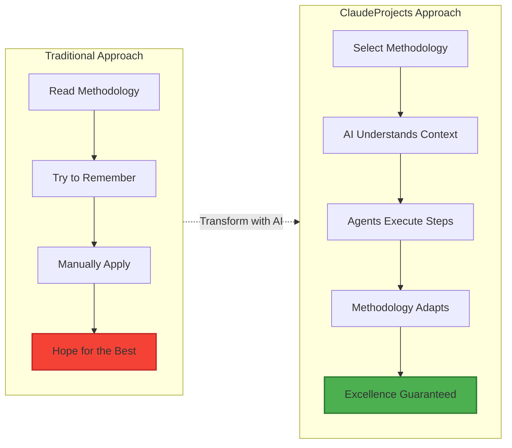
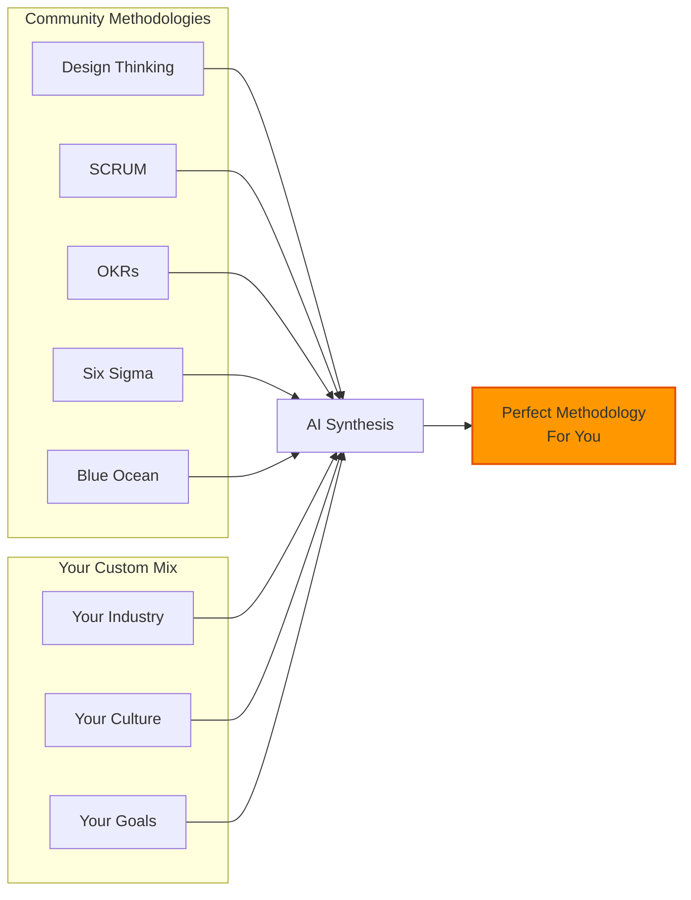
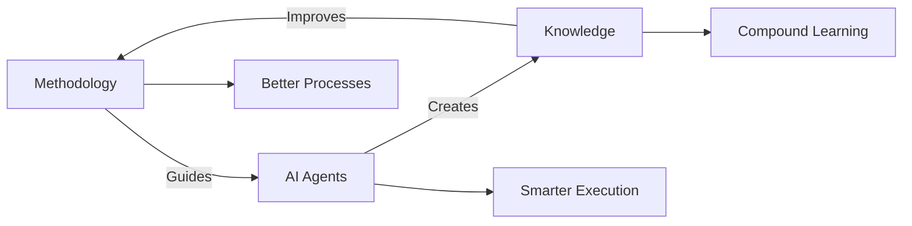

# Executable Methodologies: From PDFs to Intelligent Workflows

[← Back to Overview](./README.md)

## The Problem with Traditional Methodologies

Today's best practices are trapped:
- 📄 **In PDFs**: Static documents that gather dust
- 🧠 **In Experts' Heads**: Inaccessible to most teams
- 📚 **In Training Courses**: Expensive, quickly forgotten
- 📋 **In Templates**: Rigid, one-size-fits-none

## The ClaudeProjects Revolution

We transform methodologies into living, breathing intelligence:



## How It Works

### 1. **Methodology as Code**
```yaml
methodology: design_sprint
version: 2.0
phases:
  understand:
    duration: 1_day
    agents: [research_agent, interview_agent]
    outputs: [problem_statement, user_journey_map]
    
  ideate:
    duration: 1_day  
    agents: [ideation_agent, synthesis_agent]
    outputs: [concept_sketches, solution_matrix]
```

### 2. **Context-Aware Execution**
The AI doesn't just follow steps—it understands:
- Your specific industry context
- Your team's capabilities
- Your timeline and constraints
- Your desired outcomes

### 3. **Intelligent Adaptation**
- **Too rushed?** The methodology compresses intelligently
- **Missing data?** Agents know what to gather
- **Stakeholder change?** Workflow adjusts automatically
- **New insights?** Methodology evolves in real-time

## Real-World Examples

### Design Sprint → Executable Design Sprint

**Before**: 5-day rigid process, requires full team dedication

**After with ClaudeProjects**:
- Compresses to 2 days when needed
- Agents handle async work
- Automatically incorporates industry best practices
- Scales from startup to enterprise

### Agile Development → Intelligent Agile

**Before**: Ceremonies become empty rituals

**After with ClaudeProjects**:
- Sprint planning uses AI to estimate accurately
- Daily standups focus on real blockers
- Retrospectives generate actionable improvements
- Velocity predictions based on team patterns

### Sales Methodology → AI-Powered Sales

**Before**: Generic stages don't fit your market

**After with ClaudeProjects**:
- Customizes stages to your industry
- Agents gather intel automatically
- Predicts deal probability accurately
- Suggests next best actions

## The Methodology Marketplace



### Featured Methodologies

1. **Innovation & Design**
   - Design Sprint 2.0
   - Double Diamond
   - Jobs-to-be-Done
   - Lean Startup

2. **Project Management**
   - Agile/Scrum
   - Waterfall+
   - Hybrid PM
   - Critical Chain

3. **Strategy & Analysis**
   - Blue Ocean Strategy
   - Porter's Five Forces
   - SWOT+++
   - Wardley Mapping

4. **Sales & Marketing**
   - MEDDIC
   - Challenger Sale
   - Account-Based Marketing
   - Growth Hacking

## Building Your Own

Creating a custom methodology is simple:

```javascript
const myMethodology = {
  name: "Customer Success Sprint",
  basedon: ["design_sprint", "jobs_to_be_done"],
  
  phases: {
    discover: {
      goal: "Understand customer struggles",
      agents: ["research", "interview", "analytics"],
      duration: "4h"
    },
    
    design: {
      goal: "Create intervention strategies", 
      agents: ["ideation", "prioritization"],
      duration: "4h"
    },
    
    deliver: {
      goal: "Launch and measure",
      agents: ["implementation", "measurement"],
      duration: "ongoing"
    }
  }
}
```

## The Triple Helix in Action

This is where our Triple Helix creates magic:



Each project makes your methodology smarter:
- Agents learn what works
- Knowledge captures patterns
- Methodology evolves automatically

## Getting Started

1. **Browse the Marketplace**: Find methodologies for your domain
2. **Clone and Customize**: Adapt to your needs
3. **Run Your First Project**: See 10x productivity immediately
4. **Share Back**: Help others with your improvements

[**🚀 Try Your First Executable Methodology →**](./10-getting-started.md)

---

[← Back to Overview](./README.md) | [Next: Agent Ecosystem →](./02-agent-ecosystem.md)