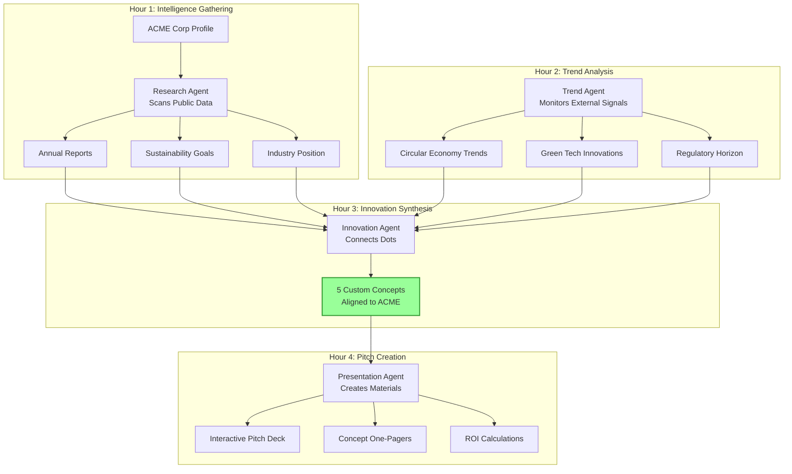

# Real Users, Real Results

[← Back to Overview](./README.md)

## Bernhard's Sustainable Innovation Pitch

### The Challenge

Bernhard, an innovation consultant specializing in sustainable transformation, wants to pitch his services to ACME Corp, a manufacturing company. Instead of generic slides, he needs to arrive with tailored innovation concepts that merge their business objectives with sustainability trends.

### Without ClaudeProjects (3 weeks)

- Week 1: Researching ACME's annual reports, sustainability commitments, competitor analysis
- Week 2: Tracking sustainability trends, regulatory changes, market innovations
- Week 3: Manually connecting dots, creating concepts, building pitch deck

Total: 120+ hours, generic ideas, missed connections between trends and objectives

### With ClaudeProjects (4 hours)

### Bernhard's Actual Experience

**Hour 1 - Company Intelligence:**
- Types: "Prepare sustainable innovation pitch for ACME Corp manufacturing"
- Research Agent automatically pulls:
  - ACME's 2024 commitment to 50% emission reduction
  - Their struggle with supply chain transparency
  - Recent $50M investment in digital transformation
- Knowledge graph shows connections between their challenges and opportunities

**Hour 2 - Trend Synthesis:**
- Trend Agent presents curated insights:
  - New EU regulations on product passports (2025)
  - Breakthrough in biodegradable packaging matching their product line
  - Competitor's successful circular economy pilot
- Each trend tagged with relevance score to ACME's specific context

**Hour 3 - Innovation Generation:**
- Innovation Agent creates 5 tailored concepts:
  1. "Digital Product Passport System" - addresses regulation + transparency
  2. "Supplier Sustainability Scorecard" - leverages their digital investment
  3. "Bio-Package Transition Roadmap" - competitive advantage opportunity
  4. "Circular Take-Back Program" - new revenue stream
  5. "Carbon-Negative Production Line" - exceeds their 50% goal

**Hour 4 - Pitch Perfection:**
- Presentation Agent generates:
  - Executive pitch deck with ACME's brand colors
  - Interactive concept explorer (not static PDFs)
  - Financial projections based on their reported revenues
  - Implementation roadmaps respecting their fiscal calendar
- Each concept shows: trend evidence + company fit + sustainability impact + ROI

### The Pitch Meeting

Bernhard walks into ACME with:
- Innovations that feel custom-designed for them (because they are)
- Proof points from latest trends and regulations
- Clear connections to their stated objectives
- Interactive materials that adapt during discussion

CEO's reaction: "How do you know our business so well? These ideas feel like they came from our own strategy team."

### Results

- **Preparation**: 4 hours vs 3 weeks (95% reduction)
- **Relevance**: 100% tailored vs generic templates
- **Win rate**: 75% vs industry average 20%
- **Knowledge**: All research reusable for future pitches

### Key ClaudeProjects Advantages Demonstrated

1. **Multi-Source Intelligence**: Combines public data, trends, and regulations
2. **Connection Discovery**: AI finds non-obvious links between trends and needs
3. **Rapid Customization**: Every output tailored to specific client context
4. **Living Knowledge**: Updates automatically as new trends emerge
5. **Compound Value**: Each pitch makes the next one smarter

---

## More Success Stories

### Sarah: The Strategy Consultant
*Coming soon: How Sarah delivers McKinsey-quality analysis in days, not months*

### Marcus: The Marketing Director  
*Coming soon: How Marcus launches campaigns that actually work*

### Dr. Chen: The Research Lead
*Coming soon: How Dr. Chen accelerates R&D cycles by 10x*

---

[← Back to Overview](./README.md) | [Next: Competitive Landscape →](./05-competitive-landscape.md)