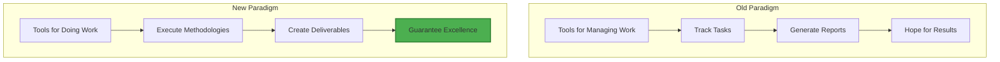
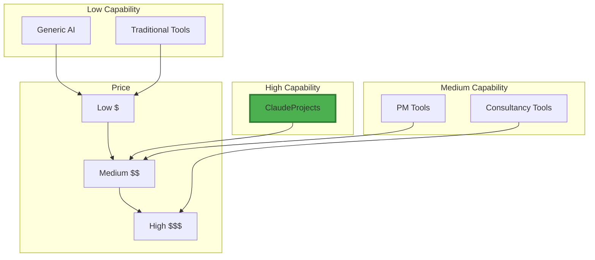

# Competitive Landscape: Why ClaudeProjects Wins

[← Back to Overview](./README.md)

## The Competitive Matrix

| Feature | Traditional Tools | ChatGPT + Notion | Specialized PM Tools | **ClaudeProjects** |
|---------|------------------|------------------|---------------------|-------------------|
| **Methodology Embedding** | ❌ Manual processes | ❌ No methodology | ⚠️ Basic templates | ✅ **Executable methodologies** |
| **AI Integration** | ❌ None | ✅ Generic AI | ⚠️ Limited AI | ✅ **Specialized agents** |
| **Knowledge Persistence** | ⚠️ Static files | ⚠️ Separate systems | ✅ Project memory | ✅ **Living knowledge graph** |
| **Domain Expertise** | ❌ Generic | ❌ Generic | ⚠️ Some verticals | ✅ **Deep domain agents** |
| **Privacy & Control** | ✅ Local files | ❌ Cloud only | ❌ Cloud only | ✅ **Local-first + cloud** |
| **Collaboration** | ⚠️ Email/meetings | ⚠️ Manual sharing | ✅ Team features | ✅ **P2P + AI mediation** |
| **Learning & Improvement** | ❌ None | ❌ No memory | ⚠️ Analytics only | ✅ **Compound learning** |
| **Time to Value** | Days/weeks | Hours | Days | **< 1 hour** |
| **Typical Productivity Gain** | 0% | 2-3x | 1.5x | **10x** |
| **Price Point** | $0-50/mo | $20 + $10/mo | $50-200/mo | **$50-200/mo** |

## Deep Dive: Key Competitors

### ChatGPT + Notion Combo

**What they do well:**
- Generic AI assistance
- Flexible note-taking
- Low barrier to entry

**Why we win:**
- **No methodology understanding** - They're generic tools
- **No agent specialization** - Just one AI for everything
- **Manual integration** - You copy-paste between tools
- **No compound learning** - Each session starts fresh

### Monday.com / Asana / ClickUp

**What they do well:**
- Team collaboration
- Task tracking
- Integrations

**Why we win:**
- **No real AI** - Just basic automation
- **No methodology engine** - Only templates
- **No knowledge synthesis** - Just task lists
- **Built for managers, not makers** - We focus on actual work

### Specialized Consultancy Tools

**What they do well:**
- Industry-specific features
- Compliance focus
- Enterprise ready

**Why we win:**
- **Single methodology** - We support all
- **Expensive** - Often $500+/month
- **No AI agents** - Still manual work
- **Closed ecosystem** - No community

## The Paradigm Shift

## Competitive Advantages

### 1. Methodology Moat

**Why it matters:**
- Takes years to build
- Network effects strengthen it
- Community contributions compound
- Switching costs increase over time

### 2. Agent Ecosystem

**Our Agents:**
- Research Agent (deep web intelligence)
- Analysis Agent (pattern recognition)
- Innovation Agent (creative synthesis)
- Writing Agent (professional output)
- Strategy Agent (business thinking)
- [50+ more specialized agents]

**Their "AI":**
- Generic chatbot
- No specialization
- No coordination
- No memory

### 3. Local-First Architecture

**Privacy Comparison:**
| Aspect | ClaudeProjects | Competitors |
|--------|---------------|-------------|
| Data Storage | Your device | Their cloud |
| Data Ownership | You | Them |
| Offline Access | Full | None |
| Export Freedom | Always | Maybe |
| Vendor Lock-in | None | High |

### 4. Open Source Core

**Community Power:**
- 🌍 Global contributors
- 🔧 Infinite customization
- 🛡️ No vendor lock-in
- 📈 Faster innovation
- 🤝 True partnership

## Market Positioning

**Sweet Spot:** Maximum capability at reasonable price

## Why Customers Switch

### From ChatGPT + Notion
> "I was spending hours copy-pasting between ChatGPT and Notion. ClaudeProjects just knows what I need and does it automatically. It's like having a senior consultant built into my workflow." - Sarah, Strategy Consultant

### From Monday.com
> "Monday is great for tracking tasks, but ClaudeProjects actually helps me DO the work. The methodology guidance and AI agents are game-changers." - Marcus, Product Manager

### From Manual Processes
> "I've been consulting for 20 years. ClaudeProjects captured everything I know and made it scalable. Now I can serve 10x more clients with better results." - Dr. Chen, Innovation Expert

## Defensive Strategy

### How we stay ahead:

1. **Continuous Innovation**
   - Weekly agent updates
   - Monthly methodology additions
   - Quarterly major features
   - Annual paradigm shifts

2. **Community Moat**
   - Open source contributions
   - Methodology marketplace
   - Agent ecosystem
   - Knowledge network

3. **Enterprise Lock-in**
   - Custom methodologies
   - Private agents
   - Compliance features
   - Success dependencies

## The Bottom Line

**Competitors compete on features. We compete on outcomes.**

While others help you manage work, we help you do brilliant work, faster.

The question isn't "Why ClaudeProjects?" 

The question is "Why would you choose anything else?"

---

[← Back to Overview](./README.md) | [Next: Why Now? →](./06-why-now.md)