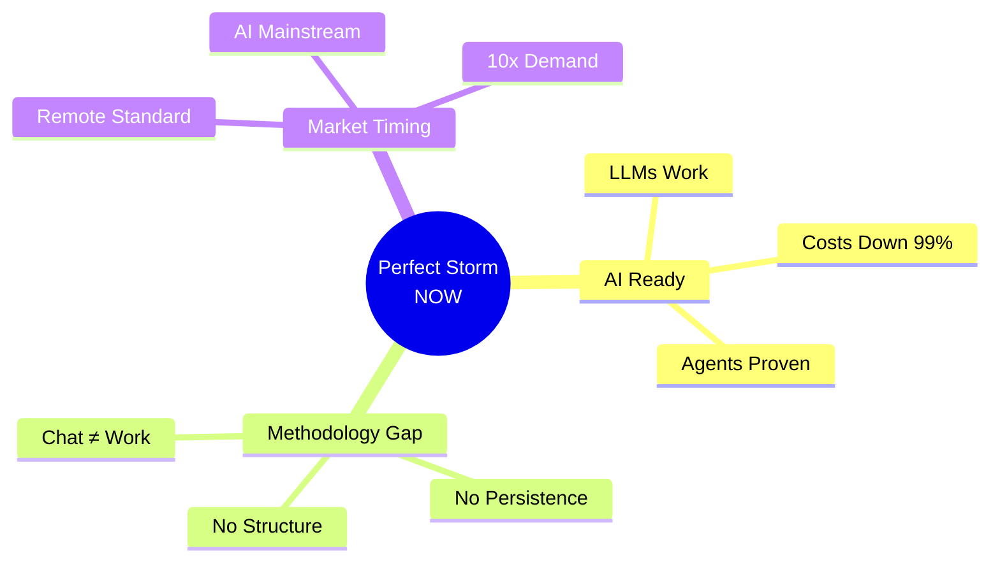
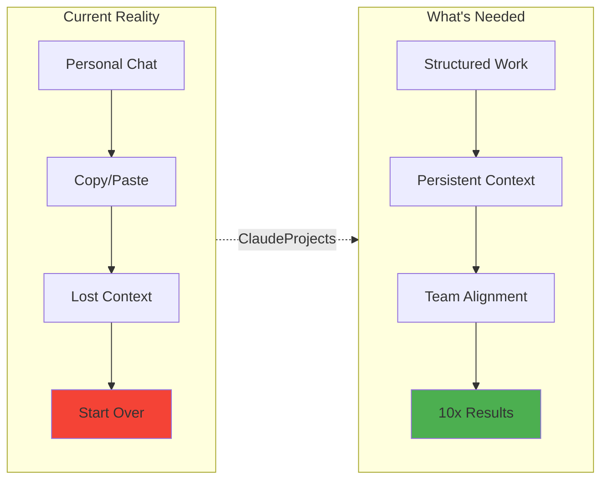

# Why Now? The Perfect Storm

[← Back to Overview](./README.md)

## The Convergence

Three forces create a once-in-a-decade opportunity:

## 1. AI Technology: Finally Ready

**Technical Maturity**
- GPT-4/Claude handle complex reasoning
- 200K+ context windows = full project understanding
- Multi-agent orchestration proven at scale

**Economic Viability**

| Year | Cost/Million Tokens | Impact |
|------|---------------------|---------|
| 2022 | $100 | Too expensive |
| 2023 | $10 | Experiments only |
| 2024 | $1 | **ROI positive** |

## 2. Methodology Gap: The Opportunity

**Everyone has ChatGPT, but:**

The gap between casual AI chat and professional AI work is our opportunity.

## 3. Market Ready: Perfect Timing

- **60% of companies** actively adopting AI (2024)
- **Remote work** normalized methodology needs
- **Productivity imperative** post-economic uncertainty
- **Developer success** proves the model (AI-IDEs → 10x)

## The Window: 6-12 Months

**Why this window closes:**
1. Big Tech will enter (but build generic)
2. Consultancies will adapt (but protect billing)
3. First-mover defines the category

**Why we win now:**
- Vision clarity: AI-IPE category
- Technical readiness: All pieces exist
- Market education: Post-ChatGPT world

## The Bottom Line

> The question isn't "Will AI transform knowledge work?"
> 
> The question is "Who will own the transformation?"

**If not now, when? If not us, who?**

[**→ See Our Solution**](./README.md#why-us-the-ai-ipe-revolution)

---

[← Back to Overview](./README.md)