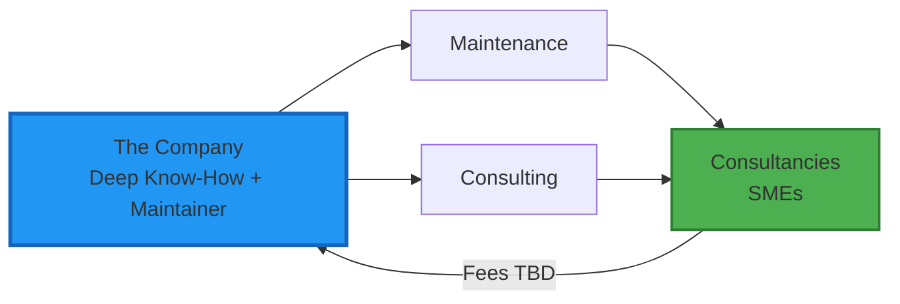
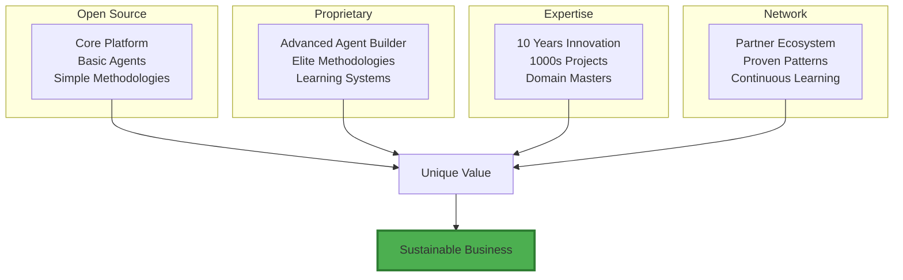

# Why Pay? The 10x Value Exchange

[← Back to Overview](./README.md)

## The ROI Calculator

**Real Example**: Bernhard reduced pitch prep from 3 weeks to 4 hours (95% reduction) and increased win rate from 20% to 75%.

## Pricing: Pay for What Matters

### For Consultancies

| Plan             | Price    | Core Value                                      | Real Difference                                           |
| ---------------- | -------- | ----------------------------------------------- | --------------------------------------------------------- |
| **Starter**      | $200/mo  | Test the waters                                 | Basic agents, proven methodologies                        |
| **Professional** | $500/mo  | **Agent Builder Pro** Create custom agents   | Design agents that handle YOUR specific client situations |
| **Agency**       | $2000/mo | **Full Arsenal** Everything + co-development | We help you build proprietary methodologies               |
|                  |          |                                                 |                                                           |

### For Enterprises

| Plan | Price | Core Value | Real Difference |
|------|-------|------------|-----------------|
| **Team** | $500/mo | Innovation projects | Guided methodology execution |
| **Business** | $2000/mo | **Transformation** Custom agent teams | Your own AI innovation department |

**What separates tiers**: Not features, but depth of expertise access and agent creation capabilities.

## Why Not Just Use ChatGPT + Notion?

| Challenge | ChatGPT + Notion | ClaudeProjects |
|-----------|------------------|----------------|
| **Methodology Execution** | Read PDF, copy-paste | One-click executable |
| **Context Persistence** | Lost between sessions | Full project memory |
| **Team Coordination** | Manual sharing | AI-orchestrated |
| **Quality Consistency** | Varies by prompt | Guaranteed excellence |
| **Time to Results** | Hours of setup | < 1 hour to value |

**Bottom line**: Generic tools = generic results. ClaudeProjects = 10x outcomes.

## "But It's Open Source - Why Pay?"

**Let's be honest**: In a Claude Code world, anyone can build anything. So what are you really paying for?

### 1. Deep Methodology Expertise
We've spent years perfecting innovation methodologies. You're buying:
- **Which** methodology works for **which** situation
- Pre-configured agent teams that actually deliver results
- Proven workflow patterns from 1000s of projects
- The difference between "it works" and "it's excellent"

### 2. Advanced Agent Creation
Yes, you can prompt Claude Code to build agents. But can you:
- Design agents that handle edge cases in innovation workshops?
- Create multi-agent orchestrations that don't conflict?
- Build agents that learn from each project and improve?
- **This is our secret sauce** - and yes, our most advanced agent creation tools are paid-only

### 3. Time & Opportunity Cost
- You could spend 2 weeks building your own innovation platform
- Or start delivering client projects tomorrow
- At $10K per project, that's $40K opportunity cost
- Plus, while you're building, we're already improving

### 4. The Network Effect
- Methodologies proven across industries
- Agent improvements from all users
- Partner ecosystem for delivery
- You join a system that gets smarter daily

**The Honest Truth**: 
> "Could our CTO build this? Probably. Would it be as good? No. Would it take 6 months? Yes. Would we maintain it? Hell no." - Innovation Director, Munich

## Common Objections (Handled)

**"It's too expensive"**
→ ROI in first week. Bernhard saves 116 hours/month. At $100/hour, that's $11,600 saved for $500 cost.

**"We already have PM tools"**
→ PM tools track work. We DO work. Completely different category.

**"What about our data?"**
→ Local-first architecture. Your data, your control. Cloud optional.

**"Will AI replace us?"**
→ AI amplifies you. You become 10x more valuable, not replaced.

## Success Guarantee

✅ **30-day money back** - No questions asked
✅ **10x productivity promise** - Measured and proven
✅ **White-glove onboarding** - Success from day one
✅ **Continuous updates** - Getting better every week

## The Value Exchange Ecosystem

Our business model is simple: we leverage deep innovation expertise and platform maintainership to deliver high-value services to consultancies and SMEs who need to innovate faster.

**How it works:**

**The Company** brings two core assets:
- **Deep Project Know-How**: 10+ years of innovation methodology expertise, having run 1000s of successful projects
- **Platform Maintainer**: Develops and maintains the open-source ClaudeProjects platform

**Services Offered:**
1. **Maintenance Services**: 
   - Platform updates and bug fixes
   - Security patches and monitoring
   - Feature development based on community needs
   - SLA-based support tiers

2. **Consulting Services**:
   - Custom agent development for specific client needs
   - Integration with existing enterprise systems
   - Training and certification programs
   - Strategic innovation methodology consulting

**Target Customers:**
- **Consultancies**: Innovation firms that need reliable tools to deliver client projects
- **SMEs**: Small and medium enterprises looking to innovate faster without huge teams

**Revenue Model** (fees to be researched):
- Maintenance: Subscription-based (monthly/annual)
- Consulting: Project-based or retainer model
- Training: Per-seat certification fees
- Enterprise: Custom pricing for large deployments

## Business Model: Expertise + Network Effects

**Our Real Moats**:
1. **Methodology Expertise** - Knowing what works when (not codifiable)
2. **Agent Orchestration** - Complex multi-agent patterns (hard to replicate)
3. **Network Learning** - Every project improves the system
4. **Partner Channel** - Trusted delivery network
5. **Speed** - We're always 6 months ahead

## Partner Success Formula

| Partner Level | Your Investment | Your Return |
|---------------|----------------|-------------|
| **Silver** | 2 consultants certified | 20% of all project revenue |
| **Gold** | 5 consultants + regional lead | 25% revenue + exclusivity |
| **Platinum** | 10 consultants + co-creation | 30% revenue + equity option |

**Real Partner Example**: Munich boutique (5 consultants) → €2M additional revenue Year 1

## The Network Effect

Each partner makes the platform stronger for all.

## Start Today

### 🚀 For Consultancies
[**Become a Partner →**](https://claudeprojects.ai/partners)
Start earning 20-30% revenue share

### 💼 For Enterprises  
[**Book a Demo →**](https://claudeprojects.ai/demo)
See 10x productivity in action

### 🌍 For Contributors
[**Join Open Source →**](https://github.com/claudeprojects)
Shape the future of work

## The Real Choice

You're not choosing between:
- ❌ Build vs Buy software
- ❌ Open source vs Proprietary

You're choosing between:
- ✅ **Go alone** - Build your own, maintain forever, learn every mistake yourself
- ✅ **Join the ecosystem** - Leverage our expertise, advanced tools, and network

**In a Claude Code world, software is easy. Expertise is hard.**

Choose wisely.

---

*Stop managing work. Start doing brilliant work.*

[← Back to Overview](./README.md) | [Next: Go-to-Market →](./08-go-to-market.md)