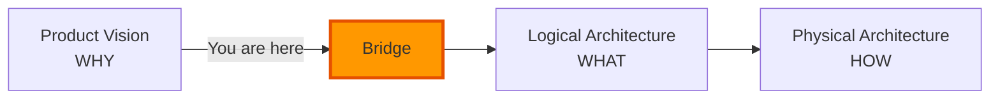

# From Vision to Architecture

[← Back to Overview](./README.md)

## The Bridge

You understand **WHY** ClaudeProjects must exist.

Now discover **WHAT** we're building and **HOW** we'll build it.

## Continue Your Journey

### 📐 [Logical Architecture →](../02-logical-architecture/README.md)
**WHAT** - The components and capabilities

### 🔧 [Physical Architecture →](../03-physical-architecture/README.md)
**HOW** - The implementation approach

---

[← Back to Product Vision](./README.md) | [Logical Architecture →](../02-logical-architecture/README.md)