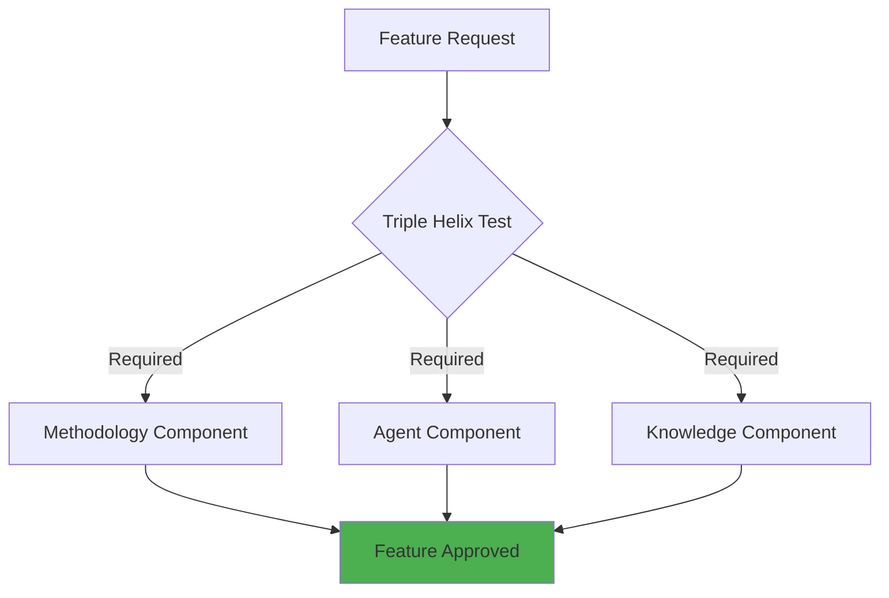

# Product Vision Traceability System

> **Purpose**: Ensure every feature, epic, and task traces directly back to our vision of delivering 10x productivity gains through the Triple Helix innovation.

## Overview

This document defines how the Product Vision maintains complete traceability to implementation, with:
- **Daily vision updates** as needed
- **Fully automated traceability** with PM control points
- **Business impact** as primary metric
- **Sprint planning** driven by vision priorities

## Governance Model

### Ownership Structure
- **Product Manager**: Maintains ownership for prioritization
- **Team Input**: Everyone can and should provide input
- **Vision Updates**: Daily as market/user needs evolve
- **Automation**: Fully automated with PM control points

### Triple Helix Validation
Every feature must demonstrate all three components:



## Traceability Framework

### Vision Hierarchy
```
AI-IPE Vision: "10x Productivity for Knowledge Workers"
├── Triple Helix Innovation
│   ├── Executable Methodologies
│   ├── Specialized Agent Teams
│   └── Living Knowledge Systems
├── Strategic Objectives
│   ├── Save 32 hours/month per user
│   ├── Democratize Excellence
│   └── Build $100M ARR Business
└── Success Metrics
    ├── Business Impact (PRIMARY)
    ├── User Satisfaction
    ├── Technical Excellence
    └── Innovation Velocity
```

### Feature Derivation Process

#### 1. Vision Element → Epic
```yaml
epic_template:
  id: E-[DOMAIN]-[NUMBER]
  vision_element: [Triple Helix Component]
  business_case:
    problem: [User problem statement]
    solution: [Proposed solution]
    impact: [Business impact metrics]
  pm_approval: [Required before proceeding]
```

#### 2. Epic → Feature
```yaml
feature_template:
  id: F-[EPIC]-[NUMBER]
  epic_ref: [Epic ID]
  triple_helix:
    methodology: [How it uses best practices]
    agents: [Which agents involved]
    knowledge: [What knowledge captured]
  business_value: [ROI calculation]
```

#### 3. Feature → User Story
```yaml
user_story_template:
  id: US-[FEATURE]-[NUMBER]
  feature_ref: [Feature ID]
  narrative: |
    As a [actor]
    I want [capability]
    So that [business value]
  traces_to_vision: [Direct vision element]
```

## Traceability Matrix

Current state of vision-to-implementation traceability:

| Vision Element | Epic | Feature | Status | Business Impact | PM Priority |
|----------------|------|---------|--------|-----------------|-------------|
| Triple Helix | E-METH-001 | Executable Methodologies | Active | 5 hrs/week saved | P0 |
| Triple Helix | E-AGENT-001 | Agent Orchestra | Active | 10x productivity | P0 |
| Triple Helix | E-KNOW-001 | Living Knowledge | Active | Zero knowledge loss | P0 |
| **Triple Helix** | **E-AGENT-001** | **Agent Update** | **Implemented** | **15x ROI, 38h/month saved** | **P0** |
| 10x Productivity | E-PROJ-001 | Sprint Management | Complete | 30% efficiency gain | P1 |
| Democratize | E-UI-001 | Obsidian Editor | Proposed | 5 hrs/week saved | P1 |

## PM Control Points

### Decision Gates
1. **Vision Alignment Gate**: Does it serve 10x productivity?
2. **Triple Helix Gate**: Has all three components?
3. **Business Impact Gate**: ROI > 10x?
4. **Sprint Planning Gate**: Fits current sprint goals?

### Automation with Control
```yaml
automation_policy:
  automatic:
    - Traceability tracking
    - Impact calculations
    - Documentation updates
    - Agent assignments
  
  pm_control:
    - Feature prioritization
    - Sprint inclusion
    - Resource allocation
    - Go/no-go decisions
```

## Sprint Planning Integration

### Vision-Driven Sprints
Every sprint must:
1. Align with current vision priorities
2. Advance at least one strategic objective
3. Deliver measurable business impact
4. Maintain Triple Helix balance

### Sprint Planning Template
```yaml
sprint:
  number: [Sprint Number]
  vision_focus: [Primary vision element]
  business_goal: [Measurable impact]
  features:
    - id: [Feature ID]
      vision_trace: [Vision element]
      business_value: [Impact metric]
  success_criteria:
    - [Specific measurable outcome]
```

## Metrics & Reporting

### Primary Metric: Business Impact
```yaml
business_impact_metrics:
  productivity_gain:
    measure: hours_saved_per_user_per_month
    target: 32 hours
    current: [Track monthly]
  
  revenue_impact:
    measure: arr_growth
    target: $100M by Year 5
    current: [Track quarterly]
  
  user_adoption:
    measure: active_users
    target: 65K by Year 2
    current: [Track weekly]
```

### Vision Health Dashboard
- **Alignment Score**: % of features aligned to vision
- **Triple Helix Coverage**: All three components active
- **Business Impact**: Cumulative value delivered
- **Sprint Velocity**: Features delivered per sprint

## Living Documentation

This traceability system is maintained through:
1. **Daily Updates**: As vision evolves
2. **Automatic Tracking**: Via vision-agent
3. **PM Reviews**: At sprint boundaries
4. **Team Input**: Continuous feedback loop

## Integration Points

### With Existing Agents
- **orchestrator-agent**: Routes vision updates
- **methodology-agent**: Validates best practices
- **project-agent**: Manages sprint alignment
- **knowledge-agent**: Captures evolution history

### With Architecture Layers
- **Presentation**: Vision dashboard
- **Application**: Traceability workflows
- **Domain**: Vision domain model
- **Infrastructure**: Message queue integration

---

*Last Updated: 2025-02-06*
*Maintained by: vision-agent*
*PM Owner: Stephan*