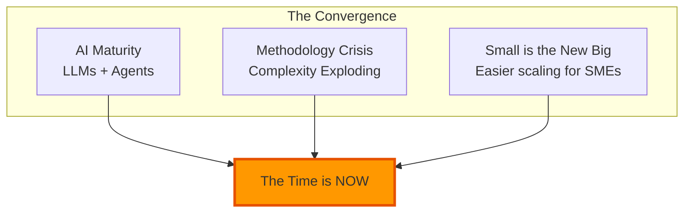
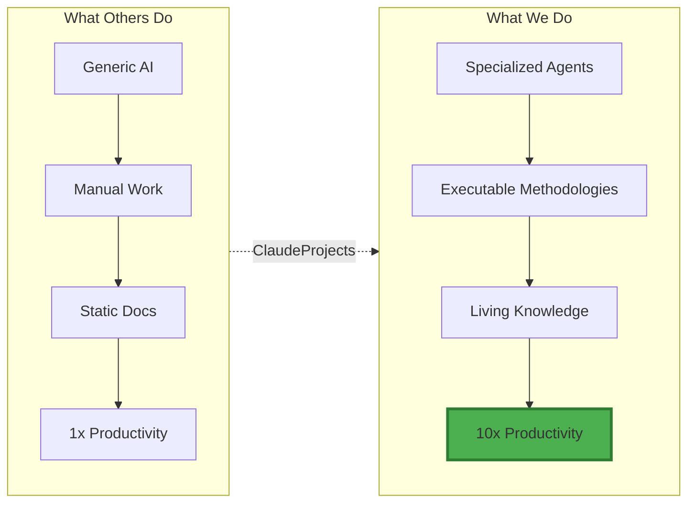
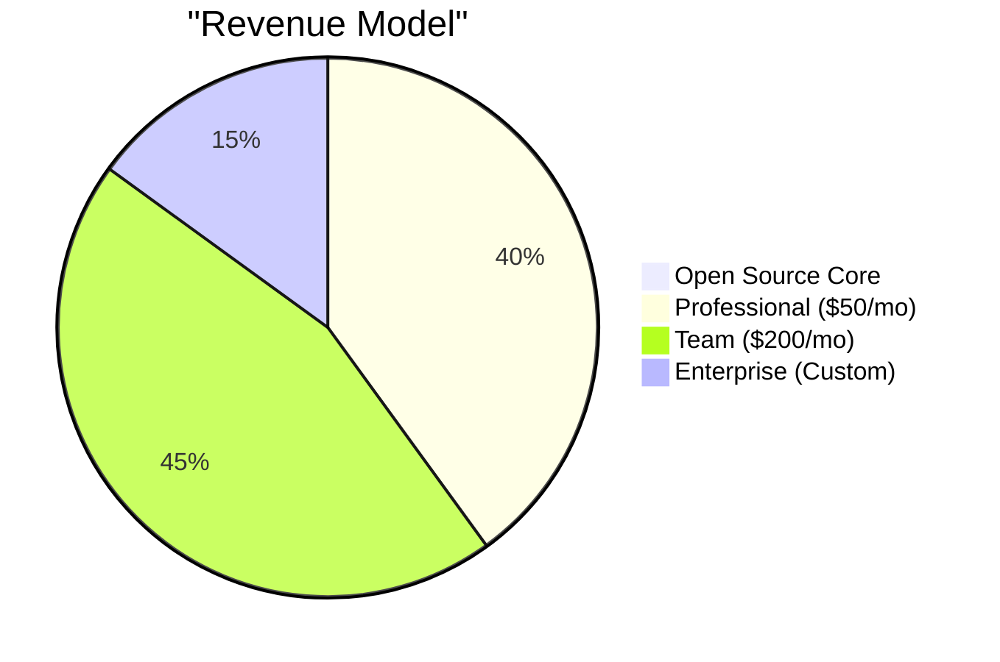

# ClaudeProjects Product Vision

> **Executive Summary**: ClaudeProjects is the AI-Integrated Project Environment (AI-IPE) that brings 10x productivity gains to knowledge workers—just as AI-IDEs revolutionized software development. By combining executable methodologies, specialized AI agents, and living knowledge systems, we transform fragmented manual work into intelligent, automated excellence.

## Why Change? The Hidden Crisis

### The Visible Pain
Every day, 1 billion knowledge workers struggle with:
- **9.4 different tools** that don't talk to each other
- **73% report feeling overwhelmed** by information overload
- **$1.3 trillion lost annually** to knowledge work inefficiency

### The Unconsidered Needs
But the real tragedy is what they've accepted as "normal":
- **Best practices trapped in PDFs** - Methodologies you read but can't execute
- **Expertise doesn't scale** - Senior people become bottlenecks
- **Knowledge dies in silos** - Every project starts from scratch
- **AI remains generic** - ChatGPT doesn't know YOUR methodology

**Meanwhile, software developers achieved 10x productivity with AI-IDEs.**

*Why should knowledge workers settle for less?*

## Why Now? The Perfect Storm

Three forces create a once-in-a-decade opportunity:



- **AI Finally Works**: Reliable, affordable, capable of complex reasoning
- **End of Knowledge Work**: Knowledge work transforms into human-AI co-created Wisdom Work
- **First-Mover Window**: 12-24 months before AI assisted work is the new normal in all companies

[**→ Read the full "Why Now?" analysis**](./06-why-now.md)

## Why Us? The AI-IPE Revolution

We're not building another tool. We're creating a new category.



### Our Three Breakthroughs

#### 1. 🧠 **Executable Methodologies**
Best practices become intelligent workflows that adapt to your context
- [**→ See how it works**](./01-executable-methodologies.md)

#### 2. 🤖 **Specialized Agent Teams**  
Not one generic AI, but expert agents for each domain with learning intelligence
- **Intelligence Layer**: K-means clustering, pattern detection, reinforcement learning
- **Optimization Layer**: Performance, quality, process, and resource optimization  
- **Context Intelligence**: Smart routing with 100% persistence, <250ms switching
- **Agent Excellence**: Dynamic team composition with predictive performance
- [**→ Meet the agents**](./02-agent-ecosystem.md)

#### 3. 📊 **Living Knowledge Systems**
Your knowledge compounds automatically across projects
- [**→ Explore the concept**](./03-living-knowledge.md)

### Proof It Works

#### **🚀 Implemented & Validated (2025)**
- **Intelligence System**: 40+ ML algorithms and optimization scripts deployed
- **System Optimization Score**: 74.9/100 (Target: 80+) across 4 dimensions
- **Context Management**: 100% persistence with <300ms switching (Target: <250ms)
- **Blueprint Alignment**: 71.4% aligned with continuous improvement (Target: 90%)
- **Agent Performance**: K-means clustering identifies optimal team compositions
- **Learning Integration**: Reinforcement learning adapts orchestration strategies

#### **🎯 Real Success Stories**
**[→ Bernhard's Story](./04-user-stories.md#bernhards-sustainable-innovation-pitch)**: From 3 weeks to 4 hours creating innovation pitches

**[→ Sprint 9-10 Implementation](../../../docs/project-management/)**: Intelligence + Optimization layers delivered in 2 weeks

**[→ Competitive Analysis](./05-competitive-landscape.md)**: See why ChatGPT+Notion can't compete

## Why Pay? The Value Exchange

### For Users: 10x ROI Guaranteed


- **Time Saved**: 80% reduction in project time
- **Quality Gained**: McKinsey-level work from anyone
- **Knowledge Captured**: Never lose expertise again
- **Career Accelerated**: Outperform peers consistently

### For Us: Sustainable Growth



- **Open Source Core**: Trust through transparency
- **Fair Pricing**: 20-80x ROI for customers
- **Network Effects**: Each user improves the platform
- **Path to $100M ARR**: 65K customers by Year 5

[**→ Full Business Model**](./07-why-pay.md)

## Your Next Step

### For Different Stakeholders

**Innovators & Consultants**
Start with [Bernhard's Story](./04-user-stories.md) → [Try the Innovation Sprint](./01-executable-methodologies.md)

**Business Leaders**
Review [Why Now?](./06-why-now.md) → [Why Pay?](./07-why-pay.md) → [Competitive Analysis](./05-competitive-landscape.md)

**Technical Evaluators**
Explore [Architecture Bridge](./10-architecture-bridge.md) → [Logical Architecture](../02-logical-architecture/README.md)

**Everyone**
See the [10-Year Vision](./09-long-term-vision.md) → [Join the Revolution](#join-the-revolution)

## Join the Revolution

> "In 5 years, working without an AI-IPE will be like coding without an IDE—technically possible, but why would you?"

**The revolution has started. The only question is: Will you lead it or follow it?**

<div align="center">

### 🚀 Take Action Now

[**Start Free**](https://claudeprojects.ai/start) | [**Book Demo**](https://claudeprojects.ai/demo) | [**Join Community**](https://discord.gg/claudeprojects)

</div>

---

## Document Map

```
📁 product-vision/
├── 📄 README.md ← You are here
├── 📄 01-executable-methodologies.md
├── 📄 02-agent-ecosystem.md *(coming soon)*
├── 📄 03-living-knowledge.md *(coming soon)*
├── 📄 04-user-stories.md
├── 📄 05-competitive-landscape.md
├── 📄 06-why-now.md
├── 📄 07-why-pay.md
├── 📄 08-go-to-market.md *(coming soon)*
├── 📄 09-long-term-vision.md *(coming soon)*
└── 📄 10-architecture-bridge.md → [To Technical Docs]
```

---

*ClaudeProjects: Where Methodology Meets Intelligence*