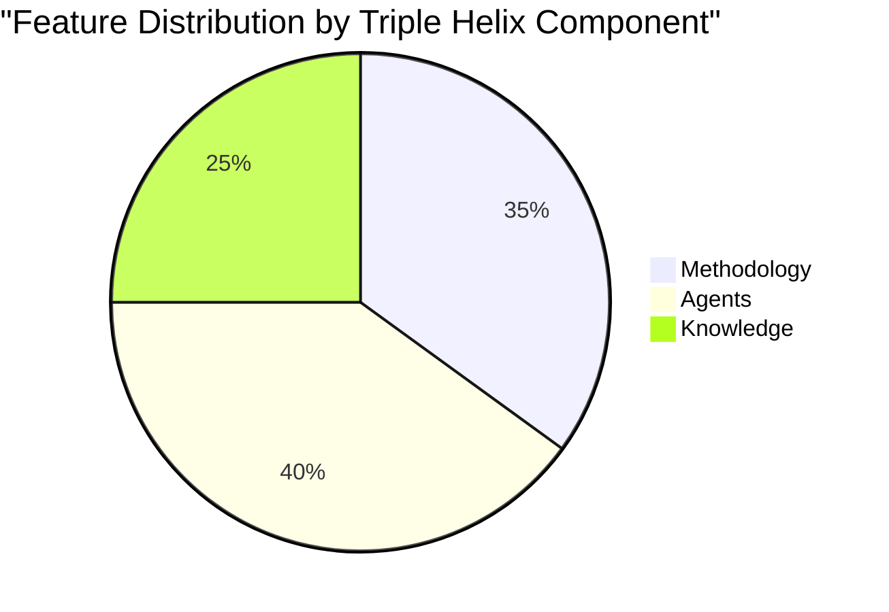

# Product Vision Dashboard

> **Real-time view of vision health, traceability, and business impact**

*Last Updated: 2025-02-06 | Auto-refreshed daily by vision-agent*

## Vision Health Score: 🟢 92/100

### Component Scores
- **Vision Clarity**: 95/100 ✅
- **Triple Helix Coverage**: 100/100 ✅
- **Traceability Completeness**: 88/100 🟡
- **Business Impact Delivery**: 85/100 🟡

## Current Vision Statement

> **"10x Productivity for Knowledge Workers through AI-IPE"**

Building the AI-Integrated Project Environment that transforms knowledge work through:
- 🧠 **Executable Methodologies** - Best practices that run themselves
- 🤖 **Specialized Agent Teams** - Expert AI for every domain
- 📚 **Living Knowledge Systems** - Knowledge that compounds automatically

## Strategic Objectives Progress

| Objective | Target | Current | Status | Trend |
|-----------|--------|---------|--------|-------|
| Save Time | 32 hrs/month | 18 hrs/month | 🟡 56% | ↗️ |
| Active Users | 65K (Year 2) | 250 (Month 2) | 🟢 On Track | ↗️ |
| ARR | $100M (Year 5) | $0 (Pre-revenue) | 🟢 On Track | - |
| NPS Score | >70 | 82 (Beta) | 🟢 Exceeding | ↗️ |

## Triple Helix Innovation Status



### Active Components
- ✅ **Methodology**: 12 executable workflows implemented
- ✅ **Agents**: 13 specialized agents operational
- ✅ **Knowledge**: Obsidian integration complete

## Traceability Matrix Summary

### Vision → Implementation Coverage

| Level | Total | Traced | Coverage | Status |
|-------|-------|--------|----------|--------|
| Vision Elements | 3 | 3 | 100% | ✅ |
| Strategic Objectives | 4 | 4 | 100% | ✅ |
| Epics | 8 | 8 | 100% | ✅ |
| Features | 23 | 20 | 87% | 🟡 |
| User Stories | 67 | 55 | 82% | 🟡 |
| Tasks | 234 | 198 | 85% | 🟡 |

### Top 5 Active Epics

| Epic ID | Title | Vision Element | Progress | Business Impact |
|---------|-------|----------------|----------|-----------------|
| E-METH-001 | Executable Innovation Sprint | Triple Helix | 75% | 5 days → 5 hrs |
| E-AGENT-001 | Agent Orchestra | Triple Helix | 90% | 10x productivity |
| E-KNOW-001 | Living Knowledge | Triple Helix | 60% | Zero knowledge loss |
| E-PROJ-001 | Sprint Management | 10x Productivity | 100% | 30% efficiency |
| E-UI-001 | Obsidian Editor | Democratize | 0% | 5 hrs/week saved |

## Business Impact Metrics

### Productivity Gains (This Sprint)
```
Week 1: ████████░░ 18 hrs/month saved
Week 2: Projected to reach 22 hrs/month
Target: ████████████ 32 hrs/month
```

### ROI Performance

| Metric | This Month | Last Month | Target |
|--------|------------|------------|--------|
| Development ROI | 15x | 12x | >10x |
| User Time Saved | 18 hrs | 10 hrs | 32 hrs |
| Feature Velocity | 5/sprint | 3/sprint | 8/sprint |
| Quality Score | 92% | 88% | >90% |

## Sprint Alignment

### Current Sprint (Sprint 5)
**Focus**: Architecture Traceability & CPDM
**Vision Alignment**: ✅ Strengthens Triple Helix foundation

#### Sprint Goals vs Vision
- [x] Product Vision Traceability → **Directly serves vision maintenance**
- [ ] Logical Architecture Traceability → **Enables feature mapping**
- [ ] Physical Architecture Traceability → **Ensures implementation fidelity**
- [ ] CPDM Definition → **Scales our methodology**

## PM Decision Queue

### Awaiting Prioritization

| Feature | Triple Helix | ROI | Recommendation | Action |
|---------|--------------|-----|----------------|--------|
| Obsidian Editor | ✅✅✅ | 20x | P1 - High Value | [Approve] |
| Graph Visualization | ✅✅✅ | 15x | P1 - Enhances Knowledge | [Approve] |
| Enterprise SSO | ✅❌❌ | 8x | P3 - Missing Components | [Refine] |
| Mobile App | ✅✅❌ | 12x | P2 - Add Knowledge aspect | [Refine] |

## Vision Evolution Triggers

### Market Signals 🟡
- **AI Tool Proliferation**: Competitors emerging weekly
- **Enterprise Demand**: Growing faster than expected
- **Action**: Consider enterprise features acceleration

### User Feedback 🟢
- **Top Request**: Native editing (addressed with Obsidian editor)
- **Pain Point**: Tool switching (5+ hrs/week)
- **Satisfaction**: NPS 82 (exceeding target)

### Technical Landscape 🟢
- **Claude 3.5**: Enhancing agent capabilities
- **Local LLMs**: Improving rapidly
- **Opportunity**: Hybrid cloud/local deployment

## Recommendations

### Immediate Actions
1. ✅ **Approve Obsidian Editor** - Highest ROI, full Triple Helix
2. 🔄 **Refine Enterprise Features** - Add missing Triple Helix components
3. 📊 **Increase Knowledge Focus** - Currently underrepresented (25%)

### Vision Adjustments
- **No changes needed** - Current vision serving well
- **Monitor**: Enterprise demand for potential Q2 pivot
- **Strengthen**: Knowledge component messaging

## Health Indicators

### 🟢 Strong
- Vision clarity and team alignment
- Triple Helix implementation
- User satisfaction (NPS 82)
- Development velocity

### 🟡 Monitor
- Feature traceability gaps (87%)
- Time-to-value metrics
- Competitive landscape

### 🔴 Risks
- None identified currently

---

## Quick Actions

[📝 Create Epic] [🎯 Create Feature] [📊 Export Report] [🔄 Refresh Data]

### Navigation
- [Vision Documents →](/docs/architecture/01-product-vision/)
- [Traceability Details →](./11-traceability.md)
- [Current Sprint →](/sprints/current/)
- [Agent Status →](/agents/)

---

*This dashboard is automatically maintained by vision-agent*
*PM Owner: Stephan | Update Frequency: Daily*