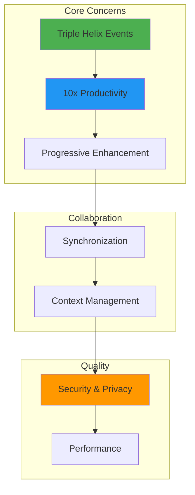
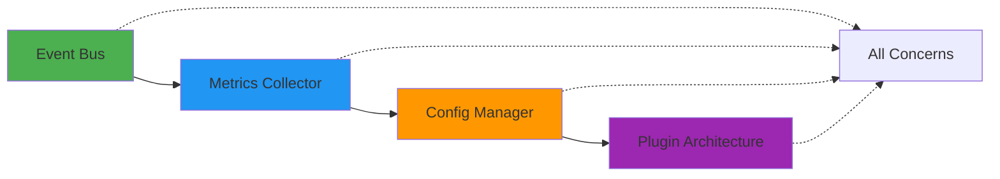

# Cross-Cutting Concerns

> System-wide capabilities that enable the Triple Helix innovation and 10x productivity gains.

## Overview

Cross-cutting concerns are architectural aspects that affect multiple layers and domains. They provide the foundational capabilities that make ClaudeProjects2 powerful, efficient, and user-friendly.

## Detailed Concerns

### 🔄 [Triple Helix Event System](cross-cutting/Triple-Helix-Events.md)
The self-reinforcing cycle of continuous improvement:
- Methodology → Agent → Knowledge → Methodology
- Event-driven architecture
- Pattern detection and system evolution
- Complete audit trail

### 🚀 [10x Productivity Engine](cross-cutting/10x-Productivity-Engine.md)
Orchestrating components for order-of-magnitude improvements:
- Methodology guidance (10x)
- Agent parallelism (8x)
- Knowledge reuse (5x)
- Combined multipliers (12x+)

### 📈 [Progressive Enhancement Framework](cross-cutting/Progressive-Enhancement.md)
Growing users from beginners to experts:
- Adaptive interface complexity
- Feature progressive disclosure
- Learning path system
- Community engagement

### 🔄 [Synchronization & Conflict Resolution](cross-cutting/Synchronization.md)
Seamless collaboration and offline-first operation:
- Smart conflict resolution
- Priority-based sync queuing
- Performance optimization
- Eventually consistent

### 🧠 [Context Persistence & Evolution](cross-cutting/Context-Management.md)
Intelligent agent memory management:
- Context layers (working, project, learning, collaboration)
- Persistence and compression
- Evolution through pattern learning
- Seamless context sharing

### 🔒 [Security & Privacy Framework](cross-cutting/Security-Privacy.md)
User data sovereignty and system security:
- Local-first architecture
- Zero-knowledge protocols
- Privacy control matrix
- Compliance ready (GDPR, SOC2)

### ⚡ [Performance Optimization Framework](cross-cutting/Performance-Optimization.md)
Meeting 10x productivity goals:
- Parallel processing strategies
- Intelligent caching layers
- Resource management
- Adaptive performance states

## Integration Points

All cross-cutting concerns integrate through:

1. **Event Bus**: Central nervous system for all components
2. **Metrics Collector**: Unified performance tracking
3. **Configuration Manager**: Consistent settings across system
4. **Plugin Architecture**: Extensibility for future enhancements

## Design Principles

1. **Separation of Concerns**: Each concern has clear boundaries
2. **Composability**: Concerns work together seamlessly
3. **Performance First**: Every concern optimized for speed
4. **User Control**: Privacy and preferences respected
5. **Continuous Improvement**: System learns and evolves

## Next Steps

- Review individual concerns for detailed implementation
- See [Quality Attributes](Quality-Attributes.md) for specific targets
- Explore [Flows](Flows.md) for end-to-end examples
- Return to [Overview](Overview.md) for big picture