# Domain Business Logic

> Deep dive into the business rules and interactions within each domain. For domain overview, see [Layers](Layers.md#domain-layer---triple-helix-core).

## High-Level Domain Interactions


## Domain Details

<details>
<summary><b>👤 User Domain</b> - Identity, preferences, and growth</summary>

### Business Rules
- Users must authenticate before accessing system
- Each user owns exactly one workspace (personal workspace)
- Workspace contains all user's projects and settings
- User preferences cascade to all their projects
- Growth level unlocks advanced features
- Users can share individual projects with others
- Time to first value must be tracked and < 5 minutes
- Achievement milestones trigger feature unlocks
- Personalized learning paths adapt to user's domain

### Enhanced Growth Journey


### Achievement System


### Skill Progression Tracking

```typescript
interface UserProgression {
  level: UserLevel
  experience: {
    totalProjects: number
    successfulProjects: number
    totalTimeSaved: Duration
    averageQualityScore: Percentage
  }
  
  achievements: Achievement[]
  unlockedFeatures: Feature[]
  
  learningPath: {
    currentPhase: LearningPhase
    completedModules: Module[]
    recommendedNext: Module[]
    domainSpecialization: Domain
  }
  
  metrics: {
    timeToFirstValue: Duration
    timeToProductivity: Duration
    adoptionVelocity: Rate
    masteryProgress: Percentage
  }
}
```

### Personalized Onboarding

```mermaid
sequenceDiagram
    participant User
    participant Onboarding
    participant QuickStart
    participant ValueDemo
    participant FirstProject
    
    User->>Onboarding: Sign up
    Onboarding->>User: Welcome + Role Selection
    User->>Onboarding: Select "Innovation Consultant"
    Onboarding->>QuickStart: Load domain-specific flow
    QuickStart->>ValueDemo: Show before/after example
    ValueDemo->>User: "3 weeks → 4 hours" demo
    User->>FirstProject: Start with template
    FirstProject->>User: First AI output (< 30s)
    Note over User: First value achieved!
    FirstProject->>User: Guide through completion
    User->>Onboarding: Complete (< 15 min total)
```



### Permission Model
- **Owner**: Full control over own workspace
- **Collaborator**: Can edit shared projects
- **Viewer**: Read-only access to shared projects
- **Guest**: Limited access to specific deliverables
- **Influencer**: Extended API limits, beta features

### Workspace Entity


**Workspace Features:**
- **One-to-One with User**: Each user has exactly one personal workspace
- **Project Container**: All user's projects live within their workspace
- **Settings Hub**: Workspace-level preferences and configurations
- **Template Library**: Custom templates and project types
- **Collaboration Space**: Share individual projects while keeping workspace private
- **Resource Management**: Track usage limits and quotas

</details>


<details>
<summary><b>📁 Project Domain</b> - Value creation through methodology execution</summary>

### Business Rules
- Projects exist within a user's workspace
- Projects must be created from a project type
- Cannot execute without assigned methodology
- All deliverables must be living documents
- Productivity metrics tracked automatically
- Knowledge capture is continuous, not post-hoc
- Individual projects can be shared without exposing entire workspace

### Project Lifecycle


### Productivity Measurement


### Living Deliverables
- Auto-update when source data changes
- Version history with explanations
- Proactive refresh suggestions
- Cross-project synchronization

### Project Management Integration
- **Agile PM**: Built-in sprint planning and tracking
- **Task Management**: Break down methodology phases into tasks
- **Agent Assignment**: Assign tasks to appropriate AI agents
- **Progress Tracking**: Real-time visibility into project status
- **Sprint Reviews**: Automated retrospectives with insights

</details>

<details>
<summary><b>🎯 Project Types</b> - Reusable project configurations</summary>

### Business Rules
- Built-in types cannot be deleted
- Custom types can extend OR be completely new
- Types define default methodology
- Types specify agent team composition
- Types are private to workspace (future: marketplace)

### Type Inheritance


### Type Components
- **Methodology**: Default workflow
- **Agent Team**: Pre-assigned specialists
- **Templates**: Starting documents
- **Metrics**: Success criteria
- **Settings**: Project defaults

</details>

<details>
<summary><b>📚 Methodology Domain</b> - Executable best practices</summary>

### Business Rules
- Methodologies have mandatory phases
- Quality gates cannot be skipped
- Each phase has success criteria
- Methodologies learn from outcomes
- Custom methodologies require validation

### Methodology Evolution


### Quality Gates
- **Entry Criteria**: Prerequisites met
- **Phase Validation**: Deliverables complete
- **Exit Criteria**: Quality standards met
- **Automated Checks**: AI validation
- **Human Override**: With justification

### Methodology Library
| Category | Count | Examples |
|----------|-------|----------|
| Innovation | 5 | Design Sprint, Double Diamond, Jobs-to-be-Done |
| Sales | 4 | MEDDIC, Challenger, Solution Selling, SPIN |
| Marketing | 6 | Growth Hacking, Content Strategy, ABM |
| Development | 5 | Agile, Waterfall, DDD, TDD, DevOps |
| Consulting | 4 | McKinsey 7S, BCG Matrix, Blue Ocean |

</details>

<details>
<summary><b>🏪 Marketplace Domain</b> - Community sharing and discovery</summary>

### Business Rules
- All shared content must pass quality validation
- Methodologies and agents can be published independently
- Publishers maintain ownership but grant usage rights
- Community ratings help surface quality content
- Versioning ensures compatibility

### Marketplace Components


### Publishing Workflow


### Discovery Features
- **Search**: Full-text and semantic search
- **Categories**: Browse by domain, complexity, use case
- **Recommendations**: Based on user profile and project history
- **Trending**: Popular and newly featured content
- **Collections**: Curated sets for specific industries

### Quality Assurance
- **Automated Testing**: Syntax validation, compatibility checks
- **Community Review**: Peer validation process
- **Usage Analytics**: Track effectiveness metrics
- **Continuous Monitoring**: Flag degraded quality
- **Version Compatibility**: Ensure backward compatibility

</details>

<details>
<summary><b>🤖 Agent Domain</b> - Specialized AI workforce with context management</summary>

### Business Rules
- Agents have defined specializations
- Teams form based on methodology needs
- Agents can work in parallel
- Performance tracked per agent
- Agents improve through usage
- Context persists across sessions
- Context evolves based on outcomes

### Agent Specialization Matrix


### Team Formation Rules
- Methodology specifies required roles
- System matches best available agents
- Parallel execution when possible
- Automatic workload balancing
- Fallback agents for availability

### Performance Tracking
- Task completion time
- Output quality scores
- Collaboration effectiveness
- Learning rate
- User satisfaction

### Agent Context Management


### Context Components

#### Working Memory
- **Current Task**: Active goal and progress
- **Recent Actions**: Last N operations for continuity
- **Temporary State**: Session-specific information
- **Active Tools**: Currently loaded capabilities

#### Project Context
- **Project History**: All past interactions on project
- **Methodology State**: Current phase and progress
- **Deliverables**: Generated artifacts and documents
- **Decisions**: Key choices and rationale

#### Learning Context
- **Performance Metrics**: Success/failure patterns
- **Effective Strategies**: What worked well
- **User Preferences**: Learned style preferences
- **Domain Knowledge**: Accumulated expertise

#### Collaboration Context
- **Team State**: Other agents' current work
- **Handoff Points**: Clear transition information
- **Shared Goals**: Team objectives
- **Communication History**: Inter-agent messages

### Context Lifecycle


### Context Evolution Mechanism
- **Pattern Recognition**: Identify successful approaches
- **Preference Learning**: Adapt to user style
- **Knowledge Accumulation**: Build domain expertise
- **Performance Optimization**: Improve based on metrics
- **Collaborative Learning**: Learn from team interactions

</details>

<details>
<summary><b>🧠 Knowledge Domain</b> - Living organizational memory</summary>

### Business Rules
- All project artifacts become knowledge
- Knowledge links automatically form
- Patterns emerge from usage
- Insights proactively surface
- Privacy controls respect boundaries

### Knowledge Flow


### Living Document Features
- **Auto-Update**: When sources change
- **Version Intelligence**: Explain why changed
- **Cross-Reference**: Link related docs
- **Predictive Updates**: Suggest refreshes
- **Quality Decay**: Flag stale content

### Organizational Learning
- Success pattern recognition
- Failure analysis and prevention
- Best practice extraction
- Predictive recommendations
- Knowledge gap identification

</details>

<details>
<summary><b>📊 Value Analytics Domain</b> - ROI tracking and business value demonstration</summary>

### Business Rules
- Every project must establish baseline metrics before starting
- Time tracking runs automatically during all project activities
- Quality metrics derived from methodology compliance and outputs
- ROI calculations update in real-time as work progresses
- Value reports generated automatically at project milestones
- Historical data improves future baseline estimates
- All metrics respect user privacy settings

### Value Tracking Components


### Baseline Establishment

```typescript
interface ProjectBaseline {
  traditional: {
    estimatedDuration: Duration
    estimatedCost: Money
    expectedRevisions: number
    resourceRequirements: Resource[]
    qualityExpectations: QualityMetrics
  }
  
  historical: {
    similarProjects: ProjectReference[]
    averageMetrics: AggregatedMetrics
    industryBenchmarks: Benchmark[]
  }
  
  target: {
    duration: Duration  // 10x improvement goal
    quality: QualityScore  // Higher quality target
    cost: Money  // Reduced cost target
  }
}
```

### Real-Time Value Tracking


### ROI Calculation Framework

```typescript
class ROICalculator {
  calculateROI(project: Project): ROIMetrics {
    const baseline = project.baseline
    const actual = project.actualMetrics
    
    return {
      timeSavings: {
        hours: baseline.traditional.duration - actual.duration,
        percentage: (1 - actual.duration / baseline.traditional.duration) * 100,
        dollarValue: this.hourlyRate * savedHours
      },
      
      qualityImprovement: {
        revisionsAvoided: baseline.expectedRevisions - actual.revisions,
        defectReduction: baseline.defectRate - actual.defectRate,
        satisfactionIncrease: actual.satisfaction - baseline.satisfaction
      },
      
      costSavings: {
        directLabor: this.calculateLaborSavings(baseline, actual),
        opportunityCost: this.calculateOpportunityCost(timeSaved),
        qualityCost: this.calculateQualityCost(qualityImprovement)
      },
      
      totalROI: {
        percentage: (totalValue - investment) / investment * 100,
        multiplier: totalValue / investment,
        paybackPeriod: investment / monthlyValue
      }
    }
  }
}
```

### Value Reporting


### Success Metrics Tracking

| Metric | Measurement | Target | Dashboard Display |
|--------|------------|--------|-------------------|
| Time to Value | First output timestamp | < 5 min | Green/Yellow/Red |
| Productivity Gain | Time saved vs baseline | 10x | Multiplier chart |
| Quality Improvement | Defects, revisions | 50% less | Trend line |
| Cost Reduction | $ saved | 90% | Savings counter |
| User Satisfaction | NPS score | > 70 | Gauge chart |

### Integration Points

- **Project Domain**: Provides task timing and outcomes
- **Methodology Domain**: Supplies baseline estimates and quality standards  
- **Agent Domain**: Reports execution metrics and performance
- **User Domain**: Tracks individual productivity growth
- **Knowledge Domain**: Historical data for better baselines

</details>

<details>
<summary><b>🧠 Intelligence Domain</b> - Machine learning and adaptive optimization</summary>

### Business Rules
- All agent interactions generate learning data automatically
- Success patterns are identified and stored for reuse  
- Performance degradation triggers automatic optimization
- Learning models adapt based on user behavior and outcomes
- Intelligence insights must be explainable and actionable
- Context-aware predictions improve over time
- Privacy controls respect user preferences for data usage

### Intelligence Components


### Learning Algorithms

**K-means Clustering for Agent Performance**
- Clusters agents by performance characteristics
- Identifies optimal team compositions  
- Detects performance anomalies automatically
- Enables predictive agent selection

**Jaccard Similarity for Pattern Matching**
- Measures similarity between task patterns
- Finds best-match methodologies for new projects
- Identifies reusable solution patterns
- Optimizes methodology selection accuracy

**Reinforcement Learning for Dynamic Optimization**
- Learns optimal orchestration strategies
- Adapts to changing performance conditions
- Balances exploration vs exploitation
- Maximizes long-term system performance

### Context Intelligence Features

```typescript
interface ContextIntelligence {
  learning: {
    patternRecognition: PatternEngine
    performancePrediction: PredictiveModel
    contextAdaptation: AdaptiveContext
    userBehaviorAnalysis: BehaviorModel
  }
  
  optimization: {
    dynamicRouting: SmartRouter
    contextPersistence: PersistenceOptimizer
    recoveryStrategies: RecoveryIntelligence
    performanceOptimization: PerformanceEngine
  }
  
  insights: {
    explainableAI: ExplanationEngine
    recommendationSystem: RecommendationEngine
    anomalyDetection: AnomalyDetector
    trendAnalysis: TrendAnalyzer
  }
}
```

### Self-Improvement Capabilities
- **Agent Enhancement**: Automatically improves agent performance based on success patterns
- **Methodology Evolution**: Updates methodologies with lessons learned from project outcomes  
- **Context Optimization**: Learns optimal context switching and persistence strategies
- **Team Optimization**: Identifies and promotes high-performing agent combinations
- **Pattern Evolution**: Discovers new patterns and adds them to the pattern library

### Intelligence Data Flow

```mermaid
sequenceDiagram
    participant Agent as Agent Execution
    participant Learn as Learning Algorithms
    participant Opt as Dynamic Optimizer
    participant Intel as Intelligence Layer
    participant Context as Context System
    
    Agent->>Learn: Performance metrics
    Learn->>Learn: Pattern analysis
    Learn->>Opt: Optimization recommendations
    Opt->>Intel: Adaptive strategies
    Intel->>Context: Smart routing decisions
    Context->>Agent: Optimized execution
    
    Note over Learn: K-means clustering of agent performance
    Note over Opt: Reinforcement learning optimization
    Note over Intel: Context-aware predictions
```

</details>

<details>
<summary><b>⚡ Optimization Domain</b> - Multi-dimensional system optimization</summary>

### Business Rules
- Optimization runs continuously in background without user intervention
- Performance thresholds trigger automatic optimization actions
- Quality gates ensure optimization doesn't sacrifice correctness
- Resource optimization respects system constraints and user preferences
- Process optimization maintains methodology integrity
- All optimizations are measured and reversible

### Optimization Architecture

```mermaid
graph TB
    subgraph "Optimization Layers"
        PERF[Performance Optimizer]
        QUAL[Quality Optimizer]
        PROC[Process Optimizer]
        RESOURCE[Resource Optimizer]
    end
    
    subgraph "Optimization Engine"
        UNIFIED[Unified Optimizer]
        COORD[Optimization Coordinator]
        METRIC[Metrics Engine]
        PREDICT[Predictive Optimizer]
    end
    
    subgraph "Monitoring & Control"
        MONITOR[Real-time Monitoring]
        THRESHOLD[Threshold Management]
        ALERT[Alert System]
        ROLLBACK[Rollback System]
    end
    
    PERF --> UNIFIED
    QUAL --> UNIFIED
    PROC --> UNIFIED
    RESOURCE --> UNIFIED
    
    UNIFIED --> COORD
    COORD --> METRIC
    METRIC --> PREDICT
    
    MONITOR --> THRESHOLD
    THRESHOLD --> ALERT
    ALERT --> ROLLBACK
```

### Performance Optimization

**Bottleneck Detection & Resolution**
- Identifies performance bottlenecks in real-time
- Applies caching strategies automatically  
- Optimizes agent response times
- Balances workloads across available resources

**ML-Driven Performance Prediction**
- Predicts performance issues before they occur
- Recommends proactive optimization actions
- Learns from historical performance patterns
- Adapts to changing system conditions

### Quality Optimization

**Verification-Driven Quality Enhancement**
- Continuous quality monitoring across all processes
- Automatic error pattern detection and prevention
- Quality gate optimization without compromising standards
- Learning from quality failures to prevent recurrence

**Quality Metrics Tracking**
- Real-time quality score calculation
- Quality trend analysis and prediction
- Automated quality improvement suggestions
- Quality correlation with performance metrics

### Process Optimization

**Team Effectiveness Analysis**
- Analyzes team composition effectiveness
- Identifies optimal collaboration patterns
- Optimizes handoff processes between agents
- Reduces coordination overhead

**Execution Strategy Optimization**
```typescript
enum ExecutionStrategy {
  Simple = "sequential_single_agent",
  Pipeline = "pipeline_with_handoffs", 
  FanOut = "parallel_fan_out",
  Hybrid = "adaptive_mixed_strategy"
}

interface ProcessOptimizer {
  analyzeTeamEffectiveness(): TeamEffectivenessMetrics
  optimizeExecutionStrategy(): ExecutionStrategy
  reduceCoordinationOverhead(): OptimizationAction[]
  predictOptimalTeamSize(task: Task): number
}
```

### Resource Optimization

**Predictive Resource Allocation**
- Forecasts resource needs based on task patterns
- Optimizes memory, CPU, and network usage
- Prevents resource starvation scenarios
- Scales resources dynamically based on demand

**Unified Optimization Engine**
- Coordinates all optimization dimensions
- Resolves conflicts between optimization goals
- Maintains system-wide optimization coherence
- Provides unified optimization metrics dashboard

### Optimization Metrics

| Dimension | Current Score | Target | Trend |
|-----------|---------------|---------|-------|
| Performance | 42.3/100 | 80+ | ↗️ Improving |
| Quality | 87.6/100 | 90+ | ↗️ Steady |
| Process | 78.4/100 | 85+ | ↗️ Optimizing |
| Resource | 91.2/100 | 90+ | ↗️ Optimal |
| **Overall** | **74.9/100** | **85+** | **↗️ Good** |

### Integration with Intelligence Domain

```mermaid
graph LR
    subgraph "Intelligence Domain"
        LEARN[Learning Algorithms]
        PATTERN[Pattern Recognition]
        PREDICT_I[Predictive Models]
    end
    
    subgraph "Optimization Domain"
        PERF_O[Performance Optimizer]
        QUAL_O[Quality Optimizer]
        RESOURCE_O[Resource Optimizer]
    end
    
    LEARN --> PERF_O
    PATTERN --> QUAL_O
    PREDICT_I --> RESOURCE_O
    
    PERF_O --> LEARN
    QUAL_O --> PATTERN
    RESOURCE_O --> PREDICT_I
```

### Continuous Optimization Loop

1. **Monitor**: Real-time performance, quality, and resource metrics
2. **Analyze**: Pattern detection and bottleneck identification
3. **Plan**: Generate optimization recommendations using ML insights
4. **Execute**: Apply optimizations with rollback capabilities
5. **Validate**: Measure optimization effectiveness
6. **Learn**: Feed results back into intelligence domain for future improvements

</details>

## Cross-Domain Interactions

### The Triple Helix in Action

```mermaid
sequenceDiagram
    participant User
    participant Project
    participant Methodology
    participant Agents
    participant Knowledge
    participant Value
    
    User->>Project: Start new project
    Project->>Value: Establish baseline
    Project->>Methodology: Load methodology
    Methodology->>Agents: Define team needs
    Agents->>Project: Execute phases
    Agents->>Value: Report metrics
    Project->>Knowledge: Capture outputs
    Value->>User: Show real-time ROI
    Knowledge->>Methodology: Improve process
    Methodology->>Agents: Update guidance
    Value->>Knowledge: Store success metrics
    
    Note over Knowledge: Continuous improvement cycle
    Note over Value: 32 hours saved = $3,200 value
```

### Event-Driven Coordination
- **Project Events**: Trigger methodology phases
- **Methodology Events**: Activate agent teams
- **Agent Events**: Generate knowledge
- **Knowledge Events**: Evolve methodologies
- **User Events**: Personalize experience

## Business Value Streams

### Time-to-Value Acceleration
Traditional: Research → Design → Build → Test → Deploy (weeks)  
ClaudeProjects: All phases parallel with AI agents (hours)

### Quality Improvement
Traditional: Multiple revision cycles, defects found late  
ClaudeProjects: First-time quality through methodology enforcement

### Knowledge Compound Effect
Traditional: Knowledge lost between projects  
ClaudeProjects: Every project makes the next one better

## Next Steps

- Review [Cross-Cutting Concerns](Cross-Cutting.md) for system-wide features
- Explore [Quality Attributes](Quality-Attributes.md) for performance requirements
- See [Flows](Flows.md) for detailed execution examples