# Real-World Flows

See the Triple Helix and 10x productivity in action through detailed examples.

## Innovation Sprint Flow - "5 Days to 5 Hours"

### Traditional Approach (5 Days)
```
Day 1: Understand (8 hours)
├── Stakeholder interviews (3 hours)
├── User research (3 hours)
└── Synthesis (2 hours)

Day 2: Ideate (8 hours)
├── Brainstorming (4 hours)
├── Concept development (4 hours)

Day 3: Decide (8 hours)
├── Concept review (4 hours)
├── Decision making (4 hours)

Day 4: Prototype (8 hours)
├── Design mockups (4 hours)
├── Build prototype (4 hours)

Day 5: Test (8 hours)
├── User testing (6 hours)
└── Results analysis (2 hours)

Total: 40 hours
```

### ClaudeProjects Approach (5 Hours)


### Detailed Phase Breakdown

#### Phase 1: Understand (45 minutes)
```typescript
const understandPhase = await designSprint.executePhase({
  phase: "Understand",
  agents: [
    { name: "user-researcher", task: "Create interview guide and personas" },
    { name: "market-analyst", task: "Analyze competitor apps" },
    { name: "domain-expert", task: "Research banking regulations" },
    { name: "data-scientist", task: "Analyze user behavior data" }
  ],
  parallel: true,
  knowledge: {
    query: "mobile banking user needs and pain points",
    similar: "fintech app design patterns"
  }
});

// Output includes:
// - 5 detailed user personas
// - 20 key insights from user research
// - Competitive analysis of 10 apps
// - Regulatory compliance checklist
```

#### Phase 2: Ideate (60 minutes)
```typescript
const ideatePhase = await designSprint.executePhase({
  phase: "Ideate",
  agents: [
    { name: "creative-director", task: "Generate innovative concepts" },
    { name: "ux-designer", task: "Sketch user flows" },
    { name: "tech-innovator", task: "Suggest cutting-edge features" }
  ],
  constraints: understandPhase.insights,
  method: "Parallel brainstorming with AI synthesis"
});

// Output includes:
// - 127 unique concepts generated
// - 10 fully developed concepts with sketches
// - Innovation score for each concept
// - Feasibility assessment
```

---

## Sales Qualification Flow - "2 Weeks to 2 Days"

### Traditional MEDDIC Process (2 Weeks)
```
Week 1:
├── Metrics Research (2 days)
├── Economic Buyer Identification (2 days)
├── Decision Criteria Discovery (1 day)

Week 2:
├── Decision Process Mapping (2 days)
├── Pain Point Analysis (2 days)
├── Champion Development (1 day)

Total: 10 days / 80 hours
```

### ClaudeProjects MEDDIC (2 Days)


### Detailed MEDDIC Outputs

#### Metrics - Value Framework
```typescript
const metricsAnalysis = await meddic.analyzeMetrics({
  company: "TechCorp",
  solution: "Our Platform",
  agents: ["financial-analyst", "roi-calculator", "benchmark-researcher"]
});

// Output:
{
  currentState: {
    operationalCost: "$8.5M annually",
    efficiency: "62% due to manual processes",
    timeToMarket: "6 months average"
  },
  proposedState: {
    operationalCost: "$6M annually",
    efficiency: "89% with automation",
    timeToMarket: "2 months average"
  },
  valueProps: [
    { metric: "Cost Savings", value: "$2.5M/year", confidence: 0.85 },
    { metric: "Efficiency Gain", value: "27%", confidence: 0.90 },
    { metric: "Revenue Acceleration", value: "$5M", confidence: 0.75 }
  ]
}
```

---

## Marketing Campaign Flow - "1 Month to 3 Days"

### Traditional Campaign Development (1 Month)
```
Week 1: Strategy
├── Market research (3 days)
└── Strategy development (2 days)

Week 2: Creative
├── Concept development (3 days)
└── Creative production (2 days)

Week 3: Content
├── Copy writing (3 days)
└── Design creation (2 days)

Week 4: Launch
├── Channel setup (3 days)
└── Testing & optimization (2 days)

Total: 20 days / 160 hours
```

### ClaudeProjects Campaign (3 Days)


---

## Consulting Engagement - "3 Months to 3 Weeks"

### Traditional Consulting Project
```
Month 1: Discovery (160 hours)
├── Stakeholder interviews
├── Data collection
└── Current state analysis

Month 2: Analysis (160 hours)
├── Gap analysis
├── Opportunity identification
└── Solution design

Month 3: Recommendations (160 hours)
├── Report writing
├── Presentation prep
└── Implementation planning

Total: 480 hours
```

### ClaudeProjects Consulting (3 Weeks)

```typescript
async function runDigitalTransformation() {
  // Week 1: Discovery (40 hours with agent teams)
  const discovery = await methodology.execute({
    phase: "Discovery",
    agents: {
      interviews: ["stakeholder-interviewer", "insight-extractor"],
      analysis: ["data-analyst", "process-mapper", "tech-auditor"],
      research: ["industry-researcher", "benchmark-analyst"]
    },
    parallel: true
  });
  
  // Week 2: Solution Design (40 hours)
  const solution = await methodology.execute({
    phase: "Solution Design",
    input: discovery.findings,
    agents: {
      architecture: ["solution-architect", "tech-strategist"],
      roadmap: ["transformation-planner", "risk-analyst"],
      business: ["roi-modeler", "change-manager"]
    }
  });
  
  // Week 3: Delivery (40 hours)
  const delivery = await methodology.execute({
    phase: "Delivery",
    input: solution.design,
    agents: {
      documentation: ["report-writer", "presentation-creator"],
      planning: ["implementation-planner", "resource-estimator"],
      enablement: ["training-designer", "communication-planner"]
    }
  });
  
  return {
    timeSpent: "120 hours",
    timeSaved: "360 hours",
    multiplier: "4x",
    quality: "McKinsey-level",
    deliverables: {
      executiveSummary: delivery.summary,
      detailedReport: delivery.report,
      implementationPlan: delivery.plan,
      riskRegister: delivery.risks,
      quickWins: delivery.quickWins
    }
  };
}
```

---

## Productivity Metrics Across Flows

### Time Compression


### Quality Improvements
```typescript
const qualityMetrics = {
  designSprint: {
    concepts: { traditional: 20, claude: 127 }, // 6x more
    userValidation: { traditional: 10, claude: 100 }, // 10x more
    iterations: { traditional: 1, claude: 5 } // 5x faster
  },
  
  salesQual: {
    insightsDepth: { traditional: "surface", claude: "comprehensive" },
    accuracy: { traditional: 0.7, claude: 0.9 },
    completeness: { traditional: 0.6, claude: 0.95 }
  },
  
  marketing: {
    variations: { traditional: 3, claude: 50 },
    channels: { traditional: 5, claude: 15 },
    personalization: { traditional: "segments", claude: "individual" }
  }
};
```

## Key Success Factors

### 1. Parallel Agent Execution
- Multiple specialists work simultaneously
- No waiting for sequential tasks
- Instant expertise availability

### 2. Knowledge Reuse
- Start with 80% from similar projects
- Learn from every execution
- Continuous methodology improvement

### 3. Methodology Guidance
- Never start from scratch
- Best practices embedded
- Quality gates ensure standards

### 4. Living Deliverables
- Documents update themselves
- Insights emerge automatically
- Knowledge compounds over time

---

## Community Contribution Flow - "Share Excellence"

### Publishing a Methodology to Marketplace

```mermaid
sequenceDiagram
    participant User
    participant MW as Methodology Workspace
    participant MP as Marketplace
    participant QA as Quality Assurance
    participant COM as Community
    
    User->>MW: "Share my Sales Methodology"
    MW->>MW: Package methodology + evidence
    MW->>MP: Submit for publication
    
    MP->>QA: Automated validation
    QA->>QA: Syntax check
    QA->>QA: Compatibility test
    QA->>QA: Performance benchmark
    
    alt Validation Passed
        QA->>MP: Approved for review
        MP->>COM: Community testing period (7 days)
        
        par Community Testing
            COM->>COM: Test in sandbox
            COM->>COM: Provide feedback
            COM->>COM: Rate effectiveness
        end
        
        COM->>MP: 4.5★ rating, 10 reviews
        MP->>User: Published! 🎉
        MP->>MW: Enable marketplace tracking
    else Validation Failed
        QA->>MW: Issues to fix
        MW->>User: Revision needed
    end
    
    Note over User,COM: Continuous improvement from usage
```



### Discovering & Using Community Content

```typescript
async function discoverMethodology(need: ProjectNeed) {
  // Smart discovery
  const recommendations = await marketplace.discover({
    domain: need.domain,
    complexity: need.complexity,
    teamSize: need.teamSize,
    timeline: need.timeline
  });
  
  // Returns ranked options
  return recommendations.map(method => ({
    name: method.name,
    author: method.author,
    rating: method.communityRating,
    usage: method.timesUsed,
    fit: method.fitScore, // AI-calculated fit
    preview: method.sandboxUrl
  }));
}

// Using community methodology
async function useMethodology(selection: MethodologySelection) {
  // One-click import
  const imported = await marketplace.import(selection.id);
  
  // Automatic adaptation
  const adapted = await workspace.adapt({
    methodology: imported,
    context: currentProject,
    preferences: userPreferences
  });
  
  // Track usage for analytics
  await marketplace.trackUsage({
    methodologyId: selection.id,
    projectType: currentProject.type,
    adaptations: adapted.changes
  });
}
```

---

## Offline-to-Online Synchronization Flow

### Collaborative Project with Offline Work


### Intelligent Conflict Resolution

```typescript
class ConflictResolution {
  async resolveProjectConflict(conflict: ProjectConflict) {
    // Analyze conflict type
    const analysis = {
      type: this.detectType(conflict),
      severity: this.assessSeverity(conflict),
      autoResolvable: this.canAutoResolve(conflict)
    };
    
    if (analysis.autoResolvable) {
      // Smart merge strategies
      switch (analysis.type) {
        case 'non-overlapping':
          return this.mergeNonOverlapping(conflict);
          
        case 'semantic-compatible':
          return this.mergeSemanticCompatible(conflict);
          
        case 'timestamp-based':
          return this.mergeByTimestamp(conflict);
          
        case 'crdt-mergeable':
          return this.mergeCRDT(conflict);
      }
    }
    
    // Manual resolution needed
    return this.presentConflictUI({
      local: conflict.localVersion,
      remote: conflict.remoteVersion,
      base: conflict.commonAncestor,
      suggestions: this.generateSuggestions(conflict),
      impact: this.assessImpact(conflict)
    });
  }
}

// Sync queue optimization
class SyncQueue {
  prioritizeSync(changes: Change[]) {
    return changes.sort((a, b) => {
      // Critical shared resources first
      if (a.resource.shared && !b.resource.shared) return -1;
      
      // User-initiated over system
      if (a.source === 'user' && b.source === 'system') return -1;
      
      // Smaller changes first for quick wins
      if (a.size < b.size) return -1;
      
      return 0;
    });
  }
}
```

---

## Agent Context Evolution Flow

### Learning from Project Success


### Context Handoff Between Agents


### Practical Context Evolution

```typescript
// Real example: Sales proposal agent learning
class SalesAgentEvolution {
  async evolveFromOutcome(context: AgentContext, outcome: ProposalOutcome) {
    if (outcome.won) {
      // What worked?
      const successFactors = {
        valueProps: this.extractWinningValueProps(context, outcome),
        language: this.analyzeEffectiveLanguage(context, outcome),
        structure: this.captureWinningStructure(context, outcome)
      };
      
      // Update context
      context.learning.patterns.push({
        type: 'winning-proposal',
        factors: successFactors,
        confidence: 0.85,
        industry: outcome.client.industry
      });
      
      // Refine strategies
      context.learning.strategies = context.learning.strategies.map(s => {
        if (s.name === 'value-articulation') {
          s.effectiveness += 0.1;
          s.examples.push(successFactors.valueProps);
        }
        return s;
      });
    }
    
    // Prune outdated patterns
    context.learning.patterns = context.learning.patterns
      .filter(p => {
        // Keep if recent or highly effective
        const age = Date.now() - p.timestamp;
        const isRecent = age < 90 * 24 * 60 * 60 * 1000; // 90 days
        const isEffective = p.confidence > 0.7;
        return isRecent || isEffective;
      })
      // Consolidate similar patterns
      .reduce((consolidated, pattern) => {
        const similar = consolidated.find(p => 
          this.similarity(p, pattern) > 0.8
        );
        if (similar) {
          similar.confidence = Math.max(similar.confidence, pattern.confidence);
          similar.occurrences++;
        } else {
          consolidated.push(pattern);
        }
        return consolidated;
      }, []);
    
    return context;
  }
}
```

## Performance Impact of New Features

### Marketplace Acceleration
- **Before**: Build methodology from scratch (2 weeks)
- **After**: Adapt community methodology (2 hours)
- **Multiplier**: 80x faster startup

### Collaboration Efficiency
- **Before**: Email files, manual merge (hours/day)
- **After**: Real-time sync, auto-merge (seamless)
- **Multiplier**: ∞ (removes friction entirely)

### Agent Intelligence Growth
- **First Project**: Baseline performance
- **10th Project**: 2x faster execution
- **50th Project**: 5x quality improvement
- **Growth Rate**: Exponential with usage

## Next Steps

- Return to [Overview](Overview.md) for architecture summary
- Explore [Domains](Domains.md) for detailed capabilities
- Review [Quality Attributes](Quality-Attributes.md) for metrics