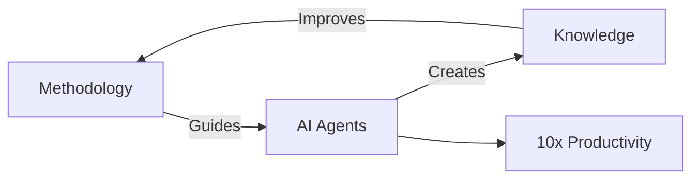
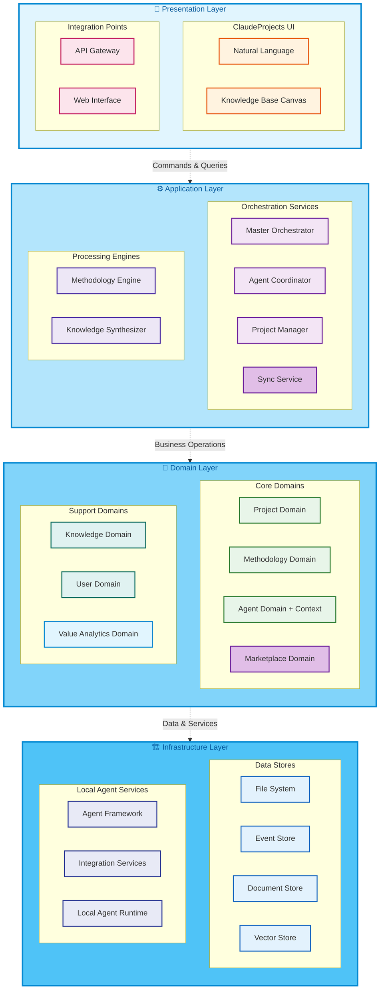

# Logical Architecture Overview

## The Triple Helix Innovation



## Architectural Principles

1. **Methodology-First**: Every workflow embeds executable best practices
2. **Agent-Oriented**: Specialized AI agents as primary value creators
3. **Knowledge-Centric**: Living knowledge that learns and evolves
4. **Local-First**: User sovereignty, privacy, and performance
5. **Progressive Enhancement**: Simple start, expert growth path
6. **10x Productivity**: Every feature must contribute to order-of-magnitude gains
7. **Community-Driven**: Marketplace for sharing methodologies and agents
8. **Seamless Collaboration**: Offline-first with intelligent synchronization

## Layer Architecture

### Stacked Layer View



### Layer Responsibilities

| Layer | Purpose | Key Components |
|-------|---------|----------------|
| **Presentation** | User interaction & external interfaces | ClaudeProjects UI, Knowledge Base Canvas, Web Interface, APIs |
| **Application** | Business process orchestration | Master Orchestrator, Methodology Engine, Agent Coordinator, Project Manager, Synchronization Service |
| **Domain** | Core business logic & rules | Projects, Methodologies, Agents (with Context Management), Knowledge, Users, Value Analytics, Marketplace |
| **Infrastructure** | Technical services & persistence | File System, Event Store, Document Store, Vector Store, Agent Framework, Local Agent Runtime, Integration Services |

## Key Concepts

### Methodology-Driven Execution
Every project follows proven methodologies that are:
- **Executable**: Not just documentation but active workflows
- **Adaptive**: Learn and improve from usage
- **Domain-Specific**: Specialized for different knowledge work

### Agent Ecosystem
Specialized AI agents that:
- **Collaborate**: Form teams for complex tasks
- **Learn**: Improve performance over time through context evolution
- **Specialize**: Deep expertise in specific domains
- **Remember**: Maintain context across sessions and projects
- **Share**: Pass context seamlessly between team members

### Living Knowledge
Knowledge that:
- **Self-Updates**: Documents refresh automatically
- **Connects**: Links emerge between concepts
- **Evolves**: Best practices improve continuously
- **Syncs**: Seamlessly merges changes from multiple sources
- **Shares**: Community contributions enhance everyone

## Value Proposition

Transform this:
```
Manual Process (40 hours)
├── Research: 16 hours
├── Planning: 8 hours  
├── Execution: 12 hours
└── Documentation: 4 hours
```

Into this:
```
ClaudeProjects (4 hours)
├── AI Research: 1.5 hours (parallel agents)
├── Methodology Planning: 0.5 hours (templates)
├── Agent Execution: 1.5 hours (specialized teams)
└── Auto Documentation: 0.5 hours (continuous capture)
```

## New Architectural Enhancements

### 1. Community Marketplace
- **Share Excellence**: Publish methodologies and agents to help others
- **Discover Solutions**: Find proven approaches from the community
- **Quality Assured**: Automated testing and community validation
- **Continuous Improvement**: Learn from collective usage

### 2. Intelligent Synchronization
- **Offline-First**: Full functionality without connectivity
- **Smart Conflict Resolution**: Automatic merging where possible
- **Prioritized Sync**: Critical changes sync first
- **Real-time Collaboration**: Live updates for shared projects

### 3. Agent Context Management
- **Persistent Memory**: Agents remember across sessions
- **Context Evolution**: Learn from every interaction
- **Seamless Handoffs**: Context flows between collaborating agents
- **Performance Optimization**: Fast context switching (< 500ms)

## Next Steps

- Dive into [Layers](Layers.md) for detailed specifications
- Explore [Domains](Domains.md) for business logic
- Review [Flows](Flows.md) for real examples
- Check [Cross-Cutting Concerns](Cross-Cutting.md) for sync and context details