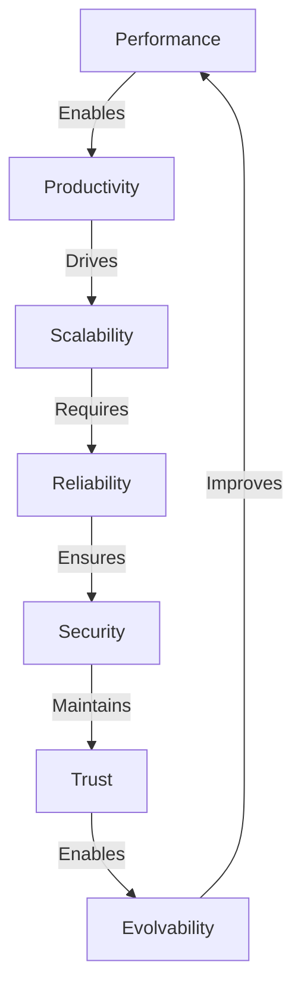

# Quality Attributes - "10x Enablers"

Measurable qualities that ensure ClaudeProjects2 delivers on its promise.

## Performance - "Speed to Value"

### Targets

| Metric | Target | Rationale |
|--------|--------|-----------|
| Time to First Value | < 5 minutes | User sees tangible output immediately |
| Time to First Project | < 2 minutes | Quick start with templates |
| Time to First AI Output | < 30 seconds | Instant gratification |
| Time to Productivity | < 1 hour | Complete first real project |
| Agent Response | < 3s simple, < 30s complex | Maintain flow state |
| Methodology Loading | < 1s local, < 3s cloud | Instant gratification |
| Knowledge Query | < 500ms | As fast as thinking |
| UI Responsiveness | < 100ms | Native app feel |
| Context Switch Time | < 500ms | Instant agent transitions |
| Context Load Time | < 2s | Quick project switching |
| Context Save Time | < 1s | Non-blocking saves |

### Implementation Strategies

```typescript
class PerformanceOptimizer {
  // Predictive loading
  async preloadLikely(context: Context): Promise<void> {
    const predictions = this.ml.predictNextActions(context);
    await Promise.all([
      this.cacheMethodologies(predictions.methodologies),
      this.warmAgents(predictions.agents),
      this.prefetchKnowledge(predictions.queries)
    ]);
  }
  
  // Streaming responses
  streamAgentResponse(agent: Agent, task: Task): Observable<Chunk> {
    return agent.executeStreaming(task).pipe(
      buffer(100), // Buffer 100ms chunks
      map(chunk => this.renderPartial(chunk))
    );
  }
  
  // Progressive rendering
  renderDashboard(project: Project): RenderPlan {
    return {
      immediate: this.getCriticalData(project),
      deferred: this.getNonCriticalData(project),
      lazy: this.getHistoricalData(project)
    };
  }
  
  // Fast context switching
  async switchContext(from: Context, to: Context): Promise<void> {
    // Parallel save and load
    await Promise.all([
      this.saveContext(from),  // Non-blocking
      this.preloadContext(to)  // Start loading early
    ]);
    
    // Instant switch with preloaded data
    this.activateContext(to);
  }
  
  // Context performance monitoring
  measureContextPerformance(): ContextMetrics {
    return {
      avgSwitchTime: this.metrics.average('context.switch'),
      avgLoadTime: this.metrics.average('context.load'),
      avgSaveTime: this.metrics.average('context.save'),
      cacheHitRate: this.metrics.ratio('context.cache.hit', 'context.cache.total'),
      compressionRatio: this.metrics.average('context.compression')
    };
  }
}
```

### Time-to-Value Optimization

```typescript
class TimeToValueOptimizer {
  // Quick start experience
  async quickStart(user: User): Promise<QuickStartResult> {
    const templates = await this.getRelevantTemplates(user.role);
    const wizard = this.createThreeStepWizard(templates);
    
    return {
      projectCreated: await wizard.execute(),
      timeElapsed: this.tracker.elapsed(),
      firstValueDelivered: this.tracker.firstOutput()
    };
  }
  
  // Onboarding flow
  async onboardUser(user: User): Promise<OnboardingResult> {
    const flow = {
      welcome: this.showPersonalizedWelcome(user),
      roleSelection: this.selectDomainRole(),
      valueDemo: this.demonstrateBeforeAfter(user.role),
      instantProject: this.createSampleProject(user.role),
      firstOutput: await this.generateFirstAIOutput()
    };
    
    return {
      timeToFirstValue: flow.firstOutput.timestamp,
      completionTime: this.tracker.total(),
      engagement: this.measureEngagement(flow)
    };
  }
  
  // Value demonstration
  demonstrateValue(role: UserRole): ValueDemo {
    const scenarios = {
      consultant: { before: "3 weeks", after: "4 hours", example: "Innovation Sprint" },
      salesperson: { before: "2 weeks", after: "2 days", example: "Qualification" },
      marketer: { before: "1 month", after: "3 days", example: "Campaign" }
    };
    
    return this.visualizeComparison(scenarios[role]);
  }
}
```

---

## Productivity - "10x Metrics"

### Targets

| Metric | Target | Measurement |
|--------|--------|-------------|
| Task Completion | 10x faster | Time vs manual baseline |
| Quality Improvement | 50% fewer revisions | Revision count comparison |
| Knowledge Reuse | 80% starting coverage | % of deliverable pre-filled |
| Learning Curve | Productive in 1 hour | Time to complete first project |
| Parallel Execution | 5-10 agents concurrent | Throughput multiplier |

### Measurement Framework

```typescript
interface ProductivityMetrics {
  // Speed metrics
  taskCompletionTime: Duration
  baselineComparison: Multiplier
  
  // Quality metrics
  revisionCount: number
  defectRate: Percentage
  stakeholderSatisfaction: Score
  
  // Reuse metrics
  templateCoverage: Percentage
  knowledgeHits: number
  startingPointCompleteness: Percentage
  
  // Learning metrics
  timeToProductivity: Duration
  featureAdoption: Percentage
  errorRate: TrendLine
}

class ProductivityTracker {
  track(project: Project): ProductivityReport {
    return {
      headline: `${this.calculate10x(project)}x productivity gain`,
      breakdown: {
        speed: this.measureSpeed(project),
        quality: this.measureQuality(project),
        reuse: this.measureReuse(project)
      },
      trends: this.analyzeTrends(project.history),
      recommendations: this.suggestImprovements(project)
    };
  }
}
```

### Context Management Performance

```typescript
interface ContextPerformanceTargets {
  // Memory efficiency
  contextSize: {
    working: "< 10MB",      // Keep in fast memory
    project: "< 100MB",     // Reasonable for storage
    learning: "< 50MB",     // Balanced growth
    collaboration: "< 5MB"  // Light for sharing
  }
  
  // Operation performance
  operations: {
    serialize: "< 100ms",   // Fast enough for auto-save
    compress: "< 200ms",    // Worth the CPU for space savings
    encrypt: "< 50ms",      // Security without lag
    transmit: "< 500ms"     // Quick handoffs
  }
  
  // Scalability
  limits: {
    maxConcurrentContexts: 10,     // Per user
    maxContextHistory: 100,        // Per project
    maxSharedContexts: 5,          // Per team
    contextRetention: "90 days"    // Auto-cleanup
  }
}

class ContextOptimizer {
  // Efficient context storage
  optimizeStorage(context: Context): OptimizedContext {
    return {
      // Keep hot data uncompressed
      working: context.working,
      
      // Compress cold data
      project: this.compress(context.project),
      learning: this.deltaCompress(context.learning),
      
      // Deduplicate shared data
      collaboration: this.deduplicate(context.collaboration)
    };
  }
  
  // Smart context loading
  async loadContextProgressive(contextId: string): Promise<Context> {
    // Load critical data first
    const working = await this.loadWorking(contextId);
    
    // Start using while loading rest
    this.backgroundLoad([
      this.loadProject(contextId),
      this.loadLearning(contextId),
      this.loadCollaboration(contextId)
    ]);
    
    return { working, loading: true };
  }
}
```

---

## Scalability - "Growth Path"

### Targets

| Dimension | Phase 1 | Phase 2 | Phase 3 |
|-----------|---------|---------|---------|
| Users | 10K | 100K | 1M |
| Methodologies | 20 | 100 | 500 |
| Agents | 50 | 200 | 1000 |
| Knowledge Nodes | 1M | 100M | 10B |
| Concurrent Projects | 1K | 10K | 100K |

### Scaling Strategies

```typescript
class ScalabilityArchitecture {
  // Horizontal scaling for agents
  scaleAgents(demand: Demand): ScalingPlan {
    return {
      localAgents: this.optimizeLocal(demand),
      cloudAgents: demand.peak > this.localCapacity 
        ? this.provisionCloud(demand) 
        : null,
      distribution: this.balanceLoad(demand)
    };
  }
  
  // Federated knowledge
  scaleKnowledge(size: DataSize): KnowledgeArchitecture {
    if (size < Gigabyte) {
      return { type: "local", index: "sqlite" };
    } else if (size < Terabyte) {
      return { type: "hybrid", index: "distributed" };
    } else {
      return { type: "federated", index: "cloud" };
    }
  }
  
  // Progressive complexity
  scaleUserExperience(userCount: number): UIStrategy {
    return {
      rendering: userCount > 10000 ? "lazy" : "eager",
      features: this.selectFeatureSet(userCount),
      caching: this.optimizeCaching(userCount)
    };
  }
}
```

---

## Reliability - "Trust Building"

### Targets

| Metric | Target | Implementation |
|--------|--------|----------------|
| Local Availability | 100% | Full offline capability |
| Data Durability | 99.999% | Multiple backup strategies |
| Agent Consistency | 95%+ | Quality scoring and fallbacks |
| Recovery Time | < 1 minute | Checkpoint and resume |
| Error Rate | < 0.1% | Comprehensive error handling |

### Reliability Patterns

```typescript
class ReliabilityManager {
  // Offline-first architecture
  async executeWithFallback(operation: Operation): Promise<Result> {
    try {
      // Try optimal path
      return await this.executeOnline(operation);
    } catch (error) {
      // Fall back to local
      return await this.executeOffline(operation);
    }
  }
  
  // Agent reliability
  async executeWithQuality(agent: Agent, task: Task): Promise<Result> {
    const results = await Promise.all([
      agent.execute(task),
      this.qualityChecker.monitor(agent, task)
    ]);
    
    if (results[1].score < this.threshold) {
      // Use fallback agent or method
      return await this.fallbackStrategy(task);
    }
    
    return results[0];
  }
  
  // Data durability
  async saveWithRedundancy(data: Data): Promise<void> {
    await Promise.all([
      this.localDB.save(data),
      this.fileSystem.backup(data),
      this.git.commit(data),
      this.cloudBackup?.sync(data)
    ]);
  }
}
```

---

## Evolvability - "Continuous Improvement"

### Targets

| Aspect | Target | Mechanism |
|--------|--------|-----------|
| Methodology Adaptation | Weekly improvements | Usage analytics |
| Agent Enhancement | 5% monthly gain | Performance tracking |
| Knowledge Growth | 10x yearly | Automatic enrichment |
| Feature Velocity | 2-week cycles | Modular architecture |
| Community Contributions | 100+ monthly | Marketplace |

### Evolution Mechanisms

```typescript
class EvolutionEngine {
  // Methodology evolution
  async evolvemethodology(methodology: Methodology): Promise<Evolution> {
    const usage = await this.analyzeUsage(methodology);
    const patterns = this.detectPatterns(usage);
    const improvements = this.generateImprovements(patterns);
    
    return {
      changes: improvements,
      confidence: this.validateImprovements(improvements),
      rollout: this.planRollout(improvements)
    };
  }
  
  // Agent learning
  async improveAgent(agent: Agent): Promise<Enhancement> {
    const performance = await this.measurePerformance(agent);
    const feedback = await this.collectFeedback(agent);
    const training = this.generateTraining(performance, feedback);
    
    return {
      capabilities: this.enhanceCapabilities(agent, training),
      performance: this.projectImprovement(training),
      deployment: this.planDeployment(agent)
    };
  }
  
  // Knowledge enrichment
  async enrichKnowledge(graph: KnowledgeGraph): Promise<Enrichment> {
    const connections = await this.findNewConnections(graph);
    const insights = await this.generateInsights(connections);
    const predictions = await this.makePredictions(insights);
    
    return {
      newNodes: insights.length,
      newEdges: connections.length,
      value: this.estimateValue(predictions)
    };
  }
}
```

---

## Security - "Trust & Privacy"

### Targets

| Requirement | Implementation | Validation |
|-------------|----------------|------------|
| Data Sovereignty | Local-first, user controls | No unauthorized transmission |
| Privacy | E2E encryption optional | Zero-knowledge proofs |
| Compliance | GDPR, SOC2 ready | Automated compliance checks |
| Access Control | Fine-grained permissions | Role and attribute based |
| Audit Trail | Complete history | Cryptographically signed |

### Security Implementation

```typescript
class SecurityFramework {
  // Local-first security
  protectLocal(data: Data): ProtectedData {
    return {
      encrypted: this.encrypt(data, this.deriveLocalKey()),
      signed: this.sign(data, this.userKey),
      permissions: this.setLocalPermissions(data)
    };
  }
  
  // Optional cloud security
  protectForCloud(data: Data): CloudSafeData {
    if (!user.hasConsented()) {
      throw new Error("User has not enabled cloud sync");
    }
    
    return {
      anonymized: this.removePI(data),
      encrypted: this.e2eEncrypt(data),
      jurisdiction: user.selectedJurisdiction
    };
  }
  
  // Compliance automation
  async checkCompliance(operation: Operation): Promise<ComplianceResult> {
    const checks = await Promise.all([
      this.checkGDPR(operation),
      this.checkSOC2(operation),
      this.checkCustomPolicies(operation)
    ]);
    
    return {
      compliant: checks.every(c => c.passed),
      violations: checks.filter(c => !c.passed),
      remediations: this.suggestFixes(checks)
    };
  }
}
```

---

## Usability - "Democratize Excellence"

### Targets

| Metric | Target | Validation |
|--------|--------|------------|
| Time to Productivity | < 1 hour | User testing |
| Feature Discoverability | 90%+ | Analytics |
| Error Recovery | < 3 clicks | Usability studies |
| Satisfaction Score | 4.5+/5 | NPS surveys |
| Accessibility | WCAG 2.1 AA | Automated testing |

### Usability Patterns

```typescript
class UsabilityFramework {
  // Progressive disclosure
  revealComplexity(user: User): Interface {
    const level = this.assessUserLevel(user);
    return {
      visibleFeatures: this.getFeaturesForLevel(level),
      hiddenFeatures: this.getAdvancedFeatures(level),
      hints: this.getContextualHelp(level),
      shortcuts: level >= Level.Expert ? this.shortcuts : []
    };
  }
  
  // Intelligent defaults
  suggestDefaults(context: Context): Defaults {
    return {
      methodology: this.predictMethodology(context),
      agents: this.suggestAgents(context),
      templates: this.recommendTemplates(context),
      settings: this.optimizeSettings(context)
    };
  }
  
  // Error prevention
  preventErrors(action: Action): Guidance {
    const risks = this.identifyRisks(action);
    if (risks.length > 0) {
      return {
        warnings: risks,
        suggestions: this.suggestSaferApproach(action),
        confirmation: risks.some(r => r.severity > 7)
      };
    }
  }
}
```

## Quality Attribute Interactions



## Next Steps

- See [Flows](Flows.md) for quality attributes in action
- Review [Cross-Cutting Concerns](Cross-Cutting.md) for implementation
- Return to [Overview](Overview.md) for architecture summary