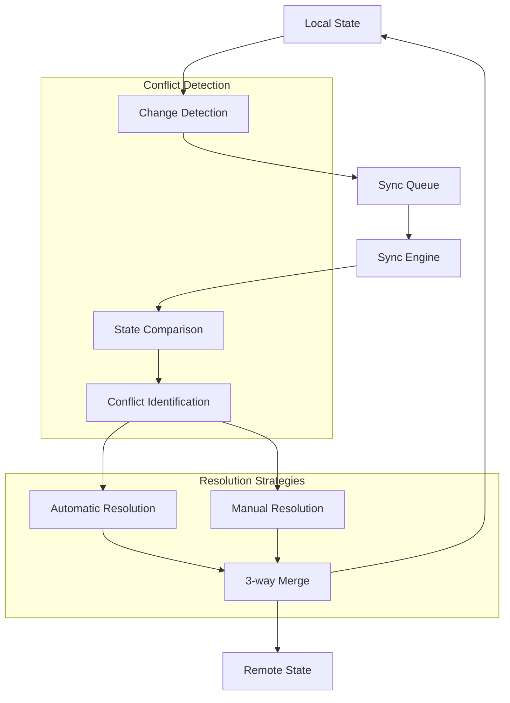
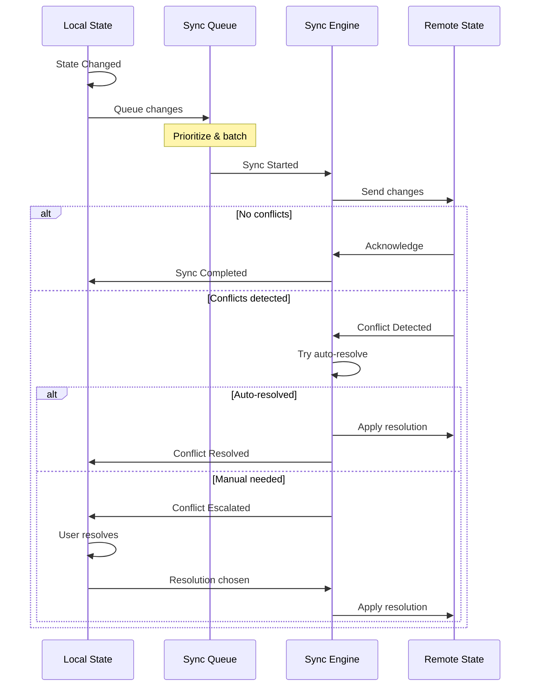
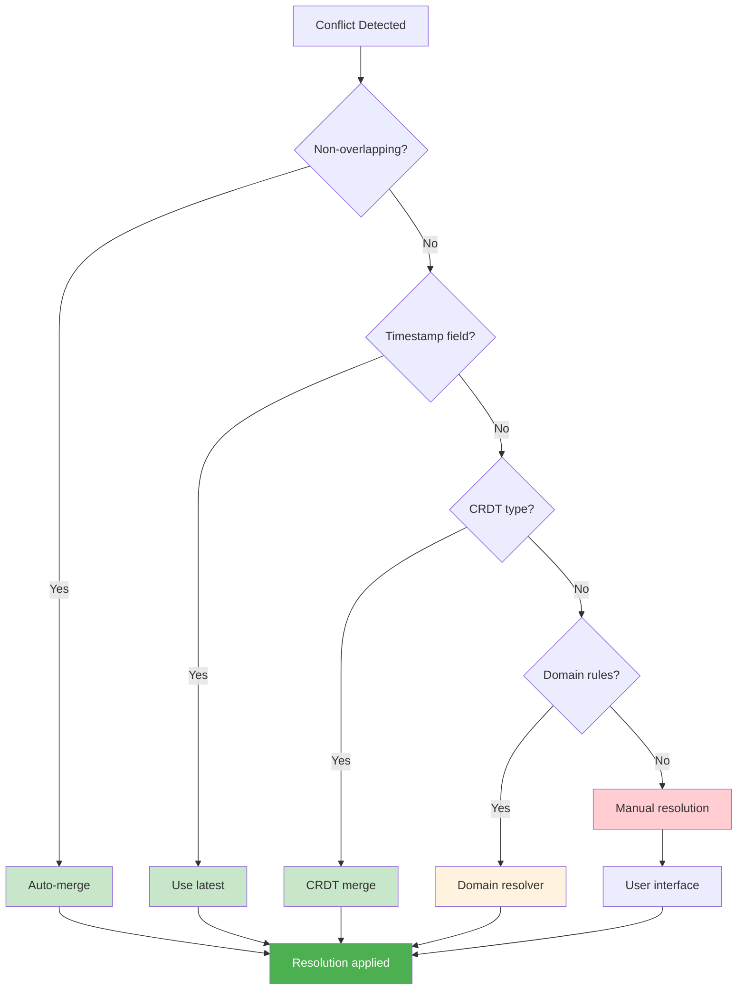
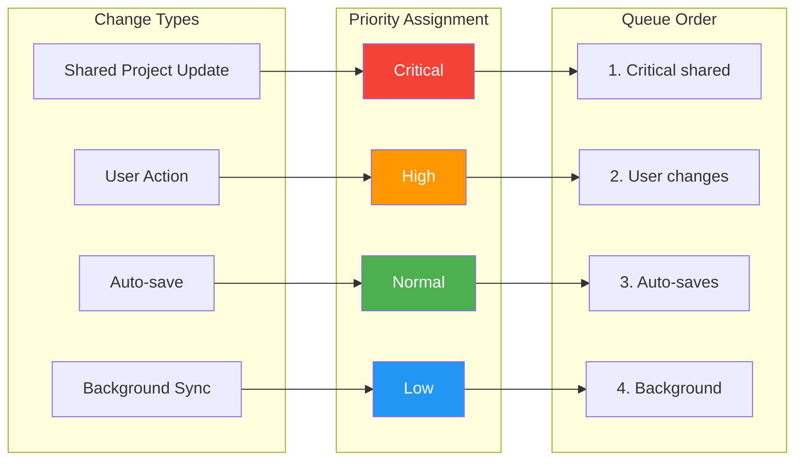
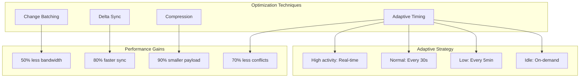

# Synchronization & Conflict Resolution

> Enable seamless collaboration and offline-first operation with eventual consistency.

## Synchronization Architecture

## Sync Events Flow

## Conflict Resolution Decision Tree

## Offline Queue Priority Management

## Sync Performance Optimization

## Key Benefits

1. **Offline-First**: Full functionality without connectivity
2. **Smart Conflicts**: Automatic resolution where possible
3. **User Control**: Manual resolution when needed
4. **Performance**: Optimized for minimal bandwidth
5. **Reliability**: Eventually consistent across all devices

## Integration Points

- **Application Layer**: Sync Service orchestrates all operations
- **Domain Layer**: Each domain defines its conflict rules
- **Infrastructure Layer**: Persistent queue and state management
- **Quality Attributes**: Performance and reliability targets