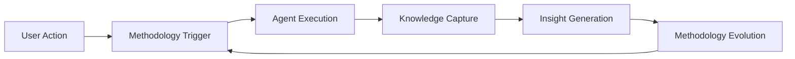
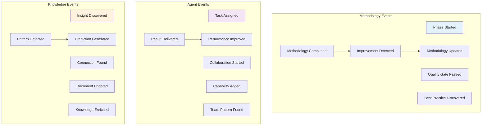
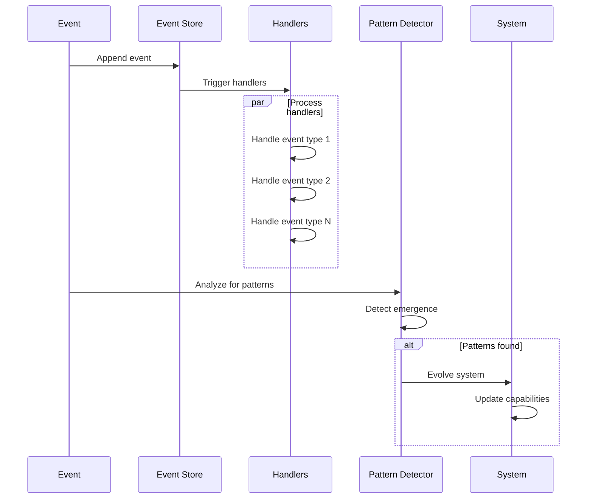

# Triple Helix Event System

> Create a self-reinforcing cycle of continuous improvement.

## Event Flow

## Event Categories

## Event Processing Flow

## Key Benefits

1. **Continuous Learning**: Every action contributes to system improvement
2. **Pattern Detection**: Emergent behaviors are identified and leveraged
3. **Automatic Evolution**: The system gets smarter with use
4. **Audit Trail**: Complete history for analysis and compliance

## Integration Points

- **Domain Layer**: Events originate from domain actions
- **Application Layer**: Orchestrators process and route events
- **Infrastructure Layer**: Event store provides persistence
- **Other Concerns**: Triggers productivity tracking, security auditing, etc.