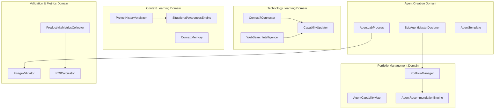

# Agent Excellence - Logical Architecture

## Domain Model

### Core Domains

#### 1. **Agent Creation Domain**
**Purpose**: Systematic creation and testing of specialized agents
**Key Objects**:
- `SubAgentMasterDesigner`: Meta-agent orchestrating agent creation
- `AgentLabProcess`: Methodology for structured agent development  
- `AgentTemplate`: Reusable patterns for agent creation
- `AgentSpecification`: Requirements and capabilities definition
- `AgentValidator`: Testing and quality assurance for new agents

#### 2. **Portfolio Management Domain**  
**Purpose**: Managing and optimizing the agent ecosystem
**Key Objects**:
- `PortfolioManager`: Agent that analyzes and optimizes agent portfolio
- `AgentCapabilityMap`: Mapping of agent capabilities and overlaps
- `ConsolidationStrategy`: Plans for merging overlapping agents
- `AgentRecommendationEngine`: Suggests optimal agent for tasks
- `PortfolioMetrics`: Analytics on agent usage and effectiveness

#### 3. **Technology Learning Domain**
**Purpose**: Keeping agents current with Claude Code evolution (Priority 1)
**Key Objects**:
- `Context7Connector`: Interface to Context7 MCP for documentation access
- `WebSearchIntelligence`: Real-time Claude Code community monitoring
- `DocumentationTracker`: Monitors Claude Code docs for updates
- `CapabilityUpdater`: Applies new knowledge to existing agents
- `TechnologyTrigger`: Detects when new learning should be applied

#### 4. **Context Learning Domain**
**Purpose**: Learning from project history and situational patterns (Priority 2)
**Key Objects**:
- `ProjectHistoryAnalyzer`: Extracts patterns from past projects
- `SituationalAwarenessEngine`: Understands context for optimal agent behavior
- `WorkflowPatternDetector`: Identifies successful development patterns
- `UserPreferenceEngine`: Learns individual user work patterns
- `ContextMemory`: Persistent storage of contextual insights

#### 5. **Validation & Metrics Domain**
**Purpose**: Proving agent effectiveness through measurable outcomes
**Key Objects**:
- `ProductivityMetricsCollector`: Measures developer productivity gains
- `UsageValidator`: Validates agent effectiveness through self-usage
- `ROICalculator`: Computes return on agent investment
- `PerformanceBenchmark`: Baseline measurements for comparison
- `ValidationReporter`: Generates effectiveness reports

## Domain Relationships

## Layer Mapping

### Presentation Layer
- Agent Excellence Dashboard
- Portfolio Management Interface
- Metrics Visualization
- Agent Creation Wizard

### Application Layer  
- Agent Orchestration Services
- Learning Coordination Services
- Portfolio Optimization Services
- Validation Services

### Domain Layer
- Agent Creation Domain
- Portfolio Management Domain  
- Technology Learning Domain
- Context Learning Domain
- Validation & Metrics Domain

### Infrastructure Layer
- Context7 MCP Integration
- Web Search APIs
- File System Storage
- SQLite Analytics Database
- GitHub Integration

## Traceability

### Vision ’ Feature ’ Domain Mapping
**Vision Element**: "SubAgentMasterDesigner + Agent Lab Process"
’ **Feature**: Agent Creation System
’ **Domain**: Agent Creation Domain

**Vision Element**: "Agent Portfolio Management"  
’ **Feature**: Portfolio Optimization
’ **Domain**: Portfolio Management Domain

**Vision Element**: "Technology-Triggered Learning (Priority 1)"
’ **Feature**: Auto-Learning System
’ **Domain**: Technology Learning Domain

**Vision Element**: "Context Learning (Priority 2)"
’ **Feature**: Project Pattern Recognition
’ **Domain**: Context Learning Domain

**Vision Element**: "Validated through self-usage"
’ **Feature**: Effectiveness Validation
’ **Domain**: Validation & Metrics Domain

---
*Logical Architecture Document - CPDM Phase 2*  
*Created: 2025-08-06*  
*Status: Complete*