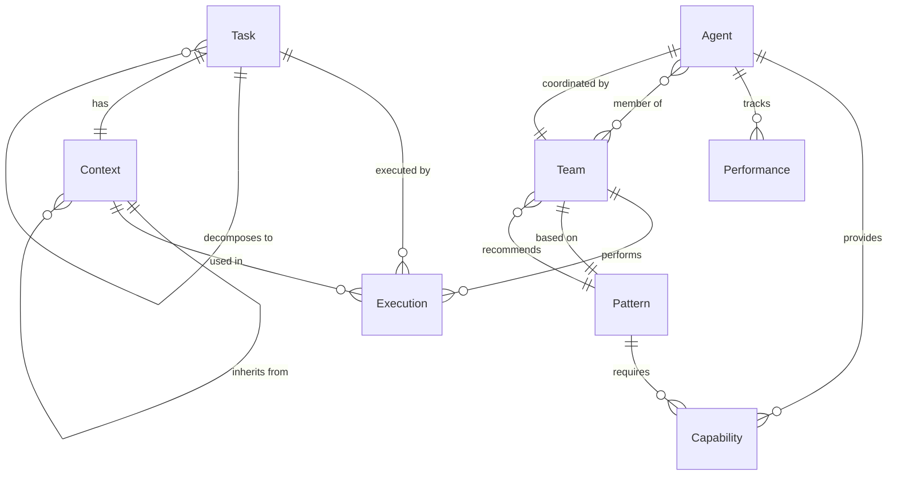

# Domain Model: Sub-Agent Alignment System

**Feature**: sub-agent-alignment
**Created**: 2025-08-06
**Status**: Design Phase

## Core Domain Entities

### Task
**Purpose**: Represents work to be performed by agents

**Attributes**:
- `id`: Unique identifier
- `description`: Natural language task description
- `requirements`: Capabilities and resources needed
- `priority`: Execution priority
- `status`: Current execution state
- `context`: Associated context object

**Behaviors**:
- Decompose into subtasks
- Validate requirements
- Track execution progress

### Agent
**Purpose**: Executable unit with specific capabilities

**Attributes**:
- `id`: Unique identifier
- `name`: Human-readable name
- `type`: Category (core, domain, infrastructure)
- `capabilities`: List of abilities
- `performance`: Historical metrics
- `status`: Availability state

**Behaviors**:
- Execute tasks
- Report capabilities
- Collaborate with other agents
- Track performance

### Context
**Purpose**: Maintains state across agent interactions

**Attributes**:
- `id`: Unique identifier
- `taskId`: Associated task
- `state`: Current state map
- `history`: Event log
- `parent`: Parent context (if nested)
- `checkpoints`: Recovery points

**Behaviors**:
- Inherit from parent
- Persist state
- Restore from checkpoint
- Merge child contexts

### Team
**Purpose**: Coordinated group of agents

**Attributes**:
- `id`: Unique identifier
- `agents`: List of team members
- `coordinator`: Lead agent
- `strategy`: Collaboration pattern
- `roles`: Agent role assignments

**Behaviors**:
- Coordinate execution
- Distribute work
- Aggregate results
- Handle member failures

### Capability
**Purpose**: Describes what an agent can do

**Attributes**:
- `name`: Capability identifier
- `domain`: Area of expertise
- `tools`: Required tools
- `skills`: Specific skills
- `version`: Capability version

**Behaviors**:
- Match to requirements
- Version compatibility check
- Combine with other capabilities

### Execution
**Purpose**: Records task execution details

**Attributes**:
- `id`: Unique identifier
- `task`: Task being executed
- `team`: Assigned team
- `startTime`: Execution start
- `endTime`: Execution end
- `result`: Execution outcome
- `metrics`: Performance data

**Behaviors**:
- Track progress
- Collect metrics
- Handle errors
- Generate reports

### Pattern
**Purpose**: Reusable team composition template

**Attributes**:
- `id`: Unique identifier
- `name`: Pattern name
- `condition`: When to apply
- `composition`: Team structure
- `successRate`: Historical success
- `useCount`: Times used

**Behaviors**:
- Match conditions
- Recommend team
- Track effectiveness
- Evolve over time

### Performance
**Purpose**: Agent performance metrics

**Attributes**:
- `agentId`: Associated agent
- `successRate`: Task success percentage
- `avgResponseTime`: Average execution time
- `errorRate`: Failure percentage
- `lastUpdated`: Last metric update

**Behaviors**:
- Calculate trends
- Identify degradation
- Compare to baseline
- Generate alerts

## Domain Relationships

## Aggregate Boundaries

### Task Aggregate
- Root: Task
- Includes: Subtasks, Requirements
- Invariants: Status consistency, requirement validation

### Agent Aggregate
- Root: Agent
- Includes: Capabilities, Performance
- Invariants: Capability consistency, performance accuracy

### Context Aggregate
- Root: Context
- Includes: State, History, Checkpoints
- Invariants: State consistency, history immutability

### Team Aggregate
- Root: Team
- Includes: Members, Roles, Strategy
- Invariants: Role uniqueness, strategy validity

## Domain Events

### Task Events
- TaskCreated
- TaskDecomposed
- TaskAssigned
- TaskStarted
- TaskCompleted
- TaskFailed

### Agent Events
- AgentRegistered
- AgentCapabilityAdded
- AgentStatusChanged
- AgentPerformanceUpdated

### Context Events
- ContextCreated
- ContextUpdated
- ContextCheckpointed
- ContextRestored
- ContextMerged

### Team Events
- TeamComposed
- TeamMemberAdded
- TeamMemberRemoved
- TeamStrategyChanged
- TeamDisbanded

### Pattern Events
- PatternDiscovered
- PatternApplied
- PatternSucceeded
- PatternFailed
- PatternPromoted

## Business Rules

1. **Task Assignment**: Tasks can only be assigned to agents with matching capabilities
2. **Context Inheritance**: Child contexts must inherit parent state
3. **Team Composition**: Teams must have at least one agent
4. **Performance Tracking**: All executions must record metrics
5. **Pattern Promotion**: Patterns with >90% success rate over 10 uses are promoted
6. **Agent Availability**: Agents can only be in one team at a time
7. **Context Consistency**: Context state must be consistent across checkpoints
8. **Capability Matching**: All task requirements must be satisfied by team capabilities

## Domain Services

### TaskDecompositionService
- Analyzes complex tasks
- Breaks into subtasks
- Identifies dependencies
- Estimates complexity

### CapabilityMatchingService
- Matches requirements to capabilities
- Finds compatible agents
- Scores matches
- Handles version compatibility

### TeamCompositionService
- Composes optimal teams
- Assigns roles
- Selects coordination strategy
- Handles constraints

### ContextManagementService
- Creates contexts
- Manages inheritance
- Handles checkpointing
- Performs recovery

### PatternRecognitionService
- Identifies patterns
- Tracks effectiveness
- Promotes successful patterns
- Deprecates failed patterns

### PerformanceAnalysisService
- Collects metrics
- Analyzes trends
- Generates insights
- Creates recommendations

## Value Objects

### TaskRequirements
- capabilities: Set<Capability>
- priority: Priority
- constraints: Set<Constraint>
- timeout: Duration

### ExecutionResult
- status: Status
- output: Any
- errors: List<Error>
- metrics: Map<String, Value>

### TeamStrategy
- type: StrategyType (pipeline, parallel, hierarchical)
- coordination: CoordinationType
- errorHandling: ErrorStrategy
- timeout: Duration

### PerformanceMetrics
- responseTime: Duration
- cpuUsage: Percentage
- memoryUsage: Bytes
- successRate: Percentage

## Anti-Corruption Layer

### External System Adapters
- GitHubAdapter: Translates to GitHub issues
- ObsidianAdapter: Manages knowledge base
- FileSystemAdapter: Handles file operations
- CLIAdapter: Interfaces with Claude CLI

### Translation Maps
- Task ↔ GitHub Issue
- Context ↔ File System State
- Pattern ↔ Knowledge Base Entry
- Metrics ↔ Dashboard Data

## Ubiquitous Language

- **Task**: Unit of work to be performed
- **Agent**: Autonomous executor with capabilities
- **Context**: Preserved state across interactions
- **Team**: Coordinated group of agents
- **Capability**: What an agent can do
- **Pattern**: Reusable team template
- **Composition**: Process of forming teams
- **Orchestration**: Coordination of agent activities
- **Decomposition**: Breaking tasks into subtasks
- **Performance**: Measured execution metrics