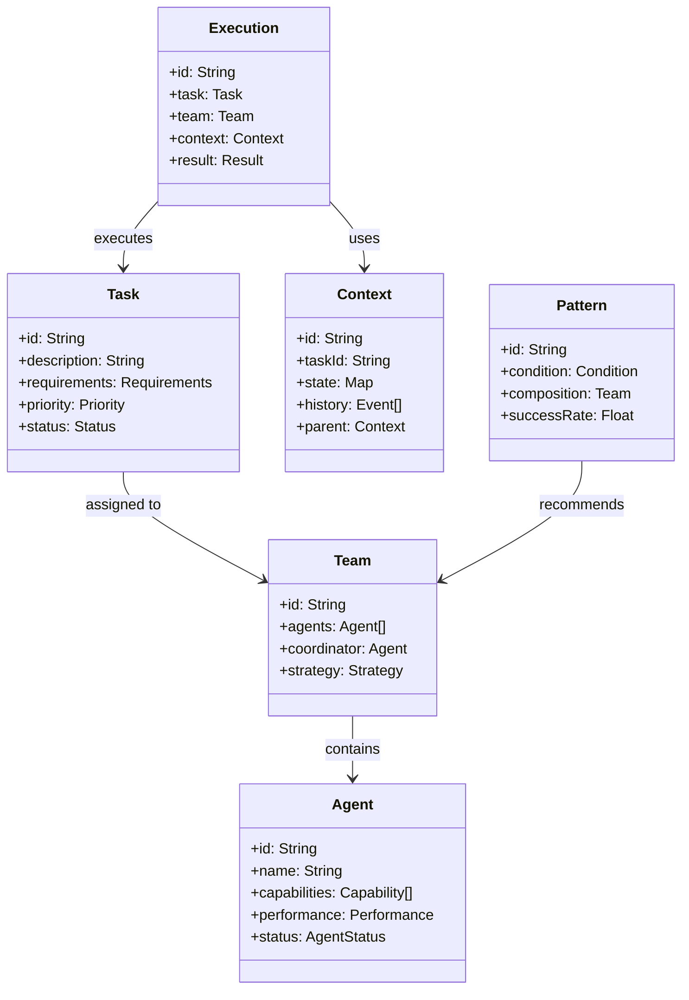
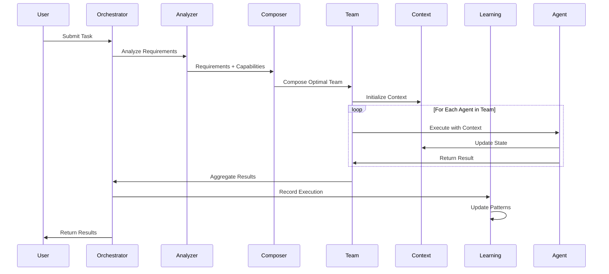
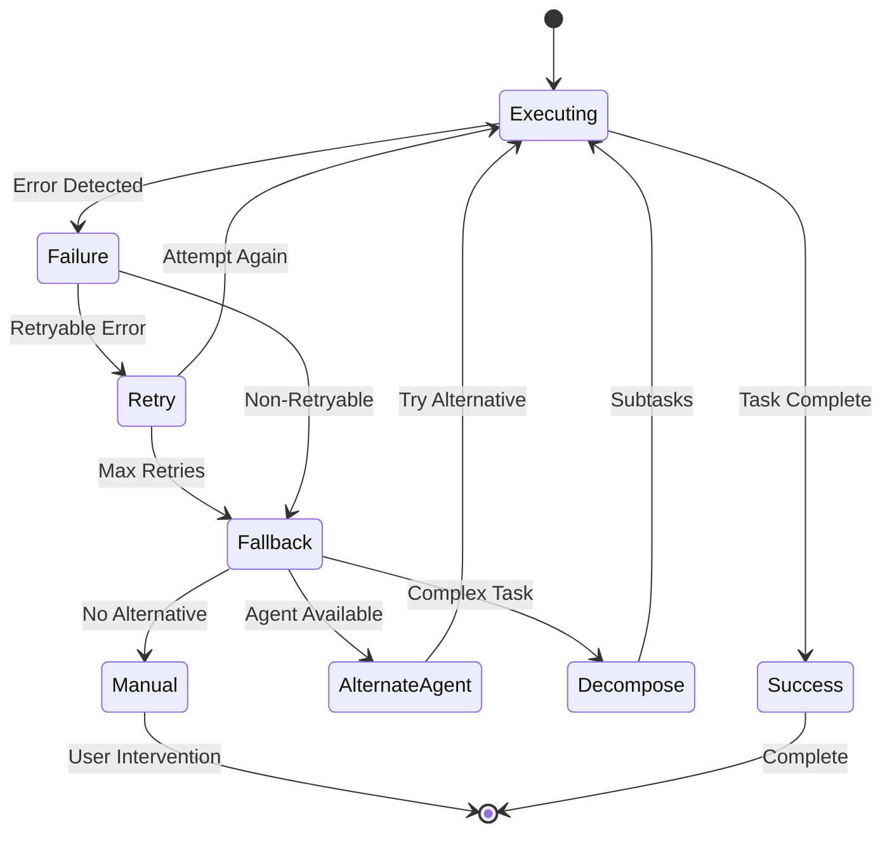

# Logical Architecture: Sub-Agent Alignment System

**Feature**: sub-agent-alignment
**Phase**: Design
**Created**: 2025-08-06
**Epic**: #55

## System Overview

The Sub-Agent Alignment System transforms ClaudeProjects2's agent orchestration from static routing to intelligent, dynamic team composition with continuous learning capabilities.

## Architectural Layers

### 1. Presentation Layer
**Purpose**: Interface for users and systems to interact with agent orchestration

**Components**:
- **Natural Language Interface**: Accepts task descriptions in plain language
- **Command Interface**: Direct agent invocation for advanced users
- **Dashboard Interface**: Real-time monitoring and insights
- **API Interface**: Programmatic access for integrations

**Responsibilities**:
- Parse user intent from natural language
- Display agent operation progress
- Present performance metrics
- Handle error messages gracefully

### 2. Orchestration Layer
**Purpose**: Intelligent routing and coordination of agent activities

**Components**:
- **Task Analyzer**: Decomposes and classifies incoming tasks
- **Agent Selector**: Matches tasks to agent capabilities
- **Team Composer**: Assembles optimal agent teams
- **Workflow Manager**: Coordinates multi-agent workflows

**Responsibilities**:
- Analyze task complexity and requirements
- Select appropriate agents or teams
- Manage execution flow
- Handle fallback strategies

### 3. Agent Layer
**Purpose**: Individual agent execution and capability management

**Components**:
- **Core Agents**: Fundamental system agents
- **Domain Agents**: Specialized business logic agents
- **Infrastructure Agents**: Technical operation agents
- **Learning Agents**: Self-improvement and analysis agents

**Responsibilities**:
- Execute assigned tasks
- Report capabilities and status
- Maintain performance metrics
- Collaborate with other agents

### 4. Context Layer
**Purpose**: Maintain state and context across agent interactions

**Components**:
- **Context Manager**: Central context coordination
- **State Store**: Persistent state management
- **Context Router**: Context distribution to agents
- **Recovery Manager**: Context restoration on failure

**Responsibilities**:
- Create and maintain context objects
- Ensure context consistency
- Handle context inheritance
- Provide context recovery

### 5. Intelligence Layer
**Purpose**: Learning, optimization, and continuous improvement

**Components**:
- **Performance Analyzer**: Metrics analysis and insights
- **Pattern Recognizer**: Identify successful patterns
- **Learning Engine**: Improve based on outcomes
- **Recommendation System**: Suggest optimizations

**Responsibilities**:
- Track execution patterns
- Identify optimization opportunities
- Learn from successes and failures
- Recommend improvements

### 6. Infrastructure Layer
**Purpose**: Foundation services and technical capabilities

**Components**:
- **Message Queue**: Inter-agent communication
- **Metrics Store**: Performance data storage
- **Configuration Manager**: System settings
- **Security Manager**: Access control and audit

**Responsibilities**:
- Provide reliable messaging
- Store operational data
- Manage configurations
- Ensure security and compliance

## Domain Model

### Core Entities

### Key Relationships

1. **Task → Team**: Tasks are assigned to dynamically composed teams
2. **Team → Agent**: Teams consist of one or more agents with defined roles
3. **Context → Execution**: Context flows through execution chain
4. **Pattern → Learning**: Patterns inform future team composition
5. **Agent → Capability**: Agents advertise their capabilities

## Behavioral Model

### Task Execution Flow

### Error Recovery Flow

## Quality Attributes

### Performance
- Agent selection: < 500ms
- Context operations: < 50ms overhead
- End-to-end latency: < 3 seconds for simple tasks

### Reliability
- Context consistency: 99.9%
- Recovery success rate: > 80%
- System availability: 99.5%

### Scalability
- Support 100+ agents
- Handle 1000+ concurrent tasks
- Linear performance scaling

### Maintainability
- Modular agent design
- Clear separation of concerns
- Comprehensive logging
- Self-documenting patterns

### Security
- Agent capability verification
- Context access control
- Audit trail for all operations
- Secure inter-agent communication

## Integration Points

### External Systems
1. **GitHub**: Issue tracking, PR management
2. **Obsidian**: Knowledge management
3. **File System**: Agent definitions, configurations
4. **Claude CLI**: Execution runtime

### Internal Systems
1. **CPDM Workflow**: Process orchestration
2. **Message Queue**: Agent communication
3. **Performance Tracker**: Metrics collection
4. **CLAUDE.md**: Configuration and routing

## Constraints and Assumptions

### Constraints
- Must maintain backward compatibility
- Cannot break existing agent contracts
- Must work within file-based architecture
- Performance overhead must be minimal

### Assumptions
- Agents provide accurate capability metadata
- Context can be serialized/deserialized
- File system is reliable and fast
- Network is generally available

## Traceability Matrix

| Vision Requirement | Logical Component | Verification Method |
|-------------------|------------------|--------------------|
| Natural language tasks | Task Analyzer | User acceptance testing |
| Dynamic team composition | Team Composer | Integration testing |
| Context preservation | Context Manager | Unit testing |
| Performance insights | Performance Analyzer | Metrics validation |
| Error resilience | Recovery Manager | Failure injection |
| Continuous learning | Learning Engine | Pattern analysis |

## Next Steps

1. **Automatic Transition**: System will transition to Decision phase
2. **Physical Architecture**: Define implementation components
3. **ADR Creation**: Document architectural decisions
4. **PM Approval**: Review and approve before implementation

---

**Status**: Ready for automatic transition to Decision phase
**Auto-transition**: Yes (Design → Decision is automatic)