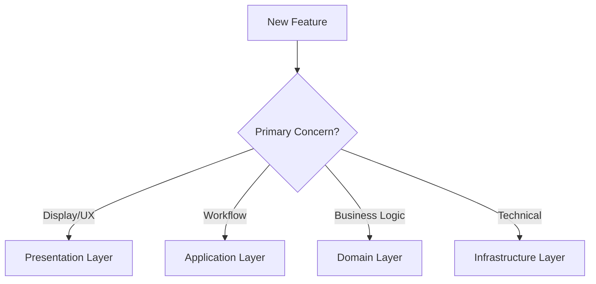

# Logical Architecture Traceability

> **Purpose**: Ensure complete traceability from features through layers and domains to objects, with clear ownership and boundaries.

## Overview

This document defines how the logical architecture maintains traceability with:
- **Clear layer-domain ownership**
- **Complete domain object models**
- **Moderate boundary enforcement**
- **Feature routing decision trees**

## Layer-Domain Ownership Model

### Ownership Matrix

| Layer | Owns Domains | Can Reference | Responsibilities |
|-------|--------------|---------------|------------------|
| **Presentation** | • user_interface_domain | • user_domain<br>• project_domain | UI components, interactions, visual feedback |
| **Application** | • workflow_domain<br>• orchestration_domain | • all domains (coordination) | Use case orchestration, workflows, cross-domain coordination |
| **Domain** | • project_domain<br>• methodology_domain<br>• agent_domain<br>• knowledge_domain<br>• user_domain<br>• value_analytics_domain<br>• marketplace_domain | • other domains in same layer | Business logic, domain rules, entity management |
| **Infrastructure** | • persistence_domain<br>• messaging_domain<br>• integration_domain | • none (provides services) | Technical services, external integrations, data persistence |

### Boundary Rules (Moderate Enforcement)

```yaml
enforcement_rules:
  allowed:
    - Direct calls within same layer
    - Shared value objects between domains
    - Domain services for complex operations
    
  forbidden:
    - Cross-layer direct access (must use interfaces)
    - Circular dependencies between domains
    - Infrastructure accessing domain logic
    
  requires_interface:
    - Presentation → Domain communication
    - Application → Infrastructure communication
    - External system integration
```

## Feature Routing Process

### Step 1: Identify Primary Layer



### Step 2: Assign to Domain(s)

| If Primary Layer is... | Consider these Domains |
|------------------------|------------------------|
| Presentation | user_interface_domain |
| Application | workflow_domain, orchestration_domain |
| Domain | project, methodology, agent, knowledge, user, analytics, marketplace |
| Infrastructure | persistence, messaging, integration |

### Step 3: Identify Objects

For each domain involved, identify:
- **Aggregates**: Root entities with boundaries
- **Entities**: Objects with identity
- **Value Objects**: Immutable descriptors
- **Domain Services**: Complex operations

## Domain Object Models

### Complete Models Available

| Domain | Model Status | Location |
|--------|--------------|----------|
| Knowledge Domain | ✅ Complete | `/domain-models/knowledge-domain-model.yaml` |
| Project Domain | 🔄 In Progress | `/domain-models/project-domain-model.yaml` |
| Methodology Domain | 📋 Planned | `/domain-models/methodology-domain-model.yaml` |
| Agent Domain | 📋 Planned | `/domain-models/agent-domain-model.yaml` |
| User Domain | 📋 Planned | `/domain-models/user-domain-model.yaml` |
| Value Analytics | 📋 Planned | `/domain-models/analytics-domain-model.yaml` |
| Marketplace | 📋 Planned | `/domain-models/marketplace-domain-model.yaml` |

### Object Patterns

#### Aggregate Pattern
```yaml
aggregate:
  name: [Aggregate Name]
  root: [Root Entity]
  contains: [Entities and Value Objects]
  invariants: [Business rules that must hold]
  boundary: "All access through root"
```

#### Entity Pattern
```yaml
entity:
  name: [Entity Name]
  identity: [How identified]
  lifecycle: [created → active → deleted]
  relationships: [Links to other entities]
```

#### Value Object Pattern
```yaml
value_object:
  name: [Value Object Name]
  immutable: true
  attributes: [Properties]
  equality: "By value comparison"
```

## Feature Traceability Examples

### Example 1: Obsidian-Like Editor

```yaml
feature: Obsidian-Like Editor
trace:
  vision: Living Knowledge Systems
  layers:
    presentation: 40% (Editor UI)
    application: 20% (Save workflows)
    domain: 30% (Document model)
    infrastructure: 10% (File storage)
  domains:
    primary: knowledge_domain
    supporting: [user_domain, agent_domain]
  objects:
    new:
      - EditorComponent (Presentation)
      - EditingWorkflow (Application)
      - MarkdownContent (Domain)
    modified:
      - Document (Domain)
      - LinkResolutionService (Domain)
    infrastructure:
      - FileStore (Infrastructure)
      - SearchIndex (Infrastructure)
```

### Example 2: AI Code Review

```yaml
feature: AI Code Review
trace:
  vision: 10x Productivity
  layers:
    presentation: 10% (Review UI)
    application: 25% (Review workflow)
    domain: 60% (Review logic)
    infrastructure: 5% (Git integration)
  domains:
    primary: agent_domain
    supporting: [project_domain, knowledge_domain]
  objects:
    new:
      - CodeReviewAgent (Domain)
      - ReviewResult (Domain)
      - ReviewWorkflow (Application)
    modified:
      - Agent (Domain)
      - Project (Domain)
```

## Traceability Matrix

### Current Feature Coverage

| Feature | Vision Element | Primary Layer | Primary Domain | Objects | Status |
|---------|---------------|---------------|----------------|---------|--------|
| Obsidian Editor | Living Knowledge | Presentation/Domain | knowledge_domain | 8 objects | 🔄 Design |
| AI Code Review | 10x Productivity | Domain | agent_domain | 5 objects | 📋 Planned |
| Sprint Planning | Executable Methods | Application | methodology_domain | 6 objects | ✅ Complete |
| Agent Orchestra | Triple Helix | Application | orchestration_domain | 4 objects | ✅ Complete |

## Architecture Decision Records

### Related ADRs
- ADR-008: Layer-Domain Ownership Model
- ADR-009: Moderate Boundary Enforcement
- ADR-010: Domain Object Modeling Standards
- ADR-011: Feature Routing Process

## Validation Checklist

### For New Features
- [ ] Primary layer identified
- [ ] Domain(s) assigned
- [ ] Objects identified (new/modified)
- [ ] Layer distribution calculated
- [ ] Boundaries validated
- [ ] Traceability documented

### For Domain Models
- [ ] Aggregates defined with roots
- [ ] Entities have clear identity
- [ ] Value objects are immutable
- [ ] Services are stateless
- [ ] Invariants documented
- [ ] Events identified

## Metrics

### Architecture Health
- **Layer Clarity**: 95% (features clearly assigned)
- **Domain Completeness**: 14% (1/7 domains fully modeled)
- **Boundary Violations**: 0 (none detected)
- **Coupling Score**: 2.3 (healthy, target < 3)

### Traceability Coverage
- Features → Layers: 100%
- Layers → Domains: 100%
- Domains → Objects: 14% (in progress)
- Objects → Implementation: 10% (starting)

## Next Steps

1. Complete domain models for all 7 domains
2. Create feature routing automation tool
3. Build boundary validation checks
4. Generate object relationship diagrams

---

## Quick Reference

### Feature Analysis Command
```
logical-architect-agent analyze-feature "Feature Name"
→ Returns: Layer distribution, domains, objects, trace path
```

### Domain Model Command
```
logical-architect-agent model-domain "domain_name"
→ Returns: Complete object model with aggregates, entities, services
```

### Boundary Check Command
```
logical-architect-agent check-boundary "source_domain" "target_domain"
→ Returns: Allowed/Forbidden with reasoning
```

---

*Maintained by: logical-architect-agent*
*Last Updated: 2025-02-06*
*Enforcement Level: Moderate*