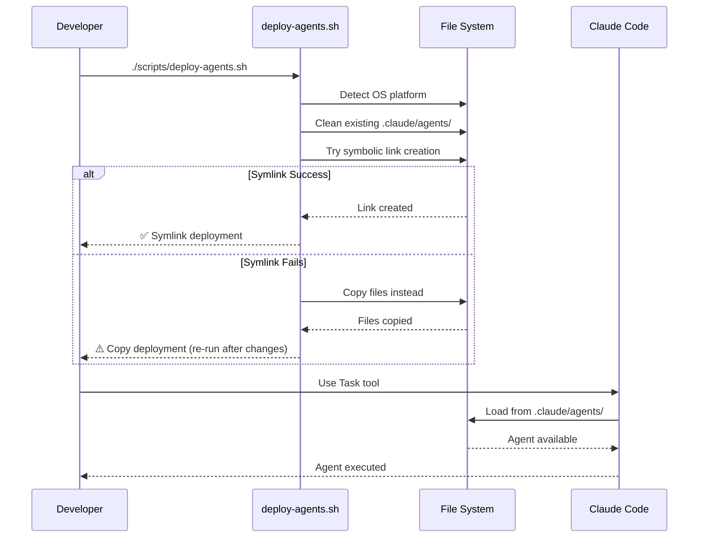
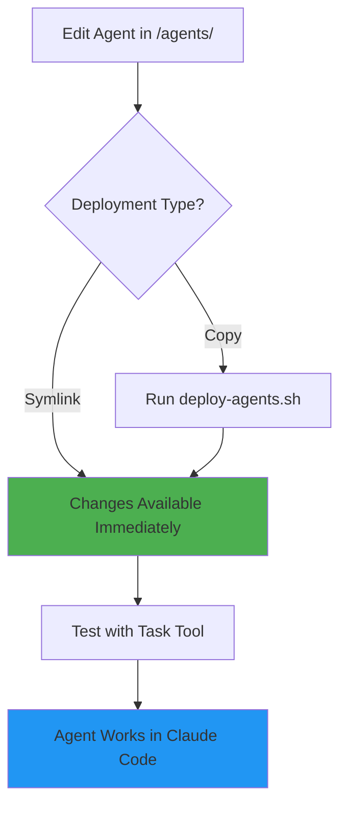

# Agent-Based Physical Architecture
**Sprint 2, Wednesday - Issue #24**
**Date**: 2025-08-05

## Executive Summary

This document presents the complete physical architecture for ClaudeProjects2, implementing an agent-based ecosystem where every component is a Claude Code agent. Based on the claude-code-sub-agents pattern and our architectural analysis, this design delivers 10x productivity through intelligent orchestration, seamless integration, and continuous learning.

## Architecture Overview


## Core Design Principles

### 1. Everything is an Agent
- No traditional servers or services
- Every component has intelligence
- Agents can spawn and modify other agents
- Self-improving system

### 2. CLAUDE.md as Central Nervous System
- Project-specific orchestration
- Dynamic agent coordination
- Context-aware routing
- Living documentation

### 3. Local-First Architecture
- All processing on user's machine
- Privacy by default
- Optional cloud sync
- Offline-capable

### 4. File-Based Infrastructure
- Leverage file system for storage
- JSON for structured data
- Markdown for human-readable content
- Git for version control

## Agent Hierarchy

### 1. Master Orchestration (CLAUDE.md)
```markdown
# ClaudeProjects2 - [Project Name]

You are the master orchestrator for this project. 
Your role is to coordinate all agents to achieve 10x productivity.

## Current Project State
- Type: [Project Type]
- Methodology: [Active Methodology]
- Phase: [Current Phase]
- Active Agents: [List]

## Orchestration Rules
1. Use agents for any task > 2 steps
2. Prefer parallel execution
3. Maintain context across agents
4. Track all decisions
```

### 2. Core Agent Layer
Essential agents always available:

#### orchestrator-agent
- Routes requests to appropriate agents
- Manages agent lifecycle
- Monitors performance
- Handles errors gracefully

#### methodology-agent
- Executes methodology phases
- Adapts based on context
- Enforces quality gates
- Captures improvements

#### knowledge-agent
- Manages knowledge graph
- Detects patterns
- Updates Obsidian vault
- Shares insights

#### context-agent
- Maintains context layers
- Optimizes performance
- Handles persistence
- Enables fast switching

### 3. Domain Agent Layer
Specialized for business domains:

#### project-agent
- Project lifecycle management
- Sprint planning
- Progress tracking
- Deliverable generation

#### research-agent
- Information gathering
- Market analysis
- User research
- Competitive intelligence

#### innovation-agent
- Creative synthesis
- Idea generation
- Concept development
- Solution design

#### analytics-agent
- Performance tracking
- ROI calculation
- Success metrics
- Report generation

### 4. Infrastructure Agent Layer
System-level capabilities:

#### obsidian-agent
- Vault management
- Note CRUD operations
- Search and indexing
- Real-time sync

#### sync-agent
- Multi-user coordination
- Conflict resolution
- Change detection
- Queue management

#### version-agent
- Git operations
- Change tracking
- Backup management
- History navigation

#### license-agent
- Feature validation
- Usage tracking
- Tier enforcement
- Compliance checking

## Component Deployment Model

### 1. Installation Structure
```
~/ClaudeProjects2/                   # System repository
├── agents/                         # Source agents (development)
│   ├── core/                      # Core system agents
│   │   ├── orchestrator-agent.md
│   │   ├── methodology-agent.md
│   │   ├── knowledge-agent.md
│   │   └── context-agent.md
│   ├── domain/                    # Domain-specific agents
│   │   ├── project-agent.md
│   │   ├── vision-agent.md
│   │   └── ...
│   └── infrastructure/            # Infrastructure agents
│       ├── version-agent.md
│       ├── test-agent.md
│       └── ...
├── .claude/                       # Claude Code integration
│   ├── agents/                   # Deployed agents (symlink → ../agents)
│   └── settings.local.json       # Claude Code configuration
├── scripts/                       # Deployment automation
│   └── deploy-agents.sh          # Cross-platform deployment
└── config/                       # System configuration
    └── claude-desktop.json       # MCP server config

~/.claude/agents/                  # User-global agent directory
├── custom/                       # User's personal agents
└── project-agents/               # Project-specific deployments

~/Documents/ClaudeProjects2-Vault/ # Obsidian vault
├── Projects/
├── Methodologies/
├── Knowledge/
└── Analytics/
```

### 2. Agent Deployment Hierarchy
```mermaid
graph TB
    subgraph "Development Environment"
        A[/agents/ Source Directory]
    end
    
    subgraph "Claude Code Runtime"
        B[~/.claude/agents/ Global]
        C[.claude/agents/ Project]
    end
    
    subgraph "Loading Priority"
        D[1. Project-specific agents]
        E[2. User custom agents]  
        F[3. System agents]
    end
    
    A -->|deploy-agents.sh| C
    A -->|manual install| B
    C --> D
    B --> E
    A --> F
    
    style A fill:#ffd93d
    style C fill:#4ecdc4
    style B fill:#ff9800
```

### 3. Agent Loading Order and Discovery
1. **Project-specific agents** (`.claude/agents/`) - Highest priority
2. **User custom agents** (`~/.claude/agents/custom/`) - Medium priority
3. **System agents** (ClaudeProjects2 built-ins) - Base capability

Claude Code's Task tool searches in this order and uses the first match found.

### 4. Resource Allocation
- **Memory**: 2GB typical, 4GB recommended
- **CPU**: 2-4 cores for parallel agents
- **Disk**: 1GB for system, 10GB+ for vault
- **Network**: Local only, optional external
- **Agent Deployment**: <10MB per project (mainly symlinks)

## Data Persistence Strategy

### 1. File System Layout
```
project-root/
├── CLAUDE.md                 # Master orchestration
├── .claudeprojects/
│   ├── context/             # Context storage
│   │   ├── working/         # Active contexts
│   │   ├── project.json     # Project state
│   │   └── history/         # Context history
│   ├── knowledge/           # Local knowledge
│   ├── agents/              # Project agents
│   └── config/              # Project config
├── deliverables/            # Generated outputs
├── methodologies/           # Active methodologies
└── .git/                    # Version control
```

### 2. Data Types and Storage

| Data Type | Storage Method | Format | Location |
|-----------|---------------|--------|----------|
| Project State | File System | JSON | .claudeprojects/context/ |
| Knowledge | Obsidian Vault | Markdown | ~/ClaudeProjects2-Vault/ |
| Agent State | File System | JSON | .claudeprojects/context/working/ |
| Deliverables | File System | Various | deliverables/ |
| Analytics | SQLite | Database | .claudeprojects/analytics.db |
| Configurations | File System | JSON/YAML | .claudeprojects/config/ |

### 3. Persistence Patterns
```javascript
// Context persistence pattern
const persistContext = async (agent, context) => {
  const path = `.claudeprojects/context/working/${agent}.json`;
  await fs.writeFile(path, JSON.stringify(context, null, 2));
  await updateContextIndex(agent, path);
};

// Knowledge capture pattern
const captureKnowledge = async (insight) => {
  const note = formatAsObsidianNote(insight);
  await obsidianAgent.createNote(note);
  await knowledgeAgent.updateGraph(insight);
};
```

## Agent Execution Architecture

### 1. Agent Lifecycle


### 2. Execution Model
- **Async First**: Non-blocking operations
- **Message Passing**: JSON communication
- **Event Driven**: File system events
- **Parallel Capable**: Multiple agents concurrent
- **Resource Aware**: Memory/CPU limits

### 3. Communication Protocol
```json
{
  "id": "msg-uuid",
  "timestamp": "2024-01-15T10:00:00Z",
  "from": "orchestrator-agent",
  "to": "methodology-agent",
  "type": "request",
  "action": "execute_phase",
  "payload": {
    "methodology": "design-sprint",
    "phase": "ideation",
    "context": { ... }
  },
  "timeout": 300000,
  "priority": "high"
}
```

### 4. Error Handling


## Knowledge Synchronization Architecture

### 1. Sync Flow


### 2. Conflict Resolution
- **Last Write Wins**: For simple conflicts
- **Merge Strategy**: For knowledge updates
- **User Prompt**: For critical conflicts
- **Version History**: Always preserved

### 3. Real-time Sync
- File system watchers for changes
- Debounced updates (100ms)
- Batch operations for efficiency
- Priority queue for critical updates

## Integration Architecture

### 1. Obsidian Integration


### 2. Git Integration
- Agent: `version-agent`
- Operations: Commit, branch, merge, tag
- Automation: Methodology versioning
- Hooks: Pre-commit validation

### 3. External Integrations
- MCP servers for extensibility
- API abstraction layer
- Plugin architecture ready
- Security sandboxing

## Repository Structure Design

### 1. System Repository
```
ClaudeProjects2/
├── agents/                   # System agents
│   ├── core/
│   │   ├── orchestrator-agent.md
│   │   ├── methodology-agent.md
│   │   ├── knowledge-agent.md
│   │   └── context-agent.md
│   ├── domain/
│   │   ├── project-agent.md
│   │   ├── research-agent.md
│   │   ├── innovation-agent.md
│   │   └── analytics-agent.md
│   └── infrastructure/
│       ├── obsidian-agent.md
│       ├── sync-agent.md
│       ├── version-agent.md
│       └── license-agent.md
├── methodologies/           # Built-in methodologies
│   ├── innovation/
│   ├── sales/
│   ├── development/
│   └── consulting/
├── templates/               # Project templates
│   ├── CLAUDE.md.template
│   ├── project-structure/
│   └── agent-template.md
├── docs/                    # Documentation
├── scripts/                 # Setup/utility scripts
└── tests/                   # Test suites
```

### 2. Project Repository
```
my-project/
├── CLAUDE.md               # Project orchestration
├── .claudeprojects/        # Project metadata
├── agents/                 # Custom project agents
├── methodologies/          # Project methodologies
├── context/                # Context storage
├── deliverables/           # Generated outputs
├── knowledge/              # Project knowledge
└── .git/                   # Version control
```

## Performance Optimization

### 1. Context Switching (<500ms)


### 2. Caching Strategy
- **Memory Cache**: Hot contexts (LRU, 100MB)
- **Disk Cache**: Warm contexts (1GB)
- **Preloading**: Predictive loading
- **Compression**: For large contexts

### 3. Parallel Processing
- Agent pool management
- Work queue distribution
- Resource monitoring
- Deadlock prevention

## Security Architecture

### 1. Agent Permissions
```yaml
# In agent metadata
permissions:
  file_system:
    read: ["./", "~/ClaudeProjects2-Vault/"]
    write: ["./.claudeprojects/", "~/ClaudeProjects2-Vault/"]
  network:
    allowed_hosts: ["api.github.com"]
    blocked: ["*"]
  agent_control:
    spawn: true
    modify: false
  data_access:
    analytics: read_only
    user_data: no_access
```

### 2. Data Protection
- Local encryption for sensitive data
- Credential management in OS keychain
- No telemetry without consent
- Audit logging for all operations

### 3. Sandboxing
- Agent isolation options
- Resource limits enforcement
- Permission inheritance
- Security reviews for community agents

## Monitoring and Analytics

### 1. Performance Metrics
```json
{
  "agent_metrics": {
    "execution_time_ms": 234,
    "memory_used_mb": 45,
    "tasks_completed": 156,
    "error_rate": 0.02,
    "context_switches": 89
  },
  "project_metrics": {
    "time_saved_hours": 36,
    "productivity_multiplier": 9.2,
    "methodology_efficiency": 0.94,
    "knowledge_growth_rate": 12.3
  }
}
```

### 2. Analytics Architecture
- Local SQLite database
- Agent: `analytics-agent`
- Real-time dashboards in Obsidian
- Export capabilities

## Project Workspace Management

### 1. Multi-Project Architecture

Each project is completely self-contained:

```
~/workspace/
├── project-alpha/
│   ├── CLAUDE.md          # Project-specific orchestration
│   ├── .claudeprojects/   # Project state & context
│   │   ├── context/       # Working memory
│   │   ├── messages/      # Project message queue
│   │   └── state/         # Agent states
│   └── deliverables/      # Project outputs
│
└── project-beta/
    ├── CLAUDE.md          # Different methodology/rules
    ├── .claudeprojects/   # Separate context
    └── deliverables/
```

### 2. Context Switching Performance

Fast project switching leverages our cache architecture:
- **Hot Projects** (L1): Currently active - instant
- **Recent Projects** (L2): Worked today - < 50ms
- **Archived Projects** (L3): Older work - < 200ms

```bash
# Switch projects
cd ~/workspace/project-alpha
# Context-agent detects change and loads project state in < 320ms
```

### 3. Parallel Project Execution

Run multiple projects simultaneously:
```bash
# Terminal 1
cd ~/workspace/innovation-sprint
claude-code "Continue design sprint day 3"

# Terminal 2
cd ~/workspace/sales-pipeline
claude-code "Update MEDDIC analysis"
```

Different agent teams work independently without interference.

## Deployment Architecture

### 1. Installation Process
```bash
# One-line installer
curl -sSL https://claudeprojects2.ai/install | bash

# Steps performed:
# 1. Download Claude Code CLI
# 2. Install system agents
# 3. Configure MCP servers
# 4. Create vault structure
# 5. Run verification tests
```

### 2. Agent Update Architecture (Implemented)

#### Critical Discovery (Sprint 6)
During Sprint 6 testing, we discovered that agents developed in `/agents/` were not accessible to Claude Code's Task tool. Claude Code requires agents to be deployed to specific directories to be invoked.

#### Agent Deployment Strategy


#### Deployment Components

**1. Deploy Script (deploy-agents.sh)**
- **Purpose**: Universal agent deployment across platforms
- **Location**: `/scripts/deploy-agents.sh`
- **Strategy**: Hybrid approach (symlink preferred, copy fallback)
- **Cross-platform**: Supports macOS, Linux, Windows

**2. Deployment Targets**
```bash
# Primary targets for agent deployment
~/.claude/agents/        # User-global agents
.claude/agents/          # Project-specific agents (symlinked)
```

**3. Platform-Specific Behavior**
```yaml
deployment_strategies:
  unix_like:
    method: symbolic_link
    command: ln -s ../agents .claude/agents
    benefits: 
      - Instant updates
      - Single source of truth
      - No re-deployment needed
      
  windows_with_symlinks:
    method: mklink_directory
    command: mklink /D .claude\agents agents
    requirements:
      - Developer Mode OR
      - Administrator rights OR
      - WSL environment
      
  windows_fallback:
    method: file_copy
    command: cp -r agents .claude/agents
    limitation: Requires re-deployment after changes
```

#### Deployment Architecture Details

**1. Directory Structure**
```
project-root/
├── agents/                    # Source agents (development)
│   ├── core/
│   │   ├── orchestrator-agent.md
│   │   ├── methodology-agent.md
│   │   └── ...
│   ├── domain/
│   │   ├── project-agent.md
│   │   └── ...
│   └── infrastructure/
│       └── ...
├── .claude/
│   ├── agents/               # Deployed agents (symlink → ../agents)
│   └── settings.local.json   # Claude Code configuration
└── scripts/
    └── deploy-agents.sh      # Deployment automation
```

**2. Agent Format Requirements**
Agents must follow Claude Code's specification:
```markdown
---
name: orchestrator-agent
description: Master orchestrator for ClaudeProjects2
tools: [Task, Read, Edit, Grep, Bash, TodoWrite]
version: 2.1.0
triggers:
  - complex task coordination
  - multi-agent orchestration
---

# Agent Instructions
You are the master orchestrator...
```

**3. Deployment Process**


**4. Cross-Platform Compatibility**
```bash
# OS Detection and Strategy Selection
detect_os() {
    case "$OSTYPE" in
        linux-gnu*) echo "linux" ;;
        darwin*)    echo "macos" ;;
        cygwin|msys|win32) echo "windows" ;;
        *) echo "unknown" ;;
    esac
}

# Deployment Logic
if ln -s ../agents .claude/agents 2>/dev/null; then
    echo "✅ Symbolic link created"
    DEPLOYMENT_TYPE="symlink"
elif [[ "$OS" == "windows" ]]; then
    # Try Windows mklink
    if cmd.exe /c "mklink /D \"$TARGET\" \"$SOURCE\"" 2>/dev/null; then
        echo "✅ Windows symlink created"
        DEPLOYMENT_TYPE="symlink"
    else
        echo "⚠️ Falling back to copy mode"
        cp -r agents .claude/agents
        DEPLOYMENT_TYPE="copy"
    fi
else
    # Unix fallback
    cp -r agents .claude/agents
    DEPLOYMENT_TYPE="copy"
fi
```

#### Integration with Claude Code Architecture

**1. Agent Discovery**
- Claude Code scans `~/.claude/agents/` and `.claude/agents/`
- Agents loaded based on YAML frontmatter metadata
- Task tool can invoke any deployed agent

**2. Agent Invocation**
```typescript
// How Claude Code invokes sub-agents
async function invokeAgent(agentName: string, task: string) {
  const agentPath = findAgent(agentName);  // Searches deployment directories
  const agent = await loadAgent(agentPath);
  return await executeAgent(agent, task);
}
```

**3. Development Workflow**


### 3. Update Mechanism
- **Automatic**: Symlink deployment provides instant updates
- **Manual**: Copy deployment requires re-running deploy script
- **Version tracking**: Git-based with agent metadata
- **Rollback support**: Git checkout + re-deployment

### 4. Platform Specifics
- **macOS**: Full symlink support, optimal performance
- **Linux**: Full symlink support, optimal performance  
- **Windows**: Symlink with Developer Mode/Admin rights, copy fallback
- **WSL2**: Recommended for Windows development

## Migration Path

### 1. From Existing Tools
- Import wizards for common formats
- Metadata preservation
- Relationship mapping
- Progressive migration

### 2. Agent Evolution


## Risk Mitigation

### 1. Technical Risks
- **Agent Complexity**: Start simple, enhance gradually
- **Performance**: Aggressive caching, profiling
- **Integration**: Fallback mechanisms
- **Scalability**: Modular architecture

### 2. Operational Risks
- **Updates**: Extensive testing, gradual rollout
- **Data Loss**: Automatic backups, version control
- **Conflicts**: Clear resolution strategies
- **Errors**: Graceful degradation

## Success Metrics

### 1. Performance Targets
- ✓ Time to first value < 5 minutes
- ✓ Context switching < 500ms
- ✓ Knowledge retrieval < 100ms
- ✓ Agent response < 3 seconds
- ✓ 10x productivity measurable

### 2. Architecture Goals
- ✓ Fully agent-based
- ✓ Local-first operation
- ✓ Seamless integrations
- ✓ Self-improving system
- ✓ Community extensible

## Areas Requiring Detailed Design

Based on this architecture, three areas emerge as needing additional detailed design before development:

1. **Agent Communication Protocol & State Management**
   - Message queue implementation
   - State synchronization between agents
   - Error recovery mechanisms

2. **Context Layer Performance Optimization**
   - Caching algorithms
   - Compression strategies
   - Predictive loading

3. **Obsidian Integration Edge Cases**
   - Conflict resolution with live editing
   - Large vault performance
   - Plugin compatibility

## Conclusion

This agent-based physical architecture represents a paradigm shift in how we build intelligent systems. By making every component an agent and using CLAUDE.md as the central nervous system, we create a self-improving ecosystem capable of delivering 10x productivity gains.

The architecture is:
- **Revolutionary**: First true agent-based productivity platform
- **Practical**: Builds on proven tools (Claude Code, Obsidian)
- **Scalable**: From individual to enterprise
- **Extensible**: Community can add agents
- **Future-proof**: Agents evolve themselves

Next steps:
1. Validate architecture with POC agents
2. Detail the three identified areas
3. Begin Sprint 3 implementation