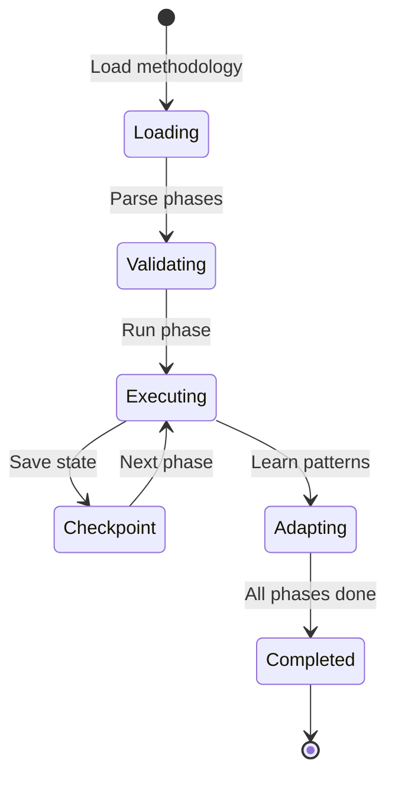
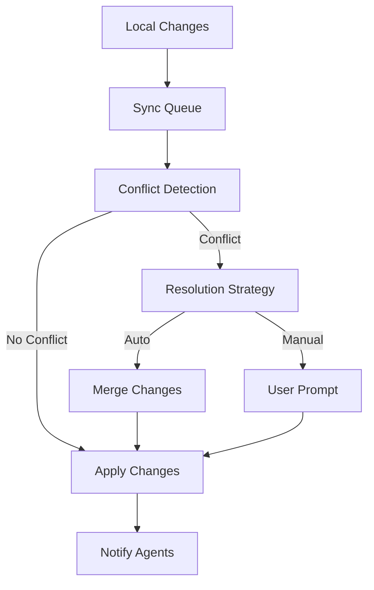
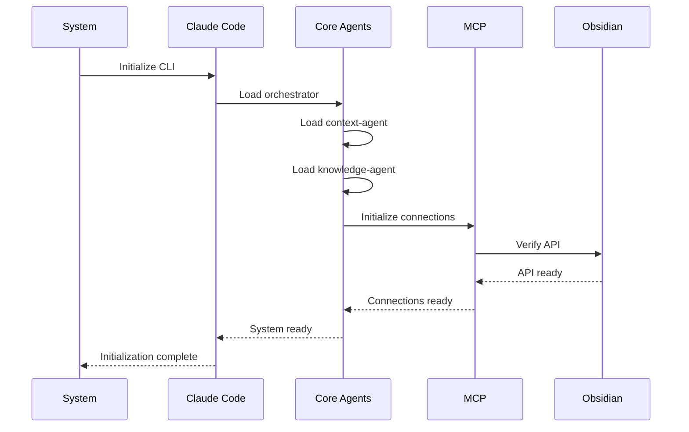

# Component Deployment Specifications
**Sprint 2, Wednesday - Issue #24**
**Date**: 2025-08-05

## Overview

This document provides detailed deployment specifications for each component in the ClaudeProjects2 agent-based architecture. Each component is designed as an intelligent agent with specific deployment requirements, dependencies, and operational characteristics.

## Core Agent Specifications

### 1. Orchestrator Agent

**Purpose**: Central coordination and routing of all agent activities

**Deployment**:
```yaml
name: orchestrator-agent
location: ~/ClaudeProjects2/agents/core/
startup: always
priority: 1
memory_limit: 512MB
```

**Dependencies**:
- Claude Code CLI (required)
- CLAUDE.md file (required)
- Context directory (required)

**Configuration**:
```json
{
  "orchestrator": {
    "max_concurrent_agents": 5,
    "default_timeout_ms": 30000,
    "retry_attempts": 3,
    "context_cache_size_mb": 100,
    "performance_monitoring": true
  }
}
```

**Initialization Sequence**:
1. Load CLAUDE.md orchestration rules
2. Discover available agents
3. Initialize context cache
4. Start message queue listener
5. Begin health monitoring

### 2. Methodology Agent

**Purpose**: Execute and adapt business methodologies

**Deployment**:
```yaml
name: methodology-agent
location: ~/ClaudeProjects2/agents/core/
startup: on-demand
priority: 2
memory_limit: 256MB
```

**Methodology Storage**:
```
~/ClaudeProjects2/methodologies/
├── built-in/
│   ├── design-sprint.md
│   ├── meddic.md
│   ├── agile-scrum.md
│   └── ...
└── custom/
    └── user-methodologies/
```

**Phase Execution Model**:


### 3. Knowledge Agent

**Purpose**: Manage knowledge capture, synthesis, and retrieval

**Deployment**:
```yaml
name: knowledge-agent
location: ~/ClaudeProjects2/agents/core/
startup: always
priority: 2
memory_limit: 512MB
```

**Knowledge Infrastructure**:
```
~/Documents/ClaudeProjects2-Vault/Knowledge/
├── insights/           # Captured insights
├── patterns/          # Detected patterns
├── references/        # External knowledge
├── index/            # Search indices
└── graph/            # Knowledge graph data
```

**Integration Points**:
- Obsidian MCP Server (primary)
- Direct file system (fallback)
- Vector database (future)

### 4. Context Agent

**Purpose**: Manage multi-layer context for all agents

**Deployment**:
```yaml
name: context-agent
location: ~/ClaudeProjects2/agents/core/
startup: always
priority: 1
memory_limit: 256MB
```

**Context Layers**:
```
.claudeprojects/context/
├── working/           # Active task contexts
│   ├── {agent-id}.json
│   └── ...
├── project.json      # Project-wide context
├── learning/         # Historical patterns
│   ├── patterns.json
│   └── improvements.json
├── collaboration/    # Shared contexts
└── cache/           # Performance cache
```

**Performance Targets**:
- Context load: < 100ms
- Context switch: < 500ms
- Cache hit rate: > 80%

## Domain Agent Specifications

### 5. Project Agent

**Purpose**: Manage project lifecycle and agile processes

**Deployment**:
```yaml
name: project-agent
location: ~/ClaudeProjects2/agents/domain/
startup: on-demand
priority: 3
memory_limit: 256MB
```

**Project Structure**:
```
project-root/
├── CLAUDE.md
├── .claudeprojects/
│   ├── project.json    # Project metadata
│   ├── sprints/        # Sprint data
│   ├── tasks/          # Task tracking
│   └── metrics/        # Project metrics
```

**Agile Features**:
- Sprint planning
- Task management
- Burndown tracking
- Velocity calculation
- Retrospective capture

### 6. Research Agent

**Purpose**: Gather and analyze information

**Deployment**:
```yaml
name: research-agent
location: ~/ClaudeProjects2/agents/domain/
startup: on-demand
priority: 3
memory_limit: 256MB
tools: [web_search, document_analysis]
```

**Research Capabilities**:
- Web search integration
- Document parsing
- Data extraction
- Source validation
- Summary generation

### 7. Innovation Agent

**Purpose**: Creative synthesis and ideation

**Deployment**:
```yaml
name: innovation-agent  
location: ~/ClaudeProjects2/agents/domain/
startup: on-demand
priority: 3
memory_limit: 512MB
```

**Innovation Techniques**:
- SCAMPER method
- Mind mapping
- Lateral thinking
- Concept combination
- Trend synthesis

### 8. Analytics Agent

**Purpose**: Track metrics and calculate ROI

**Deployment**:
```yaml
name: analytics-agent
location: ~/ClaudeProjects2/agents/domain/
startup: on-demand
priority: 3
memory_limit: 256MB
```

**Analytics Database**:
```sql
-- SQLite schema
CREATE TABLE project_metrics (
    id INTEGER PRIMARY KEY,
    project_id TEXT NOT NULL,
    timestamp INTEGER NOT NULL,
    metric_type TEXT NOT NULL,
    metric_value REAL NOT NULL,
    metadata TEXT
);

CREATE TABLE agent_performance (
    id INTEGER PRIMARY KEY,
    agent_name TEXT NOT NULL,
    execution_time_ms INTEGER,
    memory_used_mb INTEGER,
    success BOOLEAN,
    timestamp INTEGER
);
```

## Infrastructure Agent Specifications

### 9. Obsidian Agent

**Purpose**: Manage Obsidian vault operations

**Deployment**:
```yaml
name: obsidian-agent
location: ~/ClaudeProjects2/agents/infrastructure/
startup: on-demand
priority: 2
memory_limit: 256MB
```

**MCP Configuration**:
```json
{
  "obsidian_mcp": {
    "api_key": "${OBSIDIAN_API_KEY}",
    "host": "127.0.0.1",
    "port": 27124,
    "timeout_ms": 5000,
    "retry_attempts": 3
  }
}
```

**Vault Operations**:
- Note CRUD
- Search operations
- Tag management
- Link graph queries
- Bulk imports

### 10. Sync Agent

**Purpose**: Handle multi-user synchronization

**Deployment**:
```yaml
name: sync-agent
location: ~/ClaudeProjects2/agents/infrastructure/
startup: on-demand
priority: 3
memory_limit: 256MB
```

**Sync Architecture**:


**Conflict Resolution**:
- Text merge algorithms
- Semantic diff for knowledge
- User preferences
- Audit trail

### 11. Version Agent

**Purpose**: Git operations and version control

**Deployment**:
```yaml
name: version-agent
location: ~/ClaudeProjects2/agents/infrastructure/
startup: on-demand
priority: 3
memory_limit: 128MB
```

**Versioning Strategy**:
- Auto-commit on milestones
- Semantic versioning
- Branch management
- Tag creation
- History navigation

### 12. License Agent

**Purpose**: Feature validation and usage tracking

**Deployment**:
```yaml
name: license-agent
location: ~/ClaudeProjects2/agents/infrastructure/
startup: always
priority: 2
memory_limit: 128MB
```

**License Enforcement**:
```json
{
  "tiers": {
    "community": {
      "agents": ["core", "basic_domain"],
      "methodologies": 5,
      "projects": 10,
      "knowledge_items": 1000
    },
    "professional": {
      "agents": ["all"],
      "methodologies": "unlimited",
      "projects": "unlimited",
      "knowledge_items": "unlimited",
      "advanced_features": true
    }
  }
}
```

## Deployment Configurations

### Development Environment
```bash
# ~/.claudeprojects/dev.env
CLAUDE_CODE_PATH=/usr/local/bin/claude
OBSIDIAN_VAULT=~/Documents/ClaudeProjects2-Vault
AGENT_LOG_LEVEL=debug
PERFORMANCE_MONITORING=true
CACHE_SIZE_MB=500
MAX_AGENTS=10
```

### Production Environment
```bash
# ~/.claudeprojects/prod.env
CLAUDE_CODE_PATH=/usr/local/bin/claude
OBSIDIAN_VAULT=~/Documents/ClaudeProjects2-Vault
AGENT_LOG_LEVEL=info
PERFORMANCE_MONITORING=true
CACHE_SIZE_MB=2000
MAX_AGENTS=20
AUTO_UPDATE=true
```

## Agent Communication Infrastructure

### Message Queue Implementation
```
.claudeprojects/messages/
├── inbox/              # Incoming messages
│   ├── {agent-id}/
│   │   └── {msg-id}.json
├── outbox/             # Outgoing messages
├── processing/         # Active processing
└── archive/           # Completed messages
```

### Message Format
```json
{
  "header": {
    "id": "msg-uuid",
    "timestamp": "ISO-8601",
    "from": "agent-id",
    "to": "agent-id",
    "priority": "high|normal|low",
    "timeout_ms": 30000
  },
  "body": {
    "type": "request|response|event",
    "action": "specific-action",
    "payload": { },
    "context_ref": "context-id"
  }
}
```

## Performance Optimization Deployment

### Cache Architecture
```
.claudeprojects/cache/
├── context/           # Context cache (LRU)
├── knowledge/         # Knowledge cache
├── search/           # Search indices
└── agent_state/      # Agent state cache
```

### Resource Management
```yaml
# Resource allocation by agent type
resource_profiles:
  core_agents:
    memory_mb: 512
    cpu_priority: high
    cache_size_mb: 100
    
  domain_agents:
    memory_mb: 256
    cpu_priority: normal
    cache_size_mb: 50
    
  infrastructure_agents:
    memory_mb: 256
    cpu_priority: low
    cache_size_mb: 25
```

## Monitoring and Logging

### Log Structure
```
~/.claudeprojects/logs/
├── agents/
│   ├── {agent-name}/
│   │   ├── {date}.log
│   │   └── errors.log
├── system/
│   ├── performance.log
│   └── security.log
└── analytics/
    └── metrics.log
```

### Performance Metrics Collection
```json
{
  "metric_collection": {
    "interval_ms": 1000,
    "metrics": [
      "execution_time",
      "memory_usage",
      "cache_hit_rate",
      "message_queue_size",
      "active_agents"
    ],
    "storage": "sqlite",
    "retention_days": 30
  }
}
```

## Security Deployment

### Permission Model
```yaml
# Agent permission profiles
permission_profiles:
  core:
    file_system:
      read: ["./", "~/"]
      write: ["./.claudeprojects/"]
    network:
      allowed: ["localhost"]
    agents:
      spawn: true
      modify: true
      
  domain:
    file_system:
      read: ["./"]
      write: ["./deliverables/"]
    network:
      allowed: ["api.allowed.com"]
    agents:
      spawn: false
      modify: false
```

### Audit Configuration
```json
{
  "audit": {
    "enabled": true,
    "events": [
      "agent_start",
      "agent_stop",
      "file_access",
      "network_request",
      "permission_denied"
    ],
    "storage": ".claudeprojects/audit/",
    "retention_days": 90
  }
}
```

## Startup Sequence

### System Initialization


### Project Initialization
```bash
#!/bin/bash
# Project initialization script

# 1. Create project structure
mkdir -p .claudeprojects/{context,messages,cache,logs}

# 2. Initialize CLAUDE.md
cp ~/.claudeprojects/templates/CLAUDE.md.template ./CLAUDE.md

# 3. Create initial context
echo '{"project_id":"'$(uuidgen)'","created":"'$(date -u +"%Y-%m-%dT%H:%M:%SZ")'"}' > .claudeprojects/context/project.json

# 4. Start core agents
claude-code --project . --start-agents core

# 5. Verify setup
claude-code --project . --verify
```

## Deployment Validation

### Health Checks
```yaml
health_checks:
  - name: core_agents
    type: process
    command: ps aux | grep -E "(orchestrator|context|knowledge|methodology)-agent"
    expected: 4
    
  - name: obsidian_api
    type: http
    url: http://localhost:27124/health
    expected_status: 200
    
  - name: message_queue
    type: file_system
    path: .claudeprojects/messages/
    check: writable
    
  - name: context_cache
    type: performance
    operation: context_load
    max_time_ms: 100
```

## Conclusion

These deployment specifications provide the detailed blueprint for implementing the agent-based architecture. Each component is designed for:
- **Independence**: Can operate standalone
- **Intelligence**: Self-monitoring and adapting
- **Integration**: Seamless communication
- **Performance**: Optimized for speed
- **Security**: Least privilege principle

The deployment model ensures that ClaudeProjects2 can be installed and running in under 5 minutes while maintaining the flexibility for advanced configurations.