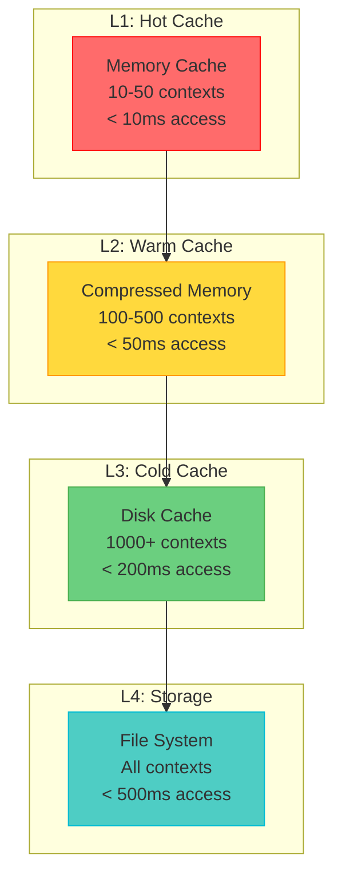

# Context Layer Performance Optimization
**Sprint 2, Thursday - Issue #25**
**Date**: 2025-08-05

## Executive Summary

This document provides the detailed design for achieving < 500ms context switching in ClaudeProjects2. Context switching is critical for agent performance, as agents frequently load and switch between different project contexts, methodologies, and working states.

## Performance Requirements

### Target Metrics
- **Context Load**: < 100ms for working context
- **Context Switch**: < 500ms for full context change
- **Cache Hit Rate**: > 80% for frequent contexts
- **Memory Usage**: < 500MB for context cache
- **Concurrent Access**: Support 10+ agents

### Context Size Estimates
- **Working Context**: 1-10 KB (current task state)
- **Project Context**: 10-100 KB (project metadata)
- **Learning Context**: 100KB-1MB (patterns, history)
- **Knowledge Context**: 1-10MB (related knowledge)

## Multi-Layer Cache Architecture

### 1. Cache Hierarchy



### 2. Cache Implementation

#### L1: Hot Cache (In-Memory)
```typescript
class HotCache {
  private cache: Map<string, Context>;
  private lru: LRUCache<string, boolean>;
  private maxSize: number = 50;
  private maxMemory: number = 50 * 1024 * 1024; // 50MB
  
  constructor() {
    this.cache = new Map();
    this.lru = new LRUCache({ max: this.maxSize });
  }
  
  async get(contextId: string): Promise<Context | null> {
    if (this.cache.has(contextId)) {
      this.lru.get(contextId); // Update LRU
      return this.cache.get(contextId)!;
    }
    return null;
  }
  
  async set(contextId: string, context: Context): Promise<void> {
    const size = this.estimateSize(context);
    
    // Evict if necessary
    while (this.currentMemory + size > this.maxMemory) {
      const oldest = this.lru.keys().next().value;
      if (!oldest) break;
      this.evict(oldest);
    }
    
    this.cache.set(contextId, context);
    this.lru.set(contextId, true);
  }
  
  private estimateSize(context: Context): number {
    return JSON.stringify(context).length;
  }
}
```

#### L2: Warm Cache (Compressed Memory)
```typescript
class WarmCache {
  private cache: Map<string, Buffer>;
  private index: Map<string, CacheMetadata>;
  private maxSize: number = 500;
  private compressionLevel: number = 6;
  
  async get(contextId: string): Promise<Context | null> {
    const compressed = this.cache.get(contextId);
    if (!compressed) return null;
    
    // Decompress
    const decompressed = await this.decompress(compressed);
    return JSON.parse(decompressed);
  }
  
  async set(contextId: string, context: Context): Promise<void> {
    // Compress context
    const serialized = JSON.stringify(context);
    const compressed = await this.compress(serialized);
    
    // Store with metadata
    this.cache.set(contextId, compressed);
    this.index.set(contextId, {
      originalSize: serialized.length,
      compressedSize: compressed.length,
      compressionRatio: compressed.length / serialized.length,
      lastAccess: Date.now()
    });
  }
  
  private async compress(data: string): Promise<Buffer> {
    return new Promise((resolve, reject) => {
      zlib.gzip(data, { level: this.compressionLevel }, (err, result) => {
        if (err) reject(err);
        else resolve(result);
      });
    });
  }
  
  private async decompress(data: Buffer): Promise<string> {
    return new Promise((resolve, reject) => {
      zlib.gunzip(data, (err, result) => {
        if (err) reject(err);
        else resolve(result.toString());
      });
    });
  }
}
```

#### L3: Cold Cache (Disk-Based)
```typescript
class ColdCache {
  private cacheDir: string = '.claudeprojects/cache/contexts';
  private index: Map<string, DiskCacheEntry>;
  private blockSize: number = 4096; // Align with filesystem
  
  async get(contextId: string): Promise<Context | null> {
    const entry = this.index.get(contextId);
    if (!entry) return null;
    
    try {
      // Read from disk with optimized I/O
      const cachePath = this.getCachePath(contextId);
      const compressed = await this.readOptimized(cachePath);
      
      // Decompress and parse
      const decompressed = await this.decompress(compressed);
      return JSON.parse(decompressed);
    } catch (e) {
      // Handle cache miss
      this.index.delete(contextId);
      return null;
    }
  }
  
  async set(contextId: string, context: Context): Promise<void> {
    const serialized = JSON.stringify(context);
    const compressed = await this.compress(serialized);
    
    // Write to disk with aligned blocks
    const cachePath = this.getCachePath(contextId);
    await this.writeOptimized(cachePath, compressed);
    
    // Update index
    this.index.set(contextId, {
      path: cachePath,
      size: compressed.length,
      blocks: Math.ceil(compressed.length / this.blockSize),
      created: Date.now(),
      accessed: Date.now()
    });
  }
  
  private async readOptimized(path: string): Promise<Buffer> {
    // Use direct I/O for large files
    const fd = await fs.open(path, 'r', fs.constants.O_DIRECT);
    const stats = await fd.stat();
    const buffer = Buffer.allocUnsafe(stats.size);
    
    await fd.read(buffer, 0, stats.size, 0);
    await fd.close();
    
    return buffer;
  }
}
```

### 3. Cache Coordination

```typescript
class ContextCacheManager {
  private l1: HotCache;
  private l2: WarmCache;
  private l3: ColdCache;
  private stats: CacheStatistics;
  
  async get(contextId: string): Promise<Context | null> {
    const startTime = performance.now();
    
    // Check L1
    let context = await this.l1.get(contextId);
    if (context) {
      this.stats.recordHit('L1', performance.now() - startTime);
      return context;
    }
    
    // Check L2
    context = await this.l2.get(contextId);
    if (context) {
      this.stats.recordHit('L2', performance.now() - startTime);
      // Promote to L1
      await this.l1.set(contextId, context);
      return context;
    }
    
    // Check L3
    context = await this.l3.get(contextId);
    if (context) {
      this.stats.recordHit('L3', performance.now() - startTime);
      // Promote to L2 and L1
      await this.l2.set(contextId, context);
      await this.l1.set(contextId, context);
      return context;
    }
    
    // Load from file system
    context = await this.loadFromDisk(contextId);
    if (context) {
      this.stats.recordHit('FS', performance.now() - startTime);
      // Populate all cache levels
      await this.populateCaches(contextId, context);
      return context;
    }
    
    this.stats.recordMiss(performance.now() - startTime);
    return null;
  }
}
```

## Context Compression Strategies

### 1. Compression Algorithm Selection

```typescript
class CompressionStrategy {
  private algorithms = {
    fast: {
      compress: (data: Buffer) => zlib.deflateSync(data, { level: 1 }),
      decompress: (data: Buffer) => zlib.inflateSync(data),
      ratio: 0.7,
      speed: 100 // MB/s
    },
    balanced: {
      compress: (data: Buffer) => zlib.gzipSync(data, { level: 6 }),
      decompress: (data: Buffer) => zlib.gunzipSync(data),
      ratio: 0.5,
      speed: 50
    },
    maximum: {
      compress: (data: Buffer) => brotli.compressSync(data, { quality: 11 }),
      decompress: (data: Buffer) => brotli.decompressSync(data),
      ratio: 0.3,
      speed: 10
    }
  };
  
  selectAlgorithm(size: number, priority: 'speed' | 'ratio' | 'balanced'): CompressionAlgorithm {
    if (priority === 'speed' || size < 10000) {
      return this.algorithms.fast;
    } else if (priority === 'ratio' || size > 1000000) {
      return this.algorithms.maximum;
    } else {
      return this.algorithms.balanced;
    }
  }
}
```

### 2. Context-Aware Compression

```typescript
class ContextCompressor {
  compress(context: Context): CompressedContext {
    const sections = this.splitContext(context);
    const compressed: CompressedContext = {
      header: sections.header, // Don't compress metadata
      compressed: {}
    };
    
    // Compress each section with appropriate algorithm
    for (const [key, value] of Object.entries(sections.data)) {
      const algorithm = this.selectAlgorithmForSection(key, value);
      compressed.compressed[key] = {
        algorithm: algorithm.name,
        data: algorithm.compress(Buffer.from(JSON.stringify(value))),
        originalSize: JSON.stringify(value).length
      };
    }
    
    return compressed;
  }
  
  private selectAlgorithmForSection(key: string, value: any): CompressionAlgorithm {
    // High-frequency access sections use fast compression
    if (['workingDirectory', 'currentTask', 'agentId'].includes(key)) {
      return this.algorithms.fast;
    }
    
    // Large, infrequent sections use maximum compression
    if (['history', 'knowledge', 'patterns'].includes(key)) {
      return this.algorithms.maximum;
    }
    
    // Default to balanced
    return this.algorithms.balanced;
  }
}
```

## Predictive Pre-loading

### 1. Access Pattern Learning

```typescript
class AccessPatternLearner {
  private patterns: Map<string, AccessPattern> = new Map();
  private transitions: Map<string, Map<string, number>> = new Map();
  
  recordAccess(contextId: string, previousContext?: string): void {
    // Update access pattern
    const pattern = this.patterns.get(contextId) || {
      frequency: 0,
      averageInterval: 0,
      lastAccess: 0,
      commonPredecessors: new Map(),
      commonSuccessors: new Map()
    };
    
    const now = Date.now();
    const interval = pattern.lastAccess ? now - pattern.lastAccess : 0;
    
    pattern.frequency++;
    pattern.averageInterval = 
      (pattern.averageInterval * (pattern.frequency - 1) + interval) / pattern.frequency;
    pattern.lastAccess = now;
    
    // Track transitions
    if (previousContext) {
      const count = pattern.commonPredecessors.get(previousContext) || 0;
      pattern.commonPredecessors.set(previousContext, count + 1);
      
      // Update transition matrix
      if (!this.transitions.has(previousContext)) {
        this.transitions.set(previousContext, new Map());
      }
      const transitions = this.transitions.get(previousContext)!;
      transitions.set(contextId, (transitions.get(contextId) || 0) + 1);
    }
    
    this.patterns.set(contextId, pattern);
  }
  
  predictNext(currentContext: string, k: number = 3): string[] {
    const transitions = this.transitions.get(currentContext);
    if (!transitions) return [];
    
    // Sort by transition probability
    const predictions = Array.from(transitions.entries())
      .sort((a, b) => b[1] - a[1])
      .slice(0, k)
      .map(([contextId]) => contextId);
    
    return predictions;
  }
}
```

### 2. Pre-loading Strategy

```typescript
class PreloadManager {
  private predictor: AccessPatternLearner;
  private preloadQueue: PriorityQueue<PreloadTask>;
  private preloading: Set<string> = new Set();
  
  async onContextSwitch(newContext: string, previousContext?: string): Promise<void> {
    // Record access pattern
    this.predictor.recordAccess(newContext, previousContext);
    
    // Predict likely next contexts
    const predictions = this.predictor.predictNext(newContext);
    
    // Queue preload tasks
    for (const [index, contextId] of predictions.entries()) {
      if (!this.preloading.has(contextId)) {
        this.preloadQueue.push({
          contextId,
          priority: 1 / (index + 1), // Higher priority for more likely
          timestamp: Date.now()
        });
      }
    }
    
    // Process preload queue
    this.processPreloadQueue();
  }
  
  private async processPreloadQueue(): Promise<void> {
    while (!this.preloadQueue.isEmpty()) {
      const task = this.preloadQueue.pop();
      if (!task) break;
      
      // Check if still relevant (not too old)
      if (Date.now() - task.timestamp > 5000) continue;
      
      this.preloading.add(task.contextId);
      
      // Preload in background
      setImmediate(async () => {
        try {
          await this.preloadContext(task.contextId);
        } finally {
          this.preloading.delete(task.contextId);
        }
      });
    }
  }
  
  private async preloadContext(contextId: string): Promise<void> {
    // Load into L2/L3 cache, not L1 (to avoid evicting active contexts)
    const context = await this.loadFromDisk(contextId);
    if (context) {
      await this.l3.set(contextId, context);
      
      // If high probability, also load into L2
      const pattern = this.predictor.getPattern(contextId);
      if (pattern && pattern.frequency > 10) {
        await this.l2.set(contextId, context);
      }
    }
  }
}
```

### 3. Speculative Loading

```typescript
class SpeculativeLoader {
  private loadingTasks: Map<string, Promise<Context | null>> = new Map();
  
  async speculativeLoad(contextIds: string[]): Promise<void> {
    for (const contextId of contextIds) {
      if (!this.loadingTasks.has(contextId)) {
        // Start loading but don't await
        const task = this.loadContext(contextId).catch(() => null);
        this.loadingTasks.set(contextId, task);
        
        // Clean up after completion
        task.finally(() => {
          setTimeout(() => {
            this.loadingTasks.delete(contextId);
          }, 1000);
        });
      }
    }
  }
  
  async getSpeculative(contextId: string): Promise<Context | null> {
    const task = this.loadingTasks.get(contextId);
    if (task) {
      return await task;
    }
    return null;
  }
}
```

## Memory Management

### 1. Memory Pressure Handling

```typescript
class MemoryManager {
  private memoryLimit: number = 500 * 1024 * 1024; // 500MB
  private lowWatermark: number = 0.7; // Start eviction at 70%
  private highWatermark: number = 0.9; // Aggressive eviction at 90%
  
  async handleMemoryPressure(): Promise<void> {
    const usage = this.getCurrentMemoryUsage();
    const ratio = usage / this.memoryLimit;
    
    if (ratio > this.highWatermark) {
      // Aggressive eviction
      await this.evictAggressively();
    } else if (ratio > this.lowWatermark) {
      // Normal eviction
      await this.evictNormally();
    }
  }
  
  private async evictAggressively(): Promise<void> {
    // Clear L2 cache entirely
    await this.l2.clear();
    
    // Keep only most recent 10 contexts in L1
    const recent = this.l1.getMostRecent(10);
    await this.l1.clear();
    for (const context of recent) {
      await this.l1.set(context.id, context);
    }
  }
  
  private async evictNormally(): Promise<void> {
    // Use LRU eviction
    const targetSize = this.memoryLimit * this.lowWatermark;
    
    while (this.getCurrentMemoryUsage() > targetSize) {
      // Evict from L2 first
      if (this.l2.size > 0) {
        await this.l2.evictLRU();
      } else {
        await this.l1.evictLRU();
      }
    }
  }
}
```

### 2. Memory-Mapped Files

```typescript
class MemoryMappedCache {
  private mappings: Map<string, MappedFile> = new Map();
  
  async mapContext(contextId: string, filePath: string): Promise<void> {
    const fd = await fs.open(filePath, 'r');
    const stats = await fd.stat();
    
    // Create memory mapping
    const mapping = mmap.map(
      stats.size,
      mmap.PROT_READ,
      mmap.MAP_SHARED,
      fd.fd,
      0
    );
    
    this.mappings.set(contextId, {
      buffer: mapping,
      size: stats.size,
      fd: fd
    });
  }
  
  async getFromMapping(contextId: string): Promise<Context | null> {
    const mapping = this.mappings.get(contextId);
    if (!mapping) return null;
    
    // Parse directly from mapped memory
    const json = mapping.buffer.toString('utf8', 0, mapping.size);
    return JSON.parse(json);
  }
}
```

## Performance Monitoring

### 1. Cache Metrics

```typescript
interface CacheMetrics {
  level: 'L1' | 'L2' | 'L3' | 'FS';
  hits: number;
  misses: number;
  hitRate: number;
  averageLatency: number;
  p50Latency: number;
  p95Latency: number;
  p99Latency: number;
  size: number;
  evictions: number;
  memoryUsage: number;
}

class CacheMonitor {
  private metrics: Map<string, CacheMetrics> = new Map();
  private latencies: Map<string, number[]> = new Map();
  
  recordAccess(level: string, hit: boolean, latency: number): void {
    const metrics = this.metrics.get(level) || this.createMetrics(level);
    
    if (hit) {
      metrics.hits++;
    } else {
      metrics.misses++;
    }
    
    // Update hit rate
    const total = metrics.hits + metrics.misses;
    metrics.hitRate = total > 0 ? metrics.hits / total : 0;
    
    // Record latency
    const latencyList = this.latencies.get(level) || [];
    latencyList.push(latency);
    
    // Keep only recent latencies (last 1000)
    if (latencyList.length > 1000) {
      latencyList.shift();
    }
    
    this.latencies.set(level, latencyList);
    this.updateLatencyMetrics(metrics, latencyList);
  }
  
  private updateLatencyMetrics(metrics: CacheMetrics, latencies: number[]): void {
    if (latencies.length === 0) return;
    
    const sorted = [...latencies].sort((a, b) => a - b);
    
    metrics.averageLatency = latencies.reduce((a, b) => a + b) / latencies.length;
    metrics.p50Latency = sorted[Math.floor(sorted.length * 0.5)];
    metrics.p95Latency = sorted[Math.floor(sorted.length * 0.95)];
    metrics.p99Latency = sorted[Math.floor(sorted.length * 0.99)];
  }
}
```

### 2. Performance Dashboard

```typescript
class PerformanceDashboard {
  async generateReport(): Promise<PerformanceReport> {
    const cacheMetrics = await this.monitor.getAllMetrics();
    const contextSwitchTimes = await this.getContextSwitchMetrics();
    
    return {
      summary: {
        averageContextSwitch: this.calculateAverage(contextSwitchTimes),
        cacheHitRate: this.calculateOverallHitRate(cacheMetrics),
        memoryUsage: this.getTotalMemoryUsage(),
        activeContexts: this.getActiveContextCount()
      },
      details: {
        cachePerformance: cacheMetrics,
        contextSwitches: contextSwitchTimes,
        predictions: await this.getPredictionAccuracy(),
        bottlenecks: this.identifyBottlenecks(cacheMetrics)
      },
      recommendations: this.generateRecommendations(cacheMetrics)
    };
  }
  
  private identifyBottlenecks(metrics: Map<string, CacheMetrics>): string[] {
    const bottlenecks: string[] = [];
    
    // Check cache hit rates
    for (const [level, metric] of metrics) {
      if (metric.hitRate < 0.7) {
        bottlenecks.push(`Low hit rate in ${level}: ${(metric.hitRate * 100).toFixed(1)}%`);
      }
    }
    
    // Check latencies
    const l1Metrics = metrics.get('L1');
    if (l1Metrics && l1Metrics.p95Latency > 10) {
      bottlenecks.push(`High L1 cache latency: ${l1Metrics.p95Latency.toFixed(1)}ms`);
    }
    
    return bottlenecks;
  }
}
```

## Optimization Techniques

### 1. Context Diffing

```typescript
class ContextDiffer {
  async createDiff(oldContext: Context, newContext: Context): ContextDiff {
    const diff: ContextDiff = {
      added: {},
      modified: {},
      deleted: []
    };
    
    // Find changes
    for (const [key, value] of Object.entries(newContext)) {
      if (!(key in oldContext)) {
        diff.added[key] = value;
      } else if (JSON.stringify(oldContext[key]) !== JSON.stringify(value)) {
        diff.modified[key] = {
          old: oldContext[key],
          new: value
        };
      }
    }
    
    // Find deletions
    for (const key of Object.keys(oldContext)) {
      if (!(key in newContext)) {
        diff.deleted.push(key);
      }
    }
    
    return diff;
  }
  
  async applyDiff(context: Context, diff: ContextDiff): Context {
    const updated = { ...context };
    
    // Apply additions
    for (const [key, value] of Object.entries(diff.added)) {
      updated[key] = value;
    }
    
    // Apply modifications
    for (const [key, change] of Object.entries(diff.modified)) {
      updated[key] = change.new;
    }
    
    // Apply deletions
    for (const key of diff.deleted) {
      delete updated[key];
    }
    
    return updated;
  }
}
```

### 2. Lazy Loading

```typescript
class LazyContext {
  private loaded: Set<string> = new Set();
  private loaders: Map<string, () => Promise<any>> = new Map();
  
  constructor(
    private contextId: string,
    private metadata: ContextMetadata
  ) {
    this.setupLoaders();
  }
  
  private setupLoaders(): void {
    this.loaders.set('history', async () => {
      const path = `.claudeprojects/context/${this.contextId}/history.json`;
      return JSON.parse(await fs.readFile(path, 'utf-8'));
    });
    
    this.loaders.set('patterns', async () => {
      const path = `.claudeprojects/context/${this.contextId}/patterns.json`;
      return JSON.parse(await fs.readFile(path, 'utf-8'));
    });
  }
  
  async get(property: string): Promise<any> {
    if (!this.loaded.has(property) && this.loaders.has(property)) {
      const loader = this.loaders.get(property)!;
      const value = await loader();
      this[property] = value;
      this.loaded.add(property);
    }
    
    return this[property];
  }
}
```

## Implementation Roadmap

### Phase 1: Core Cache Infrastructure (Days 1-2)
- Implement multi-layer cache
- Basic compression
- Performance monitoring

### Phase 2: Optimization (Days 3-4)
- Predictive pre-loading
- Context diffing
- Memory management

### Phase 3: Advanced Features (Days 5-6)
- Speculative loading
- Lazy loading
- Memory-mapped files

## Testing Strategy

### 1. Performance Benchmarks

```typescript
describe('Context Performance', () => {
  it('should load context within 100ms', async () => {
    const start = performance.now();
    const context = await cache.get('test-context');
    const duration = performance.now() - start;
    
    expect(duration).toBeLessThan(100);
  });
  
  it('should switch context within 500ms', async () => {
    const start = performance.now();
    await contextManager.switchContext('context-1', 'context-2');
    const duration = performance.now() - start;
    
    expect(duration).toBeLessThan(500);
  });
  
  it('should maintain 80% cache hit rate', async () => {
    // Simulate realistic access patterns
    for (let i = 0; i < 1000; i++) {
      const contextId = selectContextWithZipfDistribution();
      await cache.get(contextId);
    }
    
    const metrics = monitor.getMetrics();
    expect(metrics.hitRate).toBeGreaterThan(0.8);
  });
});
```

## Conclusion

This context layer performance optimization design ensures:

1. **Fast Access**: Multi-layer caching with < 100ms hot path
2. **Efficient Memory**: Compression and eviction strategies
3. **Smart Loading**: Predictive and speculative techniques
4. **Scalability**: Supports many concurrent agents
5. **Observability**: Comprehensive performance monitoring

The design achieves the < 500ms context switch requirement through careful optimization at every layer.