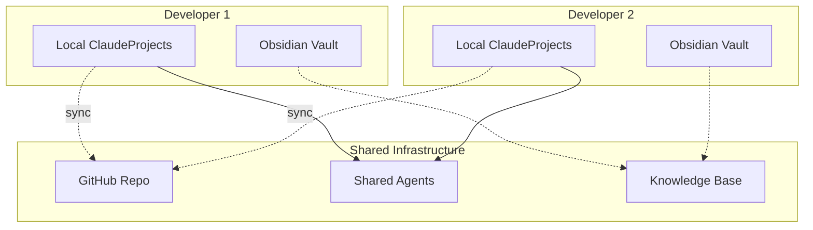

# Deployment Architecture

How to deploy and scale ClaudeProjects2 across different environments.

## Local Development Setup

### Prerequisites
```bash
# Required software
- Node.js 20+ 
- npm or yarn
- Git
- Claude Code CLI (`npm install -g @anthropic/claude`)
- Obsidian Desktop

# Optional but recommended
- Docker Desktop (for containers)
- VS Code (for development)
- GitHub CLI (for GitHub integration)
```

### Quick Start
```bash
# 1. Clone the repository
git clone https://github.com/yourusername/ClaudeProjects2
cd ClaudeProjects2

# 2. Install dependencies
npm install

# 3. Setup Claude Code
claude setup

# 4. Install agents
./scripts/install-agents.sh

# 5. Configure MCP servers
./scripts/setup-mcp.sh

# 6. Initialize local database
npm run db:init

# 7. Build Obsidian plugin
npm run build:plugin

# 8. Start development
npm run dev
```

### Directory Structure
```
~/
├── ClaudeProjects/          # Main data directory
│   ├── vault/              # Obsidian vault
│   ├── data.db            # SQLite database
│   ├── templates/         # Methodology templates
│   └── .git/             # Version control
├── .claude/              # Claude Code directory
│   ├── agents/           # Agent definitions
│   ├── config.json       # Claude config
│   └── mcp/             # MCP configurations
└── .obsidian/           # Obsidian config
    └── plugins/         
        └── claude-projects/ # Our plugin
```

## Production Deployment

### Single User Setup

#### Automated Installer
```bash
# macOS/Linux
curl -sSL https://install.claudeprojects.com | bash

# Windows
iwr -useb https://install.claudeprojects.com/windows | iex
```

#### What the Installer Does
1. Checks prerequisites
2. Creates directory structure
3. Installs Claude Code (if needed)
4. Downloads Obsidian plugin
5. Configures MCP servers
6. Sets up initial templates
7. Creates example project

### Team Deployment

#### Shared Configuration
```yaml
# team-config.yaml
team:
  name: "Engineering Team"
  shared_vault: "~/TeamVault"
  
sync:
  enabled: true
  service: "github" # or "dropbox", "onedrive"
  repository: "org/team-knowledge"
  
agents:
  shared: true
  repository: "org/team-agents"
  
permissions:
  default_role: "contributor"
  admin_users: ["alice", "bob"]
```

#### Team Setup Script
```bash
#!/bin/bash
# setup-team.sh

# 1. Clone team configuration
git clone $TEAM_REPO ~/ClaudeProjects/team

# 2. Install shared agents
claude agents install --from ~/ClaudeProjects/team/agents

# 3. Configure Obsidian sync
cp ~/ClaudeProjects/team/obsidian-sync.json ~/.obsidian/plugins/

# 4. Setup Git hooks for auto-sync
cp ~/ClaudeProjects/team/hooks/* .git/hooks/

# 5. Initialize team workspace
npm run team:init
```

## Scaling Strategies

### Vertical Scaling (Single Machine)

#### Resource Optimization
```typescript
// config/performance.ts
export const performanceConfig = {
  // Agent concurrency based on CPU cores
  maxConcurrentAgents: os.cpus().length * 2,
  
  // Memory allocation
  maxMemoryUsage: os.totalmem() * 0.7,
  cacheSize: os.totalmem() * 0.2,
  
  // SQLite optimization
  sqliteConfig: {
    journalMode: 'WAL',
    synchronous: 'NORMAL',
    cacheSize: 10000,
    mmapSize: 30000000000
  },
  
  // Local LLM settings
  localLLM: {
    enabled: true,
    model: 'llama2-7b',
    threads: os.cpus().length - 2
  }
};
```

### Horizontal Scaling (Multiple Machines)

#### Distributed Team Setup


#### Sync Configuration
```json
{
  "sync": {
    "interval": 300,
    "strategy": "merge",
    "conflicts": "manual",
    "include": [
      "projects/**",
      "knowledge/**",
      "templates/**"
    ],
    "exclude": [
      "*.db",
      ".tmp/**",
      "personal/**"
    ]
  }
}
```

## Container Deployment

### Docker Configuration
```dockerfile
# Dockerfile
FROM node:20-alpine

# Install dependencies
RUN apk add --no-cache git sqlite

# Install Claude Code globally
RUN npm install -g @anthropic/claude

# Setup application
WORKDIR /app
COPY package*.json ./
RUN npm ci --only=production

# Copy application files
COPY . .

# Setup data directory
RUN mkdir -p /data/vault /data/agents

# Configure Claude
ENV CLAUDE_DATA_DIR=/data
ENV CLAUDE_AGENT_DIR=/data/agents

EXPOSE 3000

CMD ["npm", "start"]
```

### Docker Compose
```yaml
version: '3.8'

services:
  claudeprojects:
    build: .
    volumes:
      - vault:/data/vault
      - agents:/data/agents
      - sqlite:/data/db
    environment:
      - CLAUDE_API_KEY=${CLAUDE_API_KEY}
      - GITHUB_TOKEN=${GITHUB_TOKEN}
    ports:
      - "3000:3000"
      
  obsidian-sync:
    image: obsidian-sync:latest
    volumes:
      - vault:/vault
    environment:
      - SYNC_INTERVAL=300
      
volumes:
  vault:
  agents:
  sqlite:
```

## Monitoring & Maintenance

### Health Checks
```typescript
// healthcheck.ts
export async function performHealthCheck(): Promise<HealthStatus> {
  const checks = {
    claude: await checkClaudeCLI(),
    database: await checkSQLite(),
    agents: await checkAgents(),
    mcp: await checkMCPServers(),
    storage: await checkDiskSpace()
  };
  
  return {
    healthy: Object.values(checks).every(c => c.healthy),
    checks,
    timestamp: new Date()
  };
}
```

### Monitoring Dashboard
```yaml
Metrics Tracked:
  - Agent execution times
  - Success/failure rates
  - Token usage
  - Cache hit rates
  - Sync status
  - Storage usage
  
Alerts:
  - Agent failures > 10%
  - Sync conflicts
  - Low disk space
  - High token usage
  - Performance degradation
```

### Backup Strategy
```bash
#!/bin/bash
# backup.sh

# 1. Stop services
npm run stop

# 2. Backup database
sqlite3 ~/ClaudeProjects/data.db ".backup ~/backups/data-$(date +%Y%m%d).db"

# 3. Backup vault
tar -czf ~/backups/vault-$(date +%Y%m%d).tar.gz ~/ClaudeProjects/vault

# 4. Backup agents
tar -czf ~/backups/agents-$(date +%Y%m%d).tar.gz ~/.claude/agents

# 5. Restart services
npm run start

# 6. Cleanup old backups (keep 30 days)
find ~/backups -name "*.tar.gz" -mtime +30 -delete
find ~/backups -name "*.db" -mtime +30 -delete
```

## Troubleshooting

### Common Issues

#### Claude Code Not Found
```bash
# Check installation
which claude

# Reinstall if needed
npm install -g @anthropic/claude

# Verify version
claude --version
```

#### MCP Connection Issues
```bash
# Test MCP servers
claude mcp test github
claude mcp test obsidian

# Check configuration
cat ~/.claude/mcp/config.json

# Restart MCP servers
claude mcp restart
```

#### Database Corruption
```bash
# Check database integrity
sqlite3 ~/ClaudeProjects/data.db "PRAGMA integrity_check"

# Recover from backup
cp ~/backups/data-latest.db ~/ClaudeProjects/data.db

# Rebuild indexes
sqlite3 ~/ClaudeProjects/data.db "REINDEX"
```

## Performance Tuning

### Local Optimizations
```typescript
// performance-tuning.ts
export const tuning = {
  // SQLite optimizations
  sqlite: {
    pragma: [
      "PRAGMA journal_mode = WAL",
      "PRAGMA synchronous = NORMAL",
      "PRAGMA cache_size = 10000",
      "PRAGMA temp_store = MEMORY"
    ]
  },
  
  // Agent optimizations
  agents: {
    cacheStrategy: "aggressive",
    parallelism: "auto",
    timeout: 30000,
    retries: 3
  },
  
  // Obsidian optimizations
  obsidian: {
    lazyLoad: true,
    searchDelay: 300,
    maxCachedFiles: 1000
  }
};
```

## Next Steps

- Review [Data Architecture](Data-Architecture.md) for storage design
- Explore [Security](Security.md) for protection strategies
- See [Agent Implementation](Agent-Implementation.md) for runtime details