# Integration Diagrams
**Sprint 2, Wednesday - Issue #24**
**Date**: 2025-08-05

## Overview

This document presents comprehensive integration diagrams showing how all components of ClaudeProjects2 work together to deliver 10x productivity. Each diagram focuses on a specific aspect of the system integration.

## 1. System-Wide Integration Overview

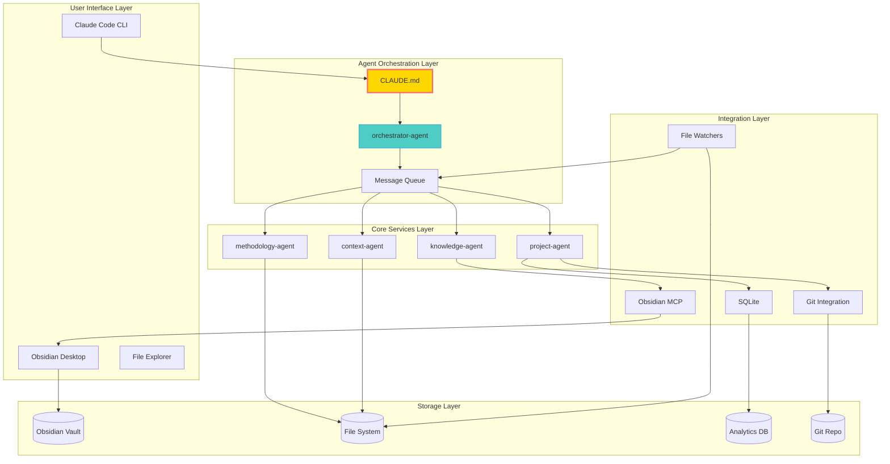

## 2. Agent Communication Flow

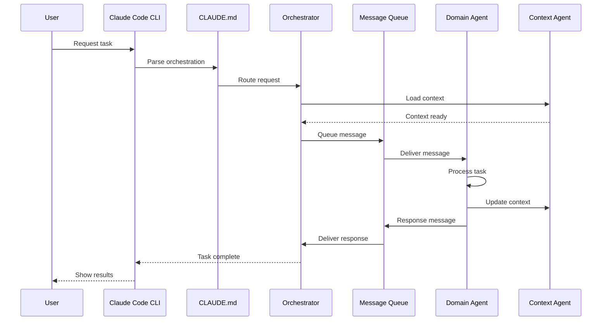

## 3. Knowledge Management Integration

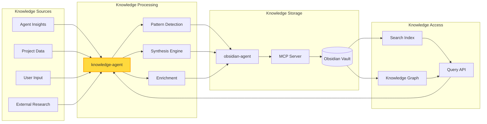

## 4. Methodology Execution Flow

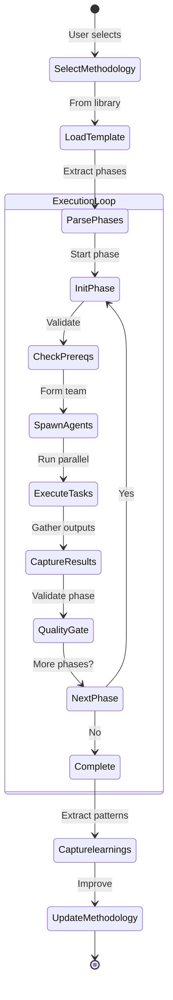

## 5. Context Management Integration

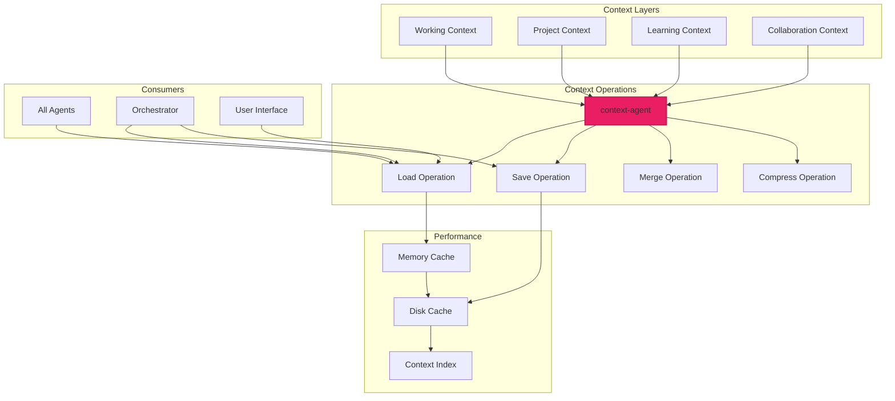

## 6. Obsidian Integration Architecture

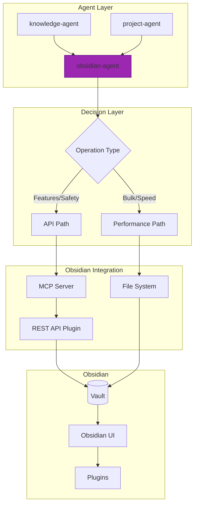

## 7. Data Flow Integration

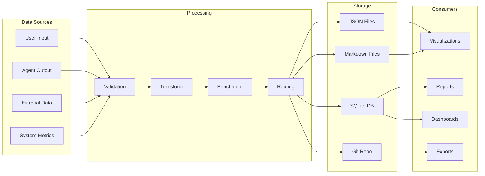

## 8. Security Integration

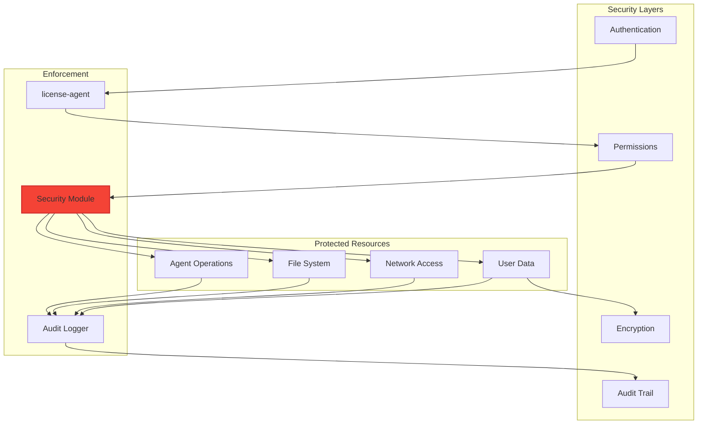

## 9. Performance Optimization Integration

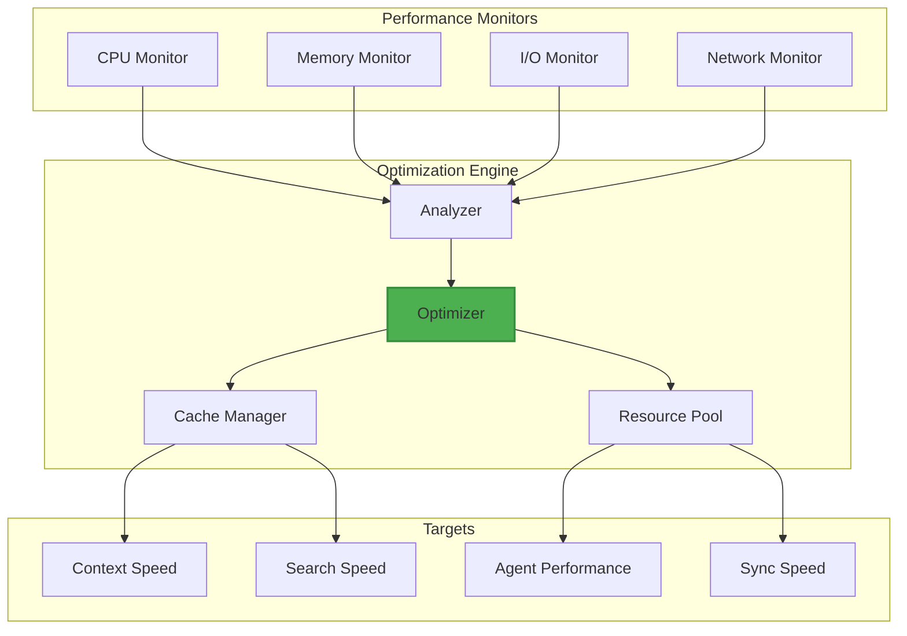

## 10. Multi-User Collaboration Integration

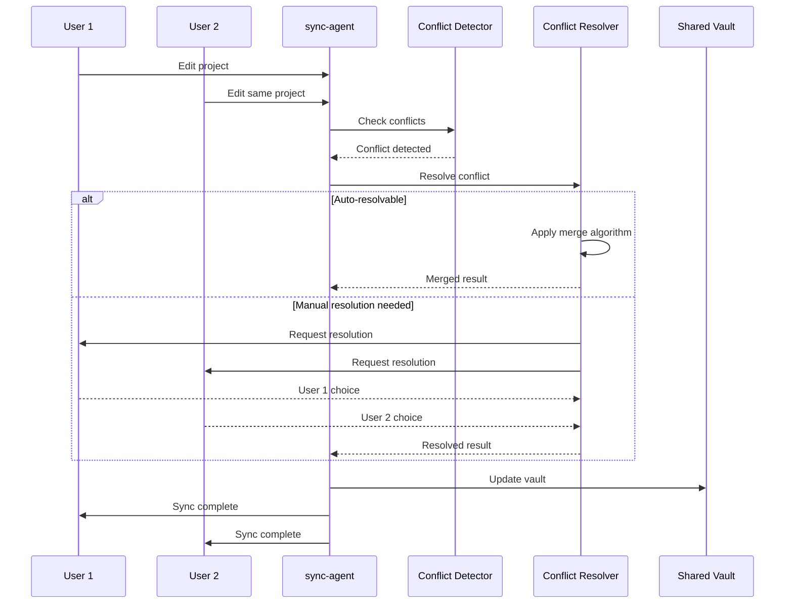

## 11. End-to-End Innovation Sprint Integration

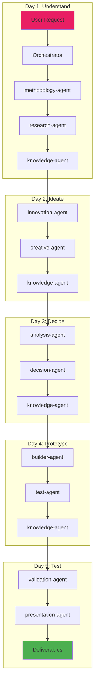

## 12. Agent Lifecycle Integration

```mermaid
stateDiagram-v2
    [*] --> Discovery: Agent file created
    Discovery --> Registration: Valid metadata
    Registration --> Available: Ready pool
    
    state "Active Lifecycle" {
        Available --> Assigned: Task received
        Assigned --> Initializing: Load context
        Initializing --> Executing: Run task
        Executing --> Completing: Finish task
        Completing --> Reporting: Update metrics
        Reporting --> Available: Return to pool
    }
    
    Available --> Updating: Self-improvement
    Updating --> Testing: Validate changes
    Testing --> Available: Re-register
    
    Available --> Hibernating: Low activity
    Hibernating --> Available: Task received
    
    Available --> Terminating: Shutdown
    Terminating --> [*]
```

## 13. Real-Time Monitoring Integration

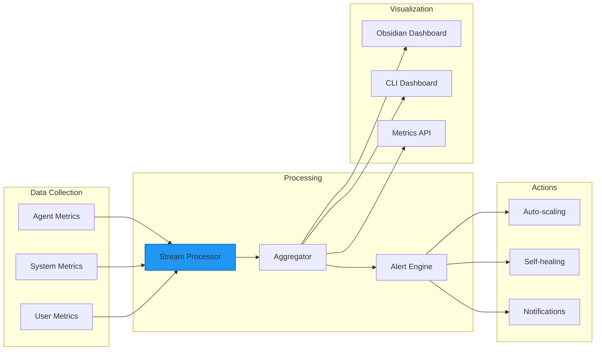

## 14. Plugin Architecture Integration

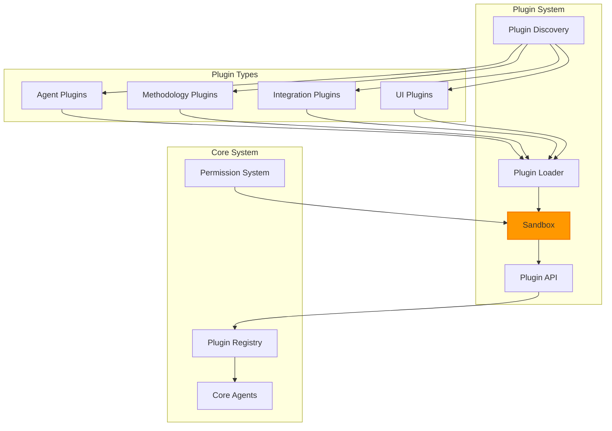

## 15. Continuous Learning Integration

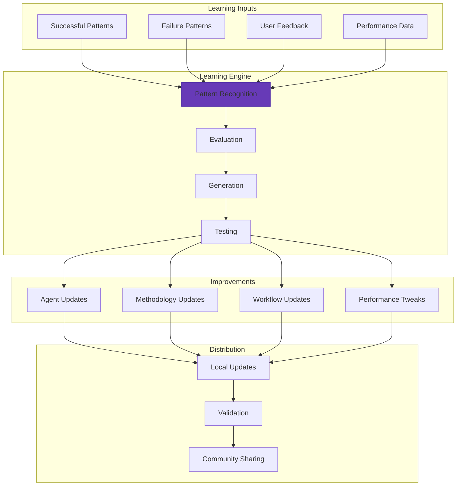

## Integration Principles

### 1. Loose Coupling
- Agents communicate via messages
- No direct dependencies
- Fallback mechanisms everywhere
- Graceful degradation

### 2. High Cohesion
- Each agent has single responsibility
- Clear interfaces
- Well-defined protocols
- Consistent patterns

### 3. Async First
- Non-blocking operations
- Message queues
- Event-driven architecture
- Promise-based APIs

### 4. Performance Aware
- Caching at every layer
- Lazy loading
- Resource pooling
- Optimization loops

### 5. Failure Resilient
- Retry mechanisms
- Circuit breakers
- Fallback strategies
- Error recovery

## Conclusion

These integration diagrams demonstrate how ClaudeProjects2 achieves seamless operation through:
- **Intelligent Orchestration**: CLAUDE.md coordinates everything
- **Clean Separation**: Each component has clear boundaries
- **Multiple Pathways**: Redundancy and fallbacks
- **Performance Focus**: Optimization at every level
- **User-Centric Design**: Everything serves the 10x goal

The architecture ensures that all components work together harmoniously while maintaining independence and resilience.