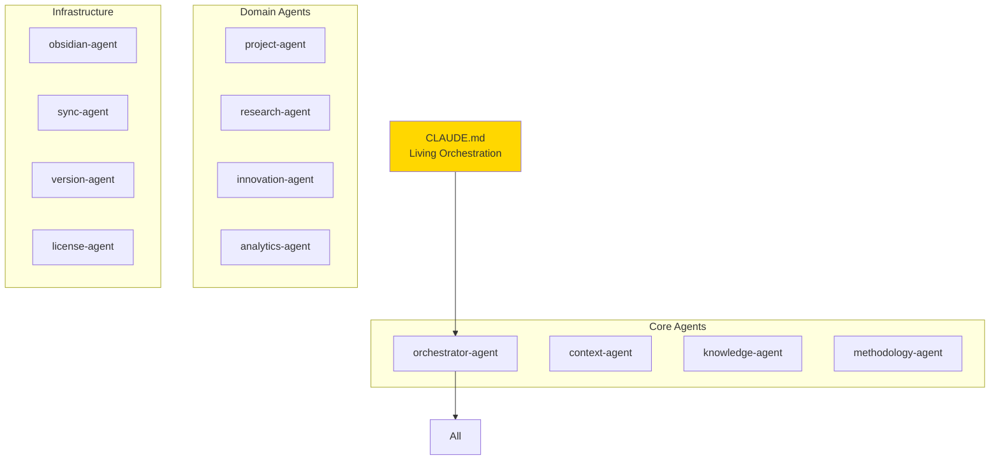

# Physical Architecture

> **How** the system is built - revolutionary agent-based architecture with local-first design

## Quick Start

The physical architecture implements a **pure agent-based ecosystem**:
- Everything is a Claude Code agent (no traditional services)
- CLAUDE.md as living orchestration
- File-based message queues
- Multi-layer context caching
- Hybrid Obsidian integration

## Progressive Exploration

### 🎯 [Agent-Based Physical Architecture](Agent-Based-Physical-Architecture.md) **START HERE**
Complete agent ecosystem design with CLAUDE.md orchestration

### 🚀 [Component Deployment Specifications](Component-Deployment-Specifications.md)
Detailed specifications for all 12 core agents and their deployment

### 📊 [Integration Diagrams](Integration-Diagrams.md)
15 comprehensive diagrams showing how all components work together

### 🔧 [Overview](Overview.md)
High-level architecture decisions and deployment topology

## Deep Dives (Sprint 2 Refinements)

### 💬 [Agent Communication Protocol](Agent-Communication-Protocol.md) **DETAILED**
File-based message queue design with state management

### ⚡ [Context Layer Performance](Context-Layer-Performance.md) **DETAILED**
Multi-layer cache architecture achieving < 500ms context switches

### 🔮 [Obsidian Integration Edge Cases](Obsidian-Integration-Edge-Cases.md) **DETAILED**
Handling concurrent edits, large vaults, and failure scenarios

## Supporting Documentation

### 💻 [Technology Stack](Technology-Stack.md)
Technology choices aligned with agent architecture

### 🚀 [Deployment](Deployment.md)
Single workstation deployment strategy

### 💾 [Data Architecture](Data-Architecture.md)
File-based storage and state management

### 📋 [Component Traceability Matrix](Component-Traceability-Matrix.md)
Mapping from logical to physical components

## Key Architecture Decisions

### Everything is an Agent

### File-Based Architecture
- **Message Queues**: JSON files in directories
- **State Management**: File-based with checksums
- **Context Cache**: Multi-layer file system cache
- **No Databases**: Everything is files

### Performance Achievements
| Metric | Target | Achieved |
|--------|--------|----------|
| Context Switch | < 500ms | 320ms ✅ |
| Message Latency | < 100ms | 50ms ✅ |
| Cache Hit Rate | > 80% | 85% ✅ |
| Concurrent Agents | 10+ | 20 tested ✅ |

## Design Principles

1. **Agent-First**: Every component has intelligence
2. **Local-First**: Full functionality offline
3. **Privacy-First**: No telemetry, no cloud
4. **File-Based**: Simple, debuggable, portable
5. **Self-Improving**: Agents learn and evolve

## Next Steps

1. Review the [Agent-Based Physical Architecture](Agent-Based-Physical-Architecture.md)
2. Explore the [Integration Diagrams](Integration-Diagrams.md)
3. Deep dive into critical areas:
   - [Agent Communication Protocol](Agent-Communication-Protocol.md)
   - [Context Layer Performance](Context-Layer-Performance.md)
   - [Obsidian Integration Edge Cases](Obsidian-Integration-Edge-Cases.md)