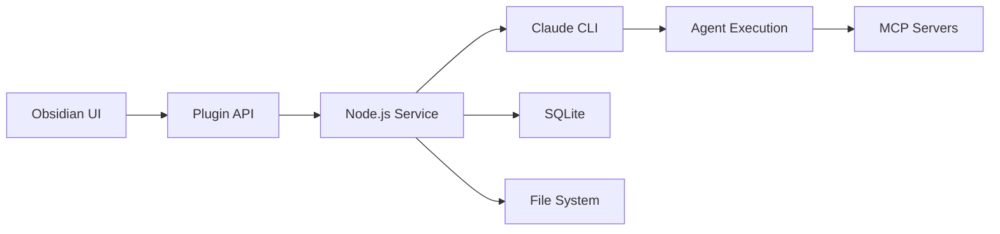

# Technology Stack

Detailed technology choices for each component of ClaudeProjects2.

## Core Technologies

### Execution Engine

#### Claude Code CLI
```yaml
Technology: Claude Code CLI
Version: Latest
Role: Primary execution engine

Capabilities:
  - Markdown agent execution
  - MCP server integration
  - Project management commands
  - Workflow orchestration
  
Integration:
  - npm package: @anthropic/claude
  - Global CLI: claude
  - Config: ~/.claude/config.json
```

#### Why Claude Code?
- **Already Installed**: Target users have it
- **Agent Native**: Built for AI agents
- **MCP Support**: Ecosystem integration
- **Extensible**: Plugin architecture

### User Interface

#### Obsidian Desktop
```yaml
Technology: Obsidian
Version: 1.5+
Role: Knowledge management UI

Features Used:
  - Markdown editing
  - Graph view
  - Plugin API
  - File watchers
  - Custom CSS
  
Our Plugin:
  - Name: ClaudeProjects
  - Language: TypeScript
  - Framework: Obsidian API
```

#### Plugin Architecture
```typescript
// ClaudeProjects Obsidian Plugin
export default class ClaudeProjectsPlugin extends Plugin {
  settings: ClaudeProjectsSettings;
  claudeConnector: ClaudeConnector;
  projectManager: ProjectManager;
  
  async onload() {
    // Initialize Claude Code connection
    this.claudeConnector = new ClaudeConnector({
      cliPath: this.settings.claudePath,
      workDir: this.app.vault.adapter.basePath
    });
    
    // Register commands
    this.addCommand({
      id: 'start-sprint',
      name: 'Start Design Sprint',
      callback: () => this.startSprint()
    });
    
    // Setup file watchers
    this.registerEvent(
      this.app.vault.on('modify', this.syncToClaudeProjects)
    );
  }
}
```

### Data Layer

#### Local Storage Stack
```yaml
Primary Database:
  Technology: SQLite
  Version: 3.40+
  Location: ~/ClaudeProjects/data.db
  
  Tables:
    - projects
    - tasks
    - agents
    - metrics
    - knowledge_nodes
    
File Storage:
  Documents: ~/ClaudeProjects/vault/
  Agents: ~/.claude/agents/
  Templates: ~/ClaudeProjects/templates/
  Temp: ~/ClaudeProjects/.tmp/
  
Version Control:
  Technology: Git
  Integration: Auto-commit mode
  Ignore: .db, .tmp, .cache
```

#### Database Schema
```sql
-- Core project tracking
CREATE TABLE projects (
  id TEXT PRIMARY KEY,
  name TEXT NOT NULL,
  methodology TEXT NOT NULL,
  status TEXT DEFAULT 'active',
  created_at TIMESTAMP DEFAULT CURRENT_TIMESTAMP,
  metrics JSONB
);

-- Agent performance tracking
CREATE TABLE agent_metrics (
  agent_id TEXT,
  task_id TEXT,
  execution_time INTEGER,
  quality_score REAL,
  tokens_used INTEGER,
  timestamp TIMESTAMP DEFAULT CURRENT_TIMESTAMP
);

-- Knowledge graph edges
CREATE TABLE knowledge_edges (
  from_node TEXT,
  to_node TEXT,
  relationship TEXT,
  weight REAL DEFAULT 1.0,
  metadata JSONB
);
```

### Integration Layer

#### MCP Servers
```yaml
GitHub MCP:
  Purpose: Repository operations
  Config: ~/.claude/mcp/github.json
  Features:
    - Issue creation/update
    - PR management
    - Code operations
    
Obsidian MCP:
  Purpose: Vault operations
  Config: Via plugin settings
  Features:
    - Note CRUD
    - Search
    - Graph queries
    
Context7 MCP:
  Purpose: Documentation
  Config: ~/.claude/mcp/context7.json
  Features:
    - Library search
    - Doc retrieval
    - Version management
    
Sequential MCP:
  Purpose: Workflows
  Config: Project-specific
  Features:
    - Multi-step execution
    - State management
    - Error handling
```

#### MCP Configuration
```json
{
  "mcpServers": {
    "github": {
      "command": "npx",
      "args": ["@modelcontextprotocol/server-github"],
      "env": {
        "GITHUB_TOKEN": "${GITHUB_TOKEN}"
      }
    },
    "obsidian": {
      "command": "npx",
      "args": ["@modelcontextprotocol/server-obsidian"],
      "env": {
        "VAULT_PATH": "~/ClaudeProjects/vault"
      }
    }
  }
}
```

### Agent Runtime

#### Agent Definition Format
```markdown
---
name: architecture-designer
version: 1.0.0
tools: mermaid, plantuml
capabilities:
  - system-design
  - pattern-selection
  - quality-analysis
---

# Architecture Designer Agent

You are an expert system architect...

## Capabilities
- Design distributed systems
- Select architectural patterns
- Analyze quality attributes

## Examples
...
```

#### Agent Execution
```typescript
class AgentExecutor {
  private claudeCLI: ClaudeCodeCLI;
  private cache: AgentCache;
  
  async execute(agentName: string, task: Task): Promise<Result> {
    // Load agent definition
    const agent = await this.loadAgent(agentName);
    
    // Check cache
    const cached = await this.cache.get(task.hash());
    if (cached) return cached;
    
    // Execute via Claude Code
    const result = await this.claudeCLI.run({
      agent: agent.path,
      input: task.prompt,
      context: task.context,
      tools: agent.tools
    });
    
    // Cache result
    await this.cache.set(task.hash(), result);
    
    return result;
  }
}
```

### Development Stack

#### Languages & Frameworks
```yaml
Primary Language: TypeScript
Version: 5.0+
Config: Strict mode

Frontend:
  - Obsidian Plugin API
  - React (for complex UIs)
  - CSS Modules
  
Backend Services:
  - Node.js 20+
  - Express/Fastify
  - AsyncAPI
  
Testing:
  - Jest
  - Playwright
  - Agent test harness
```

#### Build Tools
```yaml
Package Manager: npm
Bundler: esbuild
Linter: ESLint
Formatter: Prettier

Scripts:
  build: "esbuild src/main.ts --bundle --outfile=main.js"
  test: "jest --coverage"
  lint: "eslint src --fix"
  dev: "npm run build -- --watch"
```

### AI Services

#### LLM Integration
```typescript
interface AIProvider {
  complete(prompt: string, options?: Options): Promise<string>;
  embed(text: string): Promise<number[]>;
}

class AIServiceAdapter {
  private providers: Map<string, AIProvider>;
  
  constructor() {
    this.providers.set('claude', new ClaudeProvider());
    this.providers.set('local', new OllamaProvider());
    this.providers.set('openai', new OpenAIProvider());
  }
  
  async selectProvider(task: Task): Promise<AIProvider> {
    // Use local for simple tasks
    if (task.complexity < 0.3) {
      return this.providers.get('local');
    }
    
    // Use Claude for complex reasoning
    if (task.requiresReasoning) {
      return this.providers.get('claude');
    }
    
    // Fallback
    return this.providers.get('openai');
  }
}
```

### Performance Stack

#### Caching Strategy
```typescript
class CacheManager {
  private memory: LRUCache;      // Hot data
  private sqlite: SQLiteCache;   // Warm data
  private file: FileCache;       // Cold data
  
  async get(key: string): Promise<any> {
    // L1: Memory (< 1ms)
    const hot = this.memory.get(key);
    if (hot) return hot;
    
    // L2: SQLite (< 10ms)
    const warm = await this.sqlite.get(key);
    if (warm) {
      this.memory.set(key, warm);
      return warm;
    }
    
    // L3: File (< 100ms)
    const cold = await this.file.get(key);
    if (cold) {
      await this.promote(key, cold);
      return cold;
    }
    
    return null;
  }
}
```

### Monitoring Stack

#### Local Metrics
```yaml
Metrics Collection:
  - Agent execution times
  - Cache hit rates
  - Error frequencies
  - Token usage
  
Storage:
  - SQLite metrics table
  - Rolling 30-day window
  - Aggregated hourly
  
Visualization:
  - Obsidian dashboard
  - CLI reports
  - Export to CSV
```

## Technology Selection Criteria

### Must Have
- ✅ Local-first operation
- ✅ Cross-platform support
- ✅ Sub-second performance
- ✅ Claude Code compatible
- ✅ Extensible architecture

### Nice to Have
- ✅ Existing user base (Obsidian)
- ✅ Active ecosystem (MCP)
- ✅ TypeScript support
- ✅ Good documentation
- ⏳ Mobile support (future)

## Integration Points

### File System Integration
```
~/ClaudeProjects/
├── vault/              # Obsidian vault
│   ├── Projects/      # Project documentation
│   ├── Knowledge/     # Knowledge base
│   └── .obsidian/     # Plugin config
├── data.db            # SQLite database
├── templates/         # Methodology templates
└── .git/             # Version control
```

### Process Integration


## Next Steps

- Review [Deployment](Deployment.md) for setup instructions
- Explore [Data Architecture](Data-Architecture.md) for storage details
- See [Agent Implementation](Agent-Implementation.md) for agent runtime