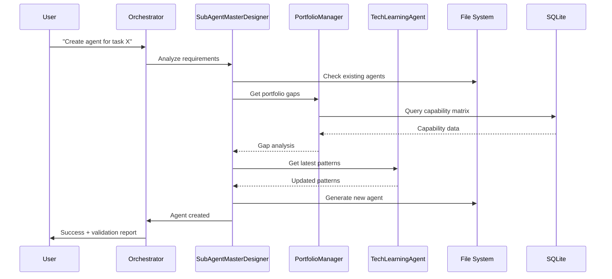

# Agent Excellence - Physical Architecture

**Created**: 2025-08-06  
**CPDM Phase**: 3 - Physical Architecture  
**Status**: Complete  
**Target**: 2-4 Week MVP Timeline

## Executive Summary

This document maps the Agent Excellence logical domains to concrete components, deployment specifications, and implementation details. The architecture leverages the existing 20-agent ecosystem in ClaudeProjects2 while introducing 5 new specialized agents to deliver agent creation, portfolio optimization, and continuous learning capabilities.

## Component Architecture Overview

```mermaid
graph TB
    subgraph "Agent Excellence System"
        subgraph "Agent Creation Components"
            SAMD[SubAgentMasterDesigner<br/>Agent]
            ALP[AgentLabProcess<br/>TypeScript Module]
            ATV[AgentTemplateValidator<br/>TypeScript Class]
        end
        
        subgraph "Portfolio Management Components"
            PM[PortfolioManager<br/>Agent]
            ACM[AgentCapabilityMapper<br/>TypeScript Service]
            ARE[AgentRecommendationEngine<br/>SQLite + TypeScript]
        end
        
        subgraph "Technology Learning Components"
            TLA[TechLearningAgent<br/>Agent]
            C7C[Context7Connector<br/>MCP Integration]
            WSI[WebSearchIntelligence<br/>TypeScript Service]
            CU[CapabilityUpdater<br/>Agent]
        end
        
        subgraph "Context Learning Components"
            CLA[ContextLearningAgent<br/>Agent]
            PHA[ProjectHistoryAnalyzer<br/>SQLite Queries]
            SAE[SituationalAwarenessEngine<br/>TypeScript Service]
        end
        
        subgraph "Validation Components"
            VA[ValidationAgent<br/>Agent]
            PMC[ProductivityMetricsCollector<br/>SQLite Service]
            RC[ROICalculator<br/>TypeScript Module]
        end
    end
    
    subgraph "Existing 20-Agent Ecosystem"
        OA[orchestrator-agent]
        MA[methodology-agent]
        KA[knowledge-agent]
        PA[project-agent]
        QA[quality-agent]
    end
    
    subgraph "Data Layer"
        FS[(File System<br/>Agent Definitions)]
        SQL[(SQLite<br/>Analytics & Metrics)]
        OBSIDIAN[(Obsidian Vault<br/>Knowledge)]
    end
    
    SAMD --> OA
    PM --> PA
    TLA --> KA
    CLA --> MA
    VA --> QA
    
    SAMD --> FS
    PM --> SQL
    TLA --> C7C
    CLA --> OBSIDIAN
```



## Domain-to-Component Mapping

### 1. Agent Creation Domain ’ Components

#### SubAgentMasterDesigner ’ Claude Code Agent
```yaml
Component: SubAgentMasterDesigner Agent
Type: claude_code_agent
Location: /agents/creation/subagent-master-designer.md
Purpose: AI-driven agent specification and creation

Capabilities:
  - Analyze task requirements for agent needs
  - Generate agent specifications
  - Create agent markdown files
  - Validate agent completeness
  
Integration:
  - Uses orchestrator-agent for delegation
  - Writes to /agents/ directory
  - Updates CLAUDE.md registry
  
Storage: Agent definitions in markdown files
Performance: < 30 seconds per agent creation
```

#### AgentLabProcess ’ TypeScript Module
```yaml
Component: AgentLabProcess
Type: typescript_service_module  
Location: /services/creation/agent-lab-process.ts
Purpose: Systematic agent development methodology

Functions:
  - validateSpecification()
  - generateTestScenarios()
  - executeValidationSuite()
  - publishToRegistry()
  
Storage: Process state in JSON files
Testing: Unit tests in /tests/creation/
Performance: < 5 seconds per validation cycle
```

#### AgentValidator ’ TypeScript Class
```yaml
Component: AgentTemplateValidator
Type: typescript_class
Location: /models/creation/agent-validator.ts
Purpose: Quality assurance for new agents

Methods:
  - validateSyntax(agentMarkdown: string)
  - checkCapabilities(spec: AgentSpec)
  - testInteractions(agent: Agent)
  - generateQualityReport()
  
Storage: Validation results in SQLite
Dependencies: Jest for testing framework
```

### 2. Portfolio Management Domain ’ Components

#### PortfolioManager ’ Claude Code Agent
```yaml
Component: PortfolioManager Agent
Type: claude_code_agent
Location: /agents/portfolio/portfolio-manager.md
Purpose: AI-driven portfolio analysis and optimization

Capabilities:
  - Analyze agent usage patterns
  - Identify capability overlaps
  - Recommend consolidations
  - Generate optimization reports
  
Data Sources:
  - Agent execution metrics (SQLite)
  - Capability definitions (file system)
  - Usage patterns (log analysis)
  
Storage: Analysis results in /portfolio-analysis/
Performance: < 2 minutes per full analysis
```

#### AgentCapabilityMapper ’ TypeScript Service
```yaml
Component: AgentCapabilityMapper
Type: typescript_service
Location: /services/portfolio/capability-mapper.ts
Purpose: Map and analyze agent capabilities

Features:
  - Parse agent markdown for capabilities
  - Build capability adjacency matrix
  - Detect overlaps and gaps
  - Generate capability visualization
  
Storage: Capability maps in JSON format
Database: Capability relationships in SQLite
Visualization: Mermaid diagrams for Obsidian
```

#### AgentRecommendationEngine ’ Hybrid Component
```yaml
Component: AgentRecommendationEngine
Type: sqlite_backed_typescript_service
Location: /services/portfolio/recommendation-engine.ts
Database: agent_recommendations table in SQLite
Purpose: Recommend optimal agents for tasks

Algorithm:
  - Task similarity analysis
  - Agent performance history
  - Capability matching
  - Load balancing considerations
  
Storage: 
  - Recommendations cache in SQLite
  - Task patterns in JSON
Performance: < 100ms per recommendation
```

### 3. Technology Learning Domain ’ Components

#### TechLearningAgent ’ Claude Code Agent
```yaml
Component: TechLearningAgent
Type: claude_code_agent
Location: /agents/learning/tech-learning-agent.md
Purpose: Monitor and apply Claude Code evolution

Capabilities:
  - Monitor Context7 MCP for updates
  - Analyze new feature announcements
  - Update agent capabilities
  - Generate learning reports
  
Triggers:
  - Daily Context7 checks
  - GitHub release notifications
  - Community discussion analysis
  
Storage: Learning updates in /learning-updates/
Performance: Background processing, < 5 minutes per update cycle
```

#### Context7Connector ’ MCP Integration
```yaml
Component: Context7Connector
Type: mcp_integration
Configuration: ~/.claude/mcp/context7.json
Purpose: Interface to Context7 documentation

Features:
  - Search Claude Code documentation
  - Retrieve version-specific guides
  - Track documentation changes
  - Cache frequently accessed content
  
Integration: Standard MCP protocol
Cache: Local file system cache
Performance: < 2 seconds per query
```

#### WebSearchIntelligence ’ TypeScript Service  
```yaml
Component: WebSearchIntelligence
Type: typescript_service
Location: /services/learning/web-search-intelligence.ts
Purpose: Monitor Claude Code community and updates

Sources:
  - GitHub repositories
  - Community forums
  - Release announcements
  - Blog posts and tutorials
  
Storage: Search results in SQLite
Processing: NLP for relevance scoring
Schedule: Daily scans, real-time for critical updates
```

#### CapabilityUpdater ’ Claude Code Agent
```yaml
Component: CapabilityUpdater
Type: claude_code_agent  
Location: /agents/learning/capability-updater.md
Purpose: Apply learned capabilities to existing agents

Process:
  1. Receive update notifications from TechLearningAgent
  2. Analyze impact on existing agents
  3. Generate update proposals
  4. Execute approved updates
  5. Validate updated agents
  
Storage: Update history in SQLite
Safety: Always backup before updates
Rollback: Automatic rollback on validation failure
```

### 4. Context Learning Domain ’ Components

#### ContextLearningAgent ’ Claude Code Agent  
```yaml
Component: ContextLearningAgent
Type: claude_code_agent
Location: /agents/learning/context-learning-agent.md  
Purpose: Learn from project history and patterns

Capabilities:
  - Analyze project outcomes
  - Identify successful patterns
  - Learn user preferences
  - Adapt agent behavior
  
Data Sources:
  - Project completion data
  - Agent performance metrics
  - User feedback scores
  - Workflow patterns
  
Storage: Learned patterns in /context-patterns/
Performance: Background learning, weekly analysis cycles
```

#### ProjectHistoryAnalyzer ’ SQLite Queries
```yaml
Component: ProjectHistoryAnalyzer
Type: sqlite_query_service
Location: /services/learning/project-history-analyzer.ts
Purpose: Extract insights from project data

Queries:
  - Success pattern detection
  - Agent effectiveness correlation
  - Timeline analysis
  - Resource utilization patterns
  
Storage: Analysis results cached in SQLite
Visualization: Charts for Obsidian dashboard
Performance: < 30 seconds per analysis
```

#### SituationalAwarenessEngine ’ TypeScript Service
```yaml
Component: SituationalAwarenessEngine
Type: typescript_service
Location: /services/learning/situational-awareness-engine.ts
Purpose: Context-aware agent behavior adaptation

Features:
  - Project context detection
  - User work pattern recognition
  - Agent recommendation adaptation
  - Performance optimization
  
Storage: Context models in JSON
Machine Learning: Simple statistical models
Performance: < 500ms per context evaluation
```

### 5. Validation & Metrics Domain ’ Components

#### ValidationAgent ’ Claude Code Agent
```yaml
Component: ValidationAgent
Type: claude_code_agent
Location: /agents/validation/validation-agent.md
Purpose: Validate agent effectiveness through self-usage

Validation Methods:
  - Self-dogfooding scenarios
  - A/B testing with different agents
  - Performance benchmarking
  - ROI calculation
  
Test Scenarios:
  - Create new agents using Agent Excellence
  - Optimize existing portfolio
  - Learn and apply new capabilities
  - Measure productivity improvements
  
Storage: Validation reports in /validation-results/
Schedule: Weekly validation cycles
```

#### ProductivityMetricsCollector ’ SQLite Service
```yaml
Component: ProductivityMetricsCollector
Type: sqlite_service
Location: /services/validation/productivity-metrics-collector.ts
Database: productivity_metrics table
Purpose: Collect and analyze productivity data

Metrics Tracked:
  - Task completion times
  - Agent usage frequency  
  - Error rates
  - User satisfaction scores
  - Code quality improvements
  
Collection: 
  - Real-time during agent execution
  - Background aggregation
  - Privacy-preserving (local only)
Performance: < 10ms per metric collection
```

#### ROICalculator ’ TypeScript Module
```yaml
Component: ROICalculator
Type: typescript_module
Location: /models/validation/roi-calculator.ts
Purpose: Calculate return on agent investment

Calculations:
  - Time savings quantification
  - Quality improvement value
  - Development cost reduction
  - Learning curve acceleration
  
Formula: ROI = (Time Saved * Hourly Rate - Development Cost) / Development Cost
Output: ROI reports with visualizations
Performance: < 1 second per calculation
```

## Integration with Existing 20-Agent Ecosystem

### Agent Orchestration Integration

```yaml
orchestrator-agent:
  new_routes:
    - "create agent" ’ SubAgentMasterDesigner
    - "optimize portfolio" ’ PortfolioManager  
    - "learn technology" ’ TechLearningAgent
    - "analyze context" ’ ContextLearningAgent
    - "validate agents" ’ ValidationAgent
    
  routing_logic:
    complexity_threshold: 7
    ai_reasoning_required: true
    delegation_patterns: existing + 5 new agents
```

### Knowledge Agent Integration

```yaml
knowledge-agent:
  new_knowledge_domains:
    - Agent Creation Patterns
    - Portfolio Optimization Strategies
    - Technology Learning History
    - Context Pattern Library
    - Validation Methodologies
    
  storage_integration:
    existing_obsidian_vault: true
    new_sections: /Agent-Excellence/
    indexing: automatic via existing patterns
```

### Project Agent Integration

```yaml
project-agent:
  enhanced_capabilities:
    - Agent-driven sprint planning
    - Portfolio-optimized task routing
    - Learning-informed estimation
    - Context-aware team formation
    
  new_workflows:
    - Agent Excellence sprints
    - Portfolio optimization cycles
    - Learning integration reviews
```

## Data Flow Architecture



## Technology Stack Specifications

### Core Technologies

#### Agent Runtime
```yaml
Primary: Claude Code CLI
Version: Latest stable
Role: Agent execution engine
Configuration: Existing CLAUDE.md orchestration

New Agent Additions:
  - 5 new agents in CLAUDE.md registry
  - Existing message queue patterns
  - Standard markdown agent format
  - MCP integration maintained
```

#### Data Storage Strategy
```yaml
Agent Definitions:
  Storage: File system (markdown)
  Location: /agents/{domain}/{agent-name}.md
  Version Control: Git (existing)
  Backup: Existing backup strategy

Analytics Data:
  Storage: SQLite (existing database)
  New Tables:
    - agent_creation_metrics
    - portfolio_analysis_results  
    - learning_updates_log
    - validation_results
    - productivity_metrics
  
Knowledge Storage:
  Storage: Obsidian vault (existing)
  New Sections:
    - /Agent-Excellence/
    - /Learning-Patterns/
    - /Portfolio-Analysis/
```

#### Integration Points
```yaml
Context7 MCP:
  Purpose: Technology learning
  Configuration: ~/.claude/mcp/context7.json
  New Usage: Daily learning scans
  
GitHub MCP:
  Purpose: Community monitoring
  Enhanced: Release tracking for Claude Code
  
Web Search:
  New Service: WebSearchIntelligence  
  APIs: To be configured (Google/Bing)
  Rate Limiting: Respectful scraping
```

### Performance Specifications

#### Response Times
```yaml
Agent Creation: < 30 seconds
Portfolio Analysis: < 2 minutes  
Technology Learning: Background (< 5 minutes)
Context Learning: Background (weekly)
Validation: < 10 seconds per test
Recommendation: < 100ms
```

#### Resource Usage
```yaml
Memory: < 200MB additional (5 agents)
Storage: < 100MB for analytics data
Network: Minimal (learning updates only)
CPU: Background processing, non-blocking
```

## Deployment Specifications

### MVP Timeline (2-4 Weeks)

#### Week 1: Foundation
```yaml
Day 1-2: SubAgentMasterDesigner Agent
  - Agent specification
  - Basic creation capabilities
  - Integration with orchestrator-agent
  
Day 3-4: AgentLabProcess Module
  - Validation framework
  - Test scenario generation
  - Quality assurance pipeline
  
Day 5: Basic Portfolio Analysis
  - Capability mapping
  - Simple overlap detection
```

#### Week 2: Core Features  
```yaml
Day 1-2: PortfolioManager Agent
  - Full portfolio analysis
  - Optimization recommendations
  - Integration with existing agents
  
Day 3-4: Technology Learning
  - TechLearningAgent
  - Context7 integration
  - Update application system
  
Day 5: Validation Framework
  - ValidationAgent
  - Metrics collection
  - ROI calculation
```

#### Week 3-4: Enhancement & Polish
```yaml
Week 3:
  - Context learning capabilities
  - Advanced analytics
  - Performance optimization
  
Week 4:
  - Full integration testing
  - Documentation completion
  - User experience refinement
```

### Deployment Strategy

#### Phase 1: Minimal Viable System
```yaml
Components:
  - SubAgentMasterDesigner Agent
  - Basic AgentLabProcess
  - Simple portfolio analysis
  
Goal: Create and validate one new agent
Success Criteria: Working agent creation pipeline
```

#### Phase 2: Portfolio Optimization
```yaml
Components:
  - PortfolioManager Agent
  - Full capability mapping
  - Recommendation engine
  
Goal: Optimize existing 20-agent portfolio
Success Criteria: 20% improvement in agent utilization
```

#### Phase 3: Learning Integration
```yaml
Components:
  - Technology learning system
  - Context learning system
  - Full validation framework
  
Goal: Self-improving agent ecosystem
Success Criteria: Automatic capability updates
```

### Infrastructure Requirements

#### Development Environment
```yaml
Prerequisites:
  - Existing ClaudeProjects2 setup
  - Claude Code CLI installed
  - Obsidian with existing vault
  - SQLite database operational
  
New Requirements:
  - Context7 MCP access
  - Web search API keys (optional)
  - Additional disk space (100MB)
```

#### Production Readiness
```yaml
Backup Strategy:
  - Agent definitions: Git version control
  - Analytics data: SQLite backups
  - Knowledge base: Obsidian sync
  
Monitoring:
  - Agent performance metrics
  - Error tracking in SQLite
  - Usage analytics dashboard
  
Security:
  - Local-first (no cloud dependencies)
  - API keys in environment variables
  - No sensitive data in agents
```

## Validation & Testing Strategy

### Component Testing
```yaml
SubAgentMasterDesigner:
  - Create test agent
  - Validate agent syntax
  - Test agent execution
  
PortfolioManager:  
  - Analyze test portfolio
  - Generate recommendations
  - Validate optimization logic
  
Learning Agents:
  - Mock technology updates
  - Test capability updates
  - Validate learning accuracy
```

### Integration Testing
```yaml
End-to-End Scenarios:
  1. User requests new agent ’ Agent created and validated
  2. Portfolio optimization ’ Recommendations applied
  3. Technology update ’ Capabilities updated
  4. Performance analysis ’ ROI calculated
  
Success Criteria:
  - All agents integrate seamlessly
  - Performance targets met
  - No existing functionality broken
```

### Self-Validation (Dogfooding)
```yaml
Validation Scenarios:
  1. Use Agent Excellence to improve itself
  2. Create new agents for missing capabilities
  3. Optimize the Agent Excellence portfolio
  4. Learn from Agent Excellence usage patterns
  
Success Metrics:
  - Agent creation time < 50% of manual
  - Portfolio optimization > 20% efficiency
  - Learning accuracy > 80%
  - Overall productivity improvement > 30%
```

## Risk Mitigation

### Technical Risks
```yaml
Agent Complexity:
  Risk: New agents too complex for maintenance
  Mitigation: Simple, focused agent designs
  
Performance Impact:
  Risk: 5 new agents slow system
  Mitigation: Background processing, caching
  
Integration Issues:
  Risk: Conflicts with existing agents
  Mitigation: Careful orchestrator integration
```

### Operational Risks
```yaml
Learning Accuracy:
  Risk: Technology learning provides bad updates
  Mitigation: Validation before application
  
Portfolio Optimization:
  Risk: Recommendations break workflows
  Mitigation: Optional recommendations, rollback capability
  
User Adoption:
  Risk: Too complex for users
  Mitigation: Simple UI, progressive disclosure
```

## Success Metrics

### Quantitative Metrics
```yaml
Agent Creation:
  - Time to create new agent < 30 seconds
  - Agent validation accuracy > 95%
  - Created agents pass all tests
  
Portfolio Optimization:
  - Agent utilization improvement > 20%
  - Capability overlap reduction > 50%
  - User satisfaction with recommendations > 80%
  
Learning System:
  - Technology updates applied within 24 hours
  - Context learning accuracy > 80%
  - Learning-driven improvements measured
  
Validation:
  - ROI > 200% within 30 days
  - Productivity improvements > 30%
  - Self-dogfooding success rate > 90%
```

### Qualitative Metrics
```yaml
User Experience:
  - Intuitive agent creation process
  - Clear portfolio optimization benefits
  - Noticeable system improvements over time
  
System Quality:
  - Reliable agent execution
  - Stable performance under load
  - Clear error messages and recovery
```

## Next Steps

### Immediate Actions (This Sprint)
1. Create SubAgentMasterDesigner agent specification
2. Implement basic AgentLabProcess module
3. Set up SQLite tables for analytics
4. Update orchestrator-agent routing
5. Create initial test scenarios

### Sprint Planning Integration
- Add Agent Excellence tasks to current sprint backlog
- Allocate development resources
- Set up progress tracking in GitHub issues
- Schedule demo for Sprint 6 completion

### Long-term Roadmap
- Mobile agent management (future)
- Cloud-based learning sharing (optional)
- Advanced AI models integration
- Community agent marketplace

---

*Physical Architecture Document - CPDM Phase 3*  
*Agent Excellence System*  
*Target: 2-4 Week MVP*  
*Integration: Existing 20-Agent Ecosystem*