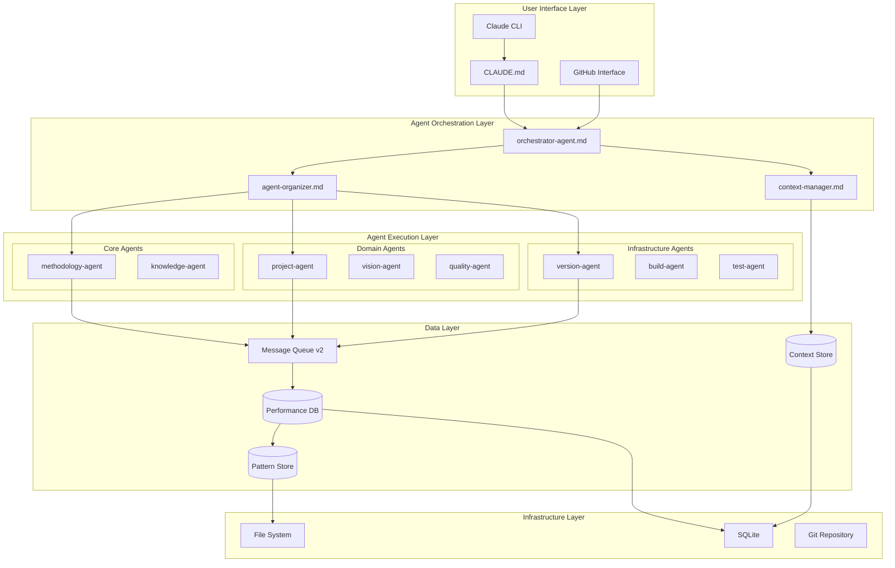

# Physical Architecture: Sub-Agent Alignment System

**Feature**: sub-agent-alignment
**Phase**: Decision
**Created**: 2025-08-06
**Epic**: #55
**ADR**: ADR-025

## Deployment Architecture

### System Components



## Component Specifications

### 1. Context Manager (`/agents/core/context-manager.md`)
**Technology**: Claude Code Agent (Markdown + YAML)
**Storage**: SQLite database at `/.cpdm/context/contexts.db`
**Interface**: File-based message queue

**Implementation**:
```yaml
---
name: context-manager
type: core
capabilities:
  - context-persistence
  - context-inheritance
  - checkpoint-management
  - recovery-operations
tools:
  - sqlite3
  - file-operations
---
```

**Database Schema**:
```sql
CREATE TABLE contexts (
    id TEXT PRIMARY KEY,
    task_id TEXT NOT NULL,
    parent_id TEXT,
    state TEXT NOT NULL,
    checkpoint TEXT,
    created_at TIMESTAMP,
    updated_at TIMESTAMP
);

CREATE TABLE context_events (
    id INTEGER PRIMARY KEY,
    context_id TEXT NOT NULL,
    event_type TEXT NOT NULL,
    data TEXT,
    timestamp TIMESTAMP
);
```

### 2. Agent Organizer (`/agents/core/agent-organizer.md`)
**Technology**: Claude Code Agent
**Configuration**: `/.cpdm/config/agent-capabilities.json`
**Patterns**: `/.cpdm/patterns/team-templates.yaml`

**Capability Registry**:
```json
{
  "agents": [
    {
      "id": "code-review-agent",
      "capabilities": ["code-analysis", "quality-checks"],
      "performance": {
        "success_rate": 0.95,
        "avg_time": 2300
      }
    }
  ]
}
```

### 3. Performance Tracker (`/scripts/agent-performance-tracker.sh`)
**Technology**: Bash script with SQLite backend
**Database**: `/.cpdm/metrics/performance.db`
**Dashboard**: `/.cpdm/dashboard/index.html`

**Metrics Collection**:
```bash
#!/bin/bash
# Record execution metrics
record_metric() {
    local agent_id=$1
    local task_id=$2
    local duration=$3
    local status=$4
    
    sqlite3 $PERF_DB <<EOF
    INSERT INTO executions (agent_id, task_id, duration, status, timestamp)
    VALUES ('$agent_id', '$task_id', $duration, '$status', datetime('now'));
EOF
}
```

### 4. Message Queue v2 (`/scripts/message-queue-v2.sh`)
**Technology**: File-based queue with priority routing
**Directory**: `/.claudeprojects/messages/`
**Format**: JSON with metadata

**Message Structure**:
```json
{
  "id": "msg-12345",
  "from": "orchestrator-agent",
  "to": "context-manager",
  "priority": "high",
  "context_id": "ctx-67890",
  "payload": {},
  "timestamp": "2025-08-06T15:00:00Z"
}
```

### 5. CLAUDE.md Transformation
**From**: Static routing rules
**To**: Dynamic capability queries

**New Structure**:
```markdown
## Intelligent Task Orchestration

### Agent Discovery
```bash
# Find agents by capability
./scripts/agent-query.sh --capability "code-review"

# Get agent performance
./scripts/agent-performance.sh --agent "test-agent"

# Suggest team for task
./scripts/suggest-team.sh "Review and deploy changes"
```

### Dynamic Routing
- Natural language → agent-organizer
- Capability matching → best agents
- Performance-based selection
- Automatic fallback chains
```

## File System Layout

```
ClaudeProjects2/
├── agents/
│   ├── core/
│   │   ├── orchestrator-agent.md
│   │   ├── context-manager.md (NEW)
│   │   └── agent-organizer.md (NEW)
│   ├── domain/
│   └── infrastructure/
├── scripts/
│   ├── agent-performance-tracker.sh (ENHANCED)
│   ├── agent-query.sh (NEW)
│   ├── suggest-team.sh (NEW)
│   └── agent-dashboard.sh (NEW)
├── .cpdm/
│   ├── context/
│   │   └── contexts.db (NEW)
│   ├── metrics/
│   │   └── performance.db (NEW)
│   ├── patterns/
│   │   └── team-templates.yaml (NEW)
│   └── config/
│       └── agent-capabilities.json (NEW)
└── .claudeprojects/
    └── messages/
        └── [queue files]
```

## Integration Points

### GitHub Integration
- Issues linked to tasks
- PR checks use quality-agent
- Metrics pushed to GitHub Actions

### Obsidian Integration
- Patterns stored as notes
- Performance insights as reports
- Learning outcomes documented

### CPDM Integration
- Phases use appropriate agent teams
- Quality gates leverage quality-agent
- Approvals tracked in context

## Performance Requirements

### Response Times
| Operation | Target | Maximum |
|-----------|--------|----------|
| Agent Selection | 200ms | 500ms |
| Context Creation | 20ms | 50ms |
| Context Retrieval | 10ms | 30ms |
| Team Composition | 300ms | 800ms |
| Pattern Matching | 100ms | 300ms |

### Throughput
| Metric | Target | Minimum |
|--------|--------|---------|
| Concurrent Tasks | 100 | 50 |
| Messages/Second | 1000 | 500 |
| Agents Active | 50 | 25 |
| Contexts/Hour | 10000 | 5000 |

### Resource Limits
| Resource | Limit | Alert Threshold |
|----------|-------|----------------|
| Context DB Size | 1GB | 800MB |
| Performance DB | 500MB | 400MB |
| Message Queue | 10000 | 8000 |
| Memory per Agent | 100MB | 80MB |

## Security Considerations

### Access Control
- Agents verify capability permissions
- Context access based on task ownership
- Audit log for all operations

### Data Protection
- Contexts encrypted at rest
- Sensitive data masked in logs
- Secure message passing

### Compliance
- GDPR-compliant data handling
- Audit trail retention (90 days)
- Right to deletion supported

## Deployment Strategy

### Sprint 8: Foundation
Week 1 Deployment:
1. Deploy context-manager.md
2. Update all agents with capabilities
3. Deploy enhanced message queue
4. Update CLAUDE.md
5. Baseline performance metrics

### Sprint 9: Intelligence
Week 2 Deployment:
1. Deploy agent-organizer.md
2. Activate task decomposition
3. Enable team composition
4. Deploy collaboration patterns
5. Begin pattern collection

### Sprint 10: Optimization
Week 3 Deployment:
1. Activate performance tracking
2. Deploy recovery patterns
3. Enable learning system
4. Launch monitoring dashboard
5. Full system activation

## Rollback Plan

### Feature Flags
```bash
# Enable/disable features
export ENABLE_CONTEXT_MANAGER=true
export ENABLE_AGENT_ORGANIZER=false
export ENABLE_PERFORMANCE_TRACKING=false
export USE_LEGACY_ROUTING=true
```

### Rollback Steps
1. Set USE_LEGACY_ROUTING=true
2. Disable new agents
3. Restore original CLAUDE.md
4. Clear context database
5. Revert to message-queue v1

## Monitoring and Alerts

### Key Metrics
- Context consistency rate
- Agent success rate
- Task completion time
- Error recovery rate
- System resource usage

### Alert Thresholds
- Context loss > 1%
- Agent failure > 10%
- Response time > 5s
- Queue depth > 8000
- Memory usage > 80%

### Dashboard Access
```bash
# Launch monitoring dashboard
./scripts/agent-dashboard.sh

# View real-time metrics
http://localhost:8080/dashboard
```

## Testing Strategy

### Unit Tests
- Each agent tested independently
- Context operations validated
- Pattern matching verified

### Integration Tests
- Multi-agent workflows
- Context inheritance chains
- Recovery scenarios

### Performance Tests
- Load testing (1000 concurrent tasks)
- Stress testing (resource limits)
- Endurance testing (24-hour run)

### Acceptance Tests
- User scenarios from vision
- CPDM workflow validation
- GitHub integration checks

## Success Criteria

### Technical Metrics
- [ ] Context consistency: 99.9%
- [ ] Agent coordination: < 500ms
- [ ] Task success rate: > 95%
- [ ] Zero regression in existing features
- [ ] All tests passing

### Business Metrics
- [ ] Development velocity: +40%
- [ ] User satisfaction: > 4.5/5
- [ ] Support tickets: -50%
- [ ] Time to market: -30%

## Documentation

### Technical Documentation
- Architecture diagrams
- API specifications
- Database schemas
- Integration guides

### User Documentation
- Migration guide
- New features guide
- Best practices
- Troubleshooting

### Operations Documentation
- Deployment procedures
- Monitoring setup
- Alert response
- Rollback procedures

---

**Status**: Ready for PM approval
**Next Step**: Approve to proceed to Implementation phase
**Command**: `./scripts/cpdm-workflow-engine.sh approve sub-agent-alignment decision`