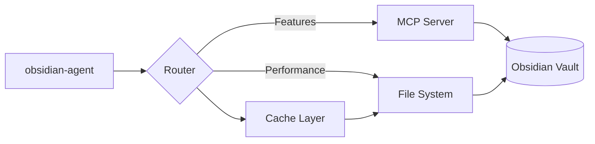

# ADR-004: Hybrid Obsidian Integration Strategy

**Status**: Accepted  
**Date**: 2025-08-05  
**Decision Makers**: Architecture Team  
**Related Issues**: #23, #24, #25

## Context

Obsidian integration is critical for ClaudeProjects2's knowledge management. We evaluated three approaches:

1. **MCP Server Only**: Use Obsidian's API via MCP server
2. **File System Only**: Direct file manipulation
3. **Hybrid**: MCP for features, file system for performance

### Trade-offs Identified
- MCP provides rich features but has latency
- File system is fast but lacks Obsidian-specific features
- Large vaults (10K+ notes) need performance optimization
- Real-time sync requires file system watchers

## Decision

We will implement a **hybrid integration strategy**:

1. Use MCP server for Obsidian-specific features
2. Use file system for performance-critical operations
3. Intelligent routing based on operation type
4. Graceful fallback when MCP unavailable
5. Cache layer for frequent operations

## Consequences

### Positive
- **Best of Both**: Features AND performance
- **Resilient**: Works even if MCP fails
- **Scalable**: Handles large vaults efficiently
- **Flexible**: Can optimize per operation
- **Future-Proof**: Can adapt as APIs evolve

### Negative
- **Complexity**: Two code paths to maintain
- **Consistency**: Must sync between approaches
- **Testing**: More scenarios to cover
- **Debugging**: Issues could be in either path

### Neutral
- Requires intelligent routing logic
- Need to monitor MCP health
- Cache invalidation complexity

## Implementation

### Decision Matrix
```typescript
interface OperationRouter {
  // Use MCP for:
  - Graph queries and backlinks
  - Plugin-specific operations  
  - Metadata-rich searches
  - Template operations
  
  // Use File System for:
  - Bulk note creation/updates
  - Large file operations
  - Simple note reads
  - Performance-critical paths
  
  // Use Hybrid for:
  - Search (index + MCP)
  - Note creation (FS + MCP notify)
  - Sync operations
}
```

### Architecture


### Routing Logic
```typescript
async function routeOperation(op: Operation): Promise<Result> {
  // Check cache first
  if (op.cacheable) {
    const cached = await cache.get(op.key);
    if (cached) return cached;
  }
  
  // Route based on operation type
  switch (op.type) {
    case 'bulk_write':
    case 'large_file':
    case 'simple_read':
      return fileSystemPath(op);
      
    case 'graph_query':
    case 'template_apply':
    case 'plugin_operation':
      return mcpPath(op);
      
    case 'search':
    case 'create_note':
      return hybridPath(op);
      
    default:
      // Intelligent fallback
      return mcpHealthy ? mcpPath(op) : fileSystemPath(op);
  }
}
```

## Performance Targets

### Operation Benchmarks
| Operation | MCP Only | FS Only | Hybrid |
|-----------|----------|---------|--------|
| Single Note Read | 50ms | 5ms | 5ms |
| Bulk Write (100) | 5000ms | 200ms | 250ms |
| Graph Query | 100ms | N/A | 100ms |
| Search (10K vault) | 500ms | 2000ms | 150ms |

## Failure Handling

### MCP Server Failures
```typescript
class MCPFallback {
  async execute(operation: Operation) {
    try {
      return await mcp.execute(operation);
    } catch (e) {
      if (this.isMCPError(e)) {
        logger.warn('MCP failed, using fallback', e);
        return await this.fallback(operation);
      }
      throw e;
    }
  }
  
  fallback(operation: Operation) {
    switch (operation.type) {
      case 'graph_query':
        return this.fileSystemGraphQuery(operation);
      case 'search':
        return this.fileSystemSearch(operation);
      default:
        return this.fileSystemGeneric(operation);
    }
  }
}
```

## Monitoring

### Health Checks
```typescript
interface IntegrationHealth {
  mcpStatus: 'healthy' | 'degraded' | 'offline';
  fileSystemStatus: 'healthy' | 'slow' | 'error';
  cacheHitRate: number;
  operationRouting: {
    toMCP: number;
    toFS: number;
    hybrid: number;
  };
  failoverCount: number;
}
```

## Alternatives Considered

### 1. MCP-Only Approach
- Simpler implementation
- Rejected: Performance issues with large vaults

### 2. File System-Only Approach  
- Maximum performance
- Rejected: Loses Obsidian-specific features

### 3. Build Custom Obsidian Plugin
- Direct integration
- Rejected: Maintenance burden, platform lock-in

## References

- [Obsidian MCP Server docs](https://github.com/modelcontextprotocol/servers)
- Performance benchmarks from testing
- [Obsidian Integration Edge Cases](../03-physical-architecture/Obsidian-Integration-Edge-Cases.md)

## Review

Review after 30 days of production use to analyze routing patterns and optimization opportunities.