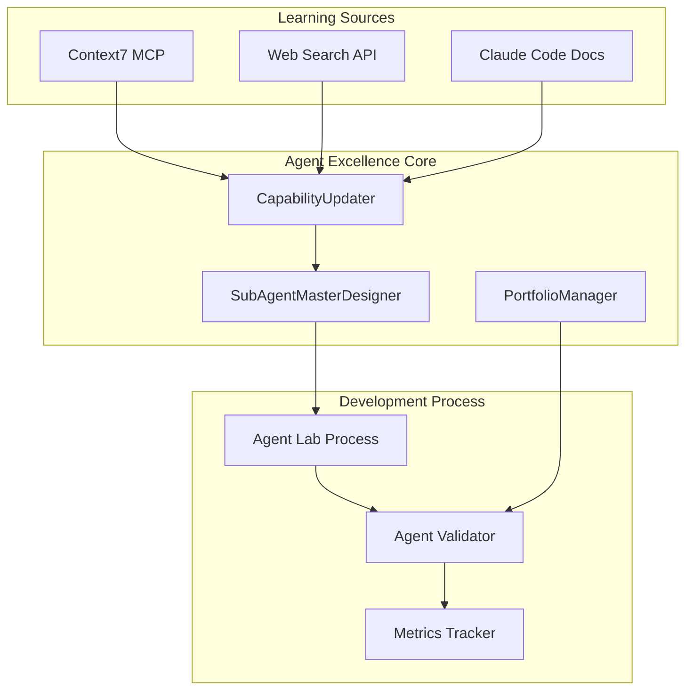

# ADR-024: Agent Excellence System Architecture

## Status
Accepted

## Context

Our current agent ecosystem faces fundamental development and management limitations that create a **productivity ceiling** and **technology knowledge gap**:

### Current Agent Development Challenges
1. **Manual Agent Creation**: No systematic process for creating specialized agents when needs arise
2. **Agent Portfolio Chaos**: Overlapping capabilities across 20+ agents with unclear consolidation strategy
3. **Technology Knowledge Gap**: Agents lack access to latest Claude Code features, documentation, and community insights
4. **Static Agent Behavior**: No learning from project history or situational patterns
5. **No Validation Process**: Cannot prove agents deliver actual developer productivity gains
6. **Slow Development Cycles**: Current agent creation takes months instead of weeks

### Business Impact
- **Developer Productivity Bottleneck**: Manual agent development limits rapid response to new needs
- **Portfolio Management Chaos**: Unclear which agents to use, significant overlap, consolidation paralysis
- **Technology Lag**: Agents fall behind Claude Code evolution, becoming less effective over time
- **Unproven ROI**: Cannot demonstrate concrete productivity gains from agent investment

### Current State vs Vision Gap
- **Current**: 5x productivity gains with static agents
- **Vision Target**: 15x productivity gains with intelligent, learning agents
- **Gap**: Need systematic approach to agent intelligence and continuous improvement

## Decision

Implement **Agent Excellence System** through three integrated approaches:

### 1. SubAgentMasterDesigner + Agent Lab Process
- **SubAgentMasterDesigner**: Meta-agent that systematically creates specialized agents
- **Agent Lab Process**: Structured methodology for agent development, testing, and validation
- **Template-Driven Creation**: Reusable patterns reducing development overhead
- **Rapid Iteration**: 2-4 week agent development cycles vs current months

### 2. Agent Portfolio Management
- **Portfolio Manager Agent**: Analyzes and optimizes agent ecosystem
- **Capability Mapping**: Identifies overlaps and consolidation opportunities
- **Recommendation Engine**: Suggests optimal agent for specific tasks
- **Strategic Evolution**: Planned agent retirement and enhancement pathways

### 3. Continuous Learning Architecture
- **Technology-Triggered Learning (Priority 1)**: Real-time capability updates via Context7 + Web Search
- **Context Learning (Priority 2)**: Project history analysis and situational awareness

## Technology Choices

### Core Technologies
```yaml
meta_agent_platform:
  runtime: Claude Code CLI
  format: Markdown with YAML frontmatter
  deployment: Project-level .claude/agents/

learning_integration:
  context7_mcp: 
    purpose: Real-time Claude Code documentation access
    priority: 1
    integration: Direct MCP server connection
  
  web_search:
    purpose: Latest Claude Code community insights
    priority: 1  
    integration: Web search API with forum monitoring
    
  documentation_tracking:
    purpose: Claude Code docs/forums update detection
    storage: File-based change tracking
    trigger: Automated capability updates

storage_architecture:
  agent_specifications: Markdown files with YAML metadata
  portfolio_data: JSON files for capability mapping
  learning_data: SQLite for analytics, JSON for state
  metrics_data: File-based + SQLite for time-series

development_methodology:
  lab_process: Structured agent creation workflow
  validation: Self-usage measurement before external deployment
  iteration: 2-4 week development cycles
  quality: Automated testing and validation
```

### Integration Architecture


## Rationale

### Why SubAgentMasterDesigner Approach
1. **Systematic Creation**: Eliminates ad-hoc agent development
2. **Knowledge Reuse**: Templates and patterns accelerate development
3. **Quality Consistency**: Standardized creation process ensures reliability
4. **Rapid Response**: Can create specialized agents as needs emerge

### Why Portfolio Management Focus  
1. **Eliminate Confusion**: Clear capability mapping reduces user uncertainty
2. **Optimize Resources**: Consolidate overlapping agents
3. **Strategic Evolution**: Planned approach to agent ecosystem growth
4. **Usage Intelligence**: Data-driven recommendations for agent selection

### Why Technology-Triggered Learning (Priority 1)
1. **Currency**: Agents automatically stay current with Claude Code evolution
2. **Capability Expansion**: New platform features become available immediately
3. **Community Intelligence**: Learn from broader Claude Code community insights
4. **Reduced Maintenance**: Automated updates vs manual agent maintenance

### Why Context7 + Web Search Integration
1. **Real-time Access**: Context7 provides immediate documentation access
2. **Community Insights**: Web search captures forum discussions and best practices
3. **Proven Technology**: Leverages existing MCP infrastructure
4. **Scalable**: Can expand to other learning sources as needed

## Consequences

### Positive
-  **15x Productivity Target**: Systematic approach to reaching productivity vision
-  **Rapid Agent Creation**: 2-4 week development cycles vs months
-  **Technology Currency**: Agents automatically stay current with platform evolution
-  **Portfolio Clarity**: Eliminates confusion through systematic capability mapping
-  **Validated Effectiveness**: Self-usage measurement proves actual value
-  **Competitive Advantage**: First-mover advantage with intelligent agent systems
-  **Scalable Architecture**: Framework supports continuous agent ecosystem growth
-  **Knowledge Compound**: Learning accumulates across projects and time

### Negative
-   **Implementation Complexity**: Requires coordination across multiple domains and technologies
-   **Dependency Risk**: Relies on Context7 and Web Search API availability
-   **Development Investment**: Requires 2-4 weeks of focused development time
-   **Learning Curve**: Team must adopt new methodologies and processes
-   **Storage Growth**: Learning data and metrics will accumulate over time
-   **Validation Requirement**: Must prove effectiveness through self-usage before broader deployment

### Risk Mitigation
- **Phased Implementation**: Technology-Triggered Learning first, Context Learning second
- **Fallback Strategy**: Maintain current agent system during transition
- **MVP Validation**: Prove core concepts before full investment
- **Documentation**: Comprehensive guides for team adoption

## Implementation Plan

### Phase 1: Foundation (Weeks 1-2)
-  Vision and logical architecture complete
-  Create SubAgentMasterDesigner core agent
-  Implement basic Agent Lab Process
-  Establish Context7 MCP integration

### Phase 2: Technology Learning (Weeks 2-3)  
-  Implement Web Search intelligence
-  Create CapabilityUpdater system
-  Build documentation change detection
-  Test technology-triggered learning cycle

### Phase 3: Portfolio Management (Weeks 3-4)
-  Create PortfolioManager agent
-  Implement capability mapping system
-  Build agent recommendation engine
-  Identify initial consolidation opportunities

### Phase 4: Validation (Week 4)
-  Implement productivity metrics collection
-  Create self-usage validation system
-  Measure baseline productivity for comparison
-  Demonstrate first specialized agent creation via Lab Process

## Success Criteria

### MVP Delivery (2-4 Weeks)
- [ ] Functional SubAgentMasterDesigner creating first specialized agent
- [ ] Agent Lab Process validated through actual agent creation
- [ ] Context7 + Web Search integration providing real-time updates
- [ ] Portfolio analysis identifying consolidation opportunities

### Self-Usage Validation (Within MVP Period)
- [ ] Measurable productivity improvement in our own development
- [ ] Successfully created specialized agent through Lab Process
- [ ] Demonstrated technology learning in action
- [ ] Team adoption of new agent creation methodology

### Strategic Objectives
- [ ] Path to 15x productivity gains clearly established
- [ ] Technology currency problem solved through automated learning
- [ ] Agent portfolio chaos resolved through systematic management
- [ ] Validated ROI through measured self-usage improvement

---
*Date: 2025-08-06*
*Sprint: 7*  
*Decision: Implement Agent Excellence through SubAgentMasterDesigner + Technology-Triggered Learning + Portfolio Management*