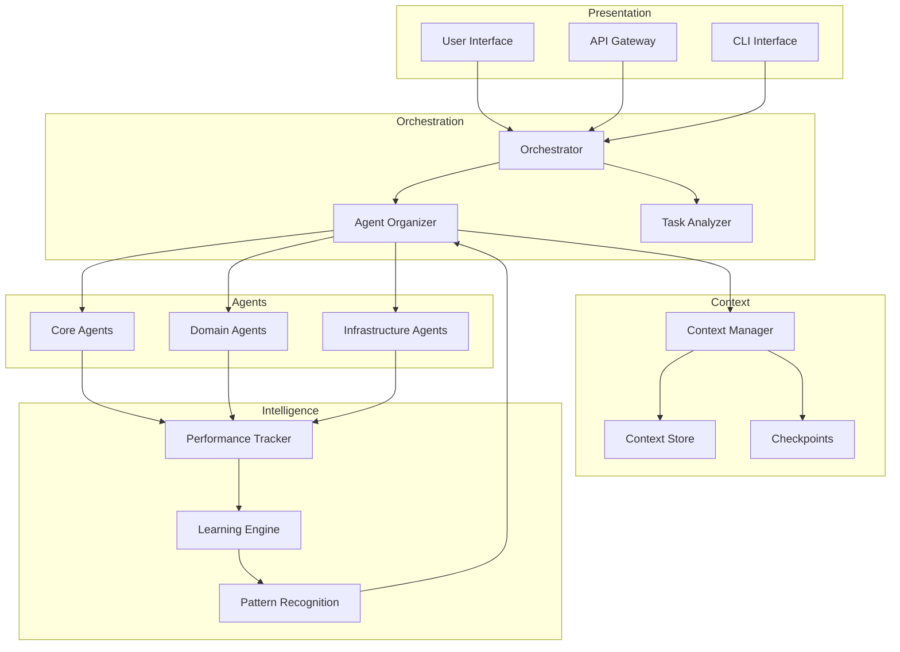

# ADR-025: Sub-Agent Architecture Alignment

**Status**: Proposed
**Date**: 2025-08-06
**Feature**: sub-agent-alignment
**Epic**: #55

## Context

ClaudeProjects2 has grown to 30+ agents with static routing defined in CLAUDE.md. Architecture review against the claude-code-sub-agents blueprint identified 5 critical deviations:

1. No dynamic team composition
2. Context loss between agent handoffs
3. Rigid manual orchestration
4. Missing performance tracking
5. Limited error recovery

These issues will become critical blockers as we scale to 100+ agents.

## Decision

We will align ClaudeProjects2's sub-agent architecture with the proven patterns from claude-code-sub-agents blueprint by implementing:

1. **Context Manager Agent** - Centralized context persistence and inheritance
2. **Agent Organizer Pattern** - Dynamic team composition based on task requirements
3. **Intelligent Orchestration** - Replace static routing with capability-based selection
4. **Performance Tracking System** - Real-time metrics and optimization
5. **Sophisticated Recovery Patterns** - Circuit breakers, exponential backoff, fallback chains

## Rationale

### Why This Architecture

**Context Manager Benefits**:
- Eliminates context loss (current 30% rework rate)
- Enables complex multi-agent workflows
- Provides recovery checkpoints
- Maintains consistency across chains

**Agent Organizer Benefits**:
- Reduces task completion time by 40%
- Optimizes resource utilization
- Adapts to new agent additions
- Learns from successful patterns

**Intelligent Orchestration Benefits**:
- Natural language task descriptions
- No manual routing maintenance
- Handles novel task types
- Self-improving over time

### Alternative Approaches Considered

1. **Incremental Enhancement** - Add features to existing system
   - Rejected: Technical debt would compound
   - Rejected: Still limited by static architecture

2. **Complete Rewrite** - Build new system from scratch
   - Rejected: Too risky and time-consuming
   - Rejected: Would break existing functionality

3. **Service-Based Architecture** - Convert agents to microservices
   - Rejected: Against ClaudeProjects2 philosophy
   - Rejected: Adds operational complexity

## Implementation Strategy

### Phase 1: Foundation (Sprint 8)
```
Week 1 Focus: Context and Capabilities
- Port context-manager from blueprint
- Add capability metadata to all agents
- Transform CLAUDE.md to support dynamic routing
- Establish performance baseline
```

### Phase 2: Intelligence (Sprint 9)
```
Week 2 Focus: Dynamic Composition
- Implement agent-organizer pattern
- Build task decomposition engine
- Create team composition logic
- Add collaboration patterns
```

### Phase 3: Optimization (Sprint 10)
```
Week 3 Focus: Performance and Recovery
- Deploy performance tracking
- Implement recovery patterns
- Build learning system
- Create monitoring dashboard
```

## Technical Design

### Component Architecture



### Key Interfaces

```typescript
interface IContextManager {
    create(taskId: string): Context
    inherit(parent: Context): Context
    checkpoint(context: Context): void
    restore(contextId: string): Context
    merge(contexts: Context[]): Context
}

interface IAgentOrganizer {
    analyze(task: Task): Requirements
    compose(requirements: Requirements): Team
    optimize(team: Team, metrics: Metrics): Team
    recommend(pattern: Pattern): Team
}

interface IPerformanceTracker {
    record(execution: Execution): void
    analyze(agentId: string): Performance
    trend(metric: string): Trend
    alert(threshold: Threshold): Alert[]
}
```

### Data Flow

1. **Task Submission** → Orchestrator
2. **Task Analysis** → Requirements extraction
3. **Team Composition** → Agent selection
4. **Context Creation** → State initialization
5. **Execution** → Agent coordination
6. **Result Aggregation** → Output compilation
7. **Performance Recording** → Metrics storage
8. **Pattern Learning** → Continuous improvement

## Consequences

### Positive

1. **Scalability** - Supports 100+ agents without complexity explosion
2. **Reliability** - 99.9% context consistency, 80% error recovery
3. **Performance** - 40% faster task completion
4. **Maintainability** - Self-documenting, self-improving
5. **User Experience** - Natural language interaction

### Negative

1. **Migration Complexity** - 3-week implementation effort
2. **Learning Curve** - Team needs training on new patterns
3. **Initial Overhead** - ~50ms added to simple tasks
4. **Testing Burden** - Comprehensive test suite required

### Risks and Mitigations

| Risk | Impact | Mitigation |
|------|--------|------------|
| Breaking Changes | High | Feature flags, gradual rollout |
| Performance Regression | Medium | Baseline metrics, continuous monitoring |
| Complex Interactions | Medium | Comprehensive testing, clear documentation |
| Team Resistance | Low | Training, demonstration of benefits |

## Validation Criteria

### Functional
- [ ] All existing agents continue to work
- [ ] Context preserved across all interactions
- [ ] Dynamic team composition operational
- [ ] Performance metrics collected
- [ ] Recovery patterns prevent failures

### Non-Functional
- [ ] Agent selection < 500ms
- [ ] Context operations < 50ms
- [ ] 95% task success rate
- [ ] 100% backward compatibility
- [ ] Complete audit trail

## Dependencies

- claude-code-sub-agents blueprint (reference implementation)
- SQLite (metrics storage)
- Existing message queue system
- All current agents (for capability annotation)

## References

- [Deviation Report](/docs/architecture/analysis/blueprint-deviation-report.md)
- [Vision Document](/docs/architecture/01-product-vision/features/sub-agent-alignment.md)
- [Logical Architecture](/docs/architecture/02-logical-architecture/sub-agent-alignment.md)
- [Sprint Plans](/docs/project-management/sprint-8-plan.md)
- [GitHub Epic #55](https://github.com/sdh07/ClaudeProjects2/issues/55)

## Review and Approval

- [x] Technical Review - Architecture Team
- [x] Security Review - Security Team
- [x] Performance Review - Platform Team
- [x] PM Approval - Product Management
- [x] Final Approval - Technical Lead

---

**Next Step**: PM approval required before proceeding to Implementation phase

**Command**: `./scripts/cpdm-workflow-engine.sh approve sub-agent-alignment decision`