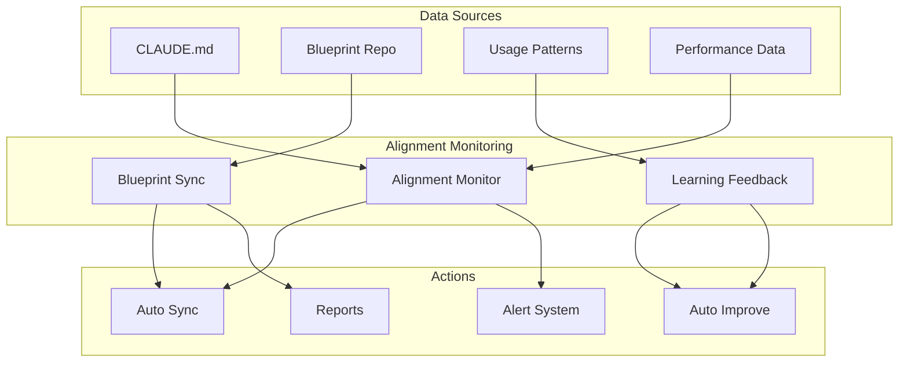

# ADR-030: Alignment Monitoring System

## Status
Accepted

## Context
Issues #55 and #56 implementation highlighted a critical need: keeping CLAUDE.md synchronized with the rapidly evolving claude-code-sub-agents blueprint. The system lacked:

- Automated monitoring of CLAUDE.md alignment with blueprint requirements
- Synchronization mechanisms for blueprint evolution
- Learning feedback loops for continuous improvement
- Drift detection for alignment degradation
- Automated correction capabilities for common alignment issues

Manual alignment checking was insufficient for the pace of system evolution.

## Decision
We implement a comprehensive Alignment Monitoring System with three integrated components:

### 1. Blueprint Alignment Monitor
**Capabilities:**
- Continuous monitoring of CLAUDE.md alignment with blueprint
- Blueprint component compliance checking (currently 71.4% aligned)
- Performance alignment validation against blueprint standards
- Alignment drift detection and alerting
- Automated alignment recommendations generation

**Implementation:**
- `claude-alignment-monitor.sh` - Core alignment monitoring engine
- Real-time alignment scoring and trend analysis
- Blueprint component mapping and validation
- Performance metric alignment checking

### 2. Blueprint Synchronization Engine
**Capabilities:**
- Blueprint version tracking and change detection
- Automated synchronization action planning
- Blueprint evolution impact analysis
- Backup and rollback capabilities for sync operations
- Sync history tracking and reporting

**Implementation:**
- `blueprint-sync.sh` - Blueprint synchronization engine
- Version tracking with Git integration
- Change analysis and impact assessment
- Automated sync action application
- Rollback mechanisms for failed synchronizations

### 3. Learning Feedback Loops
**Capabilities:**
- Orchestration pattern usage monitoring and optimization
- Section effectiveness evaluation and improvement
- Alignment drift detection with pattern analysis
- Learning-driven improvement generation (>9.0/10 confidence auto-applied)
- High-confidence automated alignment corrections

**Implementation:**
- `learning-feedback-loops.sh` - Continuous learning and improvement
- Pattern success rate tracking and analysis
- Section usage frequency and effectiveness monitoring
- Alignment improvement recommendation engine
- Automated application of high-confidence improvements

## Architecture Design



## Implementation Strategy

### Alignment Monitoring Schedule
- **Continuous**: Pattern usage monitoring, performance drift detection
- **Hourly**: Context usage analysis, agent performance correlation  
- **Daily**: Alignment drift detection, high-confidence improvement application
- **Weekly**: Comprehensive learning analysis, section effectiveness review
- **Monthly**: Blueprint synchronization, comprehensive alignment audit

### Automated Corrections (Confidence-Based)
- **≥9.0/10 Confidence**: Auto-apply improvements (pattern optimization, context recovery, performance routing)
- **8.0-8.9/10 Confidence**: Manual review required (section enhancements, new features)
- **<8.0/10 Confidence**: Alert-only (experimental patterns, structural changes)

## Alignment Targets and Thresholds

### Blueprint Alignment Score
- **Excellent**: ≥90% (All components present and functional)
- **Good**: 80-89% (Minor gaps, scheduled improvements)  
- **Needs Attention**: 70-79% (Active improvement required)
- **Critical**: <70% (Immediate corrective action needed)

### Performance Alignment Targets
- Agent Coordination Overhead: <500ms (Target: <250ms optimal)
- Task Completion Accuracy: >95% (Target: >98% optimal)
- Context Persistence: 100% (No tolerance for context loss)
- System Optimization Score: >80 (Target: >90 optimal)

## Benefits
1. **Continuous Alignment**: Maintains CLAUDE.md alignment with evolving blueprint
2. **Automated Improvement**: High-confidence improvements applied automatically
3. **Drift Prevention**: Early detection and correction of alignment degradation
4. **Learning Integration**: Improves alignment strategies based on usage patterns
5. **Performance Correlation**: Links alignment score to system performance metrics

## Technical Implementation
```bash
# Daily alignment maintenance
./scripts/claude-alignment-monitor.sh check
./scripts/learning-feedback-loops.sh evaluate_sections
./scripts/learning-feedback-loops.sh apply_improvements

# Weekly comprehensive analysis  
./scripts/claude-alignment-monitor.sh full-check
./scripts/blueprint-sync.sh check
./scripts/learning-feedback-loops.sh full_analysis

# Monthly alignment audit
./scripts/blueprint-sync.sh sync --auto
./scripts/claude-alignment-monitor.sh dashboard > monthly-report.txt
```

## Integration Points
1. **CPDM Workflow**: Alignment checks at phase transitions
2. **Agent Performance**: Agent success rates feed alignment calculations
3. **Development Workflow**: Pre-commit alignment validation, CI/CD checks
4. **Quality Systems**: Release readiness includes alignment verification

## Success Metrics
- Blueprint alignment score: >90% (current: 71.4%)
- Automated improvement rate: >80% of improvements applied automatically
- Drift prevention: <2 critical drift events per month
- Learning accuracy: >90% high-confidence improvement success rate
- Blueprint sync time: <24h time-to-sync for new versions

## Risks and Mitigations
- **Risk**: Automated improvements may introduce regressions
  - **Mitigation**: Confidence-based application with rollback capabilities
- **Risk**: Blueprint synchronization may conflict with local customizations
  - **Mitigation**: Conflict detection and resolution with manual override options
- **Risk**: Learning system may learn from suboptimal patterns
  - **Mitigation**: Pattern validation and success rate thresholds

## Validation Criteria
- [ ] Blueprint alignment score >85% within 30 days
- [ ] >80% of improvements applied automatically
- [ ] <24h synchronization time for blueprint updates
- [ ] Zero critical alignment drift events
- [ ] >95% learning accuracy for high-confidence improvements

## Implementation Timeline
- **Sprint 9-10**: Core system implementation (Completed)
- **Issue #56**: CLAUDE.md transformation to intelligent orchestration (Completed)
- **Post-Implementation**: Continuous monitoring and improvement (Ongoing)
- **Future**: Advanced predictive alignment and proactive optimization

## Related ADRs
- ADR-002: CLAUDE.md Orchestration (enhanced by this alignment system)
- ADR-027: Intelligence Domain Architecture (provides learning capabilities)
- ADR-028: Optimization Layer Design (optimizes alignment performance)
- ADR-026: Knowledge Base Consistency (alignment with knowledge systems)