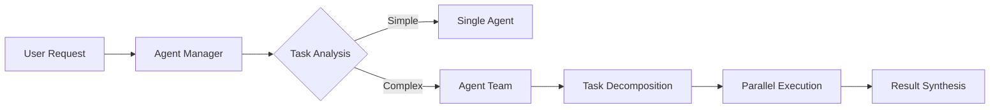

# Agent Architecture

> A unified design for AI agents as first-class architectural building blocks, based on claude-code-sub-agents patterns.

## Overview

Agents in ClaudeProjects2 are markdown-based AI components that:
- Execute specialized tasks autonomously
- Collaborate to solve complex problems
- Integrate seamlessly with Claude Code CLI
- Capture knowledge from their activities

## Agent Specification

### Standard Format

```markdown
---
name: agent-name
description: When to invoke this agent
tools: tool1, tool2  # Optional MCP tools
---

# Agent Name

## Role
[Primary responsibility and expertise]

## Capabilities
- Capability 1: [Description]
- Capability 2: [Description]

## Instructions
[Detailed behavioral instructions using semantic space shaping]

## Examples
### Example 1: [Scenario]
**Input**: [User input]
**Output**: [Expected output]

## Triggers
- "phrase 1"
- Pattern: /regex/i

## Dependencies
- Agent 1 (for capability X)
```

## Agent Categories

### 1. Architecture Agents
Located in `/agents/architecture/`:
- `architecture-designer.md` - System design and patterns
- `pattern-selector.md` - Architectural pattern selection
- `quality-analyst.md` - Quality attribute analysis
- `adr-writer.md` - Architecture decision documentation

### 2. Implementation Agents  
Located in `/agents/implementation/`:
- `code-generator.md` - Code generation from specs
- `test-builder.md` - Test creation and strategies
- `refactoring-assistant.md` - Code improvement
- `performance-optimizer.md` - Performance tuning

### 3. Documentation Agents
Located in `/agents/documentation/`:
- `user-guide-writer.md` - User documentation
- `api-documenter.md` - API documentation
- `tutorial-creator.md` - Learning materials

### 4. Workflow Agents
Located in `/agents/workflows/`:
- `design-implement-test.md` - Full development cycle
- `feature-development.md` - Feature implementation
- `bug-investigation.md` - Issue analysis

## Communication Protocol

### Agent Invocation
```bash
# Direct invocation
claude use architecture-designer "design auth system"

# With context
claude use code-generator --from-spec auth-spec.yaml

# Workflow execution
claude workflow run design-implement-test
```

### Agent Collaboration


## Best Practices

### 1. Agent Design
- **Single Responsibility**: Each agent does one thing well
- **Clear Boundaries**: Well-defined inputs and outputs
- **Self-Contained**: Minimal external dependencies
- **Examples**: Include comprehensive examples

### 2. Prompt Engineering
- **Strong Identity**: Begin with expert persona
- **Semantic Anchoring**: Use precise technical terms
- **Structured Thinking**: Define operational modes
- **Progressive Enhancement**: Layer complexity

### 3. Implementation
```bash
# Install agents
./scripts/install-agents.sh

# Test agent
claude test architecture-designer

# Validate all agents
./scripts/validate-agents.sh
```

## Integration with Claude Code

### Directory Structure
```
~/.claude/agents/
├── architecture/
├── implementation/
├── documentation/
└── workflows/
```

### MCP Tool Integration
Agents can leverage MCP tools:
- GitHub MCP for repository operations
- Obsidian MCP for knowledge management
- Context7 MCP for documentation
- Sequential MCP for complex workflows

## Performance Considerations

### Agent Selection
- Capability matching algorithm
- Performance history tracking
- Workload balancing
- Fallback strategies

### Optimization
- Result caching
- Parallel execution
- Local LLM for simple tasks
- Progressive loading

## Future Enhancements

### Phase 1 (Current)
- Basic agent definitions
- Manual agent selection
- Sequential execution

### Phase 2 (3 months)
- Dynamic agent discovery
- Intelligent routing
- Performance optimization

### Phase 3 (6 months)
- Self-improving agents
- Multi-agent learning
- Predictive selection

## Related Documentation
- [Agent Markdown Specification](../specs/Agent-Markdown-Specification.md)
- [Agent Prompt Engineering Guide](../specs/Agent-Prompt-Engineering-Guide.md)
- [Claude Code Sub-Agents Integration](../specs/Claude-Code-Sub-Agents-Integration.md)