# ClaudeProjects Logical Architecture

## Overview

The logical architecture defines "what" the system does from a functional perspective, independent of implementation details. It focuses on capabilities, responsibilities, and interactions between logical components.

## Architectural Principles

1. **Separation of Concerns**: Each component has a single, well-defined responsibility
2. **Domain-Driven Design**: Architecture reflects business domains
3. **Event-Driven**: Components communicate through events for loose coupling
4. **Agent-Oriented**: AI agents are first-class architectural elements
5. **Knowledge-Centric**: All decisions and artifacts feed the knowledge system

## Logical Layers

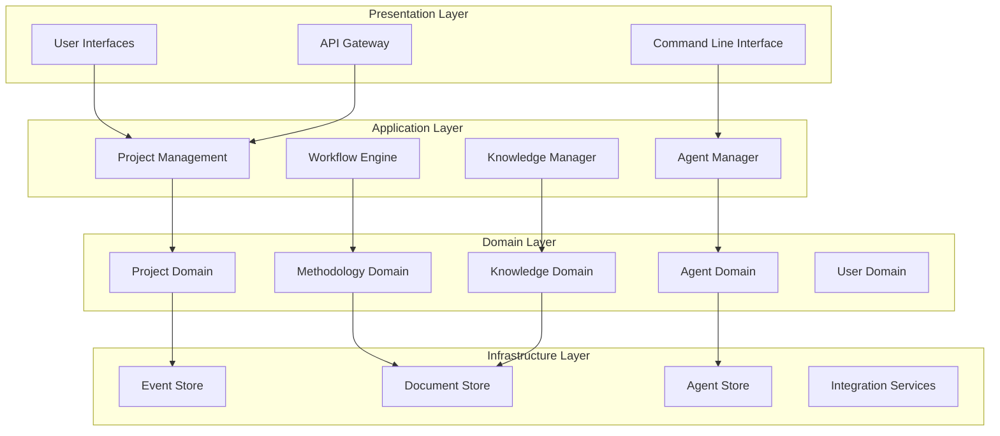

## Core Domains

### 1. Project Domain

**Purpose**: Manage the lifecycle of knowledge work projects

**Capabilities**:
- Project creation and initialization
- Sprint planning and tracking
- Issue and task management
- Progress monitoring
- Deliverable tracking

**Key Concepts**:
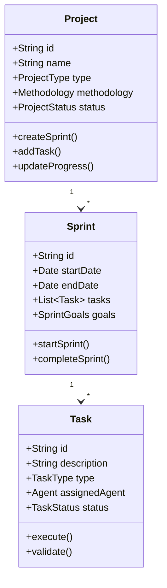

### 2. Methodology Domain

**Purpose**: Encode and execute domain-specific methodologies

**Capabilities**:
- Methodology definition and storage
- Phase orchestration
- Template management
- Best practice enforcement
- Methodology evolution

**Key Concepts**:
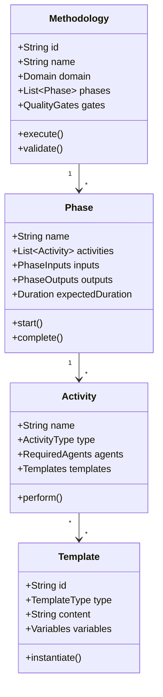

### 3. Agent Domain

**Purpose**: Manage AI agents and their interactions

**Capabilities**:
- Agent registration and discovery
- Capability matching
- Task delegation
- Agent collaboration
- Performance tracking

**Key Concepts**:
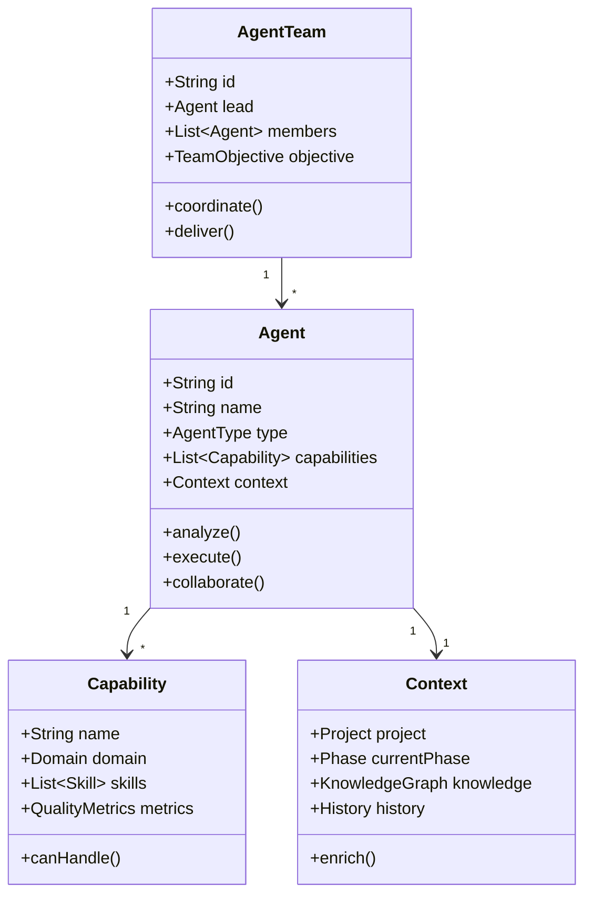

### 4. Knowledge Domain

**Purpose**: Capture, organize, and serve organizational knowledge

**Capabilities**:
- Knowledge capture from all activities
- Semantic relationship mapping
- Pattern recognition
- Insight generation
- Knowledge querying

**Key Concepts**:
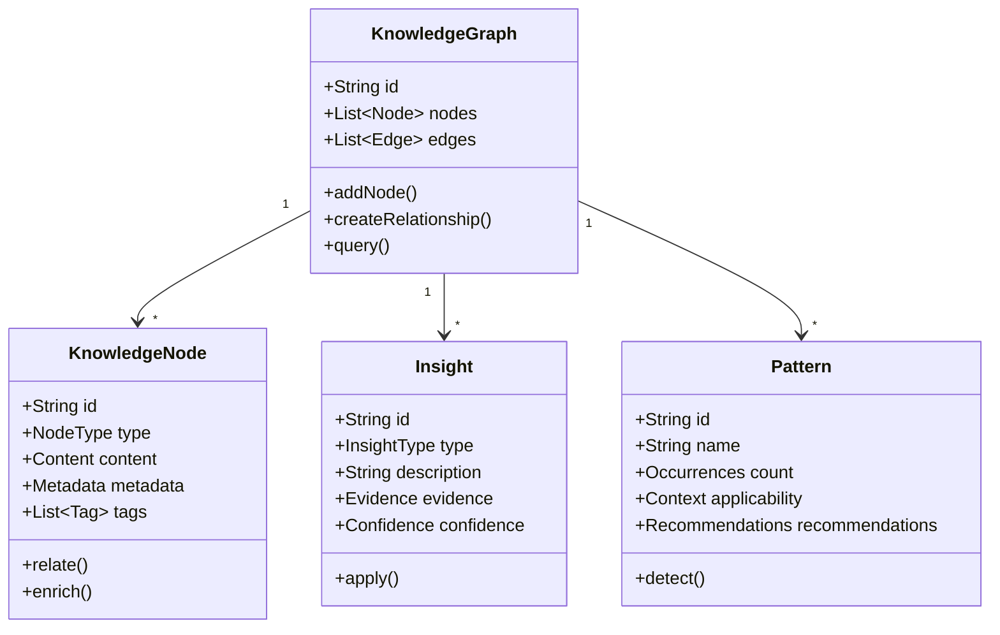

### 5. User Domain

**Purpose**: Manage users, teams, and permissions

**Capabilities**:
- User authentication and authorization
- Team formation and management
- Role-based access control
- Preference management
- Usage analytics

**Key Concepts**:
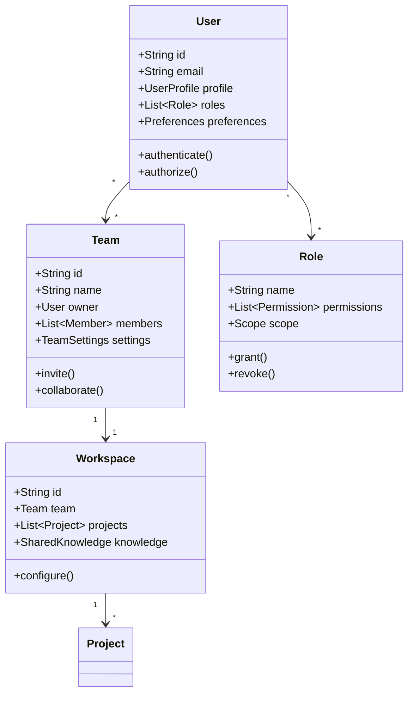

## Cross-Cutting Concerns

### 1. Event System

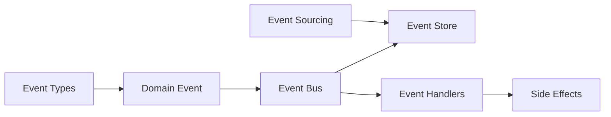

**Event Categories**:
- Project Events (created, updated, completed)
- Methodology Events (phase started, activity completed)
- Agent Events (task assigned, collaboration requested)
- Knowledge Events (insight discovered, pattern detected)
- User Events (joined team, permission changed)

### 2. Security & Privacy

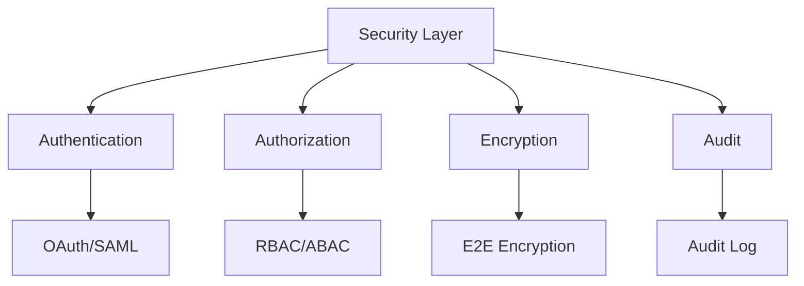

**Security Principles**:
- Zero-trust architecture
- End-to-end encryption for sensitive data
- Role-based and attribute-based access control
- Complete audit trail
- Data residency compliance

### 3. Integration Framework

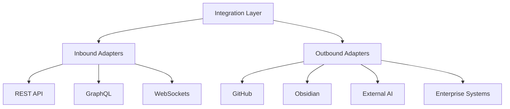

## Quality Attributes

### Performance
- Response time: < 200ms for UI operations
- Agent response: < 5s for simple tasks
- Throughput: 1000 concurrent projects

### Scalability
- Horizontal scaling for all components
- Multi-tenant architecture
- Elastic agent pools

### Reliability
- 99.9% uptime SLA
- Graceful degradation
- Automatic failover

### Maintainability
- Modular architecture
- Clear component boundaries
- Comprehensive logging

### Security
- SOC 2 compliance ready
- GDPR compliant
- Enterprise SSO support

## Logical Flow Examples

### 1. Project Creation Flow

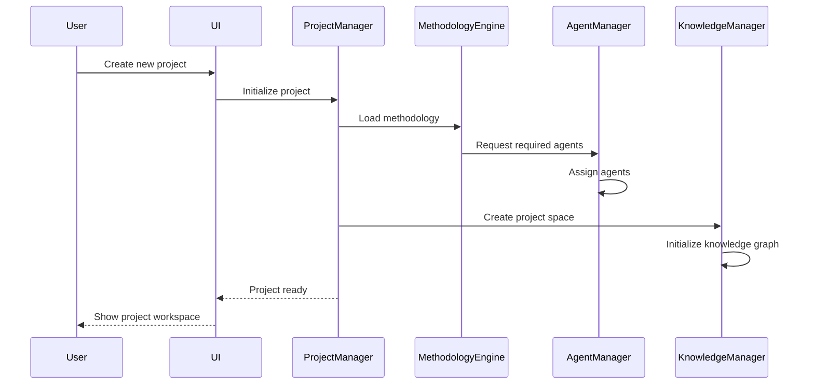

### 2. Task Execution Flow

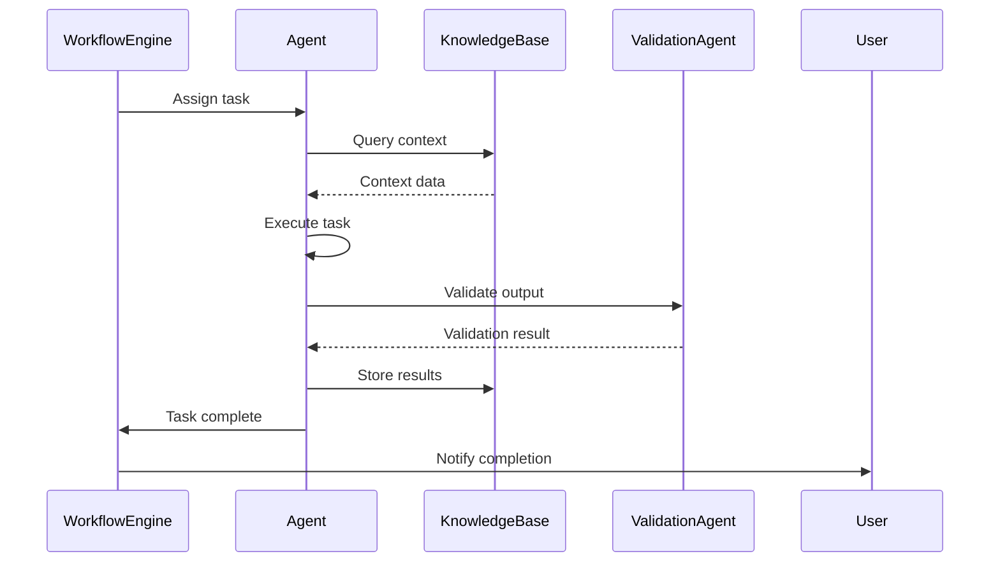

## Conclusion

This logical architecture provides a clear separation of concerns while enabling the flexibility needed for AI-augmented knowledge work. The domain-driven approach ensures that business concepts are directly reflected in the system architecture, while the agent-oriented design allows for intelligent automation throughout the platform.