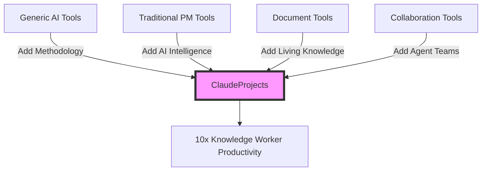
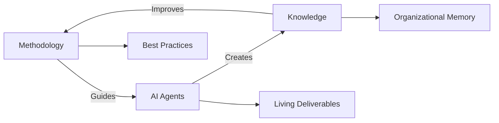
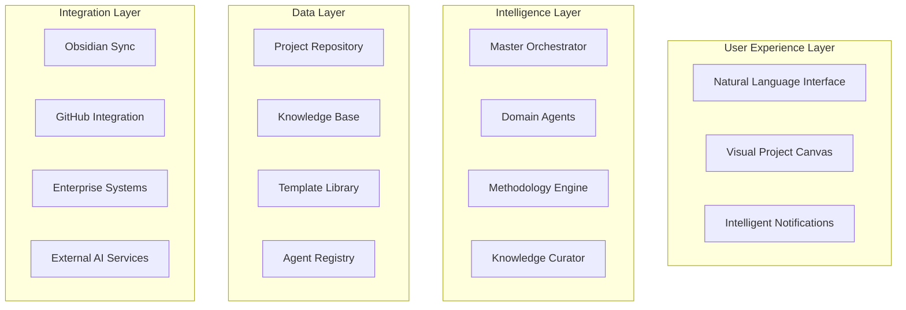

# ClaudeProjects Product Vision - Refined

## Executive Summary

ClaudeProjects is pioneering the AI-augmented knowledge work revolution by creating an intelligent project management platform that combines domain-specific methodologies, specialized AI agents, and persistent knowledge management to deliver 10x productivity gains for knowledge workers.

## Vision Statement

> "Transform how knowledge workers create value by providing them with AI-native methodologies, intelligent agents, and living knowledge systems that make expert-level work accessible to all."

## Mission

**Democratize excellence in knowledge work by:**
1. Translating the AI development revolution to knowledge domains
2. Embedding best-practice methodologies into intelligent workflows
3. Creating specialized AI agents that act as domain experts
4. Building living knowledge systems that learn and evolve

## Strategic Positioning

## Core Innovation: The Triple Helix

### 1. **Methodology-First Approach**
- Every project type has embedded best practices
- Methodologies are executable, not just documented
- AI agents understand and enforce methodology

### 2. **Specialized Agent Ecosystem**
- Domain-specific agents (Innovation, Sales, Strategy)
- Phase-specific agents (Research, Design, Implementation)
- Collaboration agents (Facilitator, Reviewer, Integrator)

### 3. **Living Knowledge System**
- Documents that update themselves
- Knowledge graphs that grow automatically
- Insights that emerge from patterns

## Product Architecture

### Conceptual Layers

## Target Market Segmentation

### Primary Markets

#### 1. **Innovation Teams** (Early Adopters)
- Design thinking practitioners
- Innovation lab managers
- R&D teams
- Startup accelerators

**Value Proposition**: "From idea to prototype in days, not months"

#### 2. **Sales Organizations** (Fast Followers)
- Enterprise sales teams
- Solution consultants
- Sales enablement managers
- Account strategists

**Value Proposition**: "Win more deals with AI-powered value creation"

#### 3. **Marketing Departments** (Mainstream)
- Brand strategists
- Campaign managers
- Content marketers
- Growth teams

**Value Proposition**: "Create compelling narratives at scale"

#### 4. **Strategy Consultants** (Premium)
- Management consultants
- Transformation specialists
- Executive advisors
- Business analysts

**Value Proposition**: "Deliver McKinsey-quality work in half the time"

## Competitive Advantage

### Sustainable Differentiators

1. **Methodology Moat**
   - Proprietary methodology encodings
   - Community-created methodologies
   - Continuous methodology evolution

2. **Agent Specialization**
   - Deep domain knowledge
   - Methodology awareness
   - Context persistence

3. **Network Effects**
   - Shared methodologies improve for all
   - Agent learning benefits everyone
   - Knowledge compounds across projects

4. **Switching Costs**
   - Accumulated project knowledge
   - Trained agent relationships
   - Customized workflows

## Go-to-Market Strategy

### Phase 1: Developer Foundation (Months 1-6)
- Launch with software development methodology
- Prove 10x productivity gains
- Build developer community
- Create agent development SDK

### Phase 2: Innovation Expansion (Months 7-12)
- Add innovation methodologies (Design Sprint, Double Diamond)
- Target innovation labs and consultancies
- Showcase transformation stories
- Build methodology marketplace

### Phase 3: Enterprise Scale (Year 2)
- Sales and marketing methodologies
- Enterprise security and compliance
- Team collaboration features
- Professional services program

## Success Metrics Framework

### User Success Metrics
| Metric | Target | Measurement |
|--------|--------|-------------|
| Time to Value | < 1 hour | First meaningful output |
| Productivity Gain | 10x | Tasks completed vs. traditional |
| Quality Score | +50% | Peer review ratings |
| User Retention | > 90% | Monthly active usage |

### Platform Success Metrics
| Metric | Year 1 | Year 3 | Year 5 |
|--------|--------|--------|--------|
| Active Users | 10K | 100K | 1M |
| Methodologies | 20 | 100 | 500 |
| Agent Types | 50 | 200 | 1000 |
| Knowledge Nodes | 1M | 100M | 10B |

## Technology Philosophy

### Core Principles

1. **Local-First Architecture**
   - User data sovereignty
   - Offline capability
   - Fast performance
   - Privacy by design

2. **Open Ecosystem**
   - Open-source methodologies
   - Community agents
   - Standard integrations
   - Transparent AI

3. **Progressive Enhancement**
   - Start simple
   - Reveal complexity gradually
   - Adapt to user expertise
   - Grow with needs

## Monetization Strategy

### Tier Structure

1. **Individual Professional** ($50/month)
   - Core methodologies
   - Personal knowledge base
   - Basic agents
   - Community support

2. **Team** ($200/month per seat)
   - All methodologies
   - Shared knowledge base
   - Advanced agents
   - Priority support

3. **Enterprise** (Custom pricing)
   - Custom methodologies
   - Private agent training
   - Compliance features
   - Dedicated success manager

### Revenue Streams
- Subscription (70%)
- Marketplace commission (20%)
- Professional services (10%)

## Risk Mitigation

### Technical Risks
- **AI Reliability**: Multiple agent fallbacks
- **Data Security**: End-to-end encryption
- **Performance**: Local-first architecture
- **Integration**: Standard protocols

### Market Risks
- **Adoption**: Start with tech-savvy early adopters
- **Competition**: Deep methodology moat
- **Pricing**: Freemium on-ramp
- **Retention**: Continuous value delivery

## 10-Year Vision

### The Knowledge Work Operating System

By 2035, ClaudeProjects will be:
- The default platform for knowledge work
- Embedded in university curricula
- Industry standard for best practices
- Global knowledge nervous system

### Impact Goals
- 🌍 Enable 10M knowledge workers
- 📈 Create $100B in value
- 🎓 Train 1M students
- 🏆 Define industry standards

## Call to Action

> "Join us in building the future of knowledge work. Where every professional has access to the world's best methodologies, AI experts at their fingertips, and a living knowledge system that makes them smarter every day."

---

*ClaudeProjects: Intelligent Methodologies. Expert Agents. Living Knowledge.*