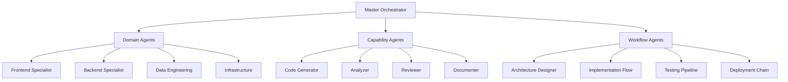
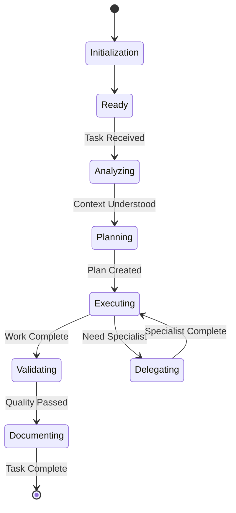

# ADR-001: Agent Architecture Pattern

## Status
Accepted

## Context
We need a standardized pattern for building Claude Code agents that aligns with our architecture-centric methodology. The claude-code-sub-agents project provides an excellent reference implementation with 33 specialized agents that we can learn from and abstract into a reusable pattern.

## Decision
We will adopt and extend the sub-agent architecture pattern with the following key abstractions:

### 1. Agent Taxonomy


### 2. Agent Interface Standard
```yaml
agent:
  metadata:
    name: string
    version: string
    category: enum[domain, capability, workflow]
    expertise: string[]
    dependencies: string[]
  
  capabilities:
    input_analysis:
      - context_understanding
      - requirement_extraction
      - constraint_identification
    
    execution:
      - primary_function
      - supporting_functions
      - integration_points
    
    output_generation:
      - artifact_types
      - quality_checks
      - documentation

  orchestration:
    can_delegate_to: string[]
    requires_agents: string[]
    trigger_patterns: regex[]
```

### 3. Agent Lifecycle Pattern


### 4. Communication Protocol
- **Agent Discovery**: Automatic registration and capability advertisement
- **Task Routing**: Context-based intelligent routing
- **Result Aggregation**: Structured output merging
- **Error Handling**: Graceful degradation and fallback

## Consequences

### Positive
- Standardized agent development process
- Reusable patterns for new agent creation
- Clear separation of concerns
- Scalable architecture for complex tasks
- Enables agent composition and orchestration

### Negative
- Initial complexity in setup
- Learning curve for agent developers
- Potential overhead for simple tasks

## Alternatives Considered
1. **Monolithic Agent**: Single agent handling all tasks - rejected due to lack of specialization
2. **Hardcoded Pipelines**: Fixed agent chains - rejected due to inflexibility
3. **No Abstraction**: Direct implementation - rejected due to maintenance overhead

## Implementation Guidelines

### For Our Methodology
1. **Architecture Agents**: Specialized in design decisions, pattern selection, and quality attributes
2. **Implementation Agents**: Code generation following architectural blueprints
3. **Validation Agents**: Conformance checking and quality assurance
4. **Documentation Agents**: Knowledge capture and dissemination

### Agent Template
```python
class BaseAgent:
    def __init__(self, config):
        self.name = config['name']
        self.capabilities = config['capabilities']
        self.orchestrator = config.get('orchestrator', None)
    
    def analyze_context(self, input):
        """Understand the task and context"""
        pass
    
    def plan_execution(self, context):
        """Create execution plan"""
        pass
    
    def execute(self, plan):
        """Perform the primary function"""
        pass
    
    def validate_output(self, result):
        """Ensure quality standards"""
        pass
    
    def document_work(self, result):
        """Update knowledge base"""
        pass
```

## References
- [claude-code-sub-agents](https://github.com/lst97/claude-code-sub-agents)
- Our Architecture-Centric Methodology
- Agent-Oriented Software Engineering principles