# Domain Business Logic

> Deep dive into the business rules and interactions within each domain. For domain overview, see [Layers](Layers.md#domain-layer---triple-helix-core).

## High-Level Domain Interactions

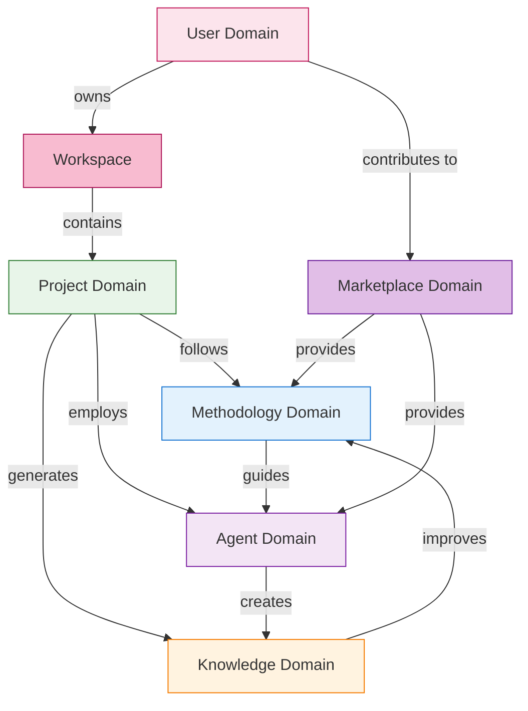

## Domain Details

<b>👤 User Domain</b> - Identity, preferences, and growth

### Business Rules
- Users must authenticate before accessing workspace
- Each user owns exactly one workspace
- User preferences cascade to all their projects
- Growth level unlocks advanced features
- Users can share individual projects with others

### Growth Journey

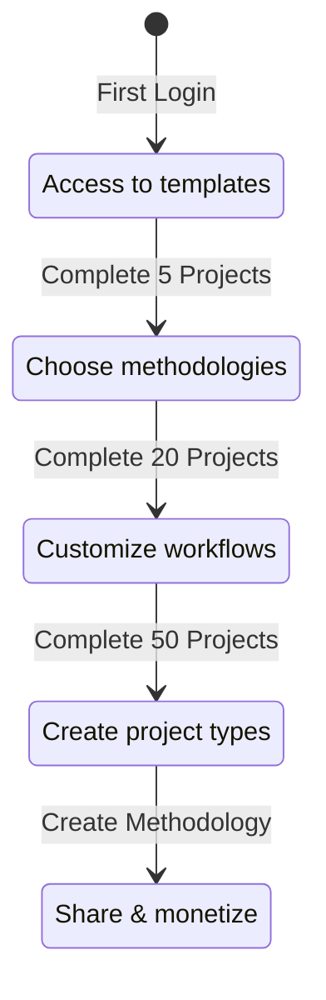

### Permission Model
- **Owner**: Full control over own workspace
- **Collaborator**: Can edit shared projects
- **Viewer**: Read-only access to shared projects
- **Guest**: Limited access to specific deliverables

<b>📂 Workspace Domain</b> - Project organization and team collaboration

### Business Rules
- One workspace per user (personal workspace)
- Project types are workspace-specific
- Projects can be shared individually
- Resource limits apply per workspace
- All user activity happens within their workspace

### Workspace Hierarchy

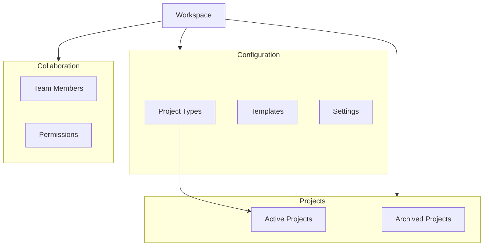

### Workspace Operations
- **Create Project**: From project type template
- **Work on Projects**: Execute methodologies with agents
- **Manage Project Types**: Create and customize types
- **Archive Projects**: Preserve but deactivate
- **Share Projects**: Grant access to specific projects
- **Export/Import**: Backup or migrate workspace data

<b>📁 Project Domain</b> - Value creation through methodology execution

### Business Rules
- Projects must be created from a project type
- Cannot execute without assigned methodology
- All deliverables must be living documents
- Productivity metrics tracked automatically
- Knowledge capture is continuous, not post-hoc

### Project Lifecycle

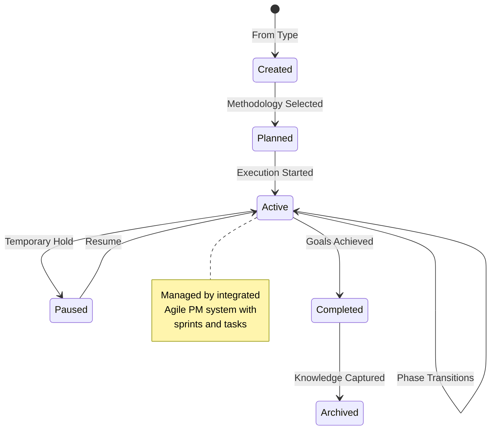

### Productivity Measurement

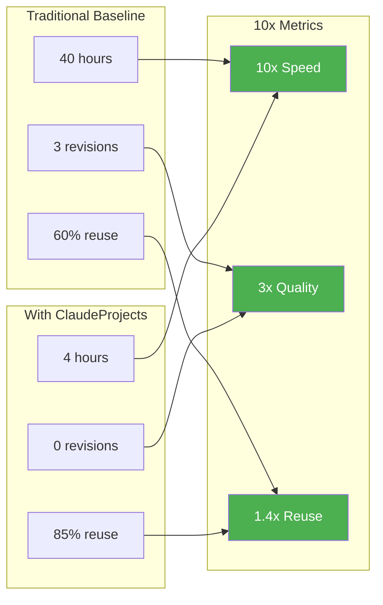

### Living Deliverables
- Auto-update when source data changes
- Version history with explanations
- Proactive refresh suggestions
- Cross-project synchronization

### Project Management Integration
- **Agile PM**: Built-in sprint planning and tracking
- **Task Management**: Break down methodology phases into tasks
- **Agent Assignment**: Assign tasks to appropriate AI agents
- **Progress Tracking**: Real-time visibility into project status
- **Sprint Reviews**: Automated retrospectives with insights

<b>🎯 Project Types</b> - Reusable project configurations

### Business Rules
- Built-in types cannot be deleted
- Custom types can extend OR be completely new
- Types define default methodology
- Types specify agent team composition
- Types are private to workspace (future: marketplace)

### Type Inheritance

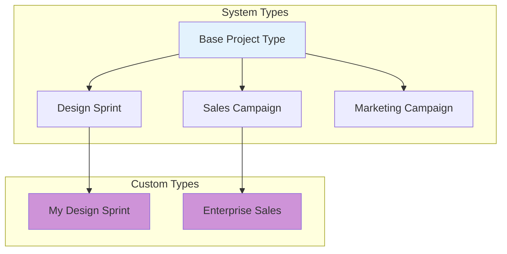

### Type Components
- **Methodology**: Default workflow
- **Agent Team**: Pre-assigned specialists
- **Templates**: Starting documents
- **Metrics**: Success criteria
- **Settings**: Project defaults

<b>📚 Methodology Domain</b> - Executable best practices

### Business Rules
- Methodologies have mandatory phases
- Quality gates cannot be skipped
- Each phase has success criteria
- Methodologies learn from outcomes
- Custom methodologies require validation

### Methodology Evolution

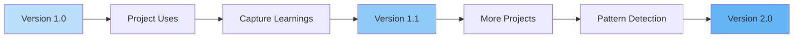

### Quality Gates
- **Entry Criteria**: Prerequisites met
- **Phase Validation**: Deliverables complete
- **Exit Criteria**: Quality standards met
- **Automated Checks**: AI validation
- **Human Override**: With justification

### Methodology Library
| Category | Count | Examples |
|----------|-------|----------|
| Innovation | 5 | Design Sprint, Double Diamond, Jobs-to-be-Done |
| Sales | 4 | MEDDIC, Challenger, Solution Selling, SPIN |
| Marketing | 6 | Growth Hacking, Content Strategy, ABM |
| Development | 5 | Agile, Waterfall, DDD, TDD, DevOps |
| Consulting | 4 | McKinsey 7S, BCG Matrix, Blue Ocean |

<b>🏪 Marketplace Domain</b> - Community sharing and discovery

### Business Rules
- All shared content must pass quality validation
- Methodologies and agents can be published independently
- Publishers maintain ownership but grant usage rights
- Community ratings help surface quality content
- Versioning ensures compatibility

### Marketplace Components

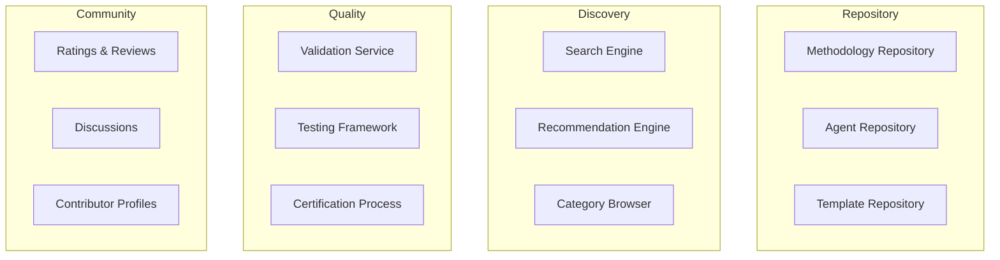

### Publishing Workflow

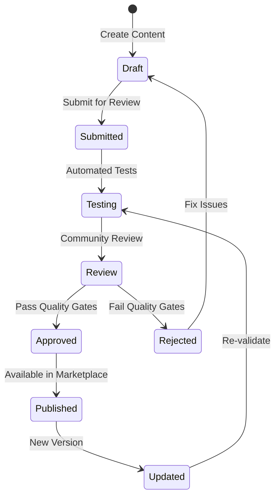

### Discovery Features
- **Search**: Full-text and semantic search
- **Categories**: Browse by domain, complexity, use case
- **Recommendations**: Based on user profile and project history
- **Trending**: Popular and newly featured content
- **Collections**: Curated sets for specific industries

### Quality Assurance
- **Automated Testing**: Syntax validation, compatibility checks
- **Community Review**: Peer validation process
- **Usage Analytics**: Track effectiveness metrics
- **Continuous Monitoring**: Flag degraded quality
- **Version Compatibility**: Ensure backward compatibility

<b>🤖 Agent Domain</b> - Specialized AI workforce with context management

### Business Rules
- Agents have defined specializations
- Teams form based on methodology needs
- Agents can work in parallel
- Performance tracked per agent
- Agents improve through usage
- Context persists across sessions
- Context evolves based on outcomes

### Agent Specialization Matrix

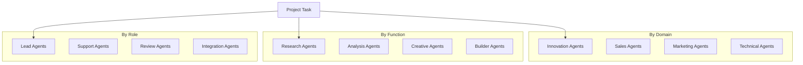

### Team Formation Rules
- Methodology specifies required roles
- System matches best available agents
- Parallel execution when possible
- Automatic workload balancing
- Fallback agents for availability

### Performance Tracking
- Task completion time
- Output quality scores
- Collaboration effectiveness
- Learning rate
- User satisfaction

### Agent Context Management

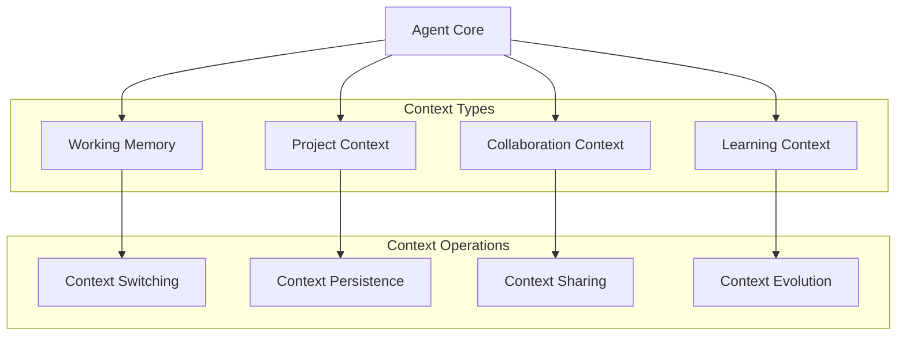

### Context Components

#### Working Memory
- **Current Task**: Active goal and progress
- **Recent Actions**: Last N operations for continuity
- **Temporary State**: Session-specific information
- **Active Tools**: Currently loaded capabilities

#### Project Context
- **Project History**: All past interactions on project
- **Methodology State**: Current phase and progress
- **Deliverables**: Generated artifacts and documents
- **Decisions**: Key choices and rationale

#### Learning Context
- **Performance Metrics**: Success/failure patterns
- **Effective Strategies**: What worked well
- **User Preferences**: Learned style preferences
- **Domain Knowledge**: Accumulated expertise

#### Collaboration Context
- **Team State**: Other agents' current work
- **Handoff Points**: Clear transition information
- **Shared Goals**: Team objectives
- **Communication History**: Inter-agent messages

### Context Lifecycle

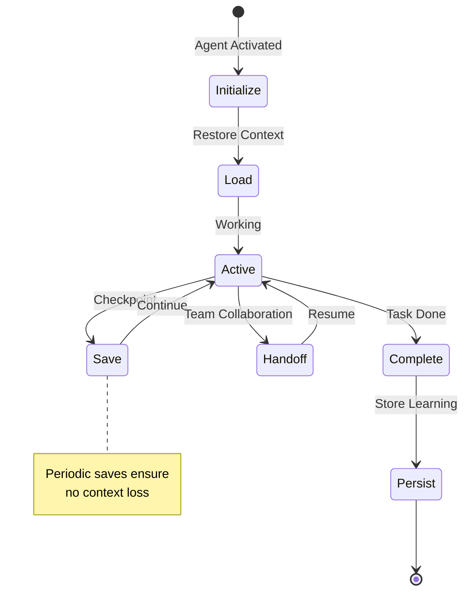

### Context Evolution Mechanism
- **Pattern Recognition**: Identify successful approaches
- **Preference Learning**: Adapt to user style
- **Knowledge Accumulation**: Build domain expertise
- **Performance Optimization**: Improve based on metrics
- **Collaborative Learning**: Learn from team interactions

<b>🧠 Knowledge Domain</b> - Living organizational memory

### Business Rules
- All project artifacts become knowledge
- Knowledge links automatically form
- Patterns emerge from usage
- Insights proactively surface
- Privacy controls respect boundaries

### Knowledge Flow

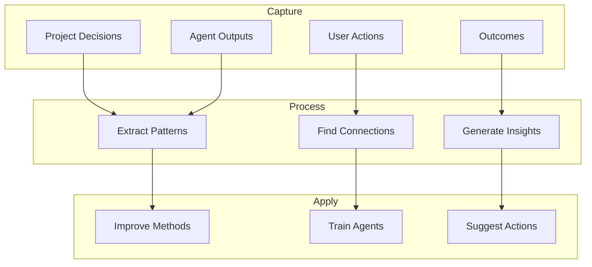

### Living Document Features
- **Auto-Update**: When sources change
- **Version Intelligence**: Explain why changed
- **Cross-Reference**: Link related docs
- **Predictive Updates**: Suggest refreshes
- **Quality Decay**: Flag stale content

### Organizational Learning
- Success pattern recognition
- Failure analysis and prevention
- Best practice extraction
- Predictive recommendations
- Knowledge gap identification

## Cross-Domain Interactions

### The Triple Helix in Action

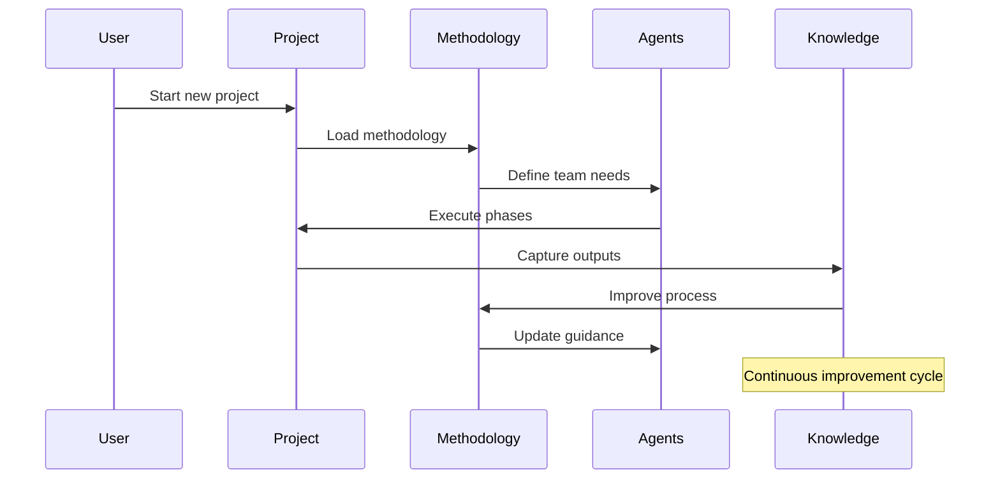

### Event-Driven Coordination
- **Project Events**: Trigger methodology phases
- **Methodology Events**: Activate agent teams
- **Agent Events**: Generate knowledge
- **Knowledge Events**: Evolve methodologies
- **User Events**: Personalize experience

## Business Value Streams

### Time-to-Value Acceleration
Traditional: Research → Design → Build → Test → Deploy (weeks)  
ClaudeProjects: All phases parallel with AI agents (hours)

### Quality Improvement
Traditional: Multiple revision cycles, defects found late  
ClaudeProjects: First-time quality through methodology enforcement

### Knowledge Compound Effect
Traditional: Knowledge lost between projects  
ClaudeProjects: Every project makes the next one better

## Next Steps

- Review [Cross-Cutting Concerns](Cross-Cutting.md) for system-wide features
- Explore [Quality Attributes](Quality-Attributes.md) for performance requirements
- See [Flows](Flows.md) for detailed execution examples