# Architectural Layers

Each layer has a specific responsibility in delivering 10x productivity gains.

## Presentation Layer - "Democratize Excellence"

### Purpose
Make expert-level capabilities accessible to all users through intuitive interfaces.

### High-Level View

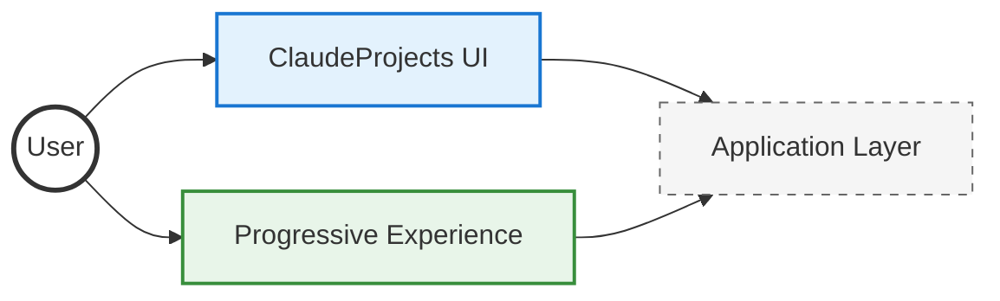

### Component Details

<details>
<summary><b>💻 ClaudeProjects UI</b> - Natural language and visual canvas</summary>

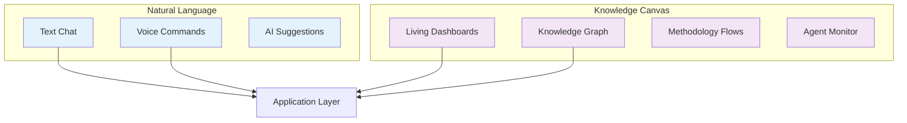

**Key Features:**
- **Natural Language**: Conversational interface with text and voice
- **Knowledge Canvas**: Visual workspace for exploring and managing knowledge
- **Living Dashboards**: Real-time project status and metrics
- **Agent Monitor**: Visibility into AI agent activities
- **Context Preservation**: Seamless switching between UI modes

</details>

<details>
<summary><b>📈 Progressive Experience</b> - Grows with user expertise</summary>

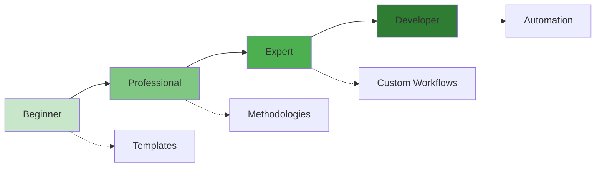

**Growth Path:**
1. **Beginner**: Guided templates, simple tasks
2. **Professional**: Full methodology controls
3. **Expert**: Custom agent orchestration
4. **Developer**: API automation

</details>

### Interaction Flow

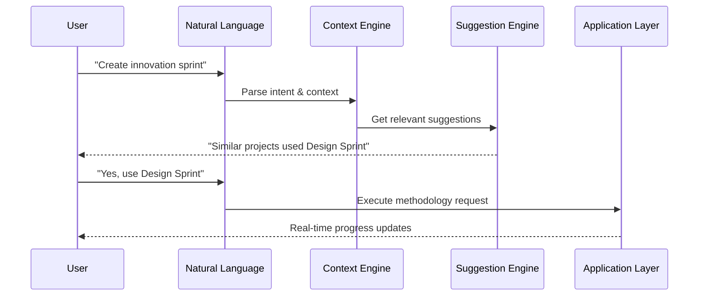

### Progressive Enhancement Model

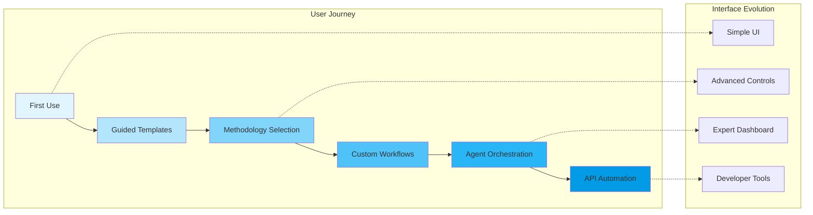

---

## Application Layer - "10x Productivity Engine"

### Purpose
Orchestrate the Triple Helix to deliver order-of-magnitude productivity gains.

### High-Level View

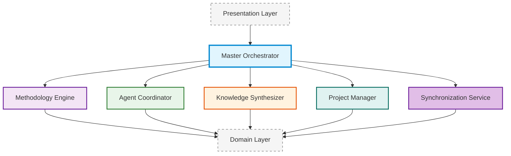

### Service Details

<details>
<summary><b>🎯 Master Orchestrator</b> - Central command and control</summary>

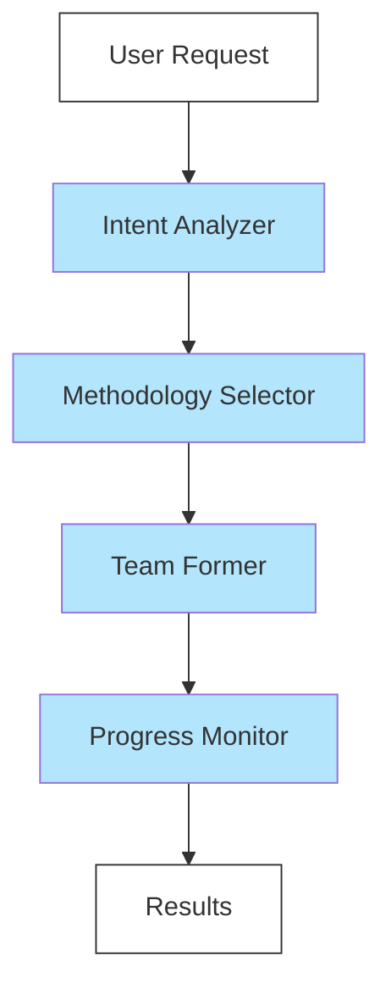

**Responsibilities:**
- Understand user intent
- Select best methodology
- Form specialist teams
- Monitor execution
- Deliver results

</details>

<details>
<summary><b>📚 Methodology Engine</b> - Executable best practices</summary>

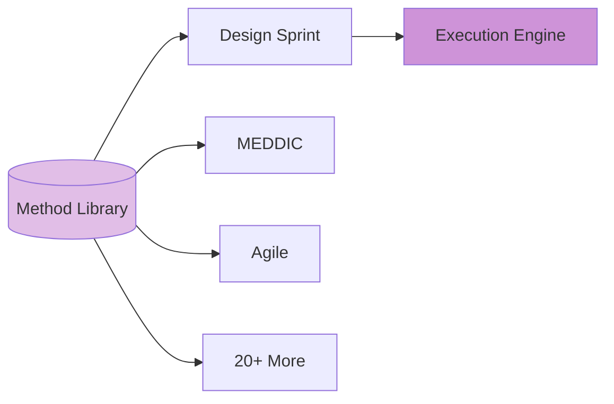

**Features:**
- 20+ pre-built methodologies
- Quality gates enforcement
- Continuous improvement
- Custom methodology creation

</details>

<details>
<summary><b>👥 Agent Coordinator</b> - AI team management</summary>

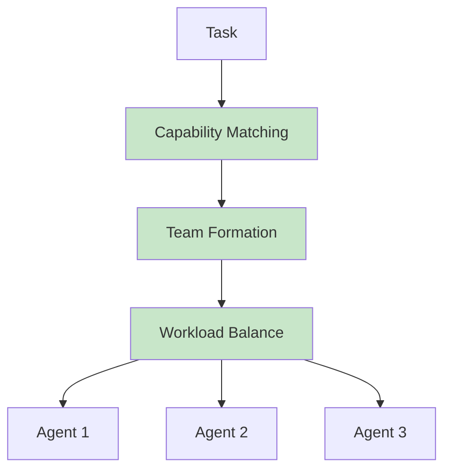

**Capabilities:**
- Match tasks to specialists
- Form dynamic teams
- Balance workloads
- Track performance

</details>

<details>
<summary><b>🧠 Knowledge Synthesizer</b> - Living knowledge system</summary>

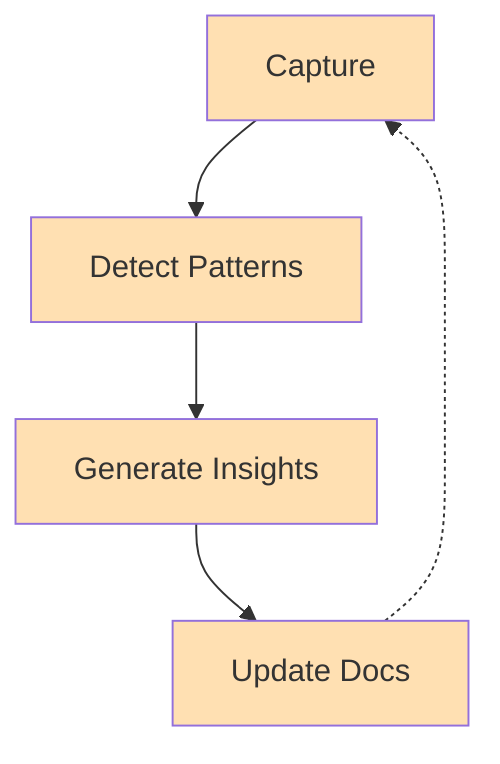

**Functions:**
- Auto-documentation
- Pattern detection
- Insight generation
- Living documents

</details>

<details>
<summary><b>📋 Project Manager</b> - Agile project tracking</summary>

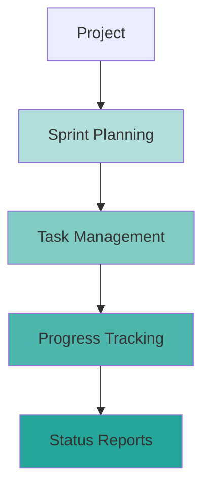

**Features:**
- Sprint planning & tracking
- Task assignment to agents
- Progress visualization
- Burndown charts
- Status reporting
- Blocker management

</details>

<details>
<summary><b>🔄 Synchronization Service</b> - Multi-user collaboration & offline support</summary>

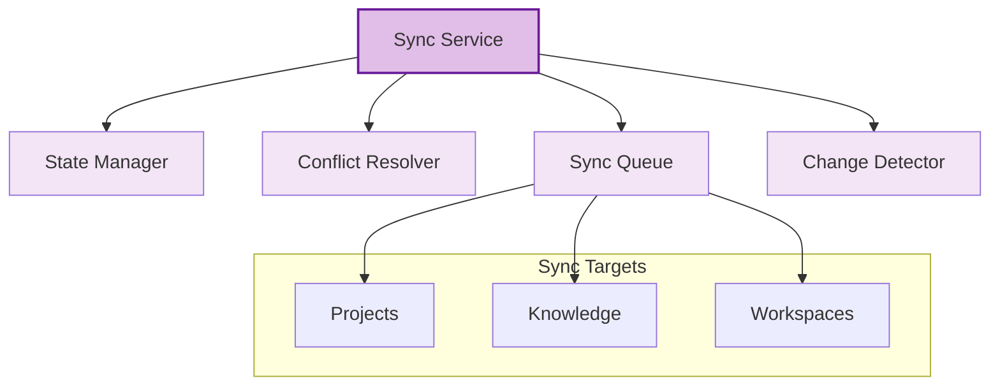

**Capabilities:**
- **State Management**: Track online/offline status, local changes
- **Conflict Resolution**: Automatic and manual merge strategies
- **Queue Management**: Prioritized sync operations
- **Change Detection**: Efficient diff algorithms
- **Real-time Collaboration**: Live updates for shared projects

**Sync Strategies:**
- **Optimistic Updates**: Apply locally, sync eventually
- **Conflict-Free Replicated Data Types (CRDTs)**: For collaborative editing
- **Priority Queuing**: Critical changes sync first
- **Batch Operations**: Efficient network usage

</details>

### Orchestration Flow

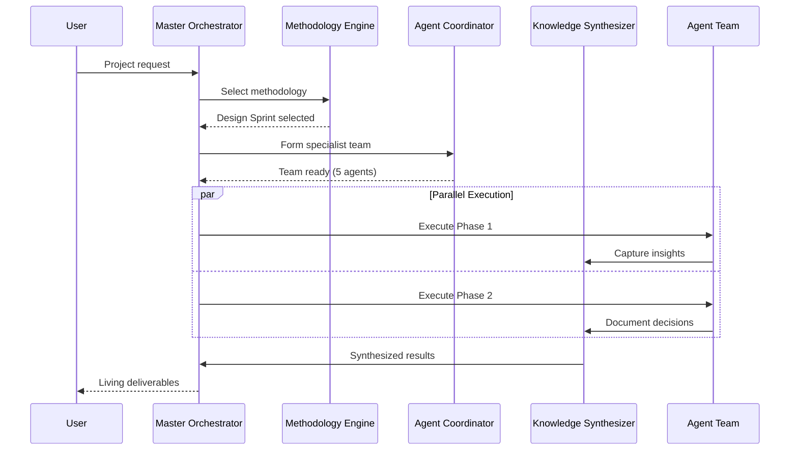

### Productivity Multipliers

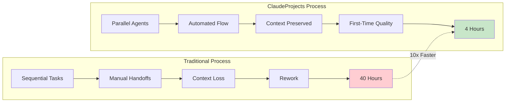

---

## Domain Layer - "Triple Helix Core"

### Purpose
Implement core business logic that powers the Triple Helix innovation.

### High-Level View

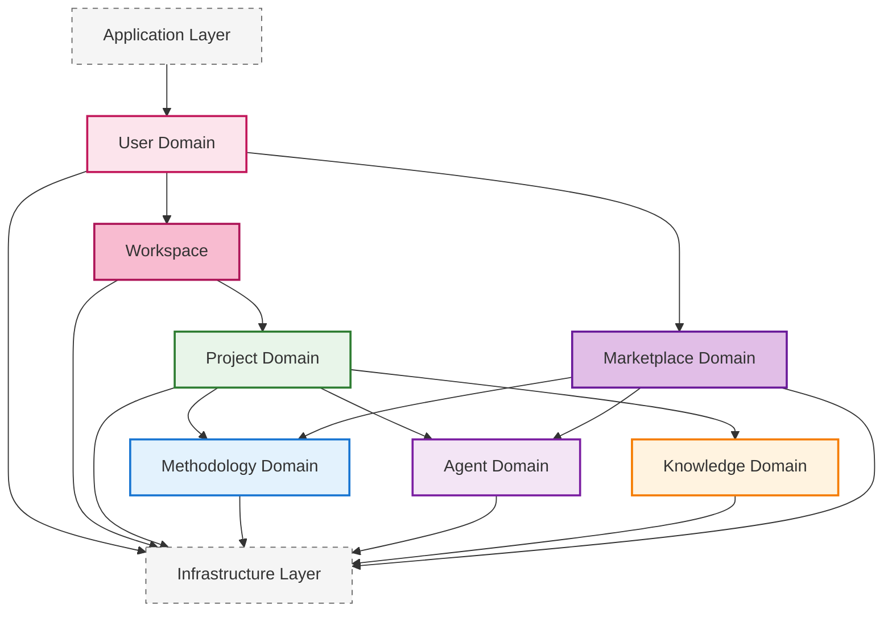

### Domain Details

<details>
<summary><b>👤 User Domain</b> - Identity and preferences</summary>

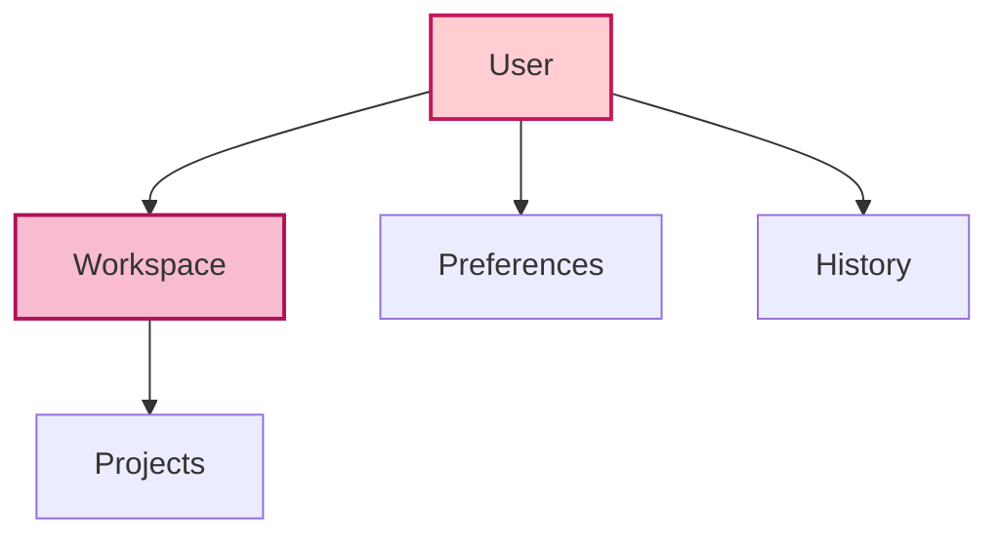

**Key Concepts:**
- User identity & auth
- Personal preferences
- Learning history
- Workspace ownership

</details>

<details>
<summary><b>📂 Workspace</b> - Project container</summary>

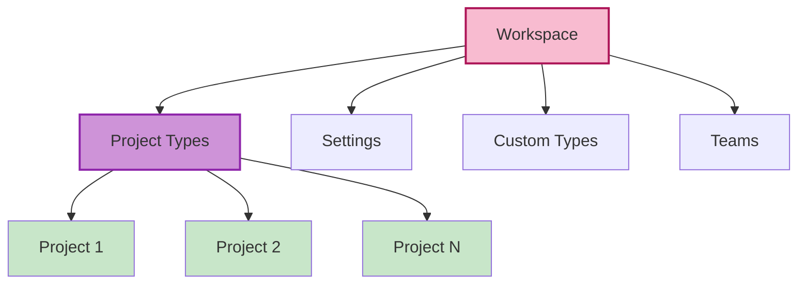

**Workspace Features:**
- Project type library
- Custom project types
- Shared settings & templates
- Team collaboration space
- Resource management

</details>

<details>
<summary><b>📁 Project Domain</b> - Value creation hub</summary>

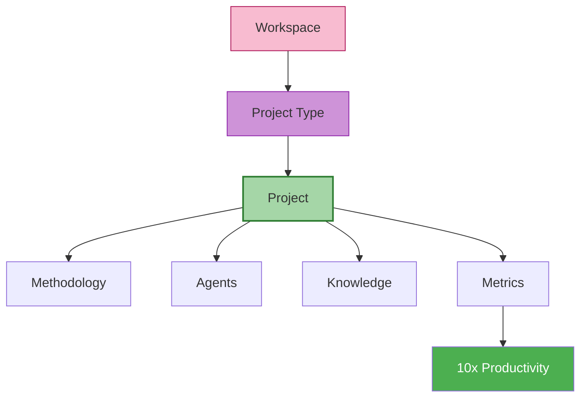

**Core Functions:**
- Created from project types
- Lives within workspace
- Execute methodologies
- Coordinate agents
- Capture knowledge
- Measure 10x gains

</details>

<details>
<summary><b>🎯 Project Types</b> - Reusable project templates</summary>

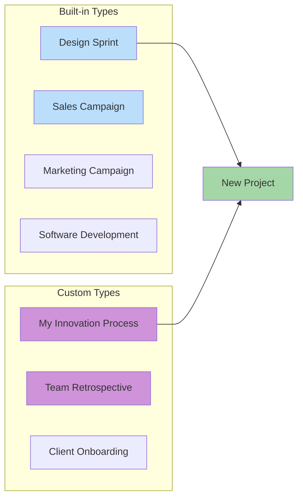

**Features:**
- Pre-configured methodologies
- Default agent teams
- Template deliverables
- Custom type creation
- Type sharing & export

</details>

<details>
<summary><b>📚 Methodology Domain</b> - Executable excellence</summary>

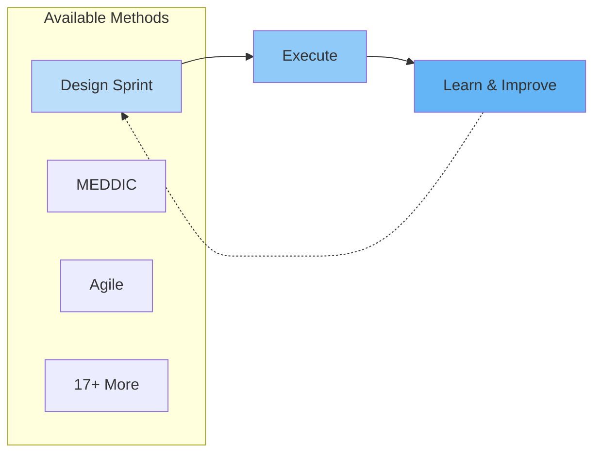

**Categories:**
- Innovation (Design Sprint, Double Diamond)
- Sales (MEDDIC, Challenger)
- Marketing (Growth, Content)
- Development (Agile, DDD)

</details>

<details>
<summary><b>🤖 Agent Domain</b> - Specialized workforce</summary>

```mermaid
graph TB
    subgraph "Agent Types"
        RES[Research]
        CRE[Creative]
        ANA[Analysis]
        BUI[Builder]
    end
    
    TASK[Task]
    TASK --> RES
    TASK --> CRE
    
    TEAM[Form Team]
    RES --> TEAM
    CRE --> TEAM
    
    style RES fill:#e1bee7
    style CRE fill:#e1bee7
    style TEAM fill:#ba68c8,color:#fff
```

**Specializations:**
- Domain experts
- Process specialists
- Collaboration roles
- Quality assurance

</details>

<details>
<summary><b>🧠 Knowledge Domain</b> - Living memory</summary>

```mermaid
graph TB
    CAP[Capture]
    CON[Connect]
    PAT[Patterns]
    PRE[Predict]
    
    CAP --> CON
    CON --> PAT
    PAT --> PRE
    PRE -.-> CAP
    
    style CAP fill:#ffe0b2
    style CON fill:#ffcc80
    style PAT fill:#ffb74d
    style PRE fill:#ffa726
```

**Capabilities:**
- Auto-updating docs
- Pattern recognition
- Predictive insights
- Continuous learning

</details>

<details>
<summary><b>🏪 Marketplace Domain</b> - Community ecosystem</summary>

```mermaid
graph TB
    MARKET[Marketplace]
    
    REPO[Community Repository]
    DISC[Discovery Service]
    QUAL[Quality Assurance]
    CONT[Contribution Manager]
    
    MARKET --> REPO
    MARKET --> DISC
    MARKET --> QUAL
    MARKET --> CONT
    
    subgraph "Content Types"
        METH_C[Methodologies]
        AGENT_C[Agents]
        TMPL_C[Templates]
    end
    
    REPO --> METH_C
    REPO --> AGENT_C
    REPO --> TMPL_C
    
    style MARKET fill:#e1bee7,stroke:#6a1b9a,stroke-width:2px
    style REPO fill:#f3e5f5
    style DISC fill:#f3e5f5
    style QUAL fill:#f3e5f5
    style CONT fill:#f3e5f5
```

**Functions:**
- **Repository**: Store and version community content
- **Discovery**: Search, filter, recommend
- **Quality**: Validate, test, certify
- **Contribution**: Publish, update, maintain

**Key Features:**
- Community-driven methodologies
- Shareable agent configurations
- Quality validation process
- Version compatibility tracking
- Usage analytics & ratings

</details>


---

## Infrastructure Layer - "Local-First Foundation"

### Purpose
Provide reliable, performant, privacy-preserving technical foundation.

### High-Level View

```mermaid
graph TB
    DOM[Domain Layer]
    
    DATA[Local Data]
    AGENT[Agent Infra]
    INT[Integration]
    KNOW[Knowledge Infra]
    
    DOM --> DATA
    DOM --> AGENT
    DOM --> INT
    DOM --> KNOW
    
    AGENT -.->|Uses| INT
    
    DATA <--> AGENT
    AGENT <--> INT
    INT <--> KNOW
    KNOW <--> DATA
    
    style DOM fill:#f5f5f5,stroke:#666,stroke-width:1px,stroke-dasharray: 5 5
    style DATA fill:#e3f2fd,stroke:#1565c0,stroke-width:3px
    style AGENT fill:#f3e5f5,stroke:#6a1b9a,stroke-width:2px
    style INT fill:#e8f5e9,stroke:#388e3c,stroke-width:2px
    style KNOW fill:#fff3e0,stroke:#e65100,stroke-width:2px
```

### Infrastructure Details

<details>
<summary><b>💾 Local Data Management</b> - Privacy-first storage</summary>

```mermaid
graph TB
    FS[(File System)]
    SQL[(SQLite)]
    GIT[Git Repo]
    OBS[Obsidian Vault]
    
    FS --> SQL
    FS --> GIT
    FS --> OBS
    
    style FS fill:#bbdefb,stroke:#1565c0,stroke-width:2px
    style SQL fill:#90caf9
    style GIT fill:#64b5f6
    style OBS fill:#42a5f5
```

**Components:**
- File System: Primary storage for all project files
- SQLite: Structured data & metrics
- Git: Version control
- Obsidian: Knowledge UI

</details>

<details>
<summary><b>🤖 Agent Infrastructure</b> - AI management</summary>

```mermaid
graph LR
    REG[(Registry)]
    PERF[Performance]
    CTX[Context]
    UPD[Updates]
    
    REG --> PERF
    PERF --> UPD
    CTX --> REG
    UPD -.-> REG
    
    style REG fill:#e1bee7
    style PERF fill:#ce93d8
    style CTX fill:#ba68c8
    style UPD fill:#ab47bc
```

**Functions:**
- Registry: Discovery
- Performance: Tracking
- Context: State management
- Updates: Improvements

</details>

<details>
<summary><b>🔌 Integration Services</b> - External connections</summary>

```mermaid
graph TB
    LAR[Local Agent Runtime]
    MCP[MCP Servers]
    AI[AI Providers]
    STD[Standards]
    
    LAR --> MCP
    MCP --> AI
    STD --> LAR
    
    AGENTS[All Agents]
    AGENTS -.->|Execute via| LAR
    
    style LAR fill:#c8e6c9,stroke:#2e7d32,stroke-width:2px
    style MCP fill:#a5d6a7
    style AI fill:#81c784
    style STD fill:#66bb6a
    style AGENTS fill:#f3e5f5
```

**Integrations:**
- Local Agent Runtime (primary agent execution interface)
- MCP ecosystem
- AI providers
- Import/export

</details>

<details>
<summary><b>📚 Knowledge Infrastructure</b> - Smart storage</summary>

```mermaid
graph TB
    VEC[(Vector Store)]
    EVT[(Event Store)]
    GDB[(Graph DB)]
    SYNC[Sync Engine]
    
    VEC --> GDB
    EVT --> SYNC
    GDB --> SYNC
    SYNC -.-> VEC
    
    style VEC fill:#ffe0b2
    style EVT fill:#ffcc80
    style GDB fill:#ffb74d
    style SYNC fill:#ffa726
```

**Capabilities:**
- Semantic search
- Event sourcing
- Relationship graphs
- Bidirectional sync

</details>

### Data Flow Architecture

```mermaid
sequenceDiagram
    participant User
    participant Local as Local Storage
    participant Sync as Sync Engine
    participant Cloud as Cloud Services
    participant MCP as MCP Servers
    
    User->>Local: Create project
    Local-->>User: Instant response
    
    opt When Online
        Local->>Sync: Queue changes
        Sync->>Cloud: Encrypted sync
        Sync->>MCP: Integration updates
    end
    
    User->>Local: Work offline
    Local-->>User: Full functionality
    
    alt Coming Online
        Sync->>Cloud: Batch sync
        Cloud-->>Sync: Merge changes
        Sync->>Local: Update local
    end
```

### Privacy & Performance

```mermaid
graph LR
    subgraph "Privacy First"
        P1[Local Processing]
        P2[Encrypted Storage]
        P3[User Controls]
        P4[No Telemetry]
    end
    
    subgraph "Performance Gains"
        F1[< 100ms UI]
        F2[< 500ms Query]
        F3[< 3s Agent Response]
        F4[100% Offline]
    end
    
    P1 --> F1
    P1 --> F2
    P2 --> F4
    P3 --> F3
    
    style P1 fill:#e8f5e9
    style P2 fill:#e8f5e9
    style P3 fill:#e8f5e9
    style P4 fill:#e8f5e9
    style F1 fill:#e3f2fd
    style F2 fill:#e3f2fd
    style F3 fill:#e3f2fd
    style F4 fill:#e3f2fd
```

## Integration Points

```mermaid
graph TB
    subgraph "External Integrations"
        GH[GitHub MCP]
        OB[Obsidian MCP]
        C7[Context7 MCP]
    end
    
    subgraph "Infrastructure Layer"
        LAR[Local Agent Runtime]
        INFRA[Integration Services]
        
        LAR --> INFRA
    end
    
    subgraph "Domain Layer"
        PROJ[Projects]
        KNOW[Knowledge]
        AGENT[Agents]
    end
    
    GH --> INFRA
    OB --> INFRA
    C7 --> INFRA
    
    INFRA --> PROJ
    INFRA --> KNOW
    AGENT -->|Execute via| LAR
    
    style GH fill:#f5f5f5
    style OB fill:#f5f5f5
    style C7 fill:#f5f5f5
    style LAR fill:#c8e6c9,stroke:#2e7d32,stroke-width:2px
```

## Next Steps

- Explore [Domains](Domains.md) for detailed business logic
- Review [Cross-Cutting Concerns](Cross-Cutting.md) for system-wide features
- See [Flows](Flows.md) for real-world examples