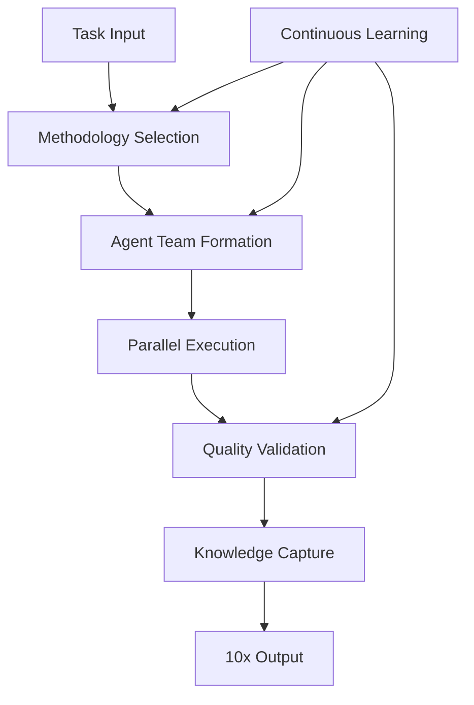
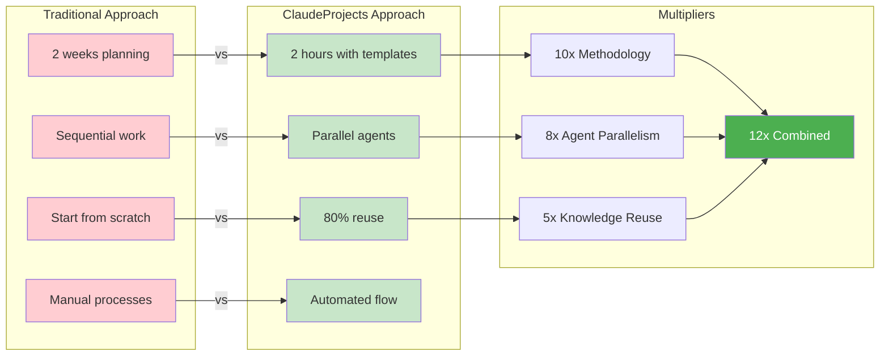
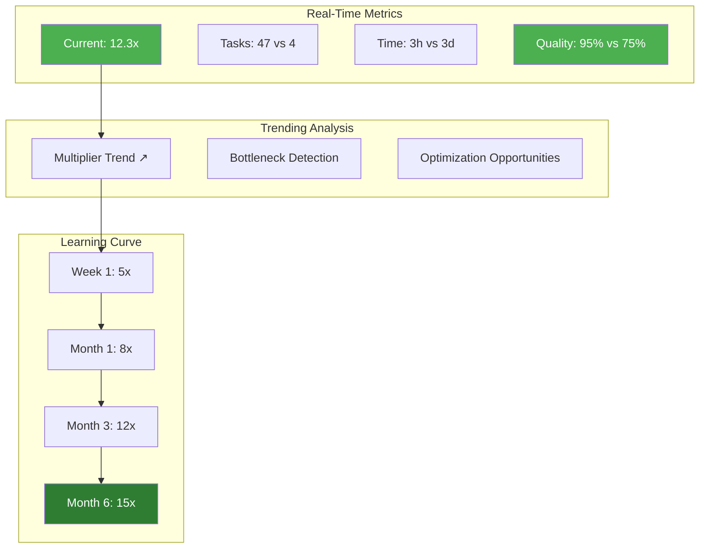

# 10x Productivity Engine

> Orchestrate all system components to deliver order-of-magnitude improvements.

## Architecture

## Productivity Multipliers

## Measurement Dashboard

## Key Multiplier Sources

### 1. Methodology Guidance
- **Traditional**: 2 weeks planning from scratch
- **ClaudeProjects**: 2 hours with methodology templates
- **Multiplier**: 10x faster startup

### 2. Agent Expertise
- **Traditional**: Sequential research → analysis → creation
- **ClaudeProjects**: Parallel specialized execution
- **Multiplier**: 8x through parallelism

### 3. Knowledge Reuse
- **Traditional**: Start every project from zero
- **ClaudeProjects**: 80% pre-filled from similar projects
- **Multiplier**: 5x from reuse

### 4. Continuous Improvement
- **Traditional**: Same process every time
- **ClaudeProjects**: Gets smarter with each use
- **Multiplier**: Compounds over time

## Success Metrics

| Metric | Traditional | ClaudeProjects | Improvement |
|--------|------------|----------------|-------------|
| Time to Value | 2 weeks | 2 days | 5x |
| Revision Cycles | 3-5 | 0-1 | 5x |
| Quality Score | 75% | 95% | 27% |
| Knowledge Reuse | 10% | 80% | 8x |