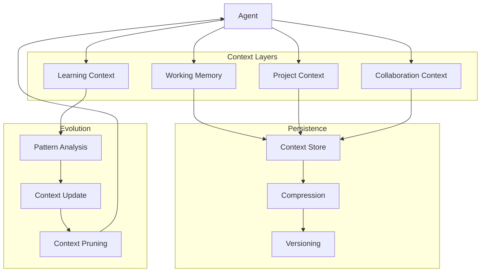
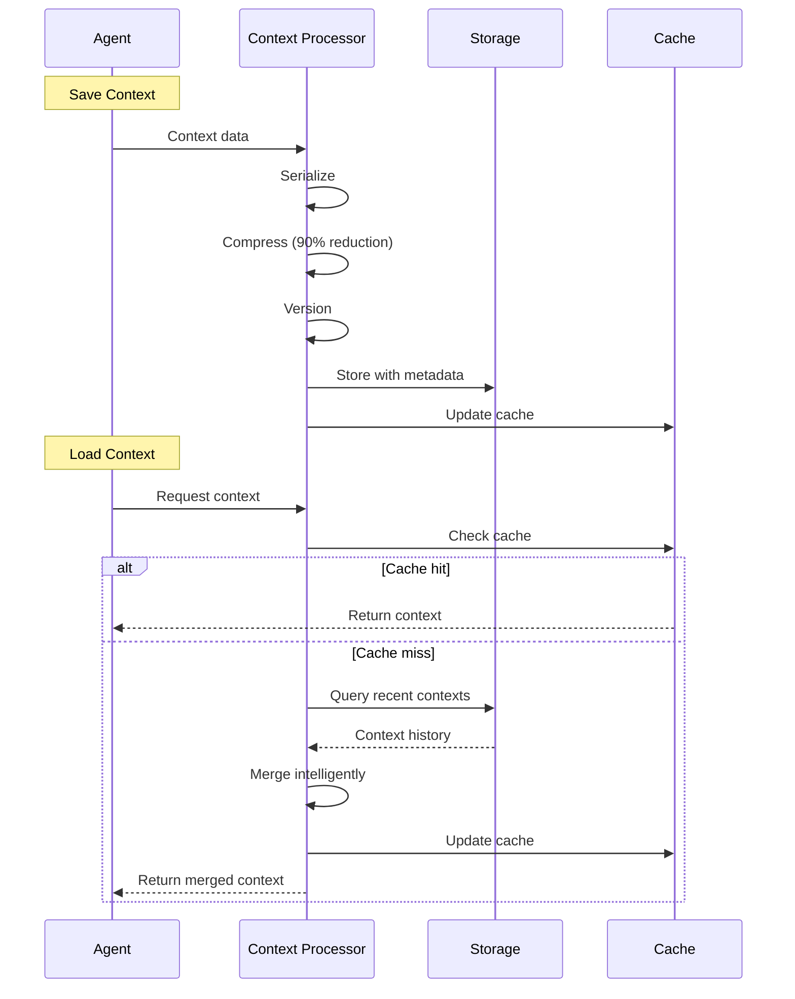
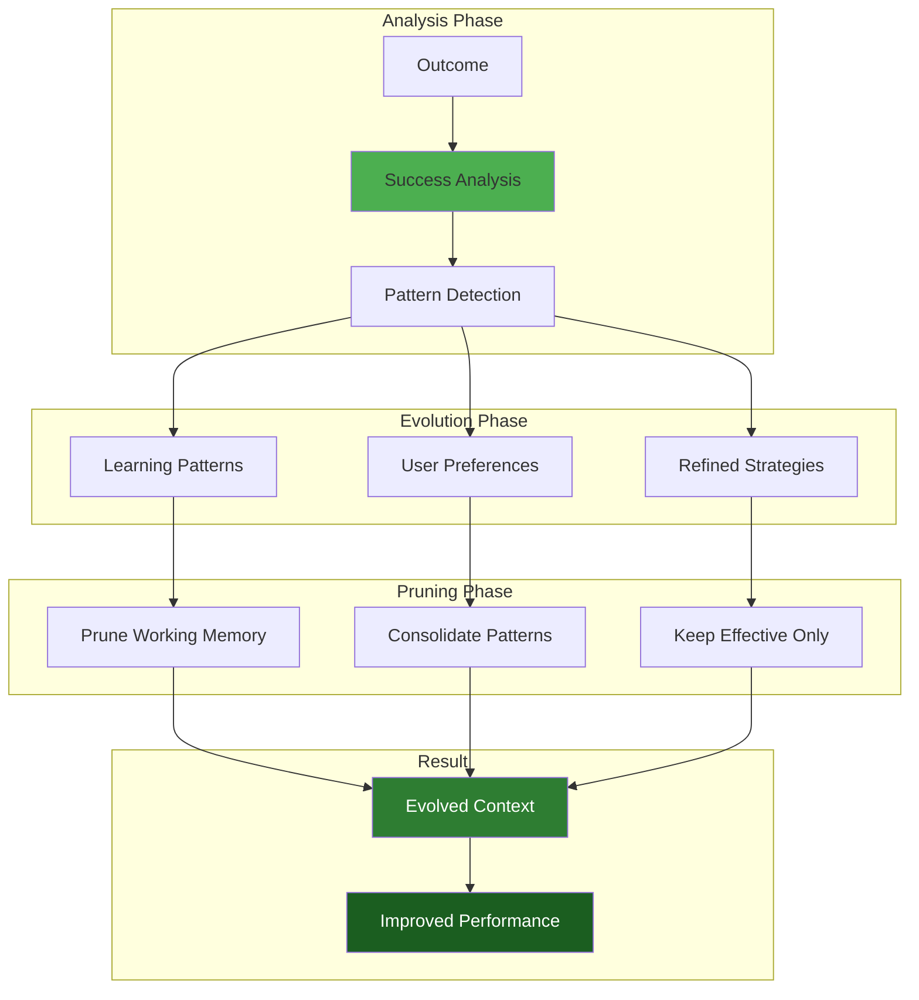
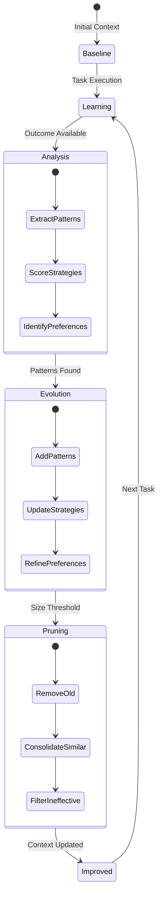
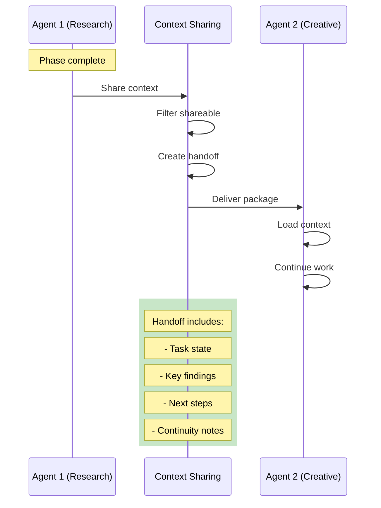
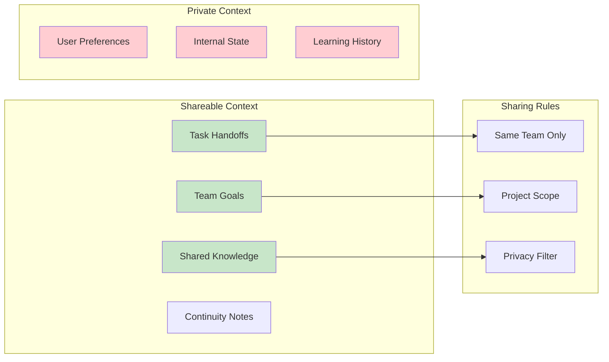
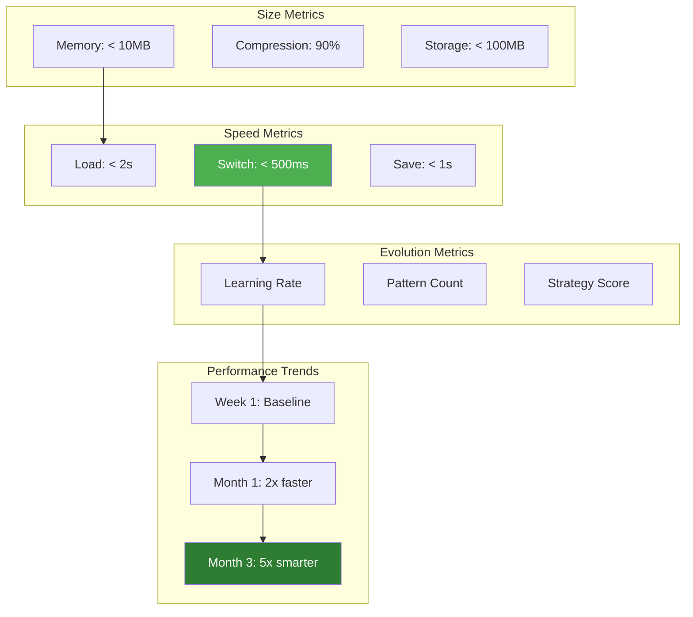

# Context Persistence & Evolution

> Maintain agent context across sessions and enable continuous learning from interactions.

## Context Architecture

## Context Persistence Flow

## Context Evolution Process

## Context Lifecycle

## Context Sharing Protocol

## Sharing Rules

## Context Performance Metrics

## Key Benefits

1. **Persistent Memory**: Agents remember across sessions
2. **Continuous Learning**: Every interaction improves performance
3. **Seamless Handoffs**: Context flows between team members
4. **Performance**: Fast switching and loading
5. **Intelligence Growth**: Exponential improvement over time