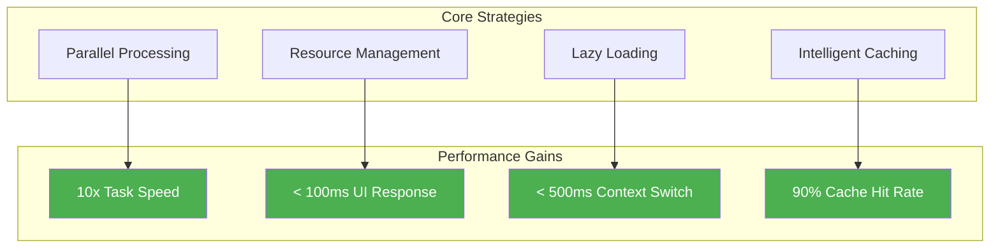
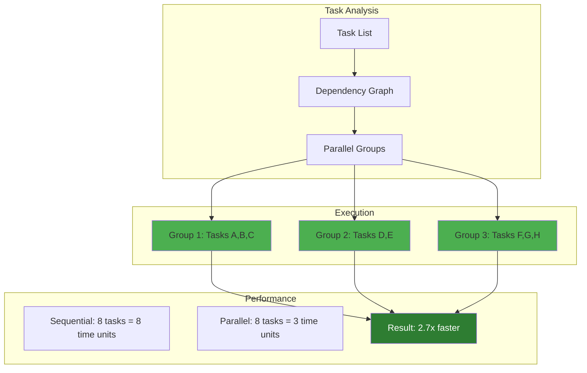
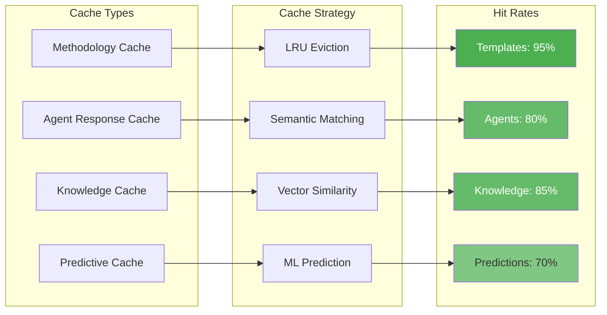
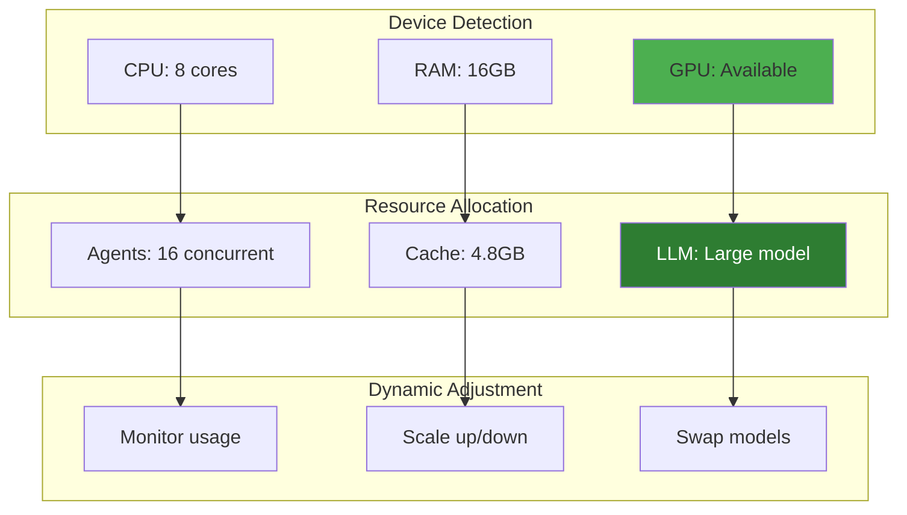
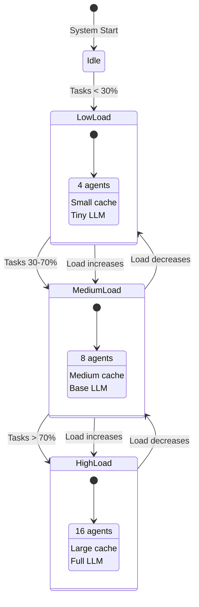
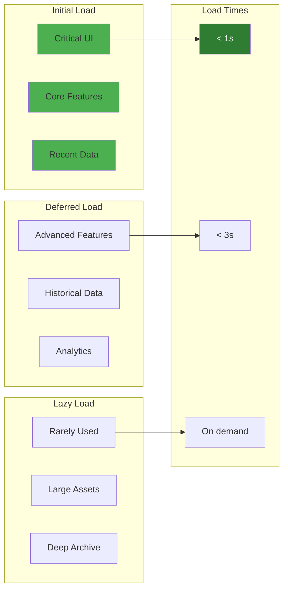
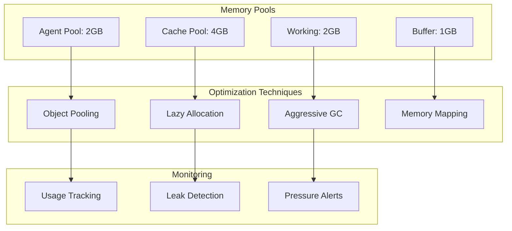
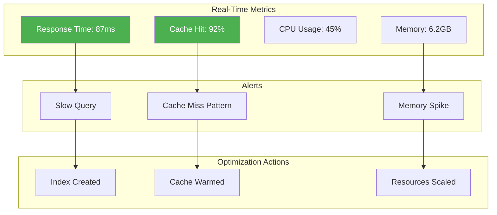

# Performance Optimization Framework

> Ensure system meets 10x productivity goals through intelligent optimization.

## Optimization Strategies Overview

## Parallel Processing Strategy

## Intelligent Caching Layers

## Resource Management Optimization

## Adaptive Performance States

## Progressive Loading Strategy

## Memory Optimization

## Performance Monitoring Dashboard

## Key Benefits

1. **10x Speed**: Parallel processing and smart caching
2. **Responsive UI**: Sub-100ms response times
3. **Efficient Resources**: Adaptive to device capabilities
4. **Scalable**: Handles growth from 1 to 1M users
5. **Predictive**: Anticipates user needs