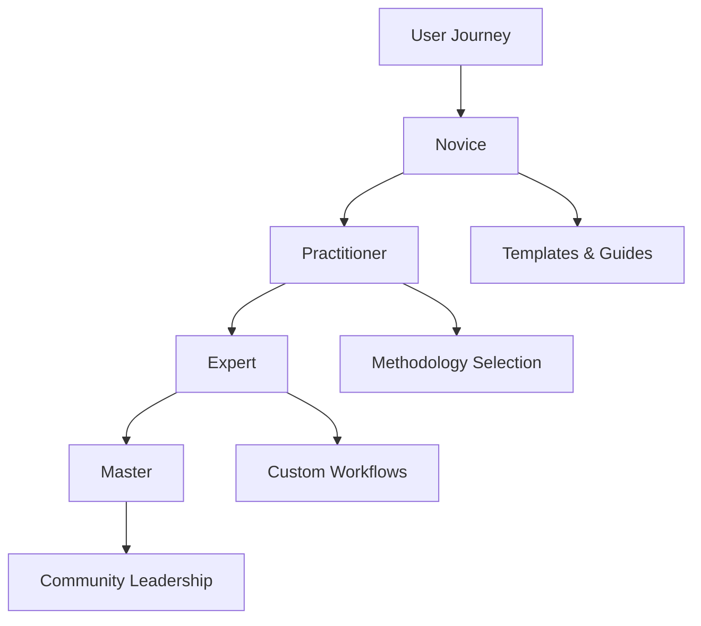
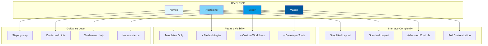
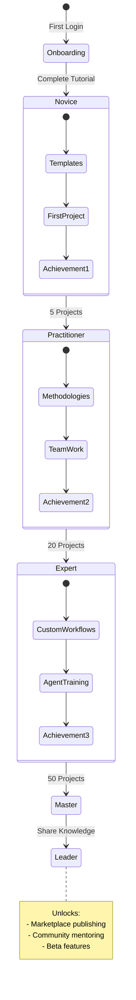
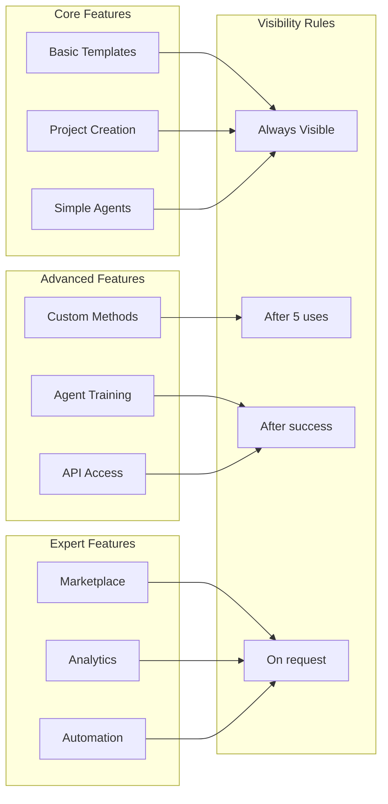

# Progressive Enhancement Framework

> Enable users to grow from beginners to experts naturally.

## User Journey

## Adaptive Interface

## Learning Path System

## Growth Triggers

### 1. Usage Patterns
- Track feature usage frequency
- Detect readiness for advanced features
- Suggest next learning steps
- Unlock capabilities gradually

### 2. Success Metrics
- Measure productivity gains achieved
- Track quality improvements
- Monitor time savings
- Reward achievements

### 3. Knowledge Contribution
- Share methodologies with team
- Publish to marketplace
- Help other users
- Build reputation

### 4. Community Engagement
- Answer questions
- Provide feedback
- Create tutorials
- Mentor newcomers

## Progressive Disclosure Strategy

## Benefits

1. **Lower Barrier to Entry**: Start simple, grow naturally
2. **Reduced Overwhelm**: See only what you need
3. **Personalized Experience**: Interface adapts to skill level
4. **Continuous Growth**: Always something new to learn
5. **Community Building**: Masters help novices