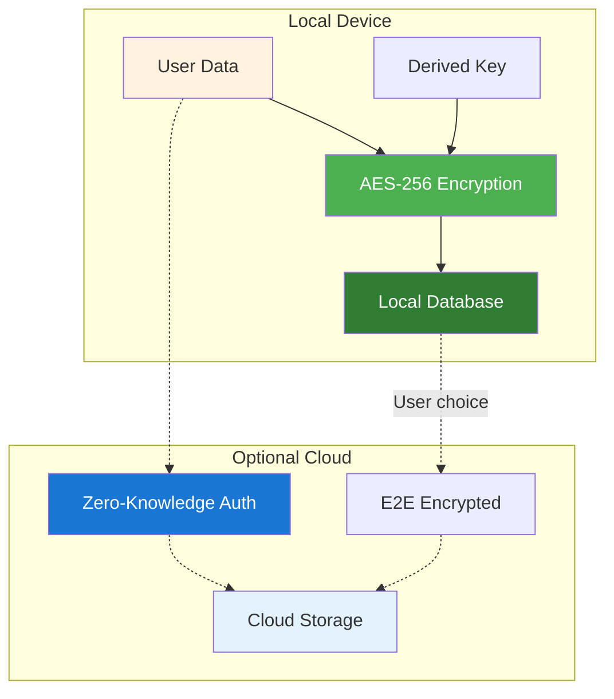
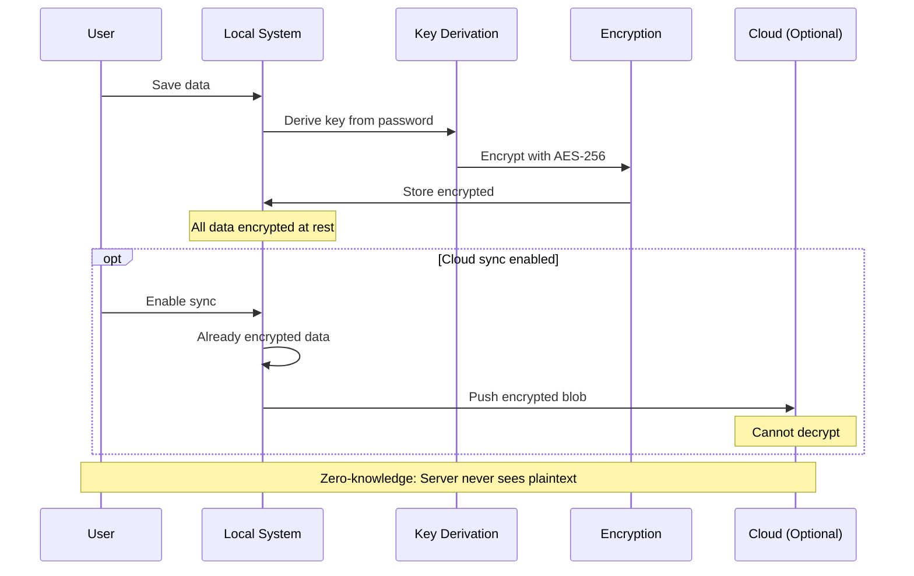
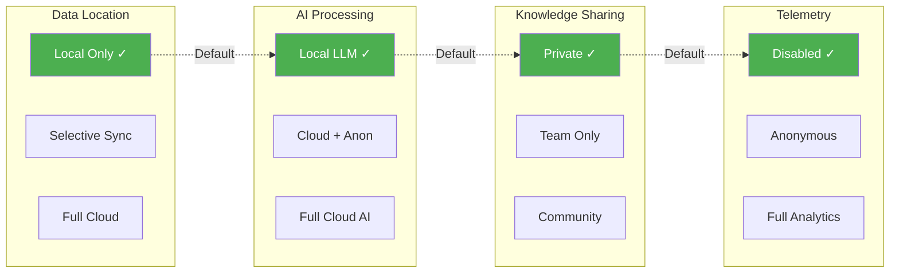
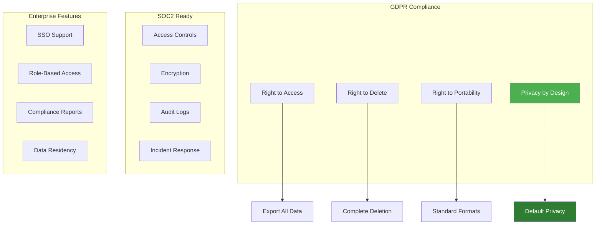
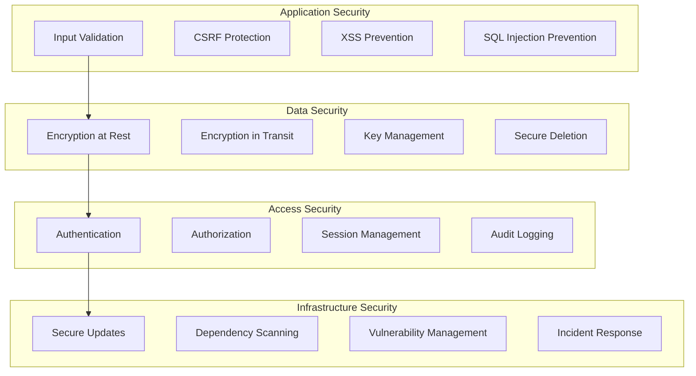

# Security & Privacy Framework

> Ensure user data sovereignty and system security.

## Local-First Security Architecture

## Security Flow

## Privacy Control Matrix

Note: ✓ indicates default privacy-preserving settings

## Data Sovereignty Principles

### 1. Local-First
- All processing happens on user's device by default
- No data leaves device without explicit consent
- Full functionality available offline
- User owns and controls all data

### 2. Encryption Everywhere
- At rest: AES-256 encryption
- In transit: TLS 1.3 minimum
- End-to-end: Optional for cloud sync
- Key management: User-controlled

### 3. Zero-Knowledge Architecture
- Authentication without exposing credentials
- Server cannot decrypt user data
- Privacy-preserving sync protocols
- No behavioral tracking

### 4. Granular Controls
- Per-project privacy settings
- Selective sync capabilities
- Data retention controls
- Export/delete at any time

## Compliance Features

## Security Layers

## Key Benefits

1. **User Trust**: Complete data sovereignty
2. **Privacy First**: Default to maximum privacy
3. **Compliance Ready**: Built-in GDPR/SOC2 features
4. **Enterprise Grade**: Suitable for sensitive data
5. **Transparent**: User always knows what's happening