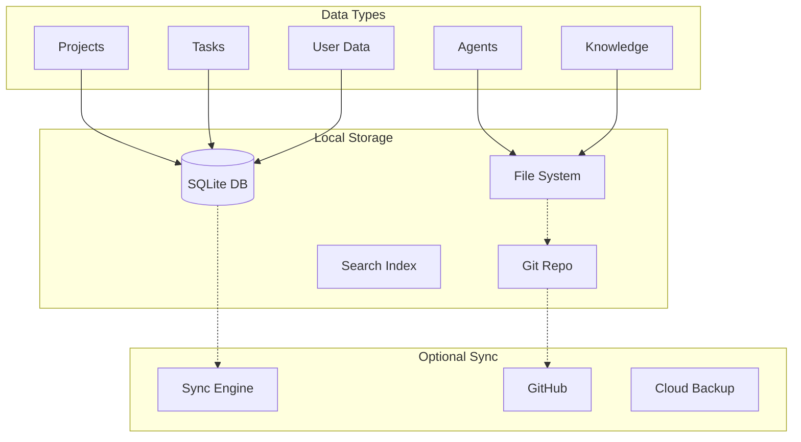

# Data Architecture

Local-first data design for privacy, performance, and reliability.

## Data Model Overview



## Storage Strategy

### Data Location Decisions

| Data Type | Storage | Format | Rationale |
|-----------|---------|--------|-----------|
| Projects | SQLite | Relational | Fast queries, ACID |
| Tasks | SQLite | Relational | Relationships, metrics |
| Agents | File System | Markdown | Version control, editing |
| Knowledge | Obsidian Vault | Markdown | User accessible, searchable |
| Templates | File System | YAML/MD | Easy customization |
| Metrics | SQLite | Time-series | Efficient aggregation |
| Cache | SQLite + Memory | Binary | Performance |

## SQLite Schema

### Core Tables

```sql
-- Projects table
CREATE TABLE projects (
    id TEXT PRIMARY KEY,
    name TEXT NOT NULL,
    description TEXT,
    methodology_id TEXT NOT NULL,
    status TEXT DEFAULT 'active',
    created_at TIMESTAMP DEFAULT CURRENT_TIMESTAMP,
    updated_at TIMESTAMP DEFAULT CURRENT_TIMESTAMP,
    metadata JSONB,
    metrics JSONB
);

-- Tasks table with event sourcing
CREATE TABLE tasks (
    id TEXT PRIMARY KEY,
    project_id TEXT NOT NULL,
    sprint_id TEXT,
    title TEXT NOT NULL,
    description TEXT,
    status TEXT DEFAULT 'pending',
    assigned_agent TEXT,
    created_at TIMESTAMP DEFAULT CURRENT_TIMESTAMP,
    completed_at TIMESTAMP,
    execution_time INTEGER,
    quality_score REAL,
    FOREIGN KEY (project_id) REFERENCES projects(id)
);

-- Event store for audit trail
CREATE TABLE events (
    id INTEGER PRIMARY KEY AUTOINCREMENT,
    aggregate_id TEXT NOT NULL,
    aggregate_type TEXT NOT NULL,
    event_type TEXT NOT NULL,
    event_data JSONB NOT NULL,
    metadata JSONB,
    timestamp TIMESTAMP DEFAULT CURRENT_TIMESTAMP,
    version INTEGER NOT NULL
);

-- Agent performance metrics
CREATE TABLE agent_metrics (
    id INTEGER PRIMARY KEY AUTOINCREMENT,
    agent_id TEXT NOT NULL,
    task_id TEXT NOT NULL,
    execution_time INTEGER,
    tokens_used INTEGER,
    quality_score REAL,
    error_count INTEGER DEFAULT 0,
    timestamp TIMESTAMP DEFAULT CURRENT_TIMESTAMP,
    FOREIGN KEY (task_id) REFERENCES tasks(id)
);

-- Knowledge graph nodes
CREATE TABLE knowledge_nodes (
    id TEXT PRIMARY KEY,
    type TEXT NOT NULL,
    title TEXT NOT NULL,
    content TEXT,
    embedding BLOB,
    metadata JSONB,
    created_at TIMESTAMP DEFAULT CURRENT_TIMESTAMP,
    updated_at TIMESTAMP DEFAULT CURRENT_TIMESTAMP
);

-- Knowledge graph edges
CREATE TABLE knowledge_edges (
    from_node_id TEXT NOT NULL,
    to_node_id TEXT NOT NULL,
    relationship TEXT NOT NULL,
    weight REAL DEFAULT 1.0,
    metadata JSONB,
    created_at TIMESTAMP DEFAULT CURRENT_TIMESTAMP,
    PRIMARY KEY (from_node_id, to_node_id, relationship),
    FOREIGN KEY (from_node_id) REFERENCES knowledge_nodes(id),
    FOREIGN KEY (to_node_id) REFERENCES knowledge_nodes(id)
);

-- Indexes for performance
CREATE INDEX idx_tasks_project ON tasks(project_id);
CREATE INDEX idx_tasks_status ON tasks(status);
CREATE INDEX idx_events_aggregate ON events(aggregate_id, aggregate_type);
CREATE INDEX idx_events_timestamp ON events(timestamp);
CREATE INDEX idx_knowledge_type ON knowledge_nodes(type);
CREATE INDEX idx_metrics_agent ON agent_metrics(agent_id);
```

### JSONB Usage

```sql
-- Example metadata structure
INSERT INTO projects (id, name, methodology_id, metadata) VALUES (
    'proj-001',
    'Mobile App Redesign',
    'design-sprint',
    json_object(
        'client', 'TechCorp',
        'team_size', 5,
        'tags', json_array('mobile', 'ux', 'redesign'),
        'custom_fields', json_object(
            'budget', 50000,
            'deadline', '2024-06-01'
        )
    )
);

-- Query JSON data
SELECT * FROM projects 
WHERE json_extract(metadata, '$.client') = 'TechCorp'
AND json_extract(metadata, '$.custom_fields.budget') > 30000;
```

## File System Structure

### Obsidian Vault Organization

```
~/ClaudeProjects/vault/
├── Projects/
│   ├── {project-name}/
│   │   ├── README.md          # Project overview
│   │   ├── Sprint-{n}/        # Sprint documentation
│   │   ├── Architecture/      # Design docs
│   │   ├── Decisions/         # ADRs
│   │   └── Deliverables/      # Final outputs
├── Knowledge/
│   ├── Patterns/              # Discovered patterns
│   ├── Insights/              # Generated insights
│   ├── Templates/             # Reusable templates
│   └── References/            # External resources
├── Methodologies/
│   ├── design-sprint.md
│   ├── meddic.md
│   └── custom/                # User-created
└── Daily/
    └── {date}.md              # Daily notes
```

### Agent Storage

```
~/.claude/agents/
├── architecture/
│   ├── system-designer.md
│   ├── pattern-expert.md
│   └── quality-analyst.md
├── implementation/
│   ├── code-generator.md
│   └── test-builder.md
├── documentation/
│   └── tech-writer.md
└── custom/                    # User-defined agents
```

## Event Sourcing

### Event Types

```typescript
// Event definitions
interface DomainEvent {
  id: string;
  aggregateId: string;
  aggregateType: string;
  eventType: string;
  eventData: any;
  metadata: EventMetadata;
  timestamp: Date;
  version: number;
}

interface EventMetadata {
  userId: string;
  correlationId: string;
  causationId?: string;
  source: string;
}

// Example events
class ProjectCreated implements DomainEvent {
  eventType = 'ProjectCreated';
  constructor(
    public aggregateId: string,
    public eventData: {
      name: string;
      methodology: string;
      team: string[];
    }
  ) {}
}

class TaskCompleted implements DomainEvent {
  eventType = 'TaskCompleted';
  constructor(
    public aggregateId: string,
    public eventData: {
      completedBy: string;
      duration: number;
      quality: number;
      outputs: string[];
    }
  ) {}
}
```

### Event Store Implementation

```typescript
class EventStore {
  constructor(private db: SQLiteDatabase) {}
  
  async append(events: DomainEvent[]): Promise<void> {
    const stmt = this.db.prepare(`
      INSERT INTO events (
        aggregate_id, aggregate_type, event_type,
        event_data, metadata, version
      ) VALUES (?, ?, ?, ?, ?, ?)
    `);
    
    const transaction = this.db.transaction((events) => {
      for (const event of events) {
        stmt.run(
          event.aggregateId,
          event.aggregateType,
          event.eventType,
          JSON.stringify(event.eventData),
          JSON.stringify(event.metadata),
          event.version
        );
      }
    });
    
    transaction(events);
  }
  
  async getEvents(aggregateId: string): Promise<DomainEvent[]> {
    const rows = this.db.prepare(`
      SELECT * FROM events 
      WHERE aggregate_id = ? 
      ORDER BY version
    `).all(aggregateId);
    
    return rows.map(row => ({
      ...row,
      eventData: JSON.parse(row.event_data),
      metadata: JSON.parse(row.metadata)
    }));
  }
}
```

## Knowledge Graph Storage

### Vector Embeddings

```typescript
class VectorStore {
  private dimension = 1536; // OpenAI embedding size
  
  async addEmbedding(
    nodeId: string,
    text: string,
    embedding: number[]
  ): Promise<void> {
    // Store as BLOB in SQLite
    const buffer = Buffer.from(new Float32Array(embedding).buffer);
    
    await this.db.run(`
      UPDATE knowledge_nodes 
      SET embedding = ? 
      WHERE id = ?
    `, [buffer, nodeId]);
  }
  
  async findSimilar(
    embedding: number[],
    limit: number = 10
  ): Promise<SimilarNode[]> {
    // Load all embeddings (for small-medium datasets)
    const nodes = await this.loadAllEmbeddings();
    
    // Calculate cosine similarity
    const similarities = nodes.map(node => ({
      node,
      similarity: this.cosineSimilarity(embedding, node.embedding)
    }));
    
    // Return top matches
    return similarities
      .sort((a, b) => b.similarity - a.similarity)
      .slice(0, limit);
  }
}
```

### Graph Queries

```sql
-- Find all nodes connected to a project
WITH RECURSIVE connected AS (
  SELECT id, title, type, 0 as depth
  FROM knowledge_nodes
  WHERE id = ?
  
  UNION
  
  SELECT n.id, n.title, n.type, c.depth + 1
  FROM knowledge_nodes n
  JOIN knowledge_edges e ON n.id = e.to_node_id
  JOIN connected c ON e.from_node_id = c.id
  WHERE c.depth < 3
)
SELECT * FROM connected;

-- Find patterns (nodes with many connections)
SELECT 
  n.id,
  n.title,
  COUNT(DISTINCT e1.to_node_id) + COUNT(DISTINCT e2.from_node_id) as connection_count
FROM knowledge_nodes n
LEFT JOIN knowledge_edges e1 ON n.id = e1.from_node_id
LEFT JOIN knowledge_edges e2 ON n.id = e2.to_node_id
GROUP BY n.id
HAVING connection_count > 5
ORDER BY connection_count DESC;
```

## Sync & Backup

### Sync Strategy

```typescript
interface SyncConfig {
  enabled: boolean;
  interval: number; // seconds
  strategy: 'merge' | 'theirs' | 'ours';
  exclude: string[];
}

class SyncEngine {
  async sync(): Promise<SyncResult> {
    // 1. Check for local changes
    const localChanges = await this.detectLocalChanges();
    
    // 2. Check for remote changes
    const remoteChanges = await this.detectRemoteChanges();
    
    // 3. Resolve conflicts
    const conflicts = this.findConflicts(localChanges, remoteChanges);
    const resolutions = await this.resolveConflicts(conflicts);
    
    // 4. Apply changes
    await this.applyChanges(resolutions);
    
    // 5. Update sync metadata
    await this.updateSyncMetadata();
    
    return {
      pushed: localChanges.length,
      pulled: remoteChanges.length,
      conflicts: conflicts.length,
      timestamp: new Date()
    };
  }
}
```

### Backup Implementation

```typescript
class BackupManager {
  async createBackup(): Promise<BackupInfo> {
    const timestamp = new Date().toISOString();
    const backupDir = `~/ClaudeProjects/backups/${timestamp}`;
    
    // 1. Create backup directory
    await fs.mkdir(backupDir, { recursive: true });
    
    // 2. Backup SQLite database
    await this.backupDatabase(backupDir);
    
    // 3. Backup vault
    await this.backupVault(backupDir);
    
    // 4. Backup agents
    await this.backupAgents(backupDir);
    
    // 5. Create manifest
    const manifest = await this.createManifest(backupDir);
    
    // 6. Compress if requested
    if (this.config.compress) {
      await this.compressBackup(backupDir);
    }
    
    return manifest;
  }
  
  async restore(backupId: string): Promise<void> {
    // Restore in reverse order
    await this.restoreDatabase(backupId);
    await this.restoreVault(backupId);
    await this.restoreAgents(backupId);
  }
}
```

## Performance Optimizations

### Database Optimizations

```sql
-- Enable WAL mode for better concurrency
PRAGMA journal_mode = WAL;
PRAGMA synchronous = NORMAL;

-- Increase cache size
PRAGMA cache_size = -64000; -- 64MB

-- Memory-mapped I/O
PRAGMA mmap_size = 30000000000;

-- Optimize for SSDs
PRAGMA temp_store = MEMORY;

-- Regular maintenance
ANALYZE; -- Update statistics
VACUUM;  -- Reclaim space
```

### Caching Strategy

```typescript
class CacheManager {
  private memoryCache: LRUCache<string, any>;
  private diskCache: SQLiteCache;
  
  async get(key: string): Promise<any> {
    // L1: Memory cache (< 1ms)
    const memResult = this.memoryCache.get(key);
    if (memResult) return memResult;
    
    // L2: Disk cache (< 10ms)
    const diskResult = await this.diskCache.get(key);
    if (diskResult) {
      this.memoryCache.set(key, diskResult);
      return diskResult;
    }
    
    return null;
  }
  
  async set(key: string, value: any, ttl?: number): Promise<void> {
    // Write to both caches
    this.memoryCache.set(key, value, { ttl });
    await this.diskCache.set(key, value, ttl);
  }
}
```

## Data Privacy

### Encryption at Rest

```typescript
class EncryptionManager {
  private key: Buffer;
  
  constructor() {
    // Derive key from user password + salt
    this.key = this.deriveKey();
  }
  
  encryptField(data: string): string {
    const iv = crypto.randomBytes(16);
    const cipher = crypto.createCipheriv('aes-256-gcm', this.key, iv);
    
    const encrypted = Buffer.concat([
      cipher.update(data, 'utf8'),
      cipher.final()
    ]);
    
    const tag = cipher.getAuthTag();
    
    return Buffer.concat([iv, tag, encrypted]).toString('base64');
  }
  
  decryptField(encrypted: string): string {
    const buffer = Buffer.from(encrypted, 'base64');
    const iv = buffer.slice(0, 16);
    const tag = buffer.slice(16, 32);
    const ciphertext = buffer.slice(32);
    
    const decipher = crypto.createDecipheriv('aes-256-gcm', this.key, iv);
    decipher.setAuthTag(tag);
    
    return decipher.update(ciphertext) + decipher.final('utf8');
  }
}
```

## Next Steps

- Review [Security](Security.md) for protection strategies
- Explore [Agent Implementation](Agent-Implementation.md) for agent storage
- See [Deployment](Deployment.md) for backup procedures