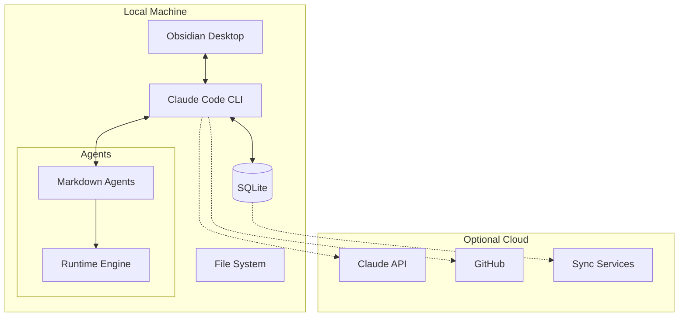
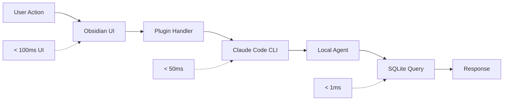

# Physical Architecture Overview

## Architecture Style

**Local-First Agent-Oriented Architecture**



## Core Technology Decisions

### Why These Technologies?

#### Claude Code CLI
- **Primary Engine**: Already installed by users
- **Agent Support**: Native markdown agent execution
- **MCP Integration**: Built-in server support
- **Extensibility**: Plugin architecture

#### Obsidian Desktop
- **Knowledge UI**: Visual knowledge management
- **Local Files**: Markdown-based storage
- **Plugin System**: Custom integrations
- **Graph View**: Knowledge visualization

#### SQLite + File System
- **Local Storage**: No server required
- **Performance**: Microsecond queries
- **Reliability**: Battle-tested
- **Portability**: Single file database

#### MCP Ecosystem
- **GitHub MCP**: Repository operations
- **Obsidian MCP**: Bidirectional sync
- **Context7 MCP**: Documentation access
- **Sequential MCP**: Complex workflows

## Deployment Topology

### Development Environment
```yaml
Local Setup:
  Core:
    - Claude Code CLI (npm install -g @anthropic/claude)
    - Obsidian Desktop (obsidian.md)
    - Git (version control)
    
  Data:
    - ~/ClaudeProjects/projects.db (SQLite)
    - ~/ClaudeProjects/vault/ (Obsidian)
    - ~/.claude/agents/ (Agent definitions)
    
  MCP Servers:
    - GitHub MCP (auto-configured)
    - Obsidian MCP (plugin install)
    - Context7 MCP (optional)
```

### Production Environment
```yaml
User Machine:
  Applications:
    - ClaudeProjects Obsidian Plugin
    - Claude Code CLI
    - Background sync service
    
  Storage:
    - Local SQLite (projects, metrics)
    - Obsidian Vault (knowledge base)
    - Git repos (version control)
    
  Optional Cloud:
    - GitHub (collaboration)
    - Cloud AI APIs (enhanced agents)
    - Backup service (redundancy)
```

## Technology Mapping

### Layer to Technology

| Logical Layer | Physical Implementation |
|---------------|------------------------|
| Presentation | Obsidian + Claude CLI |
| Application | Node.js services + MCP |
| Domain | TypeScript + Markdown |
| Infrastructure | SQLite + File System |

### Component Implementation

```typescript
// Example: Project Manager Component
class ProjectManager {
  private db: SQLiteDatabase;
  private cli: ClaudeCodeCLI;
  private obsidian: ObsidianMCP;
  
  async createProject(spec: ProjectSpec): Promise<Project> {
    // Store in local database
    const project = await this.db.insert('projects', spec);
    
    // Create Obsidian structure
    await this.obsidian.createFolder(`Projects/${project.name}`);
    
    // Register with Claude Code
    await this.cli.registerProject(project);
    
    return project;
  }
}
```

## Performance Architecture

### Local Performance


### Optimization Strategies
1. **In-Memory Caching**: Hot data in RAM
2. **Lazy Loading**: Load agents on demand
3. **Parallel Execution**: Multi-agent concurrency
4. **Local LLM**: Simple tasks without API

## Scalability Approach

### Horizontal Scaling
```typescript
// Agent pool management
class AgentPool {
  private localAgents: Agent[] = [];
  private maxConcurrent = os.cpus().length;
  
  async scale(demand: number): Promise<void> {
    if (demand > this.maxConcurrent) {
      // Option 1: Queue tasks
      this.queueExcess(demand - this.maxConcurrent);
      
      // Option 2: Cloud burst (if enabled)
      if (this.cloudEnabled) {
        await this.scaleToCloud(demand - this.maxConcurrent);
      }
    }
  }
}
```

### Data Scaling
- **Local**: Up to 10GB comfortably
- **Hybrid**: 10GB-100GB with selective sync
- **Federated**: 100GB+ with cloud integration

## Evolution Path

### Phase 1: Foundation (Current)
- Basic Claude Code integration
- Obsidian plugin MVP
- Local agent execution
- Core MCP servers

### Phase 2: Enhancement (3 months)
- Advanced Obsidian features
- Agent marketplace
- Performance optimizations
- Extended MCP support

### Phase 3: Scale (6 months)
- Team collaboration
- Cloud sync options
- Enterprise features
- API ecosystem

## Key Benefits

### Local-First Advantages
1. **Privacy**: Data never leaves device
2. **Performance**: No network latency
3. **Reliability**: Works offline
4. **Control**: User owns everything

### Agent-Oriented Benefits
1. **Modularity**: Easy to add agents
2. **Specialization**: Deep expertise
3. **Scalability**: Parallel execution
4. **Evolution**: Continuous improvement

## Next Steps

- Dive into [Technology Stack](Technology-Stack.md) for detailed choices
- Explore [Deployment](Deployment.md) for setup instructions
- Review [Agent Implementation](Agent-Implementation.md) for agent details