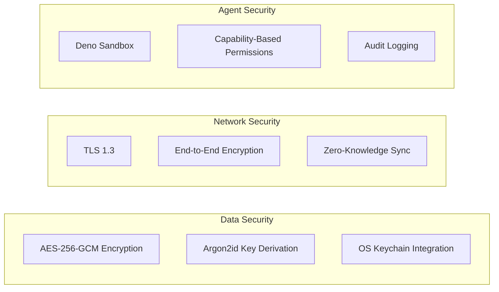
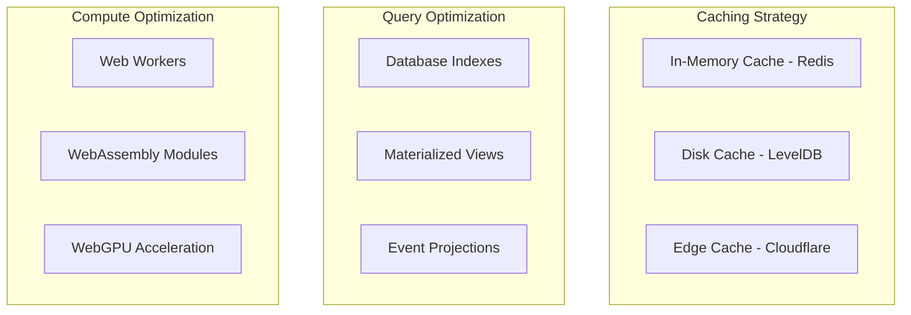
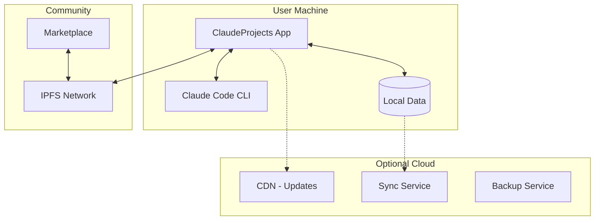

# Physical Architecture with Logical Traceability

## Executive Summary

This document maps the logical architecture components to specific technologies and products, providing clear traceability from business capabilities to implementation choices.

## Architecture Principles

1. **Local-First**: All core functionality works offline with optional cloud sync
2. **Privacy by Design**: User data sovereignty with end-to-end encryption
3. **Progressive Enhancement**: Start simple, scale with user needs
4. **Open Ecosystem**: Leverage existing tools and standards
5. **10x Performance**: Every technology choice must enable order-of-magnitude gains

## Stacked Layer Physical Architecture

```mermaid
graph TB
    subgraph PRES["🎯 Presentation Layer - Physical"]
        direction TB
        subgraph "ClaudeProjects UI Implementation"
            ELECTRON[Electron App - ClaudeProjects Desktop]
            OBSIDIAN[Obsidian Plugin - Knowledge Canvas]
            CLI[Claude Code CLI - Command Interface]
        end
        subgraph "Integration Points Implementation"
            FASTAPI[FastAPI - REST/WebSocket Server]
            GRAPHQL[GraphQL Gateway - Apollo Server]
        end
    end
    
    subgraph APP["⚙️ Application Layer - Physical"]
        direction TB
        subgraph "Orchestration Services Implementation"
            NODE_MO[Node.js - Master Orchestrator Service]
            NODE_AC[Node.js - Agent Coordinator Service]
            NODE_PM[Node.js - Project Manager Service]
            CRDT_SYNC[Y.js + WebRTC - Sync Service]
        end
        subgraph "Processing Engines Implementation"
            TS_ME[TypeScript - Methodology Engine]
            LANGCHAIN[LangChain.js - Knowledge Synthesizer]
        end
    end
    
    subgraph DOMAIN["💼 Domain Layer - Physical"]
        direction TB
        subgraph "Core Domains Implementation"
            TS_PD[TypeScript Classes - Project Domain]
            JSON_MD[JSON Schema + Markdown - Methodology Domain]
            MD_AD[Markdown Files + YAML - Agent Domain]
            IPFS_MARKET[IPFS + Smart Contracts - Marketplace]
        end
        subgraph "Support Domains Implementation"
            GRAPH_KD[Neo4j Embedded - Knowledge Graph]
            AUTH_UD[Passport.js + JWT - User Domain]
        end
    end
    
    subgraph INFRA["🏗️ Infrastructure Layer - Physical"]
        direction TB
        subgraph "Data Stores Implementation"
            FS_STORE[Local File System - Project Files]
            EVENTSTORE[EventStore DB - Event Sourcing]
            MONGO[MongoDB Embedded - Document Store]
            CHROMA[ChromaDB - Vector Store]
        end
        subgraph "Local Agent Services Implementation"
            CLAUDE_AF[Claude Code Runtime - Agent Framework]
            MCP_IS[MCP Protocol - Integration Services]
            DENO_LAR[Deno Isolates - Local Agent Runtime]
        end
    end
    
    PRES -.->|HTTP/WebSocket/IPC| APP
    APP -.->|TypeScript Interfaces| DOMAIN
    DOMAIN -.->|Native APIs| INFRA
    
    style PRES fill:#e1f5fe,stroke:#0288d1,stroke-width:3px,color:#01579b
    style APP fill:#b3e5fc,stroke:#0288d1,stroke-width:3px,color:#01579b
    style DOMAIN fill:#81d4fa,stroke:#0288d1,stroke-width:3px,color:#01579b
    style INFRA fill:#4fc3f7,stroke:#0288d1,stroke-width:3px,color:#01579b
```



## Logical to Physical Component Mapping

### Presentation Layer Traceability

| Logical Component | Physical Technology | Rationale |
|-------------------|-------------------|-----------|
| **Natural Language Interface** | Claude Code CLI | Already installed, native AI interaction, extensible |
| **Knowledge Base Canvas** | Obsidian Plugin | Visual knowledge management, markdown native, plugin ecosystem |
| **Visual Project Canvas** | Electron App (React + D3.js) | Cross-platform desktop, rich visualizations, native performance |
| **API Gateway** | FastAPI (Python) | High performance, async support, automatic OpenAPI docs |
| **Web Interface** | Next.js 14 (App Router) | Server components, edge runtime, progressive enhancement |

### Application Layer Traceability

| Logical Component | Physical Technology | Rationale |
|-------------------|-------------------|-----------|
| **Master Orchestrator** | Node.js + Bull Queue | Event-driven, job queuing, horizontal scaling |
| **Agent Coordinator** | Node.js + Socket.io | Real-time communication, agent pooling, load balancing |
| **Project Manager** | Node.js + Temporal | Workflow orchestration, state management, reliability |
| **Sync Service** | Y.js + WebRTC + libp2p | CRDT for conflict-free sync, P2P for direct collaboration |
| **Methodology Engine** | TypeScript + JSON Schema | Type safety, validation, extensible methodology DSL |
| **Knowledge Synthesizer** | LangChain.js + LlamaIndex | RAG pipeline, document processing, semantic search |

### Domain Layer Traceability

| Logical Component | Physical Technology | Rationale |
|-------------------|-------------------|-----------|
| **Project Domain** | TypeScript + DDD patterns | Rich domain models, type safety, business logic encapsulation |
| **Methodology Domain** | JSON Schema + Markdown | Human readable, version controlled, validation |
| **Agent Domain + Context** | Markdown + YAML Front Matter | Claude Code compatible, version controlled, portable |
| **Marketplace Domain** | IPFS + Ethereum L2 | Decentralized storage, smart contracts for licensing |
| **Knowledge Domain** | Neo4j Embedded | Graph relationships, pattern detection, Cypher queries |
| **User Domain** | Passport.js + Argon2 | Flexible auth, secure hashing, JWT tokens |

### Infrastructure Layer Traceability

| Logical Component | Physical Technology | Rationale |
|-------------------|-------------------|-----------|
| **File System** | Node.js fs + Git | Version control, atomic operations, watch capabilities |
| **Event Store** | EventStore DB (embedded) | Event sourcing, projections, audit trail |
| **Document Store** | MongoDB (embedded mode) | Flexible schemas, powerful queries, aggregation |
| **Vector Store** | ChromaDB | Local embeddings, semantic search, LLM integration |
| **Agent Framework** | Claude Code Runtime | Native agent support, MCP integration, proven reliability |
| **Integration Services** | MCP Protocol + Adapters | Standardized integration, community ecosystem |
| **Local Agent Runtime** | Deno Isolates | Sandboxed execution, resource limits, TypeScript native |

## Cross-Cutting Concerns Implementation

### Security & Privacy



### Performance Optimization



## Technology Stack Summary

### Core Stack
- **Runtime**: Node.js 20 LTS + Deno 1.40
- **Languages**: TypeScript 5.3 (strict mode)
- **Desktop**: Electron 28 + React 18
- **Backend**: FastAPI + Node.js services
- **Databases**: SQLite + EventStore + ChromaDB
- **Agent Runtime**: Claude Code CLI + MCP

### Development Stack
- **Build**: Vite 5 + ESBuild
- **Testing**: Vitest + Playwright
- **Linting**: ESLint + Prettier
- **CI/CD**: GitHub Actions
- **Monitoring**: OpenTelemetry

### Integration Stack
- **MCP Servers**: GitHub, Obsidian, Context7
- **AI Providers**: Anthropic, OpenAI, Local LLMs
- **Storage**: IPFS, S3-compatible
- **Auth**: OAuth2, SAML, OIDC

## Implementation Patterns

### Agent Implementation Pattern
```typescript
// Physical implementation of Agent Domain
export class AgentDefinition {
  // Stored as markdown file with YAML frontmatter
  static fromMarkdown(content: string): AgentDefinition {
    const { data, content: body } = matter(content);
    return new AgentDefinition({
      id: data.id,
      capabilities: data.capabilities,
      context: data.context,
      instructions: body
    });
  }
  
  // Execute via Claude Code Runtime
  async execute(task: Task): Promise<Result> {
    const runtime = new ClaudeCodeRuntime();
    return runtime.runAgent(this, task);
  }
}
```

### Methodology Engine Pattern
```typescript
// Physical implementation of Methodology Engine
export class MethodologyEngine {
  private validator: Ajv;
  private registry: Map<string, MethodologySchema>;
  
  async executePhase(
    methodology: string, 
    phase: string,
    context: ProjectContext
  ): Promise<PhaseResult> {
    const schema = this.registry.get(methodology);
    const agents = this.selectAgents(schema.phases[phase]);
    
    // Parallel agent execution
    const results = await Promise.all(
      agents.map(agent => agent.execute(context))
    );
    
    return this.synthesize(results);
  }
}
```

### Sync Service Pattern
```typescript
// Physical implementation using Y.js CRDT
export class SyncService {
  private doc: Y.Doc;
  private provider: WebrtcProvider;
  
  constructor(projectId: string) {
    this.doc = new Y.Doc();
    this.provider = new WebrtcProvider(projectId, this.doc);
    
    // Offline-first with eventual consistency
    this.provider.on('synced', this.handleSync);
  }
  
  updateProject(changes: ProjectChanges): void {
    const ymap = this.doc.getMap('project');
    this.doc.transact(() => {
      Object.entries(changes).forEach(([key, value]) => {
        ymap.set(key, value);
      });
    });
  }
}
```

## Deployment Architecture

### Development Setup
```yaml
# docker-compose.dev.yml
version: '3.8'
services:
  app:
    build: .
    volumes:
      - ./src:/app/src
      - ~/.claude:/home/node/.claude
      - ~/ClaudeProjects:/data
    environment:
      - NODE_ENV=development
      - CLAUDE_CODE_PATH=/usr/local/bin/claude
    
  eventstore:
    image: eventstore/eventstore:23.10.0
    environment:
      - EVENTSTORE_INSECURE=true
      - EVENTSTORE_ENABLE_ATOM_PUB_OVER_HTTP=true
    
  chromadb:
    image: chromadb/chroma:0.4.22
    volumes:
      - ./data/chroma:/chroma/chroma
```

### Production Deployment


## Performance Requirements Mapping

| Requirement | Implementation | Measurement |
|-------------|---------------|-------------|
| < 100ms UI Response | Electron IPC + React Concurrent | Chrome DevTools |
| < 500ms Query | SQLite indexes + ChromaDB cache | Query profiler |
| < 3s Agent Response | Local Claude Code + parallel execution | APM metrics |
| 10x Productivity | Methodology automation + agent teams | Time tracking |

## Evolution Roadmap

### Phase 1: Foundation (Month 1-2)
- Basic Electron app with Claude Code integration
- Core Obsidian plugin features
- Local SQLite + file storage
- Single-user workflows

### Phase 2: Collaboration (Month 3-4)
- Y.js CRDT implementation
- WebRTC peer connections
- Shared workspaces
- Real-time collaboration

### Phase 3: Marketplace (Month 5-6)
- IPFS integration
- Smart contract deployment
- Community methodologies
- Agent marketplace

### Phase 4: Enterprise (Month 7-12)
- SAML/OIDC authentication
- Audit logging
- Compliance features
- Cloud sync options

## Technology Decision Rationale

### Why Electron + Obsidian?
- **Electron**: Full desktop capabilities, native file access, system integration
- **Obsidian**: Proven knowledge management, extensible, markdown-native

### Why Node.js + TypeScript?
- **Node.js**: Event-driven perfect for agents, huge ecosystem, Claude Code compatible
- **TypeScript**: Type safety reduces bugs, better IDE support, refactoring confidence

### Why Local-First Databases?
- **SQLite**: Zero configuration, ACID compliance, single file
- **EventStore**: Event sourcing for audit trail, temporal queries
- **ChromaDB**: Local vector search without cloud dependency

### Why CRDT + WebRTC?
- **Y.js**: Proven CRDT implementation, automatic conflict resolution
- **WebRTC**: Direct peer connections, no server required, low latency

## Conclusion

This physical architecture provides a complete implementation blueprint with clear traceability from logical components to specific technologies. Every choice is optimized for the core goal of 10x productivity gains while maintaining local-first privacy and optional cloud enhancement.